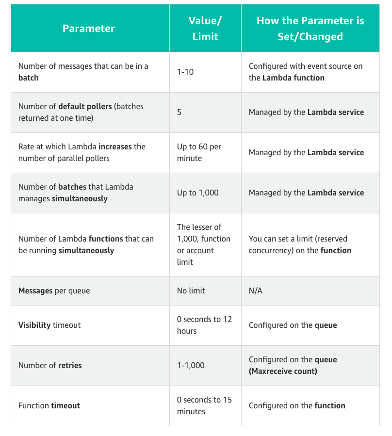
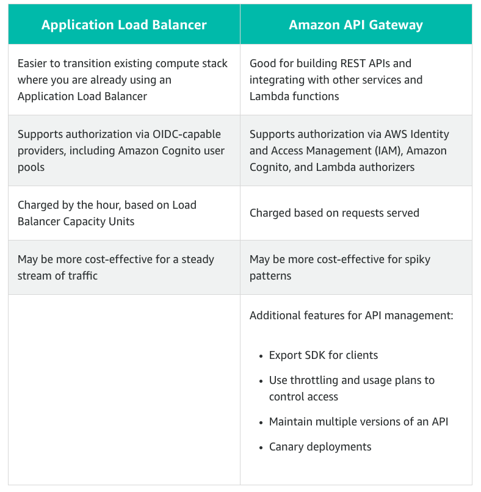
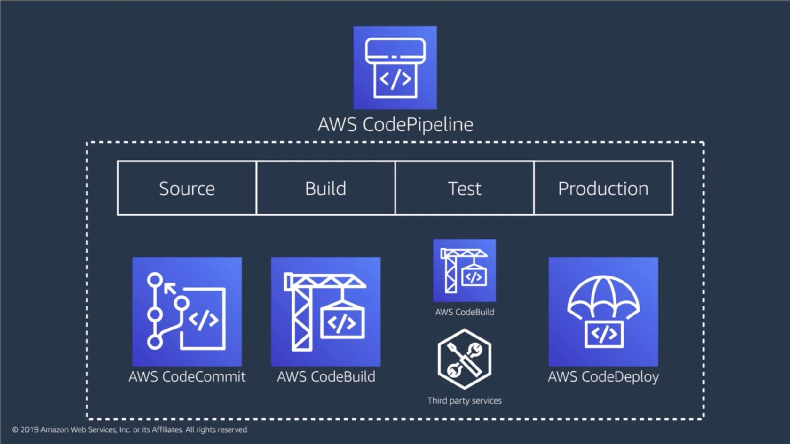

Architecting Serverless Solutions
=================================

How well-architected serverless patterns combine AWS Lambda with other AWS managed services to create scalable and secure event-driven serverless architectures.

Serverless Event Submission Patterns
------------------------------------

- AWS Lambda function call

image::AWS Lambda function call.png[AWS Lambda function call]

- AWS Serverless Compute

- Combining polling and WebSockets

- Using WebSockets with AWS AppSync

image::Using WebSockets with AWS AppSync.jpg[Using WebSockets with AWS AppSync]

- Using the presigned URL in the order processing flow

image::Using the presigned URL in the order processing flow.jpg[Using the presigned URL in the order processing flow]

- API AppSync vs. API Gateway

image::API AppSync vs. API Gateway.png[API AppSync vs. API Gateway]

- Standard vs. FIFO SQS queues

- Characteristics of an SQS queue as a Lambda event source

Serverless Data Processing Patterns
-----------------------------------

- Amazon Kinesis Data Streams

- Serverless data processing flow with Kinesis Data Firehose

- Kinesis Data Streams vs. Kinesis Data Firehose

Failure Management in Event-Driven Architectures
------------------------------------------------

- Error Handling

- Dead-Letter Queue

- AWS Event Fork Pipelines

Migrating to Serverless
-----------------------

- Application Load Balancer vs. API Gateway

Choosing Compute Services and Data Stores
-----------------------------------------

- Choosing Fargate or Lambda for Serverless Compute

Application Architecture Patterns
---------------------------------

- Web application

- Mobile backend

Thinking Serverless at Scale
----------------------------

- Concurrency Measure

- AWS based solution

Scaling Considerations for Databases, Orchestration, and Streaming
------------------------------------------------------------------

- Kinesis Data Streams standard consumer

- Kinesis Data Streams enhanced fan-out

Automating the Deployment Pipeline
----------------------------------

- AWS CodePipeline

- AWS CodePipeline with AWS SAM

image::AWS CodePipeline with AWS SAM.jpg[AWS CodePipeline with AWS SAM]

References
----------

- New Digital Course: **Architecting Serverless Solutions**, _https://aws.amazon.com/about-aws/whats-new/2020/01/new-digital-course-architecting-serverless-solutions/_
- **Serverless Application Lens**, AWS Well-Architected Framework December 2019, _https://d1.awsstatic.com/whitepapers/architecture/AWS-Serverless-Applications-Lens.pdf_
- 10 Things Serverless Architects Should Know, _https://aws.amazon.com/blogs/architecture/ten-things-serverless-architects-should-know/_