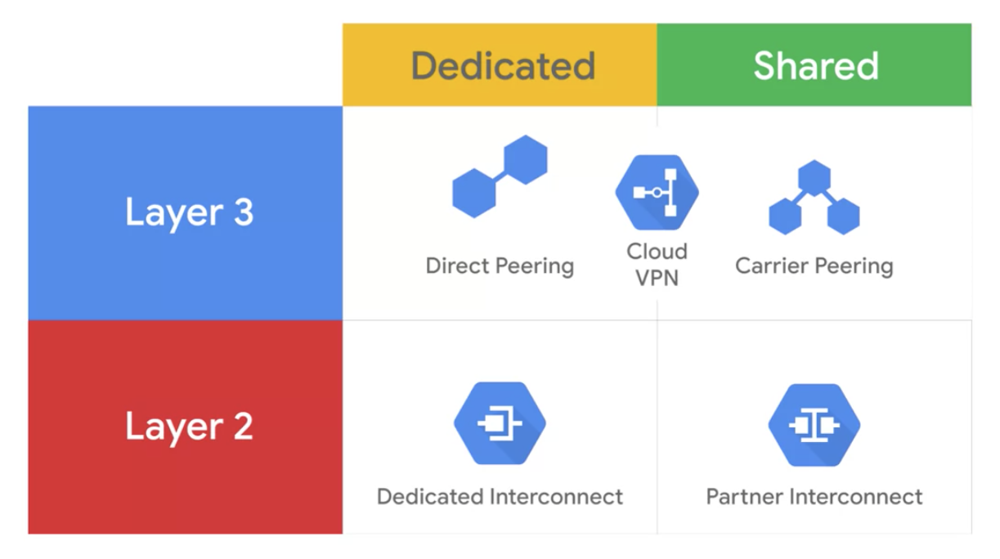
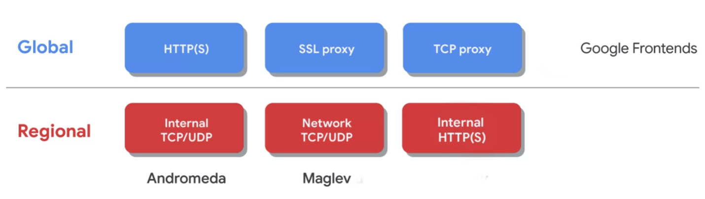
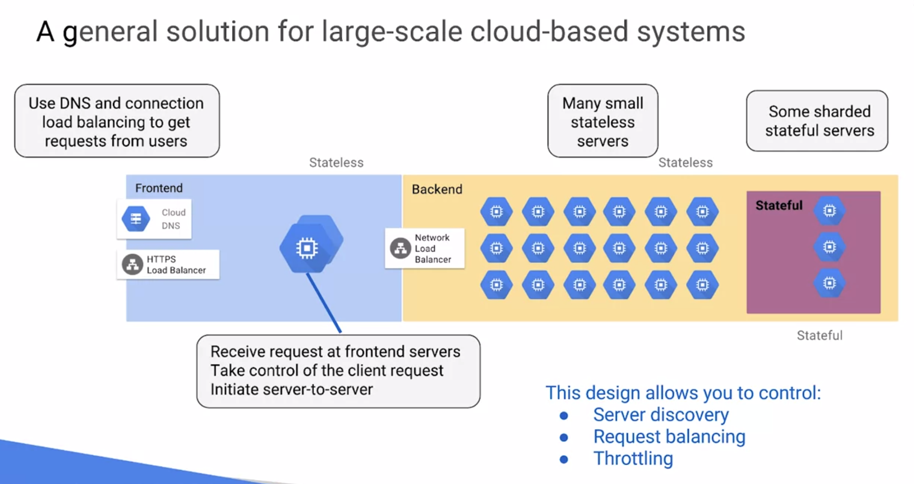

Architecting with Google Compute Engine Specialization
======================================================

Infrastructure
--------------

- Terraform is actually now integrated into GCP Cloud Shell

Networking
----------

- The default quota for each project is five networks but you can simply request additional quota using the GCP console. These networks do not have IP ranges but are simply a construct of all of the individual IP addresses and services within that network. GCP networks are global spending all available regions across the world that I showed earlier. So you can have one network that later exists anywhere in the world
- 3 types of networks: **Default** (The default network is actually an auto mode network), **Auto**, and **Custom**. Can convert an **Auto** mode network to a **Custom** mode network
- Avoid creating large subnets. Overly large subnets are more likely to cause site arrange collisions when using multiple network interfaces and VPC network peering or when configuring a VPN or other connections to an on-premises network. Therefore, do not scale your subnet beyond what you actually need
- FQDN is [hostname].[zone].c.[project-id].internal e.g. `my-server.us-central1-a.c.guestbook-15617.internal`
- Internal DNS resolver, provided as part of Compute Engine (169.254.169.254), configured for use on instance via DHCP, providing answer for internal and extenal addresses
- A **bastion** host provides an external facing point of entry into a network containing private network instances. This host can provide a **single-point of fortification or audit** and can be started and stopped to enable or disable inbound SSH communication from the Internet
- Layer 2 connections use a **VLAN** that pipes directly into your GCP environment, providing connectivity to internal IP addresses in the RFC 1918 address space. Layer 3 connections provide access to G Suite services, YouTube and Google Cloud APIs using public IP addresses
+

+
- The internal load balancer uses **Andromeda** which is GCP's software defined network virtualization stack and the network load balancer uses **Maglev** which is a large distributed software system.
+

+
- HTTPS load balancer support the **QUIC** transport layer protocol. **QUIC** is a transport layer protocol that allows faster client connection initiation, eliminates head of line blocking in multiplexed streams, and supports connection migration when a client's IP address changes
- Network load balancing is a regional **non proxied** load balancing service. In other words, all traffic is passed through the load balancer instead of being proxied and traffic can only be balanced between virtual machine instances that are in the same region unlike a global load balancer. This load balancing service uses forwarding rules to balance the load on your systems based on incoming IP protocol data such as address, port, and protocol type

Identities and Roles
--------------------

- In GCP resource hierarchy, each resource has exactly one parent
- The organization represents your company. The folder could represent your department. Projects represent a trust boundary within your company. Roles represent an abstraction of job roles
- Always select the smallest scope that's necessary for the task in order to reduce your exposure to risk

Compute Engine
--------------

- Cloud Console commands:
** `free`
** `suo dmidecode --type 17`
** `nproc`
** `lscpu`

Storage
-------

- A directory in Cloud Storage is just another object that points to different objects in the bucket
- "Valet Key" access to bucket and objects via ticket (a cryptographically signed URL): `gsutil signurl -d 10m path/to/privatekey.p12 gs://bucket/object`
- A Cloud Bigtable table is sharded into blocks of contiguous rows called **Tablets**, to help balance the workload of queries. **Tablets** are similar to HBase regions. **Tablets** in Bigtable are stored on Colossus file system in **SSTable** format. An **SSTable** provides a persistent, ordered, immutable map from keys to values where both keys and values are arbitrary byte strings. Cloud Bigtable learns to adjust to specific access patterns. If a certain Bigtable node is frequently accessing a certain subset of data, Cloud Bigtable will update the indexes so that other nodes can distribute that workload evenly

Resource Management
-------------------

- In GCP, Labels are user-defined strings in key-value format that are used to organize resources and they can propagate through billing. Tags are user-defined strings that are applied to instances only and are mainly used for networking such as applying firewall rule

Design and Process
------------------

- People tend to grab a great new idea or design pattern and use it for everything - overuse it, which can create problems later
- A central control mechanism can be the choke point and a single point of failure. Think about distributing system
- State is the cornerstone of Cloud based design. The best state is NO state. If can't avoid Stateless, best way is to put Stateless at frontends, separate read and write paths, caching of the read path, push Stateful servers to lower in the stack
+

+
- Four golden monitoring signals: **Latency**, **Traffic**, **Errors**, **Resource Saturation / Usage**
- The categories of requirements during requirements gathering: **Qualitative**, **Quantative**, **Scaling**, **Size**
- In a way, think of airlines very much like Microservices perform at a very single, larger, grander scale. One little hitch in the system can also have a huge chain of event effects on whole system
- Microservices make sense when there are many consumers of atomic unit of functionality. When there is one consumer of tight-coupled functionality, Microservices add overhead without much benefit. So use Microservices where they make sense in the design
- Design first, dimension later
- Failure is not optional, it is mandatory. Anticipate failure, design for failure, and fail gracefully
** Hardware will fail, don't depend on it
** Software will fail, modularise, monitor, test, canary it
** People will fail, review procedure, escalate it
** Communication will fail, don't assume it happened, like the Internet, is designed to route around failure
- Design to avoid Single Point Of Failures (SPOFs), is to design for a spare for teh spare, so N+2
- A group of related items that could fail at one time is called a failure domain. Best avoid correlated failure is to divide business logic into services based on failure domains; understand if that failure domain would occur, who to recover from it, not just individual components, but entire failure domains. Separate and isolate the risk, design independent but collaborating services
- People don't plan to fail, they fail to plan
- The goal isn't backup, its restore
- Cascading failure is when, due to an overload failure, the system seeks additional resources and spreads the overload until the system loses integrity
- Positive feedback cycle overload failure, for example, a single replica for a service can fail due to overload, increasing load on remaining replicas and increasing their probability of failing, causing a domino effect that takes down all the replicas for a service
+
image::http://www.gopnhat.com/tut-note/gcp-a6-cloud-infrastructure-design-process/06-03%200323%20fan-in%20overload%20failure.png[Fan-in (incast) overload failure]
+
image::http://www.gopnhat.com/tut-note/gcp-a6-cloud-infrastructure-design-process/06-03%200402%20design%20to%20mitigate%20incast%20overload.png[Design to mitigate incast overload]
+
- Don't just design your service, design its operation

References
----------

- Architecting with Google Compute Engine Specialization, _https://www.coursera.org/specializations/gcp-architecture_
- Tutorial Note - GCP Cloud Infrastructure Design Process, _http://www.gopnhat.com/tut-note/gcp-a6-cloud-infrastructure-design-process/gcp-a6-cloud-infrastructure-design-process.html_
