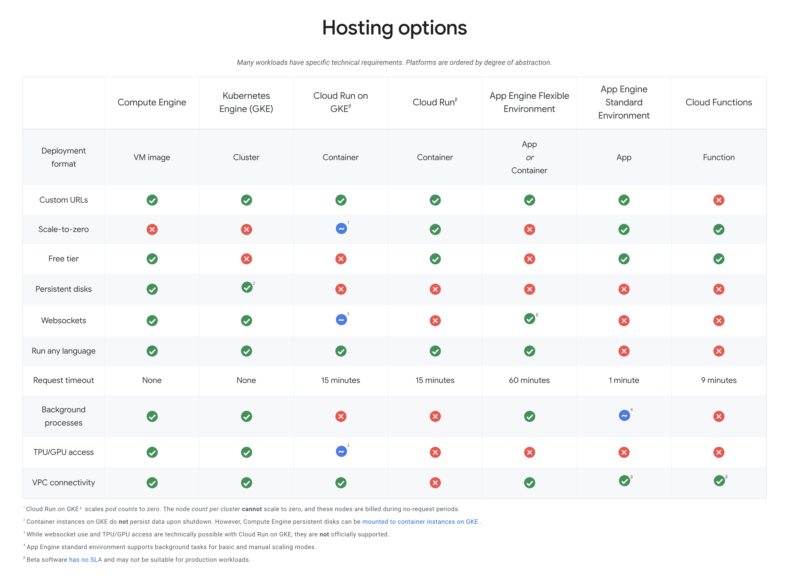

Official Google Cloud Certified Associate Cloud Engineer Study Guide
====================================================================

GCP Products Decision Tree
--------------------------

**GCP Network Tier decision tree**

image::https://miro.medium.com/max/1200/1*JnDFATWt5-7DgQusex4BeQ.png[GCP Network Tier decision tree]

**GCP Network Service Tiers decision tree**

image::Associate Cloud Engineer Study Guide - Network Service Tiers.jpeg[GCP Network Service Tiers decision tree]

**GCP Authentiation options decision tree**

image::https://miro.medium.com/max/1200/1*Uw6w0_X8X29jhpfMgW58Sw.png[GCP Authentiation options decision tree]

**GCP Compute options decision tree**

image::https://miro.medium.com/max/628/1*OV12s1M9O3OcEn2cwdtmEA.png[GCP Compute options decision tree]

**Google Data products decision tree**

image::Google Data products decision tree.png[Google Data products decision tree]

**Google Cloud Dataflow vs. Cloud Dataproc**

image::https://cloud.google.com/dataflow/images/flow-vs-proc-flowchart.svg[Google Dataflow vs. Dataproc]

**Data encryption decision tree**

image::https://miro.medium.com/max/640/1*LTWOlTPPGXIWSPmJEoBVRQ.png[Data encryption decision tree]

**Serverless Compute Platform decition tree**

image::https://cloud.google.com/images/serverless-options/serverless-guide.svg[Serverless Compute Platform]

**GCP Hosting Options**

Assessment Test
---------------

- Machine type, boot disk image or container image, zone, and labels are all configuration parameters or attributes of a VM
- **gsutil mb** is the specific command for creating, or making, a bucket
- Create a lifecycle management configuration policy specifying an age of 90 days and SetStorageClass as nearline is the most efficient way to meet object management policy requirement. Read more: Storage classes https://cloud.google.com/storage/docs/storage-classes, Object Lifecycle Management https://cloud.google.com/storage/docs/lifecycle
- **gsutil rsync** to synchronize the contents of the two buckets
- VPCs are **Global** resources. Google operates a global network, and VPCs are resources that can span that global network
- **gcloud** by default will retry a failed network operation and will wait a long time before each retry. The time to wait is calculated using a truncated binary exponential back-off strategy
- Only Google Spanner and Cloud SQL databases support transactions and have a SQL interface. Datastore has transactions but does not support fully compliant SQL; it has a SQL-like query language. Cloud Storage does not support transactions or SQL
- App Engine is a PaaS that allows developers to deploy full applications without having to manage servers or clusters. Compute Engine and Kubernetes Engine require management of servers. Cloud Functions is suitable for short-running but not full applications
- BigQuery is designed for petabyte-scale analytics and provides a SQL interface
- Cloud Dataflow allows for stream and batch processing of data and is well suited for this kind of ETL work. Dataproc is a managed Hadoop and Spark service that is used for big data analytics
- Preemptible virtual machines may be shut down at any time but will always be shut down after running 24 hours by Google
- **Organizations, folders, and projects** are the components used to manage an organizational hierarchy. **Buckets, directories, and subdirectories** are used to organize storage
- Cloud Dataproc is the managed Spark service. Cloud Dataflow is for stream and batch processing of data, BigQuery is for analytics

**Google Cloud Function**

image::Associate Cloud Engineer Study Guide - Cloud Function.png[Google Cloud Function]

Chapter 1 - Overview of Google Cloud Platform
---------------------------------------------

- Object storage, like Cloud Storage, provides redundantly stored objects without limits on the amount of data you can store
- Block sizes in a block storage system can vary. Block size is established when a file system is created
- Firewalls are software-defined network controls that limit the flow of traffic into and out of a network or subnetwork. Routers are used to move traffic to appropriate destinations on the network. Identity access management is used for authenticating and authorizing users
- Specialized services in GCP are serverless
- Investing in servers should be based on demand for server capacity
- The characteristics of the server, such as the number of virtual servers, the amount of memory, and the region where you run the VM, influence the cost
- Containers give the most flexibility for using the resources of a cluster efficiently and orchestration platforms reduce the operations overhead
- Cloud Filestore is based on Network Filesystem (NSF), which is a distributed file management system
- When you create a network, it is treated as a virtual private cloud. Resources are added to the VPC and are not accessible outside the VPC unless
you explicitly configure them to be
- Caches use memory, and that makes them the fastest storage type for reading data. Caches are data stores on the backend of distributed systems, not the clients. Caches can get out of sync with the system of truth because the system of truth could be updated, but the cache may not be updated
- Cloud providers have large capacity and can quickly allocate those resources to different customers. With a mix of customers and workloads, they can optimize the allocation of resources
- Specialized services are monitored by Google so users do not have to monitor them. Specialized services provide a specific compute functionality but do not require the user to configure any resources. They also provide APIs
- Attached drives are block storage devices. Cloud Storage is the object storage service and does not attach directly to a VM
- Databases require persistent storage on block devices. Object storage does not provide data block or file system storage

Chapter 2 - Google Cloud Computing Services
-------------------------------------------

GCP services list:

- Computing resources - Compute Engine, Kubernetes / Containers Engine, App Engine (standard / flexible environment), Cloud Functions (event-driven processing, short-running code)
- Storage resources - Cloud Storage (for object storage, single unit of data and multiple regions), Persistent Disk (block storage), Cloud Storage for Firebase, Cloud Filestore (shared file system, NFS easily to mount)
- Databases - Cloud SQL (managed relational database without having to attend to database administration tasks, such as backing up databases or patching database software), Cloud Spanner (globally distributed relational database, with the ability to scale horizontally, supports ANSI 2011 standard SQL), Cloud Bigtable (NoSQL as wide-column data model, low-latency write and read operations, support millions of operations per second, Hbase API), Cloud Datastore (NoSQL document database, collection of key-value pair, flexible schemas, REST API, shard or partition, supports transactions, indexes, and SQL-like queries), Cloud Memorystore (in-memory cache service, managed Redis service), Cloud Firestore (NoSQL database service designed as a backend for highly scalable web and mobile applications, includes a Datastore mode, which enables applications written for Datastore to work with Cloud Firebase)
- Networking services - Virtual Private Cloud (can span the globe without relying on the public Internet), Cloud Load Balancing (distribute the workload within and across regions, adapt to failed or degraded servers, and autoscale your compute resources to accommodate changes in workload), Cloud Armor, Cloud CDN, Cloud Interconnect (interconnects and peering), Cloud DNS (automatically scale)
- Identity management and security (users, roles, and privileges, groups of related permissions can be bundled into roles)
- Development tools - Cloud SDK
- Management tools - Stackdriver, Monitoring, Logging, Error Reporting, Trace, Debugger, Profiler
- Specialized services - Apigee API Platform, Data Anylytics (BigQuery, Cloud Dataflow, Dataproc, Dataprep), AI and Machine Learning (Cloud AutoML, Machine Learning Engine, NLP, Vision)

- Container is another approach to isolating computing resources is to use features of the host operating system to isolate processes and resources without hypervisor. No guest operating systems run on top of the container manager. Containers make use of host operating system functionality, while the operating system and container manager ensure isolation between the running containers
- App Engine is well suited for web and mobile backend applications
- A zone is considered a single failure domain
- Load balancers can route workload based on network-level or application-level rules. GCP load balancers can distribute workloads globally
- Why Çloud, enable customers to focus on application development while the cloud provider takes on more responsibility for maintaining the underlying compute infrastructure
- App Engine flexible environments allow you to run containers on the App Engine PaaS
- Cloud CDN acts as a first line of defense in the case of DDoS attacks
- Stackdriver Logging is used to consolidate and manage logs generated by applications and servers
- Cloud SQL does not have global transaction
- Dataproc is designed to execute workflows in both batch and streaming modes
- Error reporting consolidates crash information

Chapter 3 - Projects, Service, Accounts, and Billing
----------------------------------------------------

- All resources are grouped, organized and managed within **resource hierarchy** (Organisation, Folder, Project). Organization policies are defined in terms of constraints on resources in the **resource hierarchy**
- **IAM** lets you assign permissions so users or roles can perform specific operations in the cloud. The **Organization Policy Service** lets you specify limits on the ways resources can be used. **IAM** specifies who can do things, and the **Organization Policy Service** specifies what can be done with resources
- Organisation Administrator Identity, Access Management IAM roles to manage the organisation
- The users with the Organization Administrator IAM role are responsible for the following:
** Defining the structure of the resource hierarchy
** Defining identity access management policies over the resource hierarchy
** Delegating other management roles to other users
- Project Creator (with **resourcemanager.projects.create** permission) and Billing Account Creator IAM roles to all users in the domain
- Projects must have billing accounts associated with them. A billing account can be associated with more than one project
- It is in projects that we create resources, use GCP services, manage permissions, and manage billing options
- Organization will have a quota of projects it can create. Google makes decisions about project quotas based on typical use, the customer’s usage history, and other factors
- List constraints:
** Allow a specific set of values
** Deny a specific set of values
** Deny a value and all its child values
** Allow all allowed values
** Deny all values
- Boolean Constraints: **constraints/compute.disableSerialPortAccess**
- To Policy Evaluation, policies are inherited and cannot be disabled or overridden by objects lower in the hierarchy
- Inherited policies can be ONLY overridden by defining a policy at a folder or project level. Service accounts and billing accounts are not part of the resource hierarchy and are not involved in overriding policies
- Role is a collection of permissions
** **Primitive roles** are building blocks for other roles, including Owner, Editor, Viewer. Primitive roles grant wide ranges of permissions that may not always be needed by a user. It is a best practice to use Predefined roles instead of Primitive roles when possible
** **Predefined roles** provide granular access to resources, designed for GCP products and services
** **Custom roles** allow cloud administrators to create and administer their own roles. Not all permissions are available in **Custom roles**
- Service accounts are resources managed by administrators. Resources can perform operations that the Service account has permission to perform.
- Service accounts are identities assigned to roles
- Two types of Service accounts:
** User managed Service accounts
** Google managed Service accounts
- Service accounts can be managed as a group of accounts at the **project level** or at the **individual service account level**. When a user is granted **iam.serviceAccountUser** at the project level, that user can manage all Service accounts in the project. If a new Service account is created, they will automatically have privilege to manage that Service account
- When a Service account is created, Google generates encrypted keys for authentication
- Service accounts are resources that are managed by administrators
- Users with the Organization IAM role are not necessarily responsible for determining what privileges should be assigned to users. That is determined based on the person’s role in the organization and the security policies established within the organization
- Billing accounts: self-serve (paid by credit card or direct debit from a bank account, costs are charged automatically) and invoiced
- A budget is associated with a billing account, not a project
- A self-service Billing account is appropriate only for amounts that are within the credit limits of credit cards
- Billing data can be exported to either a BigQuery database or a Cloud Storage file
- Stackdriver is a set of services for monitoring, logging, tracing, and debugging applications and resources. For monitoring and logging data to be saved into Stackdriver, need to create a workspace to save it
- Strakdriver workspaces are linked to projects, not individual resources

Chapter 4 - Introduction to Computing in Google Cloud
-----------------------------------------------------

- App Engine (dynamic and resident instances). The App Engine standard environment can autoscale down to no instances when there is no load and thereby minimize costs. App Engine flexible environment is similar to the Kubernetes Engine, and flexible environment will always be **at least one container** running with your service
- High performance computing clusters can use preemptible machines because work on a preemptible machine can be automatically rescheduled for another node on the cluster when a server is preempted
- Kubernetes administrates clusters of virtual and bare-metal machines, and is designed to support clusters that run a variety of applications.
- A group containers in Kubernetes called pods. Containers within a single pod share storage, network resources, an IP address and port space. A pod is a logically single unit for providing a service. A group of running identical pods is called a deployment. The identical pods are referred to as replicas.
- Kubernetes Engine is for large-scale applications that require high availability and high reliability. Kubernetes manage services which have different lifecycles and scalability requirements as a logical unit and at levels of abstraction
- Kubernetes uses 25 percent of memory up to 4GB and then slightly less for the next 4GB, and it continues to reduce the percentage of additional memory down to 2 percent of memory over 128GB; takes 6 percent CPU resources of the first core, down to 0.25 percent of any cores above four cores
- Kubernetes does not provide vulnerability scanning. GCP does have a Cloud Security Scanner product, but that is designed to work with App Engine to identify common application
vulnerabilities
- Cloud Functions provides the “glue” between services
- All Google regions have the same level of service level agreement, so reliability is the same
- Preemptible VM can save a snapshot and use that to create a new regular instance
- Custom machine types can have between 1 and 64 vCPUs and up to 6.5GB of memory per vCPU

Chapter 5 - Computing with Compute Engine Virtual Machines
----------------------------------------------------------

- All operations you perform will apply to resources in the selected project
- The first time you try to work a VM you will have to create a billing account. When you start using the console, create a project, only if billing is enabled
- A zone is a data center–like facility within a region. Different zones may have different machine types available, so you will need to specify a region first and then a zone to determine the set of machine types available
- The boot disk type, which can be either Standard Persistent Disk or SSD Persistent Disk
- Labels and a general description will help track numbers of VMs and their related costs. --labels parameter and specify the key followed by an equal sign followed by the value, e.g., KEYS=VALUE
- Metadata can specify key-value pairs associated with the instance. These values are stored in a metadata server, which is available for querying using the Compute Engine API. Metadata tags are especially useful if you have a common script you want to run on startup or shutdown but want the behavior of the script to vary according to some metadata values
- Availability Policy: Preemptibility, Automatic restart, On host maintenance
- Shielded VM is an advanced set of security controls that includes Integrity Monitoring, a check to ensure boot images have not been tampered with, including Secure Boot, Virtual Trusted Platform Module, Integrity Monitoring
- Sole Tenancy is used if you need to run your VMs on physical servers that only run your VMs
- The two operations are using the book disk configuration are adding a new disk and attaching an existing disk. Reformatting an existing disk is not an option
- If you can tolerate unplanned disruptions, use preemptible VMs
- **gcloud** commands start with gcloud followed by a service, such as compute, followed by a resource type, such as instances, followed by a command or verb

Chapter 6 - Managing Virtual Machines
-------------------------------------

- The Reset in VM Connect drop down menu is to restarts a VM
- VM instance can filter by: Labels, Internal IP, External IP, Status, Zone, Network, Deletion protection, Member of managed instance group and unmanaged instance group. Multiple filter conditions, then all must be true for a VM to be listed unless you explicitly state the OR operator
- To add a GPU to an instance, you must start an instance in which GPU libraries have been installed or will be installed. Also verify that the instance will run in a zone
that has GPUs available. And CPU must be compatible with the GPU selected, and GPUs cannot be attached to shared memory machines, and must set the instance to terminate during maintenance
- When first create a snapshot, GCP will make a full copy of the data on the persistent disk. The next time create a snapshot from that disk, GCP will copy only the data that has changed since the last snapshot. This optimizes storage while keeping the snapshot up to date with the data that was on the disk the last time a snapshot operation occurred. Snapshots are copies of disks and are useful as backups and for copying data to other instances
- It is a good practice to label all resources with a consistent labeling convention
- Images are used to create VMs, can be created from the following: Disk, Snapshot, Cloud storage file, Another image. Images have an optional attribute called Family, which allows you to group images. Eventually, deprecated images will no longer be available
- Command line: --flatten, --format, --verbosity, --async, --keep-disks=all, --delete-disks=data, --filter="zone:ZONE"
- Managed groups consist of groups of identical VMs. They are created using an instance template, which is a specification of a VM configuration, including machine type, boot disk image, zone, labels, and other properties of an instance. Managed instance groups can automatically scale the number of instances in a group and be used with load balancing to distribute workloads across the instance group. If an instance in a group crashes, it will be recreated automatically. Managed groups are the preferred type of instance group
- Unmanaged groups should be used only when you need to work with different configurations within different VMs within the group
- Instance groups are sets of instances managed as a single entity. Instance groups can contain instances in a single zone or across a region. The first is called a zonal managed instance group, and the second is called a regional managed instance group. Regional managed instance groups are recommended because that configuration spreads the workload across zones, increasing resiliency
- In addition to load balancing, managed instance groups can be configured to autoscale. You can configure an autoscaling policy to trigger adding or removing instances based on CPU utilization, monitoring metric, load-balancing capacity, or queue-based workloads
- Instances are created automatically when an instance group is created

Chapter 7 - Computing with Kubernetes
-------------------------------------

- Pods treat the multiple containers as a single entity for management purposes. Replicas are copies of pods and constitute a group of pods that are managed as a unit. Pods support autoscaling as well. Pods are considered ephemeral; that is, they are expected to terminate. Pods are single instances of a running process in a cluster. Pods run containers but are not sets of containers
- Service is an object that provides API endpoints with a stable IP address that allow applications to discover pods running a particular application. Services update when changes are made to pods, so they maintain an up-to-date list of pods running an application. Services provide a level of indirection to accessing pods
- ReplicaSet is a controller used by a deployment that ensures the correct number identical of pods are running
- Deployments are sets of identical pods. The members of the set may change as some pods are terminated and others are started, but they are all running the same application
- StatefulSets are like deployments, but they assign unique identifiers to pods. This enables Kubernetes to track which pod is used by which client and keep them together. StatefulSets are used when an application needs a unique network identifier or stable persistent storage
- Job is an abstraction about a workload. Jobs create pods and run them until the application completes a workload
- The first time you use Kubernetes Engine, you may need to create credentials
- Kubernetes creates instance groups as part of the process of creating a cluster. Multizone/multiregion clusters are available in Kubernetes Engine and are used to provide resiliency to an application
- **kubectl** commands specify a verb and then a resource. **kubectl** command is used to control workloads on a Kubernetes cluster once it is created, like run a Docker image on a cluster. **kubectl**, not gcloud, is used to initiate deployments
- Stackdriver is a comprehensive monitoring, logging, alerting, and notification service that can be used to monitor Kubernetes clusters
- Workspaces are logical structures for storing information about resources in a project that are being monitored
- Alerts are assigned to instances or sets of instances

Chapter 8 - Managing Kubernetes Clusters
----------------------------------------

- **gcloud ** command is used to view, modify Kubernetes resources such as clusters, nodes, Container Registry images, which managed by GCP
- **gcloud container clusters get-credentials** command is the correct command to configure kubectl to use GCP credentials for the cluster
- **gcloud container clusters create** ch07-cluster --num-nodes=3 --region=us-central1
- **gcloud container clusters resize** standard-cluster-1 --node-pool default-pool --size 5 --region=us-central1, command requires the name of the cluster and the node pool to modify
- **gcloud container clusters update** standard-cluster-1 **--enable-autoscaling --min-nodes 1 --max-nodes 5** --zone us-central1-a --node-pool default-pool, to enable autoscaling, use the update command to specify
the maximum and minimum number of nodes
- Pods are used to implement replicas of a deployment. Pods are managed through deployments. A deployment includes a configuration parameter called **replicas**, which are the number of pods running the application specified in the deployment. It is a best practice to modify the deployments, which are configured with a specification of the number of replicas that should always run
- Deployments are listed under Workloads in Kubernetes Engine menu
- In Create Deployment page in Cloud Console, can specify container image, cluster name, application name along with the labels, initial command, and namespace
- Actions in Deployment details are: **Autoscale**, **Expose**, **Rolling Update**, **Scale**
- **kubectl** command is used to view, modify Kubernetes resources such as pods, deployments, services, which managed by Kubernetes
- **kubectl run** hello-server --image=gcr.io/google/samples/hello-app:1.0 --port 8080, is the command used to start a deployment. It takes a name for the deployment, an image, and a port specification
- **kubectl expose deployment** hello-server --type="LoadBalancer", command makes a service accessible
- **kubectl get deployments** to list deployments
- **kubectl scale deployment** to modify the number of deployments
- **kubectl autoscale deployment** to enable autoscaling.
- **kubectl get services**, command to list services
- **kubectl delete service** hello-server
- The Container Registry is the service for managing images that can be used in other services, including Kubernetes Engine and Compute Engine
- **gcloud container images** list --repository gcr.io/google-containers
- **gcloud container images** describe gcr.io/appengflex-project-1/nginx
- In Kubernetes, IP addresses are assigned to VMs, not services

Chapter 9 - Computing with App Engine
-------------------------------------

- App Engine **Standard** and App Engine **Flexible**
- App Engine **Standard** applications consist of four components: Application -> Service -> Version -> Instance
- A project can support only one App Engine app. If you’d like to run other applications, they will need to be placed in their own projects
- All resources associated with an App Engine app are created in the region specified when the app is created
- Services are defined by their source code and their configuration file. The combination of those files constitutes a version of the app
- in **app.yaml** file **runtime** parameter specifies the language environment to execute in; **script** parameter specifies the script to execute; there is no parameter for specifying the maximum time an application can run
- **gcloud app deploy app.yaml** is used to deploy an App Engine app from the command line. It breaks **gcloud [service] [resource] verb** command line convention. This command must be executed from the directory with the **app.yaml** file. **--no-promote** parameter is to deploy the app without routing traffic to it. It is the way to get code out as soon as possible without exposing it to customers
- **gcloud app logs** command
- **gcloud app browse** command
- **gcloud app versions stop** command
- App Engine applications are accessible from URLs that consist of the project name followed by appspot.com. Can also assign a custom domain rather not **appspot.com** URL. Do this from the Add New Custom domain function on the App Engine Settings page
- Two kinds of instances available in App Engine Standard - **resident instances** are resident and running all the time, optimized for performance so users will wait less while an instance is started, used with **manual scaling**; **dynamic instances** are scaled based on load, used with **autoscaling and basic scaling**
- Autoscaling enables: **target_cpu_utilization**, **target_throughput_utilization**, **max_concurrent_requests**, **max_instances**, **min_instances**, **max_pending_latency**, **min_pending_latency**
- **target_cpu_utilization** specifies the maximum CPU utilization that occurs before additional instances are started
- **target_throughput_utilization** specifies the maximum number of concurrent requests before additional instances are started, uses a 0.05 to 0.95 scale to specify maximum throughput utilization
- **max_concurrent_requests** specifies the max concurrent requests an instance can accept before starting a new instance. The default is 10; the max is 80
- **max_instances** / **min_instances** specifie the maximum / minimum number of instances that can run for this application
- **max_pending_latency** / **min_pending_latency** indicates the maximum and minimum time a request will wait in the queue to be processed
- Basic scaling only allows parameters for **idle_timeout** and **max_instances**
- Manual scaling only allows parameter for **instances**
- **IP address**, **HTTP cookie** (preferred way), and **random splitting**, are allowed methods for splitting traffic
- The cookie used for splitting in App Engine is called **GOOGAPPUID**
- **gcloud app services set-traffic** command allocates service to some users to the new version without exposing all users to it. If no service name is specified, then all services are split; **set-traffic** command takes the following parameters: **--split** is the mandatory parameter for specifying a list of instances and the percent of traffic they should receive; **--migrate** migrate traffic from the previous version to the new version; **--split-by** values are ip, cookie, and random;

Chapter 10 - Computing with Cloud Functions
-------------------------------------------

- App Engine supports multiple services organized into a single application
- Cloud Functions supports individual services that are managed and operate independently of other services. Cloud Functions will time out after 1 minute, although you can set the timeout for as long as 9 minutes
- **Events** categories: Cloud Storage, Cloud Pub/Sub, HTTP, Firebase, Stackdriver Logging
- **Trigger** is a way of responding to an event
- **Triggers** have an associated **Function**
- **Function** takes two arguments: event_data and event_context
- **Function** memory options range from 128MB to 2GB, default is 256MB
- **Function** parameters for **Cloud Storage**: Cloud function name, Memory allocated for the function, Trigger, **Event type**, Source of the function code, Runtime, Source code, Name of the function to execute
- **Function** parameters for **Cloud Pub/Sub**: Cloud function name, Memory allocated for the function, Trigger, **Topic**, Source of the function code, Runtime, Source code, Name of the function to execute
- Parameters creating Cloud Storage function: runtime, trigger-resource, trigger-event. Trigger events are: google.storage.object.finalize, google.storage.object.delete, google.storage.object.archive, google.storage.object.metadataUpdate
- Parameters creating Cloud Pub/Sub function: runtime, trigger-topic. Trigger event is: topic

Chapter 11 - Planning Storage in the Cloud
------------------------------------------

- Memorystore can be configured to use between 1GB and 300GB of memory
- Persistent disks, both SSD and HDD can be up to 64TB. Persistent disks automatically encrypt data on the disk
- Four storage classes in **Cloud Storage**: Regional, multiregional, nearline, and coldline
- Cloud Storage uses an object data model
- Lifecycle rule can be  specified on objects in Cloud Storage. Condition options: Age, Creation Data, Storage Class, Newer Versions, and Live State (live or
archived versions of an object)
- Lifecycle on Cloud Storage: Regional and multiregional class can be changed to nearline or coldline; Nearline storage class can change to coldline. Regional class storage cannot be changed to multiregional. Multiregional class cannot be changed to regional
- When versioning is enabled on a bucket, a copy of an object is archived each time the object is overwritten or when it is deleted. The most recent version of an object on bucket is called the **Live version**
- There are three broad categories of data models available in GCP: object, relational, and NoSQL. Cloud Firestore and Firebase as a fourth category
- Cloud SQL and Cloud Spanner use relational databases for transaction processing applications; BigQuery uses a relational model for data warehouse and analytic applications
- The first task for using BigQuery is to create a data set to hold data, by clicking Create Dataset
- Datastore and Firebase are document databases
- Datastore has some features in common with relational databases, such as support for transactions and indexes to improve query performance. The main difference is that Datastore does not require a fixed schema or structure and does not support relational operations, such as joining tables, or computing aggregates, such as sums and counts.
- Cloud Firestore is that it is designed for storing, synchronizing, and querying data across distributed applications, like mobile apps. Apps can be automatically updated in close to real time when data is changed on the backend. Cloud Firestore supports transactions and provides multiregional replication.
- Bigtable is a wide-column table
- Data stores decision: Read and write patterns, consistency requirements, transaction support, cost, and latency ...
- Cloud SQL and Bigtable require you to specify some configuration information for VMs
- Second-generation instance, can configure the MySQL version, connectivity, machine type, automatic backups, failover replicas, database flags, maintenance windows, and labels

Chapter 12 - Deploying Storage in Google Cloud Platform
-------------------------------------------------------

- Query the document database using GQL, a query language similar to SQL
- **gcloud** is used for most products but not all; **gsutil** is used to work with Cloud Storage from the command line; **bq** used for BigQuery from the command line; **cbt** used to work with Bigtable from the command line
- gcloud sql backups create
- gcloud sql instances patch ace-exam-mysql --backup-start-time 03:00
- gcloud datastore export –namespaces='[NAMESPACE]' gs://ace_exam_backups
- gcloud datastore import gs://[BUCKET]/[PATH]/[FILE].overall_export_metadata
- BigQuery displays an estimate of the amount of data scanned. Use the scanned data estimate with the **Pricing Calculator** to get an estimate cost
- In BigQuery console Job History shows active jobs, completed jobs, and jobs that generated errors
- bq --location=[LOCATION] query --use_legacy_sql=false --dry_run [SQL_QUERY]
- bq --location=US show -j gcpace-project:US.bquijob_119adae7_167c373d5c3
- Subscriptions can be pulled, in which the application reads from a topic, or pushed, in which the subscription writes messages to an endpoint
- Pub/Sub will wait the period of time specified in the Acknowledgment Deadline parameter. The time to wait can range from 10 to 600 seconds
- gcloud pubsub topics create [TOPIC-NAME]
- gcloud pubsub topics publish [TOPIC_NAME] --message [MESSAGE]
- gcloud pubsub subscriptions create [SUBSCRIPTION-NAME] --topic [TOPIC-NAME]
- gcloud pubsub subscriptions pull --auto-ack [SUBSCRIPTION_NAME]
- Unread messages have a retention period after which they are deleted
- cbt createtable ace-exam-bt-table
- cbt ls
- cbt createfamily ace-exam-bt-table colfam1
- cbt set ace-exam-bt-table row1 colfam1:col1=ace-exam-value
- cbt read ace-exam-bt-table
- gcloud dataproc clusters create cluster-bc3d --zone us-west2-a
- gcloud dataproc jobs submit spark --cluster cluster-bc3d --jar ace_exam_jar.jar
- gsutil rewrite -s [STORAGE_CLASS] gs://[PATH_TO_OBJECT]
- gsutil mv gs://[SOURCE_BUCKET_NAME]/[SOURCE_OBJECT_NAME] gs://[DESTINATION_BUCKET_NAME]/[DESTINATION_OBJECT_NAME]
- gsutil mv gs://[BUCKET_NAME]/[OLD_OBJECT_NAME] gs://[BUCKET_NAME]/[NEW_OBJECT_NAME]

Chapter 13 - Loading Data into Storage
--------------------------------------

- The first step in loading data into Cloud Storage is to create a bucket
- Folder can't be moved in GCP Console, under Storage menu
- gsutil mb gs://[BUCKET_NAME]/
- gsutil cp [LOCAL_OBJECT_LOCATION] gs://[DESTINATION_BUCKET_NAME]/
- gsutil mv gs://[SOURCE_BUCKET_NAME]/[SOURCE_OBJECT_NAME] gs://[DESTINATION_BUCKET_NAME]/[DESTINATION_OBJECT_NAME]
- gsutil acl ch -u [SERVICE_ACCOUNT_ADDRESS]:W gs://[BUCKET_NAME]
- gcloud sql instances describe [INSTANCE_NAME]
- gcloud sql export sql|csv [INSTANCE_NAME] gs://[BUCKET_NAME]/[EXPORT_FILE_NAME] --database=[DATABASE_NAME]
- gcloud sql import sql|csv [INSTANCE_NAME] gs://[BUCKET_NAME]/[IMPORT_FILE_NAME] --database=[DATABASE_NAME]
- Exports and imports of Cloud Datastore are done at the level of **namespaces**. The default namespace for Cloud Datastore is **default**
- Cloud Datastore export process creates a metadata file with information about the data exported and a folder that has the data itself. Export folder name is using the data and time of the export, e.g., **gcloud datastore export --namespaces="(default)" gs://ace-exam-bucket1**; when import, e.g., **gcloud datastore import gs://ace-exam-datastore1/2018-12-20T19:13:55_64324/2018-12-20T19:13:55_64324.overall_export_metadata**
- BigQuery export format options are CSV, Avro, and JSON. Choose a compression type. The options are None or Gzip for CSV and “**deflate**” and “**snappy**” for Avro
- **Avro** is a compact binary format that supports complex data structures, a schema is written to the file along with data. Schemas are defined in JSON. Avro is a good option for large data sets, and compressed using either the **deflate** or **snappy** utilities
- BigQuery imported, file format options include CSV, JSON, Avro, Parquet, PRC, and Cloud Datastore Backup
- BigQuery table type may be **native type** or **external table**. If the table is external, the data is kept in the source location, and only metadata about the table is stored in BigQuery. This is used when you have large data sets and do not want to load them all into BigQuery
- To export BigQuery data from the command line, use the **bq extract** command: bq extract --destination_format [FORMAT] --compression [COMPRESSION_TYPE] --field_delimiter [DELIMITER] --print_header [BOOLEAN] [PROJECT_ID]:[DATASET].[TABLE] gs://[BUCKET]/[FILENAME]
- To import data into BigQuery from the command line, use the **bq load** command: bq load --autodetect --source_format=[FORMAT] [DATASET].[TABLE] [PATH_TO_SOURCE]. **--autodetect** automatically detect the schema of a file on import
- Export from Cloud Spanner will be charges for running **Cloud Dataflow**, a pipeline service for processing streaming and batch data that implements workflows, because there is no gcloud command to export data, and there may be data egress charges for data sent between regions
- Cloud Bigtable does not have an Export and Import option in the Cloud Console or in gcloud. Two other options: using a Java application for importing and exporting or using the HBase interface to execute HBase commands
- Cloud Dataproc is a data analysis platform. These platforms are designed more for data manipulation, statistical analysis, machine learning, and other complex operations than for data storage and retrieval. When you export from Dataproc, you are exporting the cluster configuration, not data in the cluster
- gcloud beta dataproc clusters export [CLUSTER_NAME] --destination=[PATH_TO_EXPORT_FILE]
- gcloud beta dataproc clusters import [SOURCE_FILE]

Chapter 14 - Creating a Virtual Private Cloud with Subnets
----------------------------------------------------------

- GCP automatically creates a VPC when you create a project
- VPCs are global resources, so they are not tied to a specific region or zone
- VPCs are logical data centers in the cloud. VPCs are global, they have subnets in all regions. Resources in any region can be accessed through the VPC, can communicate with each other in SAME VPC
- VPCs can have multiple subnets but each subnet has its own address range, subnets are regional resources
- The shared VPC is hosted in a common project. Users in other projects who have sufficient permissions can create resources in the shared VPC
- Classless Inter Domain Routing (CIDR) notation
- Private Google Access allows VMs on the subnet to access Google services without assigning an external IP address to the VM
- Flow Logs option turns on / off logging of network traffic and sent to Stackdriver
- Regional routing will have Google Cloud Routers learn routes within the region. Global routing will enable Google Cloud Routers to learn routes on all subnetworks in the VPC
- gcloud compute networks create ace-exam-vpc1 --subnet-mode=auto (**auto mode network** is GCP chooses a range of IP addresses for each subnet when creating subnets)
- gcloud compute networks create ace-exam-vpc1 --subnet-mode=custom
- gcloud beta compute networks **subnets** create ace-exam-vpc-subnet1 --network=aceexam-vpc1 --region=us-west2 --range=10.10.0.0/16 --enable-private-ip-googleaccess --enable-flow-logs
- gcloud organizations add-iam-policy-binding [ORG_ID] --member='user:[EMAIL_ADDRESS]' --role="roles/compute.xpnAdmin" (Shared VPC Admin role to a organisation)
- gcloud organizations list
- gcloud beta resource-manager **folders** add-iam-policy-binding [FOLDER_ID] --member='user:[EMAIL_ADDRESS]' --role="roles/compute.xpnAdmin" (Shared VPC Admin role to a folder)
- gcloud beta resource-manager **folders** list --organization=[ORG_ID]
- Shared VPCs can be shared at the **network or folder level**. Shared VPCs need to bind identity and access management (IAM) policies at the **organizational or folder level** to enable Shared VPC Admin roles
- gcloud compute shared-vpc enable [HOST_PROJECT_ID] (sharing VPC at the organisation level)
- gcloud compute shared-vpc associated-projects add [SERVICE_PROJECT_ID] --host-project [HOST_PROJECT_ID] (sharing VPC at the organisation level)
- gcloud beta compute shared-vpc enable [HOST_PROJECT_ID] (sharing VPC at the folder level)
- gcloud beta compute shared-vpc associated-projects add [SERVICE_PROJECT_ID] --host-project [HOST_PROJECT_ID] (sharing VPC at the folder level)
- **VPC peering** for interproject connectivity
- gcloud compute networks peerings create peer-ace-exam-1 --network ace-exam-network-A --peer-project ace-exam-project-B --peer-network ace-exam-network-B --auto-create-routes (peering on network from A to B)
- gcloud compute networks peerings create peer-ace-exam-1 --network ace-exam-network-B --peer-project ace-exam-project-A --peer-network ace-exam-network-A --auto-create-routes (peering on network from B to A)

- Firewall is stateful which means if traffic is allowed in one direction and a connection established, it is allowed in the other direction
- An active connection is one with at least one packet exchanged every ten minutes
- All VPCs start with two **implied rules**: One allows egress traffic to all destinations (IP address 0.0.0.0/0), and one denies all incoming traffic from any source (IP address 0.0.0.0/0). **implied rules** can't be deleted
- Firewall rules consist of direction (incoming / outcoming), priority (which of all the matching rules is applied), action (allow / deny), target (an instance, alll instances in a network, instances with particular network tags, instances using a special service account), source (IP ranges, instances with particular network tags, instances using a special service account) / destination (IP ranges), protocols (TCP, UDP, ICMP) and port, and enforcement status (enabled / disabled)
- Compute and the resource used for creating, deleting, describing, updating, listing a firewall rule
- Firewall rules are only applied to subnet level, can't to VPC level
- gcloud compute firewall-rules create ace-exam-fwr1 –-network ace-exam-vpc1 –-allow tcp:20000-25000
- gcloud compute firewall-rules create ace-exam-fwr1 –-direction ingress –-allow udp:20000-30000

- VPNs are secure connections between your VPC subnets and your internal network. VPNs route traffic between your cloud resources and your internal network. VPNs include gateways, forwarding rules, and tunnels (**gcloud compute forwarding-rule**, **gcloud compute target-vpn-gateways**, **gcloud compute vpn-tunnels**)
- Routers can be configured to learn **regional routes** or **global routes**. Global dynamic routing is used to learn all routes on a network. Regional dynamic routing would learn only routes in a region
- Dynamic (routes are learned regionally or globally), Route-Based (IP ranges of the remote network), or Policy-Based Routing (remote IP ranges, local subnet, local IP ranges)
- Dynamic routing uses the Board Gateway Protocol (**BGP protocol**) to learn routes in your networks. Private **Autonomous System Number (ASN)** used by the BGP protocol. The ASN is a number in the range 64512–65534 or 4000000000–4294967294. Each cloud router you create will need a **unique ASN**
- Internet Key Exchange (IKE) protocol
- gcloud compute target-vpn-gateways create NAME --network [VPN_NETWORK] --region [REGION]
- gcloud compute forwarding-rules create NAME --TARGET_SPECIFICATION (--target-instance, --target-http-proxy, --target-vpn-gateway) [VPN_GATEWAY]
- gcloud compute vpn-tunnels create NAME --peer-address [PEER_ADDRESS] (IPv4 address of the remote tunnel endpoint) --sharedsecret [SHARED_SECRET] --target-vpn-gateway [TARGET_VPN_GATEWAY] (target VPN gateway IP)

Chapter 15 - Networking in the Cloud: DNS, Load Balancing, and IP Addressing
----------------------------------------------------------------------------

- Domain Name System (DNS)
- HTTP(S), SSL Proxy, TCP Proxy, Network TCP/UDP, and Internal TCP/UDP Network
- A record maps a hostname to IP addresses in IPv4
- AAAA records are used in IPv6 to map names to IPv6 addresses
- CNAME records hold the canonical name. CNAME record takes a name, or alias of a server. The DNS name and TTL parameters are the same as in the A record
- DNSSEC (DNS security) is designed to prevent spoofing (a client appearing to be some other client) and cache poisoning (a client sending incorrect information to update the DNS server)
- NS (Name Server)
- SOA (Start Of Authority)
- TTL (Time To Live)
- DNS Forwarding allows your DNS queries to be passed to an on-premise DNS server if you are using Cloud VPN or Interconnect
- gcloud beta dns managed-zones create ace-exam-zone1 --description= --dnsname=aceexamzone.com.
- gcloud beta dns managed-zones create ace-exam-zone1 --description= --dnsname=aceexamzone.com. --visibility=private --networks=default
- To add an A record, start a transaction, add the A record information, execute the transaction:
** gcloud dns record-sets transaction **start** --zone=ace-exam-zone1
** gcloud dns record-sets transaction **add** 192.0.2.91 --name=aceexamzone.com. --ttl=300 **--type=A** --zone=ace-exam-zone1
** gcloud dns record-sets transaction **execute** --zone=ace-exam-zone1.
- To create a CNAME record:
** gcloud dns record-sets transaction **start** --zone=ace-exam-zone1
** gcloud dns record-sets transaction **add** server1.aceexamezone.com. --name=www2.aceexamzone.com. --ttl=300 **--type=CNAME** --zone=ace-exam-zone1
** gcloud dns record-sets transaction **execute** --zone=ace-exam-zone1
- Reserved addresses stay attached to a VM when it is not in use and stay attached until released
- Ephemeral addresses are released automatically when a VM shuts down
- gcloud beta compute addresses create ace-exam-reserved-static1 --region=us-west2 --network-tier=PREMIUM

- Global Load Balancers
** HTTP(S)
** SSL Proxy, non-HTTPS traffic
** TCP Proxy, configure both the frontend (specify ports to forward when configuring the frontend) and backend (backend is where you configure how traffic is routed to VMs)
- Regional Load Balancers:
** Internal TCP/UDP
** Network TCP/UDP, based on IP protocol, address, and port, are used for SSL and TCP traffic not supported by the SSL Proxy and TCP Proxy load balancers
- External Load Balancer:
** HTTP(S)
** SSL Proxy
** TCP Proxy
** Network TCP/UDP
- Internal Load Balancer, balance traffic only from within GCP:
** Internal TCP/UDP
- The prefix length specifies the length in bits of the subnet mask
- gcloud compute target-pools add-instances ace-exam-pool --instances ig1,ig2
- gcloud compute forwarding-rules create ace-exam-lb --port=80 --target-pool ace-exam-pool
- gcloud compute networks subnets expand-ip-range ace-exam-subnet1 --prefix-length 16

Chapter 16 - Deploying Applications with Cloud Launcher and Deployment Manager
------------------------------------------------------------------------------

- Cloud Launcher / Marketplace categories are: Datasets, Operationg System, Developer Tools, Kubernetes Apps, API & Services, Databases
- Deployment Manager is a GCP service for creating configuration files that define resources to use with an application
- Deployment Manager addresses that problem by making it relatively simple to deploy an application and resources in a repeatable process
- Deployment Manager configuration files can be long or complicated, you can modularize them using templates. Templates define resources and can be imported into other templates. Template can be written in Python or Jinja2. Google recommends using Python for complicated templates
- Free, Paid, and Bring You Own Licence (BYOL) are all license options used in Cloud Launcher
- Deployment Manager configuration files start with the word **resources**, followed by resource entities, which are defined using three fields:
** **name**, which is the name of the resource
** **type**, which is the type of the resource, such as compute.v1.instance
** **properties**, which are key-value pairs that specify configuration parameters for the resource. For example, a VM has properties to specify machine type, disks, and network interfaces
- gcloud **deployment-manager** deployments create quickstart-deployment --config vm.yaml
- gcloud **deployment-manager** deployments describe quickstart-deployment
- gcloud **deployment-manager** deployments list
- gcloud compute list images

Chapter 17 - Configuring Access and Security
--------------------------------------------

- **Least privileges**, **Separation Of Duties** (ensures that two or more people are required to complete a sensitive task), **Defense In Depth** (combines multiple security controls)
- Access controls in GCP are managed using **Primitive Roles** (provide coarse-grained access controls to resources), **IAM** (Identity and Access Management, predefined roles are collections of permissions), **Scopes** (access control, permissions granted to a **VM** to perform some operation, used to limit operations that can be performed by an instance, specified using a URL that starts with https://www.googleapis.com/auth/ and is then followed by permission on a resource)
- Use IAM roles to constrain scopes and use scopes to constrain IAM roles
- Primitive Roles:
** **Owner**: Owners have editor permissions and can manage roles and permission on an entity, can also set up billing for a project
** **Editor**: Editors have viewer permissions and permission to modify an entity
** **Viewer**: Viewers have permission to perform read-only operations
- Custome Role launch stage: **Alpha**, **Beta**, **General Availability**, **Disabled**. Not all permissions are available for use in a Custom Role
- **Service Accounts** are used to provide identities independent of human users. **Service Accounts** are identities that can be granted roles
- **Scopes** are permissions granted to a VM to perform some operation. **Scopes** are access controls that apply to instances of VMs. **Scopes** authorize the access to API methods
- **Service account** assigned to a VM has roles associated with it. To configure access controls for a VM, you will need to configure both IAM roles and scopes
- A VM instance can only perform operations allowed by both IAM roles assigned to the service account and scopes defined on the instance
- **Accessing scopes** options when creating an instance: **Default Access**, **Full Access to all Cloud APIs**, **Set Access for Each API**
- View Audit Logs in Stackdriver by **resource**, **types of logs to display**, **log level**, **period of time**

- gcloud projects get-iam-policy ace-exam-project
- gcloud projects add-iam-policy-binding ace-exam-project --member user:jane@aceexam.com --role roles/appengine.deployer
- gcloud iam roles describe roles/appengine.deployer
- gcloud iam roles create customAppEngine1 --project ace-exam-project --title='Custom Update App Engine' --description='Custom update' --permissions=appengine.applications.update --stage=alpha
- gcloud compute instances **set-service-account** ace-instance **--service-account** examadmin@ace-exam-project.iam.gserviceaccount.com --scopes compute-rw,storage-ro
- gcloud compute instances create [INSTANCE_NAME] **--service-account** [SERVICE_ACCOUNT_EMAIL]

Chapter 18 - Monitoring, Logging, and Cost Estimating
-----------------------------------------------------

- **Aligning** is the process of grouping data that arrives within a time into regular buckets of time, functions including min, max, mean, count, sum ...
- **Aggregation** specifies a reducer, which is a function for combining values in a group of time series to produce a single value. It is used to combine data points using common statistics, such as sum, min, max, count ...
- OpenCensus provides a higher-level, monitoring-focused API, while the Stackdriver Monitoring API is lower-level
- **Gauges** are measures at a point in time, **Deltas** capture the change over an interval, **Cumulative** are accumulated values over an interval
- Logging to a storage system is called **exporting**, the location to which you write the log data is called a **sink**
- Label or Text Search, Resource Type, Log Type, Time Limit, Log Level can be used to filter log entries when viewing logs in Stackdriver Logging
- Log Level statuses include Critical, Error, Warning, Info, Debug
- Cloud Trace is a distributed tracing application that helps developers and DevOps engineers identify sections of code that are performance bottlenecks
- Cloud Debug provides for creating snapshots of running code and injecting log messages without altering source code
- Logpoint, which is a log statement that is written to the log when the statement executes

Official Practice Exam
----------------------

The Associate Cloud Engineer practice exam, _https://cloud.google.com/certification/practice-exam/cloud-engineer_

. You are a project owner and need your co-worker to deploy a new version of your application to App Engine. You want to follow Google’s recommended practices. Which IAM roles should you grant your co-worker?
A. Project Editor
B. App Engine Service Admin
C. App Engine Deployer
D. App Engine Code Viewer

. Your company has reserved a monthly budget for your project. You want to be informed automatically of your project spend so that you can take action when you approach the limit. What should you do?
A. Link a credit card with a monthly limit equal to your budget.
B. Create a budget alert for 50%, 90%, and 100% of your total monthly budget.
C. In App Engine Settings, set a daily budget at the rate of 1/30 of your monthly budget.
D. In the GCP Console, configure billing export to BigQuery. Create a saved view that queries your total spend.

. You have a project using BigQuery. You want to list all BigQuery jobs for that project. You want to set this project as the default for the bq command-line tool. What should you do?
A. Use "gcloud config set project" to set the default project.
B. Use "bq config set project" to set the default project.
C. Use "gcloud generate config-url" to generate a URL to the Google Cloud Platform Console to set the default project.
D. Use "bq generate config-url" to generate a URL to the Google Cloud Platform Console to set the default project.

. Your project has all its Compute Engine resources in the europe-west1 region. You want to set europe-west1 as the default region for gcloud commands. What should you do?
A. Use Cloud Shell instead of the command line interface of your device. Launch Cloud Shell after you navigate to a resource in the europe-west1 region. The europe-west1 region will automatically become the default region.
B. Use "gcloud config set compute/region europe-west1" to set the default region for future gcloud commands.
C. Use "gcloud config set compute/zone europe-west1" to set the default region for future gcloud commands.
D. Create a VPN from on-premises to a subnet in europe-west1, and use that connection when executing gcloud commands.

. You developed a new application for App Engine and are ready to deploy it to production. You need to estimate the costs of running your application on Google Cloud Platform as accurately as possible. What should you do?
A. Create a YAML file with the expected usage. Pass this file to the "gcloud app estimate" command to get an accurate estimation.
B. Multiply the costs of your application when it was in development by the number of expected users to get an accurate estimation.
C. Use the pricing calculator for App Engine to get an accurate estimation of the expected charges.
D. Create a ticket with Google Cloud Billing Support to get an accurate estimation.

. Your company processes high volumes of IoT data that are time-stamped. The total data volume can be several petabytes. The data needs to be written and changed at a high speed. You want to use the most performant storage option for your data. Which product should you use?
A. Cloud Datastore
B. Cloud Storage
C. Cloud Bigtable
D. BigQuery

. Your application has a large international audience and runs stateless virtual machines within a managed instance group across multiple locations. One feature of the application lets users upload files and share them with other users. Files must be available for 30 days; after that, they are removed from the system entirely. Which storage solution should you choose?
A. A Cloud Datastore database.
B. A multi-regional Cloud Storage bucket.
C. Persistent SSD on virtual machine instances.
D. A managed instance group of Filestore servers.

. You have a definition for an instance template that contains a web application. You are asked to deploy the application so that it can scale based on the HTTP traffic it receives. What should you do?
A. Create a VM from the instance template. Create a custom image from the VM’s disk. Export the image to Cloud Storage. Create an HTTP load balancer and add the Cloud Storage bucket as its backend service.
B. Create a VM from the instance template. Create an App Engine application in Automatic Scaling mode that forwards all traffic to the VM.
C. Create a managed instance group based on the instance template. Configure autoscaling based on HTTP traffic and configure the instance group as the backend service of an HTTP load balancer.
D. Create the necessary amount of instances required for peak user traffic based on the instance template. Create an unmanaged instance group and add the instances to that instance group. Configure the instance group as the Backend Service of an HTTP load balancer.

. You are creating a Kubernetes Engine cluster to deploy multiple pods inside the cluster. All container logs must be stored in BigQuery for later analysis. You want to follow Google-recommended practices. Which two approaches can you take?
A. Turn on Stackdriver Logging during the Kubernetes Engine cluster creation.
B. Turn on Stackdriver Monitoring during the Kubernetes Engine cluster creation.
C. Develop a custom add-on that uses Cloud Logging API and BigQuery API. Deploy the add-on to your Kubernetes Engine cluster.
D. Use the Stackdriver Logging export feature to create a sink to Cloud Storage. Create a Cloud Dataflow job that imports log files from Cloud Storage to BigQuery.
E. Use the Stackdriver Logging export feature to create a sink to BigQuery. Specify a filter expression to export log records related to your Kubernetes Engine cluster only.

. You need to create a new Kubernetes Cluster on Google Cloud Platform that can autoscale the number of worker nodes. What should you do?
A. Create a cluster on Kubernetes Engine and enable autoscaling on Kubernetes Engine.
B. Create a cluster on Kubernetes Engine and enable autoscaling on the instance group of the cluster.
C. Configure a Compute Engine instance as a worker and add it to an unmanaged instance group. Add a load balancer to the instance group and rely on the load balancer to create additional Compute Engine instances when needed.
D. Create Compute Engine instances for the workers and the master, and install Kubernetes. Rely on Kubernetes to create additional Compute Engine instances when needed.

. You have an application server running on Compute Engine in the europe-west1-d zone. You need to ensure high availability and replicate the server to the europe-west2-c zone using the fewest steps possible. What should you do?
A. Create a snapshot from the disk. Create a disk from the snapshot in the europe-west2-c zone. Create a new VM with that disk.
B. Create a snapshot from the disk. Create a disk from the snapshot in the europe-west1-d zone and then move the disk to europe-west2-c. Create a new VM with that disk.
C. Use "gcloud" to copy the disk to the europe-west2-c zone. Create a new VM with that disk.
D. Use "gcloud compute instances move" with parameter "--destination-zone europe-west2-c" to move the instance to the new zone.

. Your company has a mission-critical application that serves users globally. You need to select a transactional, relational data storage system for this application. Which two products should you consider
A. BigQuery
B. Cloud SQL
C. Cloud Spanner
D. Cloud Bigtable
E. Cloud Datastore

. You have a Kubernetes cluster with 1 node-pool. The cluster receives a lot of traffic and needs to grow. You decide to add a node. What should you do?
A. Use "gcloud container clusters resize" with the desired number of nodes.
B. Use "kubectl container clusters resize" with the desired number of nodes.
C. Edit the managed instance group of the cluster and increase the number of VMs by 1.
D. Edit the managed instance group of the cluster and enable autoscaling.

. You created an update for your application on App Engine. You want to deploy the update without impacting your users. You want to be able to roll back as quickly as possible if it fails. What should you do?
A. Delete the current version of your application. Deploy the update using the same version identifier as the deleted version.
B. Notify your users of an upcoming maintenance window. Deploy the update in that maintenance window.
C. Deploy the update as the same version that is currently running.
D. Deploy the update as a new version. Migrate traffic from the current version to the new version.

. You have created a Kubernetes deployment, called Deployment-A, with 3 replicas on your cluster. Another deployment, called Deployment-B, needs access to Deployment-A. You cannot expose Deployment-A outside of the cluster. What should you do?
A. Create a Service of type NodePort for Deployment A and an Ingress Resource for that Service. Have Deployment B use the Ingress IP address.
B. Create a Service of type LoadBalancer for Deployment A. Have Deployment B use the Service IP address.
C. Create a Service of type LoadBalancer for Deployment A and an Ingress Resource for that Service. Have Deployment B use the Ingress IP address.
D. Create a Service of type ClusterIP for Deployment A. Have Deployment B use the Service IP address.

. You need to estimate the annual cost of running a Bigquery query that is scheduled to run nightly. What should you do?
A. Use "gcloud query --dry_run" to determine the number of bytes read by the query. Use this number in the Pricing Calculator.
B. Use "bq query --dry_run" to determine the number of bytes read by the query. Use this number in the Pricing Calculator.
C. Use "gcloud estimate" to determine the amount billed for a single query. Multiply this amount by 365.
D. Use "bq estimate" to determine the amount billed for a single query. Multiply this amount by 365.

. You want to find out who in your organization has Owner access to a project called "my-project". What should you do?
A. In the Google Cloud Platform Console, go to the IAM page for your organization and apply the filter "Role:Owner".
B. In the Google Cloud Platform Console, go to the IAM page for your project and apply the filter "Role:Owner".
C. Use "gcloud iam list-grantable-role --project my-project" from your Terminal.
D. Use "gcloud iam list-grantable-role" from Cloud Shell on the project page.

. You want to create a new role for your colleagues that will apply to all current and future projects created in your organization. The role should have the permissions of the BigQuery Job User and Cloud Bigtable User roles. You want to follow Google’s recommended practices. How should you create the new role?
A. Use "gcloud iam combine-roles --global" to combine the 2 roles into a new custom role.
B. For one of your projects, in the Google Cloud Platform Console under Roles, select both roles and combine them into a new custom role. Use "gcloud iam promote-role" to promote the role from a project role to an organization role.
C. For all projects, in the Google Cloud Platform Console under Roles, select both roles and combine them into a new custom role.
D. For your organization, in the Google Cloud Platform Console under Roles, select both roles and combine them into a new custom role.

. You work in a small company where everyone should be able to view all resources of a specific project. You want to grant them access following Google’s recommended practices. What should you do?
A. Create a script that uses "gcloud projects add-iam-policy-binding" for all users’ email addresses and the Project Viewer role.
B. Create a script that uses "gcloud iam roles create" for all users’ email addresses and the Project Viewer role.
C. Create a new Google Group and add all users to the group. Use "gcloud projects add-iam-policy-binding" with the Project Viewer role and Group email address.
D. Create a new Google Group and add all members to the group. Use "gcloud iam roles create" with the Project Viewer role and Group email address.

. You need to verify the assigned permissions in a custom IAM role. What should you do?
A. Use the GCP Console, IAM section to view the information.
B. Use the "gcloud init" command to view the information.
C. Use the GCP Console, Security section to view the information.
D. Use the GCP Console, API section to view the information.

Answer:

. **C**
A. is not correct because this access is too wide, and Google recommends least-privilege. Also Google recommends predefined roles instead of primitive roles like Project Editor.
B. is not correct because although it gives write access to module-level and version-level settings, users cannot deploy a new version.
C. is correct because this gives write access only to create a new version.
D. is not correct because this is read-only access.

. **B**
A. is not correct because this will just give you the spend, but will not alert you when you approach the limit.
B. Is correct because a budget alert will warn you when you reach the limits set.
C. Is not correct because those budgets are only on App Engine, not other GCP resources. Furthermore this makes subsequent requests fail, rather than alert you in time so you can mitigate appropriately.
D. is not correct because if you exceed the budget, you will still be billed for it. Furthermore there is no alerting when you hit that limit by GCP.

. **A**
A. is correct because you need to use gcloud to manage the config/defaults.
B. is not correct because the bq command-line tool assumes the gcloud configuration settings and can’t be set through BigQuery.
C. is not correct because entering this command will not achieve the desired result and will generate an error.
D. is not correct because entering this command will not achieve the desired result and will generate an error.

. **B**
A. is not correct because Cloud Shell will not default to the location that it’s launched from.
B. is correct because this will ensure that the relevant region is used when not overwritten by a command parameter.
C. is not correct because this command should be used to set a zone, not a region.
D. is not correct because a VPN to a specific subnet does not have any effect on the gcloud command region.

. **C**
A. is not correct because that command will generate an error and not give you an estimation on workloads.
B. is not correct because this does not result in an accurate estimation.
C. is correct because this is the proper way to estimate charges.
D. is not correct because billing support is available to help you set up billing and understand invoices, not to make estimations.

. **C**
A. is not correct because Cloud Datastore is not the most performant product for frequent writes or timestamp-based queries.
B. is not correct because Cloud Storage stores blobs, which cannot be queried.
C. is correct because Cloud Bigtable is the most performant storage option to work with IoT and time series data.
D. is not correct because although it can store the data, BigQuery is very slow at changing data.

. **B**
A. is not correct because a Datastore database is not designed for file storage.
B. is correct because buckets can be multi-regional and have lifecycle management.
C. is not correct because disks are generally ephemeral for virtual machines in managed instance groups.
D. is not correct because content would be restricted to a single region for all international users.

. **C**
A. Is not correct because the Load Balancer will just load balance access to the uploaded image itself, and not create or autoscale VMs based on that image.
B. Is not correct because while the App Engine can scale as a proxy, all requests will still end up on the same Compute Engine instance, which needs to scale itself.
C. is correct because a managed instance group can use an instance template to scale based on HTTP traffic.
D. is not correct because unmanaged instance groups do not offer autoscaling.

. **A & E**
A. Is correct because creating a cluster with Stackdriver Logging option will enable all the container logs to be stored in Stackdriver Logging.
B. Is not correct because creating a cluster with Stackdriver Monitoring option will enable monitoring metrics to be gathered, but it has nothing to do with logging.
C. is not correct, because even if you can develop a Kubernetes addon that will send logs to BigQuery, this is not a Google-recommended practice.
D. is incorrect because this is not a Google recommended practice.
E. Is correct because Stackdriver Logging support exporting logs to BigQuery by creating sinks.

. **A**
A. is correct because this is the way to set up an autoscaling Kubernetes cluster.
B. is not correct because you should not manage the scaling of Kubernetes through the MIG.
C. is not correct because an UMIG cannot scale based on a load balancer and this is not the correct way to set up Kubernetes.
D. is not correct because Kubernetes will not create additional instances when deployed on Compute Engine.

. **A**
A. is correct because this makes sure the VM gets replicated in the new zone.
B. is not correct because this takes more steps than A.
C. is not correct because this will generate an error, because gcloud cannot copy disks.
D. is not correct because the original VM will be moved, not replicated.

. **B & C**
A. is not correct because BigQuery is not a transactional system.
B. is correct because Cloud SQL is a relational and transactional database in the list.
C. Is correct because Spanner is a relational and transactional database in the list.
D. is not correct because Cloud Bigtable provides transactional support but it’s not relational.
E. Is not correct because Datastore is not a relational data storage system.

. **A**
A. is correct because this resizes the cluster to the desired number of nodes.
B. is not correct because you need to use gcloud, not kubectl.
C. is not correct because you should not manually manage the MIG behind a cluster.
D. is not correct because you should not manually manage the MIG behind a cluster.

. **D**
A. is not correct because this will make the application temporarily unavailable to users.
B. is not correct because this will make the application temporarily unavailable to users.
C. is not correct because to roll back, you’ll need to redeploy the previous deployment because the app was overwritten with the same version number. Therefore this takes longer than a rollback using method D.
D. is correct because this makes sure there is no downtime and you can roll back the fastest.

. **D**
A. is not correct because this exposes Deployment A over the public internet.
B. is not correct because LoadBalancer will expose the service publicly.
C. is not correct because this exposes the service externally using a cloud provider’s load balancer, and Ingress can work only with nodeport, not LoadBalancer.
D. is correct because this exposes the service on a cluster-internal IP address. Choosing this method makes the service reachable only from within the cluster.

. **B**
A. is not correct because you should use "bq", not "gcloud", to estimate the amount of bytes read.
B. is correct because this is the correct way to estimate the yearly BigQuery querying costs.
C. is not correct because you should use "bq", not "gcloud", to work with BigQuery.
D. is not correct because this will not give the amount billed for a query.

. **B**
A. is not correct because it will give the org-wide owners, but you are interested in the project owners, which could be different.
B. is correct because this shows you the Owners of the project.
C. is not correct because this command is to list grantable roles for a resource, but does not return who has a specific role.
D. is not correct because this command is to list grantable roles for a resource, but does not return who has a specific role.

. **D**
A. is not correct because this does not create a new role.
B. is not correct because gcloud cannot promote a role to org level.
C. is not correct because it’s recommended to define the role on the organization level. Also, the role will not be applied on new projects.
D. is correct because this creates a new role with the combined permissions on the organization level.

. **C**
A. is not correct because groups are recommended over individual assignments.
B. is not correct because this command is to create roles, not to assign them.
C. is correct because Google recommends to use groups where possible.
D. is not correct because this command is to create roles, not to assign them.

. **A**
A. is correct because this is the correct console area to view permission assigned to a custom role in a particular project.
B. is not correct because 'gcloud init' will not provide the information required.
C. is not correct because these are not the correct areas to view this information
C. is not correct because these are not the correct areas to view this information

Unofficial exam
---------------

. You need to grant access for three users so that they can view and edit table data on a Cloud Spanner instance. What should you do?
A. Run gcloud iam roles describe roles/spanner.viewer --project my-project. Add the users to a new group. Add the group to the role.
B. Run gcloud iam roles describe roles/spanner.databaseUser. Add the users to the role.
C. Run gcloud iam roles describe roles/spanner.viewer --project my-project. Add the users to the role.
D. Run gcloud iam roles describe roles/spanner.databaseUser. Add the users to a new group. Add the group to the role.

. You are analyzing Google Cloud Platform service costs from three separate projects. You want to use this information to create service cost estimates by service type, daily and monthly, for the next six months using standard query syntax. What should you do?
A. Export your bill to a Cloud Storage bucket, and then import into Google Sheets for analysis.
B. Export your transactions to a local file and perform analysis with a desktop tool.
C. Export your bill to a Cloud Storage bucket and then import into Cloud Bigtable for analysis.
C. Export your bill to a BigQuery dataset, and then write time window-based SQL queries for analysis.

. You've deployed a microservice called myapp1 to a Google Kubernetes Engine cluster using the YAML file specified below. You need to refactor this configuration so that the database password is not stored in plain text. You want to follow Google recommended practices. What should you do?
A. Store the database password inside a ConfigMap object. Modify the YAML file to populate the DB_PASSWORD environment variable from the ConfigMap.
B. Store the database password inside a Secret object. Modify the YAML file to populate the DB_PASSWORD environment variable from the Secret.
C. Store the database password in a file inside a Kubernetes persistent volume, and use a persistent volume claim to mount the volume to the container.
D. Store the database password inside the Docker image of the container, not in the YAML file.

. You need to update a deployment in Deployment Manager without any resource downtime in the deployment. Which command should you use?
A. gcloud deployment-manager deployments create --config <deployment-config-path>
B. gcloud deployment-manager resources update --config <deployment-config-path>
C. gcloud deployment-manager deployments update --config <deployment-config-path>
D. gcloud deployment-manager resources create --config <deployment-config-path>

. You want to send and consume Cloud Pub/Sub messages from your App Engine application. The Cloud Pub/Sub API is currently disabled. You will use a service account to authenticate your application to the API. You want to make sure your application can use Cloud Pub/Sub. What should you do?
A. Use Deployment Manager to deploy your application. Rely on the automatic enablement of all APIs used by the application being deployed.
B. Grant the App Engine Default service account the role of Cloud Pub/Sub Admin. Have your application enable the API on the first connection to Cloud Pub/Sub.
C. Enable the Cloud Pub/Sub API in the API Library on the GCP Console.
D. Rely on the automatic enablement of the Cloud Pub/Sub API when the Service Account accesses it .

. You need to select and configure compute resources for a set of batch processing jobs. These jobs take around 2 hours to complete and are run nightly. You want to minimize service costs. What should you do?
A. Select Google Kubernetes Engine. Use a three-node cluster with micro instance type.
B. Select Compute Engine. Use preemptible VM instances of the appropriate standard machine type.
C. Select Google Kubernetes Engine. Use a single-node culster with a small instance type.
D. Select Compute Engine. Use VM instance types that support micro bursting.

Answer:

. **B**
. **D**
. **A**
. **C**
. **C**
. **B**

References
----------

- Official Google Cloud Certified Associate Cloud Engineer Study Guide, _https://www.wiley.com/en-au/Official+Google+Cloud+Certified+Associate+Cloud+Engineer+Study+Guide-p-9781119564393_
- QwikLabs Free Codes — GCP and AWS, _https://medium.com/@sathishvj/qwiklabs-free-codes-gcp-and-aws-e40f3855ffdb_
- GCP flowchart of decision tree, _https://medium.com/google-cloud/a-gcp-flowchart-a-day-2d57cc109401_
- GCP Hosting Options, _https://cloud.google.com/hosting-options/_
- GCP Serverless Options, _https://cloud.google.com/serverless-options/_