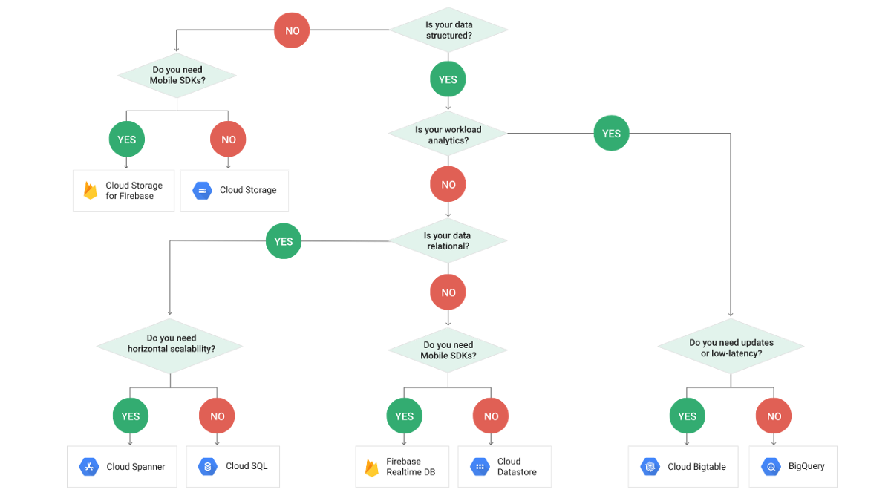

Official Google Cloud Certified Associate Cloud Engineer Study Guide
====================================================================

GCP Products Decision Tree
--------------------------

**GCP Network Tier decision tree**

image::https://miro.medium.com/max/1200/1*JnDFATWt5-7DgQusex4BeQ.png[GCP Network Tier decision tree]

**GCP Network Service Tiers decision tree**

image::Associate Cloud Engineer Study Guide - Network Service Tiers.jpeg[GCP Network Service Tiers decision tree]

**GCP Authentiation options decision tree**

image::https://miro.medium.com/max/1200/1*Uw6w0_X8X29jhpfMgW58Sw.png[GCP Authentiation options decision tree]

**GCP Compute options decision tree**

image::https://miro.medium.com/max/628/1*OV12s1M9O3OcEn2cwdtmEA.png[GCP Compute options decision tree]

**Google Data products decision tree**

**Google Cloud Dataflow vs. Cloud Dataproc**

image::https://cloud.google.com/dataflow/images/flow-vs-proc-flowchart.svg[Google Dataflow vs. Dataproc]

**Data encryption decision tree**

image::https://miro.medium.com/max/640/1*LTWOlTPPGXIWSPmJEoBVRQ.png[Data encryption decision tree]

Assessment Test
---------------

- Machine type, boot disk image or container image, zone, and labels are all configuration parameters or attributes of a VM
- **gsutil mb** is the specific command for creating, or making, a bucket
- Create a lifecycle management configuration policy specifying an age of 90 days and SetStorageClass as nearline is the most efficient way to meet object management policy requirement. Read more: Storage classes https://cloud.google.com/storage/docs/storage-classes, Object Lifecycle Management https://cloud.google.com/storage/docs/lifecycle
- **gsutil rsync** to synchronize the contents of the two buckets
- VPCs are **Global** resources. Google operates a global network, and VPCs are resources that can span that global network
- **gcloud** by default will retry a failed network operation and will wait a long time before each retry. The time to wait is calculated using a truncated binary exponential back-off strategy
- Only Google Spanner and Cloud SQL databases support transactions and have a SQL interface. Datastore has transactions but does not support fully compliant SQL; it has a SQL-like query language. Cloud Storage does not support transactions or SQL
- App Engine is a PaaS that allows developers to deploy full applications without having to manage servers or clusters. Compute Engine and Kubernetes Engine require management of servers. Cloud Functions is suitable for short-running but not full applications
- BigQuery is designed for petabyte-scale analytics and provides a SQL interface
- Cloud Dataflow allows for stream and batch processing of data and is well suited for this kind of ETL work. Dataproc is a managed Hadoop and Spark service that is used for big data analytics
- Preemptible virtual machines may be shut down at any time but will always be shut down after running 24 hours by Google
- **Organizations, folders, and projects** are the components used to manage an organizational hierarchy. **Buckets, directories, and subdirectories** are used to organize storage
- Cloud Dataproc is the managed Spark service. Cloud Dataflow is for stream and batch processing of data, BigQuery is for analytics

**Google Cloud Function**

image::Associate Cloud Engineer Study Guide - Cloud Function.png[Google Cloud Function]

Chapter 1 - Overview of Google Cloud Platform
---------------------------------------------

- Object storage, like Cloud Storage, provides redundantly stored objects without limits on the amount of data you can store
- Block sizes in a block storage system can vary. Block size is established when a file system is created
- Firewalls are software-defined network controls that limit the flow of traffic into and out of a network or subnetwork. Routers are used to move traffic to appropriate destinations on the network. Identity access management is used for authenticating and authorizing users
- Specialized services in GCP are serverless
- Investing in servers should be based on demand for server capacity
- The characteristics of the server, such as the number of virtual servers, the amount of memory, and the region where you run the VM, influence the cost
- Containers give the most flexibility for using the resources of a cluster efficiently and orchestration platforms reduce the operations overhead
- Cloud Filestore is based on Network Filesystem (NSF), which is a distributed file management system
- When you create a network, it is treated as a virtual private cloud. Resources are added to the VPC and are not accessible outside the VPC unless
you explicitly configure them to be
- Caches use memory, and that makes them the fastest storage type for reading data. Caches are data stores on the backend of distributed systems, not the clients. Caches can get out of sync with the system of truth because the system of truth could be updated, but the cache may not be updated
- Cloud providers have large capacity and can quickly allocate those resources to different customers. With a mix of customers and workloads, they can optimize the allocation of resources
- Specialized services are monitored by Google so users do not have to monitor them. Specialized services provide a specific compute functionality but do not require the user to configure any resources. They also provide APIs
- Attached drives are block storage devices. Cloud Storage is the object storage service and does not attach directly to a VM
- Databases require persistent storage on block devices. Object storage does not provide data block or file system storage

Google Cloud Computing Services
-------------------------------

GCP services list:

- Computing resources - Compute Engine, Kubernetes / Containers Engine, App Engine (standard / flexible environment), Cloud Functions (event-driven processing, short-running code)
- Storage resources - Cloud Storage (for object storage, single unit of data and multiple regions), Persistent Disk (block storage), Cloud Storage for Firebase, Cloud Filestore (shared file system, NFS easily to mount)
- Databases - Cloud SQL (managed relational database without having to attend to database administration tasks, such as backing up databases or patching database software), Cloud Spanner (globally distributed relational database, with the ability to scale horizontally, supports ANSI 2011 standard SQL), Cloud Bigtable (NoSQL as wide-column data model, low-latency write and read operations, support millions of operations per second, Hbase API), Cloud Datastore (NoSQL document database, collection of key-value pair, flexible schemas, REST API, shard or partition, supports transactions, indexes, and SQL-like queries), Cloud Memorystore (in-memory cache service, managed Redis service), Cloud Firestore (NoSQL database service designed as a backend for highly scalable web and mobile applications, includes a Datastore mode, which enables applications written for Datastore to work with Cloud Firebase)
- Networking services - Virtual Private Cloud (can span the globe without relying on the public Internet), Cloud Load Balancing (distribute the workload within and across regions, adapt to failed or degraded servers, and autoscale your compute resources to accommodate changes in workload), Cloud Armor, Cloud CDN, Cloud Interconnect (interconnects and peering), Cloud DNS (automatically scale)
- Identity management and security (users, roles, and privileges, groups of related permissions can be bundled into roles)
- Development tools - Cloud SDK
- Management tools - Stackdriver, Monitoring, Logging, Error Reporting, Trace, Debugger, Profiler
- Specialized services - Apigee API Platform, Data Anylytics (BigQuery, Cloud Dataflow, Dataproc, Dataprep), AI and Machine Learning (Cloud AutoML, Machine Learning Engine, NLP, Vision)

Highlight:

- Container is another approach to isolating computing resources is to use features of the host operating system to isolate processes and resources without hypervisor. No guest operating systems run on top of the container manager. Containers make use of host operating system functionality, while the operating system and container manager ensure isolation between the running containers
- App Engine is well suited for web and mobile backend applications
- A zone is considered a single failure domain
- Load balancers can route workload based on network-level or application-level rules. GCP load balancers can distribute workloads globally
- Why Çloud, enable customers to focus on application development while the cloud provider takes on more responsibility for maintaining the underlying compute infrastructure
- App Engine flexible environments allow you to run containers on the App Engine PaaS
- Cloud CDN acts as a first line of defense in the case of DDoS attacks
- Stackdriver Logging is used to consolidate and manage logs generated by applications and servers
- Cloud SQL does not have global transaction
- Dataproc is designed to execute workflows in both batch and streaming modes
- Error reporting consolidates crash information

References
----------

- Official Google Cloud Certified Associate Cloud Engineer Study Guide, _https://www.wiley.com/en-au/Official+Google+Cloud+Certified+Associate+Cloud+Engineer+Study+Guide-p-9781119564393_
- QwikLabs Free Codes — GCP and AWS, _https://medium.com/@sathishvj/qwiklabs-free-codes-gcp-and-aws-e40f3855ffdb_
- GCP flowchart of decision tree, _https://medium.com/google-cloud/a-gcp-flowchart-a-day-2d57cc109401_