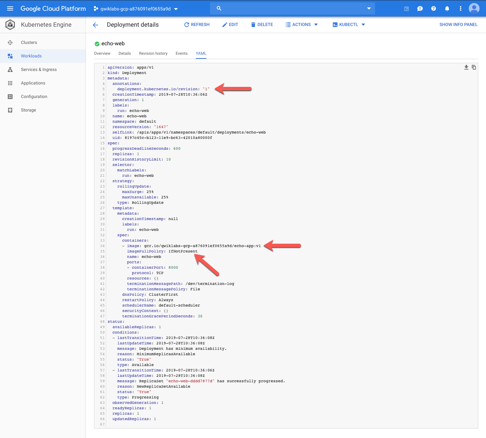

Cloud Architecture
==================

**Scale Out and Update a Containerized Application on a Kubernetes Cluster**

Tasks to complete:

- Update a docker application and push a new version to a container repository.
- Deploy the updated application version to a Kubernetes cluster.
- Scale out the application so that it is running 2 replicas.

Project ID is **qwiklabs-gcp-a876091ef0655a9d**.

Download the sample application and ...

[source.console]
----
$ gsutil ls -al gs://qwiklabs-gcp-a876091ef0655a9d
      2017  2019-07-28T10:34:30Z  gs://qwiklabs-gcp-a876091ef0655a9d/echo-web-v2.tar.gz#1564310070658683  metageneration=1
TOTAL: 1 objects, 2017 bytes (1.97 KiB)

$ gsutil cp gs://qwiklabs-gcp-a876091ef0655a9d/echo-web-v2.tar.gz .
Copying gs://qwiklabs-gcp-a876091ef0655a9d/echo-web-v2.tar.gz...
- [1 files][  2.0 KiB/  2.0 KiB]
Operation completed over 1 objects/2.0 KiB.

$ mkdir echo-web-v2
$ cd echo-web-v2
$ tar xvfz ../echo-web-v2.tar.gz
----

then, build the Docker container image, tag the image and push it to the Google Container Registry gcr.io.

[source.console]
----
$ docker build -t echo-app .
Sending build context to Docker daemon  12.29kB
Step 1/7 : FROM golang:1.8-alpine
1.8-alpine: Pulling from library/golang
550fe1bea624: Pull complete
cbc8da23026a: Pull complete
9b35aaa06d7a: Pull complete
46ca6ce0ffd1: Pull complete
7a270aebe80a: Pull complete
8695117c367e: Pull complete
Digest: sha256:693568f2ab0dae1e19f44b41628d2aea148fac65974cfd18f83cb9863ab1a177
Status: Downloaded newer image for golang:1.8-alpine
 ---> 4cb86d3661bf
Step 2/7 : ADD . /go/src/echo-app
 ---> d9f26d51852b
Step 3/7 : RUN go install echo-app
 ---> Running in b7456e5bee3a
Removing intermediate container b7456e5bee3a
 ---> d89add714b1d
Step 4/7 : FROM alpine:latest
latest: Pulling from library/alpine
050382585609: Pull complete
Digest: sha256:57334c50959f26ce1ee025d08f136c2292c128f84e7b229d1b0da5dac89e9866
Status: Downloaded newer image for alpine:latest
 ---> b7b28af77ffe
Step 5/7 : COPY --from=0 /go/bin/echo-app .
 ---> be3af4fa11b2
Step 6/7 : ENV PORT 8000
 ---> Running in 8074d2c10a52
Removing intermediate container 8074d2c10a52
 ---> 07596372d9d0
Step 7/7 : CMD ["./echo-app"]
 ---> Running in aa6216731d08
Removing intermediate container aa6216731d08
 ---> 6cdbd400de35
Successfully built 6cdbd400de35
Successfully tagged echo-app:latest

$ docker tag echo-app gcr.io/qwiklabs-gcp-a876091ef0655a9d/echo-app:v2

$ docker images
REPOSITORY                                      TAG                 IMAGE ID            CREATED             SIZE
gcr.io/qwiklabs-gcp-a876091ef0655a9d/echo-app   v2                  6cdbd400de35        2 minutes ago       11.5MB
echo-app                                        latest              6cdbd400de35        2 minutes ago       11.5MB
<none>                                          <none>              d89add714b1d        2 minutes ago       263MB
alpine                                          latest              b7b28af77ffe        2 weeks ago         5.58MB
golang                                          1.8-alpine          4cb86d3661bf        17 months ago       257MB

$ docker push gcr.io/qwiklabs-gcp-a876091ef0655a9d/echo-app:v2
The push refers to repository [gcr.io/qwiklabs-gcp-a876091ef0655a9d/echo-app]
29481783a589: Pushed
1bfeebd65323: Layer already exists
v2: digest: sha256:e819e5f50e3e3dd14f14505d402c1803f43a968fa7a408a526d0ef09c76e6b0a size: 739

$ gcloud container images list-tags gcr.io/qwiklabs-gcp-a876091ef0655a9d/echo-app
DIGEST        TAGS  TIMESTAMP
e819e5f50e3e  v2    2019-07-28T20:36:59
4464e981fa3e  v1    2019-07-28T20:35:53
----

Test application from intenret.

[source.console]
----
$ curl http://130.211.204.105/:80
Echo Test
Version: 1.0.0
Hostname: echo-web-dddd7877d-2n4ct
Host ip-address(es): 10.40.0.6
----

Try to rolling-update deployment image from command line:

[source.console]
----
$ kubectl rolling-update echo-web --image=gcr.io/qwiklabs-gcp-a876091ef0655a9d/echo-app:v2
Command "rolling-update" is deprecated, use "rollout" instead
The connection to the server localhost:8080 was refused - did you specify the right host or port?
----

Update in GCP console:

Scale to **2**:

Deployment configuration YAML after the update.

[source.console]
----
apiVersion: apps/v1
kind: Deployment
metadata:
  annotations:
    deployment.kubernetes.io/revision: "2"
  creationTimestamp: 2019-07-28T10:36:06Z
  generation: 2
  labels:
    run: echo-web
  name: echo-web
  namespace: default
  resourceVersion: "6262"
  selfLink: /apis/apps/v1/namespaces/default/deployments/echo-web
  uid: 8197c45c-b123-11e9-bc63-42010a80000f
spec:
  progressDeadlineSeconds: 600
  replicas: 1
  revisionHistoryLimit: 10
  selector:
    matchLabels:
      run: echo-web
  strategy:
    rollingUpdate:
      maxSurge: 25%
      maxUnavailable: 25%
    type: RollingUpdate
  template:
    metadata:
      creationTimestamp: null
      labels:
        run: echo-web
    spec:
      containers:
      - image: gcr.io/qwiklabs-gcp-a876091ef0655a9d/echo-app:v2
        imagePullPolicy: IfNotPresent
        name: echo-web
        ports:
        - containerPort: 8000
          protocol: TCP
        resources: {}
        terminationMessagePath: /dev/termination-log
        terminationMessagePolicy: File
      dnsPolicy: ClusterFirst
      restartPolicy: Always
      schedulerName: default-scheduler
      securityContext: {}
      terminationGracePeriodSeconds: 30
status:
  availableReplicas: 1
  conditions:
  - lastTransitionTime: 2019-07-28T10:36:08Z
    lastUpdateTime: 2019-07-28T10:36:08Z
    message: Deployment has minimum availability.
    reason: MinimumReplicasAvailable
    status: "True"
    type: Available
  - lastTransitionTime: 2019-07-28T10:36:06Z
    lastUpdateTime: 2019-07-28T11:03:16Z
    message: ReplicaSet "echo-web-66ccc8c87c" has successfully progressed.
    reason: NewReplicaSetAvailable
    status: "True"
    type: Progressing
  observedGeneration: 2
  readyReplicas: 1
  replicas: 1
  updatedReplicas: 1
----

[source.console]
----
$ curl http://130.211.204.105/:80
Echo Test
Version: 2.0.0
Hostname: echo-web-66ccc8c87c-2rnl8
Host ip-address(es): 10.40.1.8

$ gcloud container clusters delete echo-cluster
----

References
----------

- Google Cloud Training - Cloud Architecture, _https://google.qwiklabs.com/quests/24_
- Build and Deploy a Docker Image to a Kubernetes Cluster, _https://google.qwiklabs.com/focuses/1739?parent=catalog_
- Sample Application with Docker Configuration, _https://google.qwiklabs.com/instructions/143835/download_