Cloud Architecture
==================

**Build and Deploy a Docker Image to a Kubernetes Cluster**

Tasks to complete:

- Build and tag a Docker Image of a sample application
- Push the tagged image to Google Container Registry
- Create a Kubernetes Cluster
- Deploy the application to the Kubernetes Cluster

[source.console]
----
$ gcloud config set compute/region us-central1
Updated property [compute/region].

$ gcloud config set compute/zone us-central1-a
Updated property [compute/zone].
----

Project ID is **qwiklabs-gcp-7492af09d2d00882**.

Download the sample application and ...

[source.console]
----
$ gsutil ls -al gs://qwiklabs-gcp-7492af09d2d00882
      2005  2019-07-25T12:48:54Z  gs://qwiklabs-gcp-7492af09d2d00882/echo-web.tar.gz#1564058934849425  metageneration=1
TOTAL: 1 objects, 2005 bytes (1.96 KiB)

$ gsutil cp gs://qwiklabs-gcp-7492af09d2d00882/echo-web.tar.gz .
Copying gs://qwiklabs-gcp-7492af09d2d00882/echo-web.tar.gz...
/ [1 files][  2.0 KiB/  2.0 KiB]
Operation completed over 1 objects/2.0 KiB.

$ mkdir echo-web
$ cd echo-web
$ tar xvfz ../echo-web.tar.gz

$ cat main.go
package main

import (
	"fmt"
	"log"
	"net/http"
	"net"
	"strings"
	"os"
)

func main() {
	// use PORT environment variable, or default to 8000
	port := "8000"
	if fromEnv := os.Getenv("PORT"); fromEnv != "" {
		port = fromEnv
	}

	// register hello function to handle all requests
	server := http.NewServeMux()
	server.HandleFunc("/", echo)

	// start the web server on port and accept requests
	log.Printf("Server listening on port %s", port)
	err := http.ListenAndServe(":"+port, server)
	log.Fatal(err)
}

// echo responds to the request with a plain-text "Serving request" message
// followed by some meta-data baout the environment where it is running
func echo(w http.ResponseWriter, r *http.Request) {
	log.Printf("Serving request: %s", r.URL.Path)
	host, _ := os.Hostname()
	addrs, err := net.LookupHost(host)
	ipaddresses := ""

	if err == nil {
		ipaddresses = strings.Join(addrs, " ")
	}

	fmt.Fprintf(w, "Echo Test\n")
	fmt.Fprintf(w, "Version: 1.0.0\n")
	fmt.Fprintf(w, "Hostname: %s\n", host)
	fmt.Fprintf(w, "Host ip-address(es): %s\n", ipaddresses)
}

$ cat Dockerfile
FROM golang:1.8-alpine
ADD . /go/src/echo-app
RUN go install echo-app

FROM alpine:latest
# The COPY --from=0 line copies just the built artifact from the previous stage into this new stage.
COPY --from=0 /go/bin/echo-app .
ENV PORT 8000
CMD ["./echo-app"]
----

then, build the Docker container image:

[source.console]
----
$ docker build -t echo-app .
Sending build context to Docker daemon  9.728kB
Step 1/7 : FROM golang:1.8-alpine
1.8-alpine: Pulling from library/golang
550fe1bea624: Pull complete
cbc8da23026a: Pull complete
9b35aaa06d7a: Pull complete
46ca6ce0ffd1: Pull complete
7a270aebe80a: Pull complete
8695117c367e: Pull complete
Digest: sha256:693568f2ab0dae1e19f44b41628d2aea148fac65974cfd18f83cb9863ab1a177
Status: Downloaded newer image for golang:1.8-alpine
 ---> 4cb86d3661bf
Step 2/7 : ADD . /go/src/echo-app
 ---> 75b087873ba4
Step 3/7 : RUN go install echo-app
 ---> Running in 61dc15243868
Removing intermediate container 61dc15243868
 ---> ff94d264df03
Step 4/7 : FROM alpine:latest
latest: Pulling from library/alpine
050382585609: Pull complete
Digest: sha256:57334c50959f26ce1ee025d08f136c2292c128f84e7b229d1b0da5dac89e9866
Status: Downloaded newer image for alpine:latest
 ---> b7b28af77ffe
Step 5/7 : COPY --from=0 /go/bin/echo-app .
 ---> c7e29623db0b
Step 6/7 : ENV PORT 8000
 ---> Running in fdb6b40e63fc
Removing intermediate container fdb6b40e63fc
 ---> d59008ee5830
Step 7/7 : CMD ["./echo-app"]
 ---> Running in c825c6b45dd1
Removing intermediate container c825c6b45dd1
 ---> adf00d01875d
Successfully built adf00d01875d
Successfully tagged echo-app:latest

$ docker images
REPOSITORY          TAG                 IMAGE ID            CREATED             SIZE
echo-app            latest              adf00d01875d        38 seconds ago      11.5MB
<none>              <none>              ff94d264df03        40 seconds ago      263MB
alpine              latest              b7b28af77ffe        13 days ago         5.58MB
golang              1.8-alpine          4cb86d3661bf        17 months ago       257MB
----

Tag the image and push it to the Google Container Registry gcr.io.

[source.console]
----
$ docker tag echo-app gcr.io/qwiklabs-gcp-7492af09d2d00882/echo-app:v1

$ docker images
REPOSITORY                                      TAG                 IMAGE ID            CREATED             SIZE
echo-app                                        latest              adf00d01875d        12 minutes ago      11.5MB
gcr.io/qwiklabs-gcp-7492af09d2d00882/echo-app   v1                  adf00d01875d        12 minutes ago      11.5MB
<none>                                          <none>              ff94d264df03        12 minutes ago      263MB
alpine                                          latest              b7b28af77ffe        13 days ago         5.58MB
golang                                          1.8-alpine          4cb86d3661bf        17 months ago       257MB

$ docker push gcr.io/qwiklabs-gcp-7492af09d2d00882/echo-app:v1
The push refers to repository [gcr.io/qwiklabs-gcp-7492af09d2d00882/echo-app]
b74d42903d6b: Pushed
1bfeebd65323: Layer already exists
v1: digest: sha256:59ed45f0b82bb756b290209ca08e8557af9ebb06ec803f5a51910dcd7aababb9 size: 739

$ gcloud container images list-tags gcr.io/qwiklabs-gcp-7492af09d2d00882/echo-app
DIGEST        TAGS  TIMESTAMP
59ed45f0b82b  v1    2019-07-25T22:55:54
----

Create a Kubernetes Cluster.

[source.console]
----
# The extra scopes enable to access Cloud Source Repositories and Google Container Registry.
$ gcloud container clusters create echo-cluster --num-nodes 2 --machine-type n1-standard-2 --scopes "https://www.googleapis.com/auth/projecthosting,cloud-platform"
WARNING: In June 2019, node auto-upgrade will be enabled by default for newly created clusters and node pools. To disable it, use the `--no-enable-autoupgrade` flag.
WARNING: Starting in 1.12, new clusters will have basic authentication disabled by default. Basic authentication can be enabled (or disabled) manually using the `--[no-]enable-basic-auth` flag.
WARNING: Starting in 1.12, new clusters will not have a client certificate issued. You can manually enable (or disable) the issuance of the client certificate using the `--[no-]issue-client-certificate` flag.
WARNING: Starting in 1.12, default node pools in new clusters will have their legacy Compute Engine instance metadata endpoints disabled by default. To create a cluster with legacy instance metadata endpoints disabled in the default node pool, run `clusters create` with the flag `--metadata disable-legacy-endpoints=true`.
WARNING: The Pod address range limits the maximum size of the cluster. Please refer to https://cloud.google.com/kubernetes-engine/docs/how-to/flexible-pod-cidr to learn how to optimize IP address allocation.
This will enable the autorepair feature for nodes. Please see https://cloud.google.com/kubernetes-engine/docs/node-auto-repair for more information on node autorepairs.
Creating cluster echo-cluster in us-central1-a... Cluster is being health-checked (master is healthy)...done.
Created [https://container.googleapis.com/v1/projects/qwiklabs-gcp-7492af09d2d00882/zones/us-central1-a/clusters/echo-cluster].
To inspect the contents of your cluster, go to: https://console.cloud.google.com/kubernetes/workload_/gcloud/us-central1-a/echo-cluster?project=qwiklabs-gcp-7492af09d2d00882
kubeconfig entry generated for echo-cluster.
NAME          LOCATION       MASTER_VERSION  MASTER_IP      MACHINE_TYPE   NODE_VERSION   NUM_NODES  STATUS
echo-cluster  us-central1-a  1.12.8-gke.10   35.224.17.234  n1-standard-2  1.12.8-gke.10  2          RUNNING

$ gcloud container clusters get-credentials echo-cluster
Fetching cluster endpoint and auth data.
kubeconfig entry generated for echo-cluster.

$ kubectl cluster-info
Kubernetes master is running at https://35.224.17.234
GLBCDefaultBackend is running at https://35.224.17.234/api/v1/namespaces/kube-system/services/default-http-backend:http/proxy
Heapster is running at https://35.224.17.234/api/v1/namespaces/kube-system/services/heapster/proxy
KubeDNS is running at https://35.224.17.234/api/v1/namespaces/kube-system/services/kube-dns:dns/proxy
Metrics-server is running at https://35.224.17.234/api/v1/namespaces/kube-system/services/https:metrics-server:/proxy

To further debug and diagnose cluster problems, use 'kubectl cluster-info dump'.
----

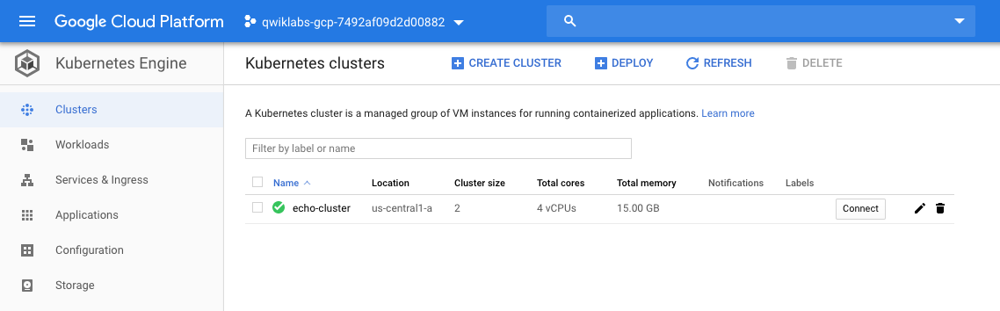

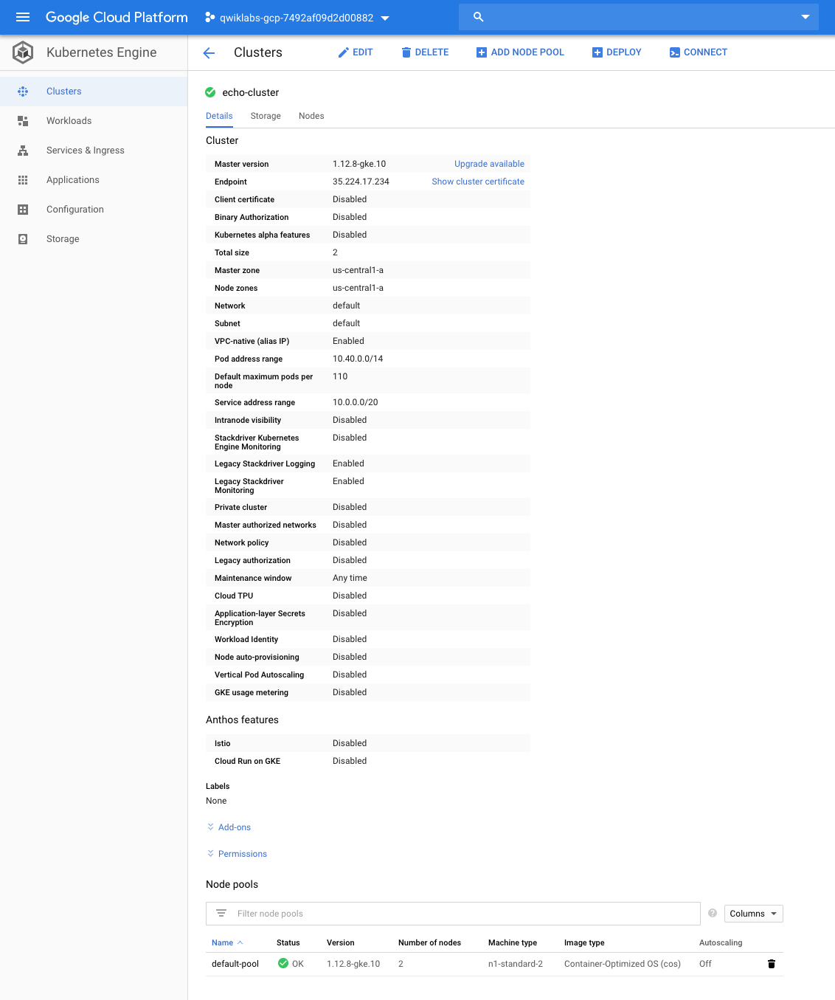

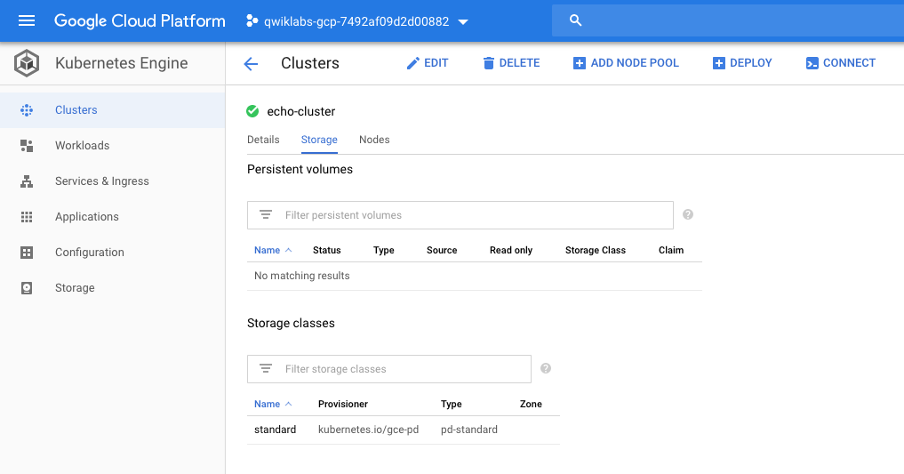

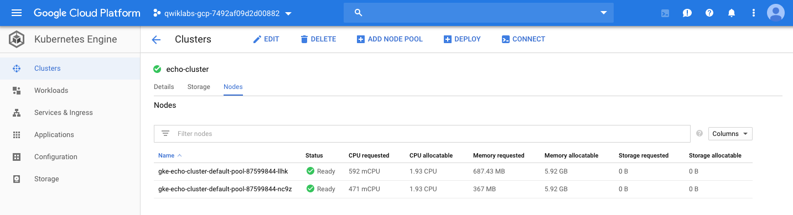

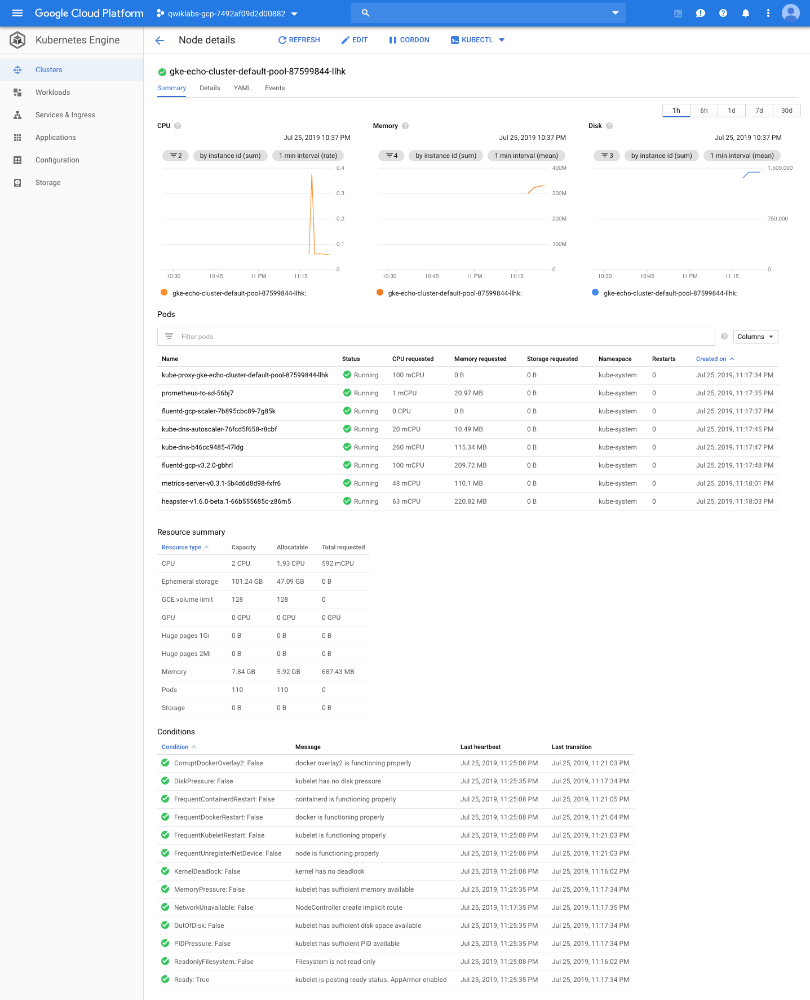

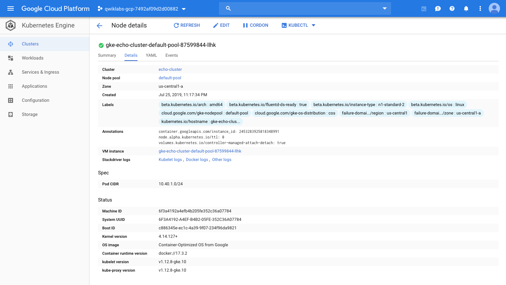

Deploy the application to the Kubernetes Cluster.

[source.console]
----
$ kubectl run echo-web --image=gcr.io/qwiklabs-gcp-7492af09d2d00882/echo-app:v1 --port 8000
kubectl run --generator=deployment/apps.v1beta1 is DEPRECATED and will be removed in a future version. Use kubectl create instead.
deployment.apps/echo-web created

$ kubectl get pods
NAME                        READY   STATUS    RESTARTS   AGE
echo-web-768b79f965-9qg8x   1/1     Running   0          4m25s

$ kubectl port-forward echo-web-768b79f965-9qg8x 8080:8000
Forwarding from 127.0.0.1:8080 -> 8000

$ curl http://127.0.0.1:8080
Echo Test
Version: 1.0.0
Hostname: echo-web-768b79f965-9qg8x
Host ip-address(es): 10.40.0.7
----

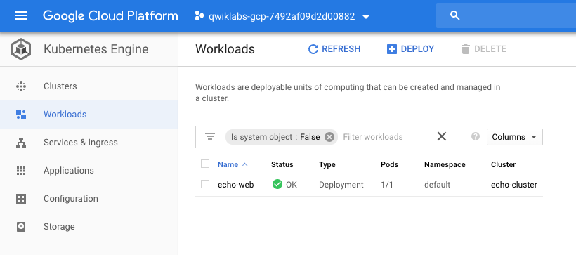

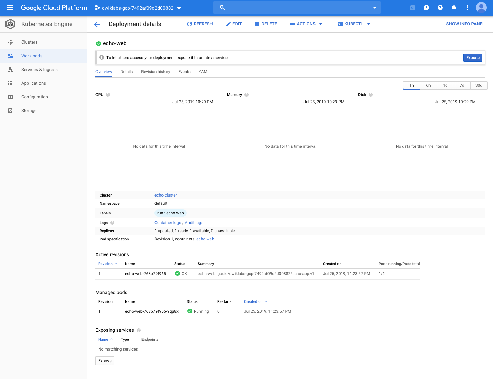

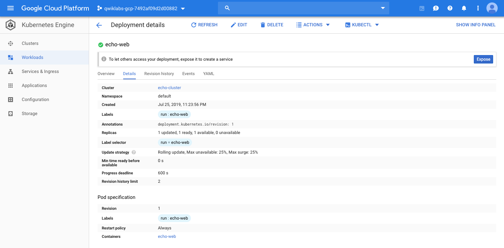

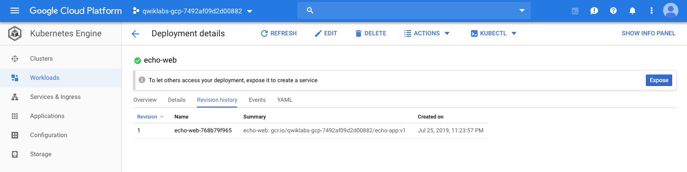

Expose deployment to a service.

[source.console]
----
$ kubectl expose deployment echo-web --port 80 --target-port=8000 --type="LoadBalancer"
service/echo-web exposed

$ kubectl get service echo-web
NAME       TYPE           CLUSTER-IP   EXTERNAL-IP     PORT(S)        AGE
echo-web   LoadBalancer   10.0.5.84    34.68.223.160   80:31551/TCP   117s
----

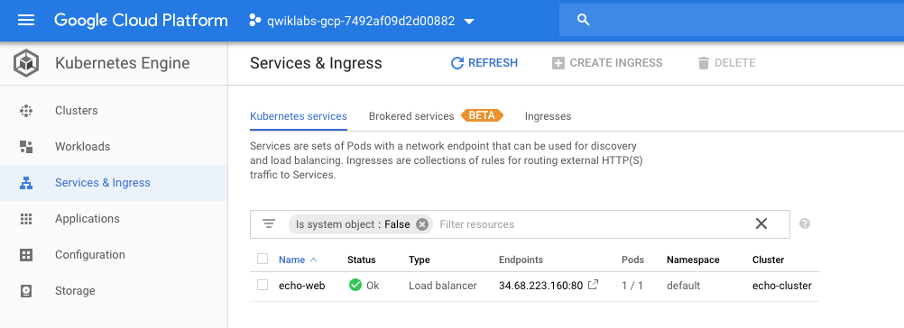

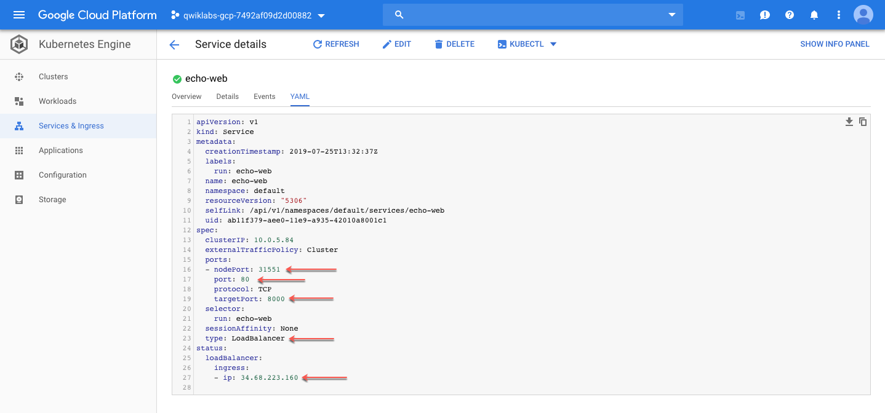

Have a look Service deployment YAML file:

[source.console]
----
apiVersion: v1
kind: Service
metadata:
  creationTimestamp: 2019-07-25T13:32:37Z
  labels:
    run: echo-web
  name: echo-web
  namespace: default
  resourceVersion: "5306"
  selfLink: /api/v1/namespaces/default/services/echo-web
  uid: ab11f379-aee0-11e9-a935-42010a8001c1
spec:
  clusterIP: 10.0.5.84
  externalTrafficPolicy: Cluster
  ports:
  - nodePort: 31551
    port: 80
    protocol: TCP
    targetPort: 8000
  selector:
    run: echo-web
  sessionAffinity: None
  type: LoadBalancer
status:
  loadBalancer:
    ingress:
    - ip: 34.68.223.160
----

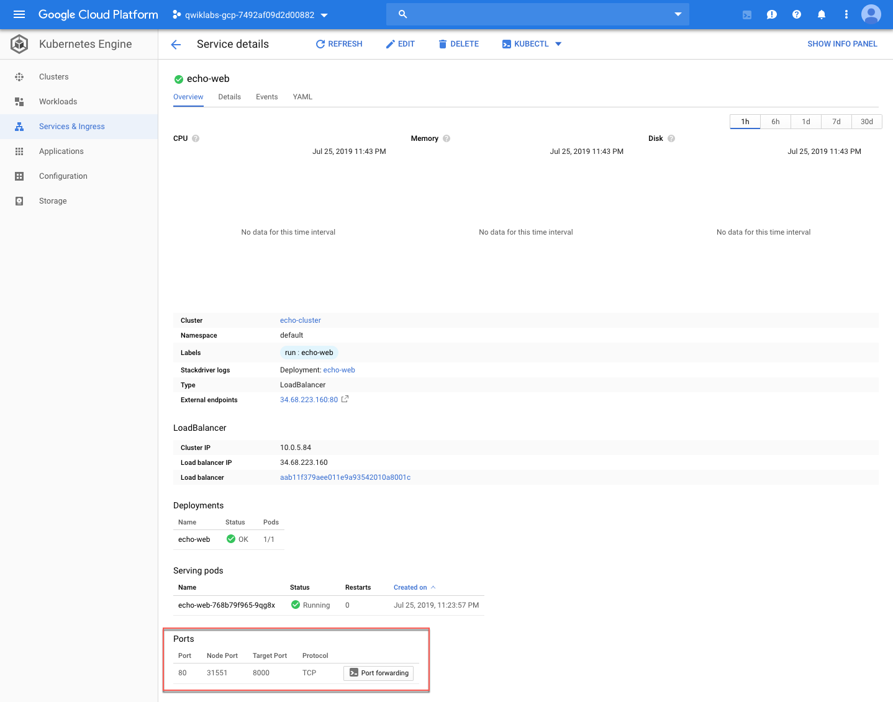

Test application from intenret.

[source.console]
----
$ curl http://34.68.223.160:80
Echo Test
Version: 1.0.0
Hostname: echo-web-768b79f965-9qg8x
Host ip-address(es): 10.40.0.7
----

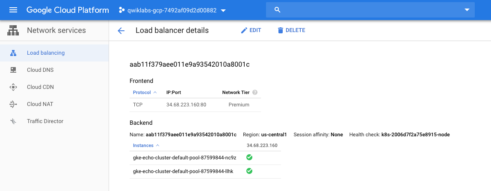

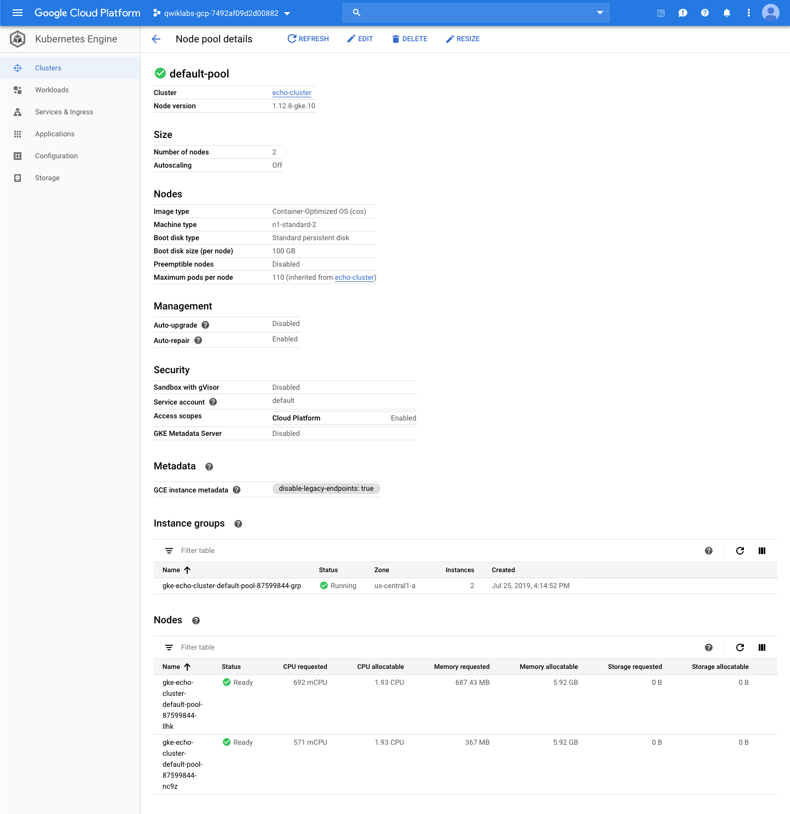

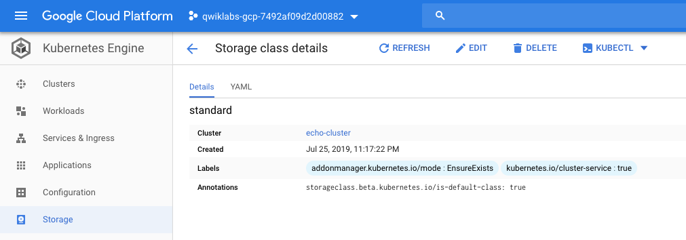

Delete Kubernetes cluster.

[source.console]
----
$ gcloud container clusters delete echo-cluster
----

References
----------

- Google Cloud Training - Cloud Architecture, _https://google.qwiklabs.com/quests/24_
- Build and Deploy a Docker Image to a Kubernetes Cluster, _https://google.qwiklabs.com/focuses/1738?parent=catalog_
- Sample Application with Docker Configuration, _https://google.qwiklabs.com/instructions/140145/download_