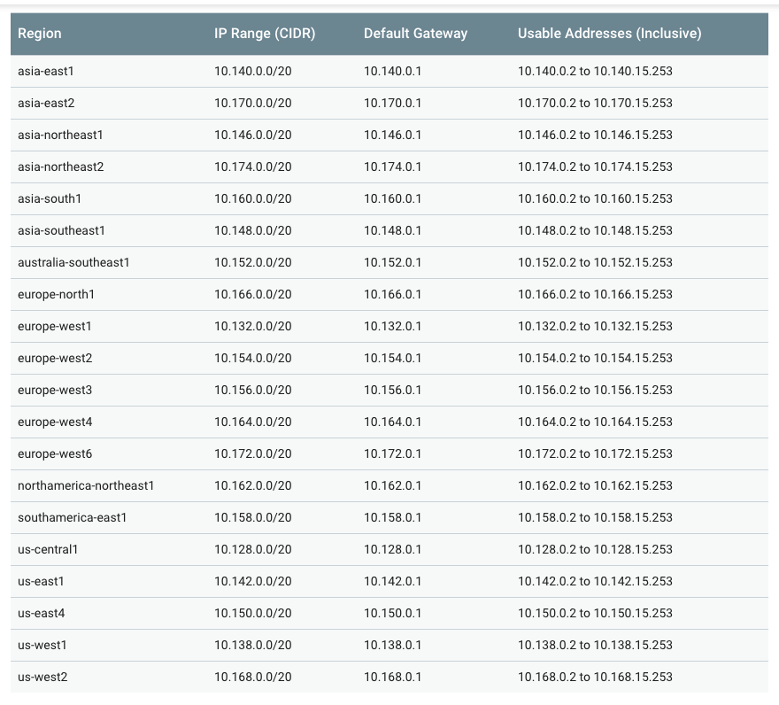

GCP Certification Series
========================

For Google Certified Associate Cloud Engineer.

Basic Knowledge
---------------

- The project number and project ID are unique across the Google Cloud Platform
- Name such as **Google** or **SSL** cannot be used for the project name
- gcloud projects create [PROJECT_ID] [--organization=ORGANIZATION_ID | --folder=FOLDER_ID]. Project ID must **start with a lowercase letter**, and can contain only ASCII letters, digits, and hyphens, and must be between 6 and 30 characters.
- Project owners can restore a deleted project within the 30-day recovery period that starts when the project is shut down. Restoring a project returns it to the state it was in before it was shut down. Cloud Storage resources are deleted before the 30-day period ends, and may not be fully recoverable.

- Standard user access types or Primitive Roles:
** Browser (Beta)
** Editor
** Owner
** Viewer

- Cloud Shell gives 5GB of persistent disk storage in your home directory

- To place a **lien** on a project protecting GCP project accidentally delete by any owners and administrator, untile **lien** is revoked
- gcloud alpha resource-manager liens list
- gcloud beta **interactive**

- IAM policy can be set at the organization level, folder level, project level, or (in some cases) resource level
- Permissions that were inherited from the original parent will be lost when the project is moved to a new folder. Permissions set at the destination folder will be inherited by the project as it is moved
+
image::https://miro.medium.com/max/1202/0*oNHpRfBVe4xrGmXm[G Suite account, Cloud Identity, and the GCP resource hierarchy]

- To use any API need to have valid credentials. To find the keys for authenticating uses of API you can add and remove credentials from the list

Cloud SDK and CLI
-----------------

Managing SDK Components - **General Availability**, **Preview** release, **Alpha**, **Beta** components, _https://cloud.google.com/sdk/docs/components_

image::https://miro.medium.com/max/1540/1*OA7SspVtgjxSZX6z73jB_A.png[Cloud SDK Additional components]

Pricing
-------

- These savings are achieved by:
** **Sustained use discount**: _**More your instances are running bigger discount you will get.**_
** **List price differences**: Google is reducing the price of services and instances according to **Moore’s law** and immediately after the price of any instance or services are reduced they are applied in your monthly billing.
** **Rightsizing recommendations**: Google cloud provides recommendations for compute engine based on the 8 days stack driver monitoring to resize the VM.
- Per-second billing
- Network traffic:
** Ingress is free
** Egress is charged. Egress to some GCP services sometimes free
- Committed-use discounts
+
image::https://cloud.google.com/images/pricing/pricing-hero.png[GCP compared to other Cloud vendors]

- Do More For Less, _https://cloud.google.com/pricing/_
- Google Cloud Platform Pricing Calculator, _https://cloud.google.com/products/calculator/_
+
image::GCP Certification Series - Pricing Calculator.png[Google Cloud Platform Pricing Calculator]

Security
--------

- Always "**distrust the network**"
- **BeyondCorp**, the implementation of the **zero trust security model**, allows any users to work more securely from virtually any location without the need for a traditional VPN. **BeyondCorp** can be enabled at virtually any organization with Google Cloud's Context-aware access (user's indentity and context) solution, powered by Cloud Identity, Cloud Identity-Aware Proxy, Cloud IAM, and VPC Service Controls (allow users to define a security perimeter around GCP resources), and can enforce granular access controls to web apps, VMs, APIs, and G Suite apps based on attributes like user identity, device security status, IP address, and more.
+
image::https://cloud.google.com/images/products/beyondcorp/gcp_beyondcorp_hero.png[]

- Service Account Keys
** GCP managed keys can not be downloaded, and they are rotated automatically on a weekly basis
** User managed keys expire 10 years after creation

Computing
---------

- Up to 5 VPC can be added to the project
- Instances in the same VPC communicate in local area network
- Public IP is only used when it has to communicate outside the project
- Compute Engine can automatically generate SSH keys for you and apply them to your Google account, or G Suite account, or **project metadata**
- Shared-core machine types provide one vCPU that is allowed to run for a portion of the time on a single hardware hyper-thread on the host CPU running your instance. Shared-core instances can be more cost-effective for running small, non-resource intensive applications than standard, high-memory or high-CPU machine types
- Bursting happens automatically when your instance requires more physical CPU than originally allocated. During these spikes, your instance will opportunistically take advantage of available physical CPU in bursts. Note that bursts are not permanent and are only possible periodically
- Attach GPUs only to instances with a predefined machine type or custom machine type are able to create in a zone. GPUs are not supported on shared-core machine types or memory-optimized machine types
- Preemption process:
** Compute Engine sends a preemption notice to the instance in the form of **an ACPI G2 Soft Off signal**. You can use a shutdown script to handle the preemption notice and complete cleanup actions before the instance stops
** If the instance does not stop after 30 seconds, Compute Engine sends **an ACPI G3 Mechanical Off signal** to the operating system
** Compute Engine transitions the instance to a **TERMINATED** state
- Computing Options
+
image::GCP Certification Series - Computing options comparing.png[Computing options comparing]
+
App Hosting on Google Cloud, _https://cloud.google.com/hosting-options/_
+
image::GCP Certification Series - Hosting options.png[Hosting options]

- Resource Quotas
+

- Metadata
+
Project wide SSH key (key-value pairs) in Metadata, available to all VM instances in the project. Format is:
+
ssh-rsa [KEY_VALUE] google-ssh {“userName”:”[USERNAME]”,”expireOn”:”[EXPIRE_TIME]”}
+
[EXPIRE_TIME] is a value in ISO 8601 format, e.g. **2018-12-04T20:12:00+0000**
+

- Instance Status
+
image::https://miro.medium.com/max/228/0*NWlURWbafjSv2-xl.png[Instance Status]
+
** **Provisioning** - Resources are being reserved for the instance. The instance isn't running yet
** **Staging** - Resources have been acquired and the instance is being prepared for launch
** **Running** - The instance is booting up or running. You should be able to ssh into the instance soon, though not immediately after it enters this state
** **Stopping** - The instance is being stopped either due to a failure, or the instance is shut down. This is a temporary status and the instance will move to **Terminated**
** **Terminated** - The instance was shut down or encountered a failure, either through the API or from inside the guest. You can choose to restart the instance or delete it. **Terminated** instances with local SSDs attached cannot be restarted at this time. We plan to support this functionality in the future.

Storage
-------

image::https://miro.medium.com/max/2470/0*-J9gAHSRqWQsDeoo.png[File Storage vs. Block Storage vs. Object Storage]

- Storage Systems:
** **File storage** — files and folders. Performance suffers of certain capacity, like processing power and growth
** **Block storage** — Databases, OS. Using traditional file systems on block storage places explicit or practical operational limits on scaling beyond the petabyte range
** **Object storage** - buckets, multimedia, designed for unstructured data such as media, documents, logs, backups, application binaries, and VM images:
*** Data are stored along with its metadata (**objects in object**) and unique identifier
*** Conceptually they are like a persistent key/value store
*** Perfect solution for backup or archive
*** Real file system layer is obsolete
*** Can be scaled up much easier
+
image::https://miro.medium.com/max/2132/1*Xjo8kkkZ7LwM93jY-tw3AQ.png[Storage System]

- Network Storage Options:
+
image::https://www.caringo.com/wp-content/uploads/2017/01/File-Object-Storage.svg[Network Storage Options]

- Different Storage products from Google
+
[cols="1,3,4a,4a"]
|===
|Product {set:cellbgcolor:#4885ed} |Description |Good For |Common Workloads

|
 https://cloud.google.com/persistent-disk/[Persistent Disk]
{set:cellbgcolor!}
|Fully-managed, price-performant block storage that is suitable for virtual machines and containers
|
* Block storage for Google Compute Engine and Google Kubernetes Engine
* Snapshots for data backup
|
* Disks for virtual machines
* Sharing read-only data across multiple virtual machines
* Rapid, durable backups of running virtual machines

|
image:../icons/Storage & Databases/Cloud Storage.svg[] https://cloud.google.com/storage/[Google Cloud Storage]
|A scalable, fully-managed, highly reliable, and cost-efficient object / blob store
|
* Images, pictures, and videos
* Objects and blobs
* Unstructured data
|
* Storing and streaming multimedia
* Storage for custom data analytics pipelines
* Archive, backup, and disaster recovery

|
image:../icons/Storage & Databases/Cloud Bigtable.svg[] https://cloud.google.com/bitable/[Google Cloud Bigtable]
|A scalable, fully-managed NoSQL wide-column database that is suitable for both real-time access and analytics workloads
|
* Low-latency read/write access
* High-throughput analytics
* Native time series support
|
* IoT, finance, adtech
* Personalization, recommendations
* Monitoring
* Geospatial datasets
* Graphs

|
image:../icons/Storage & Databases/Cloud Datastore.svg[] https://cloud.google.com/datastore/[Google Cloud Datastore]
|A scalable, fully-managed NoSQL document database for your web and mobile applications
|
* Semi-structured application data
* Hierarchical data
* Durable key-value data
|
* User profiles
* Product catalogs
* Game state

|
image:../icons/Storage & Databases/Cloud SQL.svg[] https://cloud.google.com/sql/[Google Cloud SQL]
|A fully-managed MySQL, PostgreSQL and SQL Server database service that is built on the strength and reliability of Google’s infrastructure
|
* Web frameworks
* Structured data
* OLTP workloads
|
* Websites, blogs, and content management systems (CMS)
* Business Intelligence (BI) applications
* ERP, CRM, and eCommerce applications
* Geospatial applications

|
 https://cloud.google.com/spanner/[Google Cloud Spanner]
|Mission-critical, relational database service with transactional consistency, global scale and high availability
|
* Mission-critical applications
* High transactions
* Scale + Consistency requirements
|
* Adtech
* Financial services
* Global supply chain
* Retail

|
image:../icons/Big Data/BigQuery.svg[] https://cloud.google.com/bigquery/[Google BigQuery]
|A scalable, fully-managed Enterprise Data Warehouse (EDW) with SQL and fast response times
|
* OLAP workloads up to petabyte-scale
* Big Data exploration and processing
* Reporting via Business Intelligence (BI) tools
|
* Analytical reporting on large data
* Data Science and advanced analyses
* Big Data processing using SQL

|
 https://cloud.google.com/filestore/[Google Cloud Filestore]
|A managed file storage service for applications that require a filesystem interface and a shared filesystem for data. Filestore gives users a simple, native experience for standing up managed Network Attached Storage (NAS) with their Google Compute Engine and Kubernetes Engine instances. The ability to fine-tune Filestore’s performance and capacity independently leads to predictably fast performance for your file-based workloads
|
* Fast
* Consistent
* Simple
|
* Rendering
* Application migrations
* Web content management
* Media processing
* Home directories

|
image:../icons/Storage & Databases/Cloud Memorystore.svg[] https://cloud.google.com/memorystore/[Google Cloud Memorystore]
|A fully managed in-memory data store service built on scalable, secure, and highly available infrastructure managed by Google. Use Cloud Memorystore to build application caches that provides sub-millisecond data access. Cloud Memorystore is compatible with the Redis protocol, allowing easy migration with zero code changes
|
* Focus on Building Great Apps
* Scale as Needed
* Highly Available
* Google Grade Security
* Easy Lift and Shift
|

|
image:https://cloud.google.com/images/products/logos/svg/firebase-firestore.svg[] https://cloud.google.com/filestore/[Google Cloud Firestore]
|A fast, fully managed, serverless, cloud-native NoSQL document database that simplifies storing, syncing, and querying data for your mobile, web, and IoT apps at global scale. Its client libraries provide live synchronization and offline support, while its security features and integrations with Firebase and Google Cloud Platform (GCP) accelerate building truly serverless apps
|
* Accelerate development velocity with serverless
* Sync data across devices, on or offline
* Simple and effortless
* Enterprise-grade, scalable NoSQL
|
* Mobile applications
|===
+
image::GCP Certification Series - Storage Options Flowchart.jpg[Google Cloud Storage Options Flowchart]

- Google Cloud Storage, **Standard** (Multi-Regional, Regional), Nearline, Coldline, **Ice Cold** storage classes
+
image::https://cloud.google.com/images/storage/storage-classes-desktop.svg[Google Cloud Storage]
+

- Cloud Spanner
+
The best of the relational and non-relational worlds:
+
image::GCP Certification Series - Spanner.png[Cloud Spanner]
+
image::https://miro.medium.com/max/1267/1*RCkvc1HU915MlRY0wV9Jeg.png[Cloud Spanner]

- Cloud SQL
** Second Generation instance machine type e.g. `db-n1-standard-2`

- BigQuery
** Run BigQuery Shell like: `$ bq shell`

- Bigtable
+
image::https://miro.medium.com/max/1232/1*TFuSLo5oe5cTJEPNLnVFAA.png[Bigtable]

- Dataproc
+
image::https://miro.medium.com/max/1597/1*bbiANoXkac8Eopdg9aoXCA.png[Dataproc]

- Cloud Data Transfer
** Online Transfer
** Cloud Storage Transfer Service
** Transfer Appliance
** BigQuery Data Transfer Service

Networking
----------

If you look closely the most important part of GCP is its network infrastructure as all of the things from instances to API because there is a network between them.

image::https://www.telegeography.com/assets/website/images/maps/submarine-cable-map-2011/submarine-cable-map-2011-x.jpg[Submarine Cable Map 2011]

- Submarine Cable Map, _https://www.submarinecablemap.com/_
- Worldwide Submarine Map, _https://studyandreference.weebly.com/worldwide-submarine-map.html_

Google’s global network is one of the strongest features for choosing Google Cloud Platform.

image::https://cloud.google.com/images/locations/edgepoint.png[Google Cloud Network]

- Google Cloud Network, _https://cloud.google.com/about/locations_

image::https://cloud.google.com/images/network-tiers/premium-tier-fig.svg[Premium Tier]

image::https://cloud.google.com/images/network-tiers/standard-tier-fig.svg[Standard Tier]

- Delivering choice with Network Service Tiers, _https://cloud.google.com/network-tiers/_
** Premium Tier
** Standard Tier

image::GCP Certification Series - Internet Provider.png[3 tiers Internet Providers]

- 3 tiers Internet Providers:
** Tier 1 carriers are the movers and shakers of the industry, called as backbone Internet providers
** Tier 2 carriers peer with other networks, but also purchase IP transit for full access to the internet
** Tier 3 carriers strictly purchase IP transit, usually are last mile providers

- **BGP Peering** is an agreement between different Service Providers. It is an EBGP neighborship between different Service Providers to send BGP traffic between them without paying upstream Service Provider

- How internet works
+
image::https://cdn3.vox-cdn.com/assets/4463779/nRzfTEu.gif[The internet conquers the world]
+
40 maps that explain the internet, _https://www.vox.com/a/internet-maps_

- Internet Exchange Directory
+
image::GCP Certification Series - Internet Exchange Directory.svg[Internet Exchange Directory]
+
PCH (Packet Clearing House) Internet Exchange Directory, _https://www.pch.net/ixp/dir_

- Explore Google's Data Analytics, Data Encryption, Container Operations on Google Cloud Infrastructure and Global Network via virsualisation, _https://cloud.withgoogle.com/infrastructure_
- **Edge Points of Presence** (POPs), 70+ Edge Points of Presence in 33 countries interconnected via the Backbone network
- **Edge Caching**, caching platform that sits on top of their infrastructure network. Edge locations can be found in virtually every country

- Few of the resources in GCP are global, others may be restricted by region or zone. Regional resources can be used anywhere within the same region; zonal resources can be used anywhere within the same zone
+
[cols="6,^1,^1,^2,^1"]
|===
|Resource {set:cellbgcolor:#4885ed} |Global  |Regional |Multi-regional |Zonal

|Images
{set:cellbgcolor!}
|X | | |

|Service Accounts |X | | |
|Snapshots |X | | |
|Instance Templates |X | | |
|VPC Network |X | | |
|Firewalls |X | | |
|Routes |X | | |
|Project ID (global unique) |X | | |
|Cloud Identity |X | | |
|Cloud Resource Manager |X | | |
|Cloud Audit Logging |X | | |
|Security Scanner |X | | |
|Storage Transfer Service |X | | |
|Google Domains |X | | |
|Cloud DNS |X | | |
|Cloud CDN |X | | |
|Cloud IoT Core |X | | |
|Cloud Pub/Sub (No DLQ Dead Letter Queue) |X | | |
|Cloud Dataprep |X | | |
|Cloud Data Studio |X | | |
|Stackdriver |X | | |
|Cloud Deployment Manager |X | | |
|Cloud Endpoints |X | | |

|Cloud KMS |X |X | |
|Cloud Storage |X |X | |
|Static IP (Anycast IP) |X |X | |
|Cloud Load Balancer |X |X | |

|Cloud Spanner |X |X |X |

|Dedicated Interconnect | |X |X |
|Carrier Interconnect | |X |X |
|CDN Interconnect | |X |X |
|Cloud Datastore | |X |X |

|Addresses | |X | |
|Subnets | |X | |
|Regional Managed Instance Groups | |X | |
|Google Kubernetes Engine | |X | |
|App Engine | |X | |
|Cloud Functions | |X | |
|Cloud SQL | |X | |
|BigTable | |X | |
|Cloud VPN | |X | |
|Cloud Router | |X | |
|Cloud Datalab | |X | |

|BigQuery | | |X |

|Instances | | | |X
|Disks (Local SSD Ephemeral Disk , Persistent Disk) | | | |X
|Machine Types | | | |X
|Zonal Managed Instance Groups | | | |X
|Google Compute Engine | | | |X
|Cloud Dataproc | | | |X
|Cloud Dataflow | | | |X
|===
+
For example, can attach a disk from one instance to another within the same zone, but cannot do this across zones. Since images and snapshots are Global Resources, can use these across zones in the same region.
+
image::https://www.networkmanagementsoftware.com/wp-content/uploads/disks-images-1024x407.png[Disk and Image in GCP]

- Addressing Methods
** Unicast
** Multicast
** Broadcast
** Geocast
** **Anycast**
- VPC networks only support IPv4 Unicast traffic, do not support Broadcast, Multicast, or IPv6 traffic within the network. However, IPv6 can be used to reach resources in the network. For example, IPv6 addresses can be assigned to a Global Load Balancer, and the App Engine standard environment supports IPv6.

- VPC (Virtual Private Cloud) is a private space within GCP, a virtual version of a physical network, gives you the flexibility to scale and control how workloads connect regionally and globally, consists of:
** IP Address
** Firewall
** VPN
** Cloud Router

- **Global**, VPC can span multiple regions without communicating across the public Internet
+
image::https://cloud.google.com/images/products/virtual-network/global.svg[VPC Global]
+
- **Shareable**, with a single VPC for an entire organization, teams can be isolated within projects, with separate billing and quotas, yet still maintain a shared private IP space and access to commonly used services
+
image::https://cloud.google.com/images/products/virtual-network/shareable.svg[VPC Shareable]
+
- **Expandable**, VPCs let you increase the IP space of any subnets without any workload shutdown or downtime. This gives you flexibility and growth options to meet your needs
+
image::https://cloud.google.com/images/products/virtual-network/expandable.gif[VPC Expandable]
+
- **Private**, get private access to Google services, such as storage, big data, analytics, or machine learning, without having to give your service a public IP address. Configure your application’s front end to receive Internet requests and shield your back-end services from public endpoints, all while being able to access Google Cloud services
+
image::https://cloud.google.com/images/products/virtual-network/private.svg[VPC Private]
+
- **Transparent**, use VPC flow logs for near real-time (5-second interval) logging to monitor your deployment for both performance analysis and network forensics. This allows you to keep your deployment running securely and at peak efficiency
+
image::https://cloud.google.com/images/products/virtual-network/flow-logs.svg[VPC Transparent]

- VPC IP address range:
** **Primary range**, subnet can be within a predefined auto mode IP range:
+

+
** **Secondary range**, for use with **IP aliasing**
+
image::https://cloud.google.com/vpc/images/alias-ip/alias-ip-2.svg[IP aliasing]
+
- VPC resource quotas, _https://cloud.google.com/vpc/docs/quota_

- VPC has TWO types of networks: **auto mode** network, **custom mode** network. You can switch a network from auto mode to custom mode. But custom mode network canno- t be changed to auto mode network

- **Shared VPC** connects projects within the **SAME** organisation. Project participates in **Shared VPC** is:
** **host project**, must be first enabled project by Shared VPC Admin
** **service project**, any project that has been attached to a host project by a Shared VPC Admin
** A project cannot be both a host and a service project simultaneously. Thus, a **service project** cannot be a **host project** to further **service project**
** Can create and use multiple host projects; however, each **service project** can only be attached to a single **host project**
+
image::https://cloud.google.com/vpc/images/shared-vpc/shared-vpc-example-hybrid-cloud.svg[Shared VPC Hybrid Cloud]
+
image::https://cloud.google.com/vpc/images/shared-vpc/shared-vpc-example-two-tier.svg[Shared VPC Two Tier]
+
image::https://cloud.google.com/vpc/images/shared-vpc/shared-vpc-example-concepts.svg[Shared VPC]
+
image::https://cloud.google.com/vpc/images/shared-vpc/shared-vpc-example-multiple-host-projects.svg[Host / Service projects on Shared VPC]
+
** **standard project** does not participate in **Shared VPC**
** A **Shared VPC Network** is a VPC network defined in a host project and made available as a centrally shared network for eligible resources in service projects
** In a **Legacy Network**, not VPC Network, instance IP addresses are not grouped by region or zone. One IP address can appear in one region, and the following IP address can be in a different region
+
image::https://cloud.google.com/vpc/images/no_subnetworks_1.svg[Legacy Network]

- When creating additional subnets in an auto mode network, your manually created subnets must use an IP range outside of the **10.128.0.0/9 CIDR block**. That block is reserved for the primary IP ranges of automatically created subnets
- The minimum CIDR size for a subnet is /29
- Every subnet has four **Reserved IP addresses** in its primary IP range. There are no reserved IP addresses in the secondary IP ranges
+

- **Cloud Router** for VPNs with VPC network
+
image::https://cloud.google.com/router/images/cloud-router-for-vpns-with-vpc-network.svg[Cloud Router for VPNs with VPC network]
+
- **Cloud Router** regional dynamic routing. VM instances in other regions, such as us-central1, can't reach the Cloud VPN tunnel
+
image::https://cloud.google.com/router/images/regional-routing-basic.svg[Cloud Router regional dynamic routing]
+
- **Cloud Router** global dynamic routing. VMs instances in both regions dynamically learn about on-premises hosts
+
image::https://cloud.google.com/router/images/global-routing-basic.svg[Cloud Router global dynamic routing]
+
- With **Custom Route Advertisements**, you choose which routes Cloud Router advertises to your on-premises router through the Border Gateway Protocol (BGP)

- Cloud VPN routing
** Dynamic routing based on Border Gateway Protocol (BGP)
** Policy based routing
- Cloud VPN specifications
** Cloud VPN can be used with VPC networks and legacy networks. For VPC, a custom mode is recommended so you have full control over the ranges of IP addresses used by the subnets in the network
** If IP address ranges for on-premise subnets overlap with IP addresses used by subnets in your VPC network, refer to **Order of routes** to determine how routing conflicts are resolved
** Each Cloud VPN gateway must be connected to another Cloud VPN gateway or an on-premisesVPN gateway
** The on-premises VPN gateway must have a static external IP address. You’ll need to know its IP address in order to configure Cloud VPN
** If your on-premises VPN gateway is behind a firewall, you must configure the firewall to pass ESP (IPSec) protocol and IKE (UDP 500 and UDP 4500) traffic to it. If the firewall provides Network Address Translation (NAT), refer to UDP encapsulation and NAT-T
** Cloud VPN only supports a pre-shared key (shared secret) for authentication. You must specify a shared secret when you create the Cloud VPN tunnel. This same secret must be specified when creating the tunnel at the on-premises gateway. Refer to these guidelines for creating a strong shared secret
** Cloud VPN uses a Maximum Transmission Unit (MTU) of 1460 bytes. On-premises VPN gateways must be configured to use an MTU of no greater than 1460 bytes
** To account for ESP overhead, you may need to set the MTU values for systems sending traffic through the tunnel to lower values. Refer to MTU Considerations for a detailed discussion and recommendations
** Cloud VPN requires that the on-premises VPN gateway is configured to support fragmentation. Packets must be fragmented before being encapsulated
** Cloud VPN uses replay detection with a window of 4096 packets. You cannot turn this off
** Refer to Supported IKE Ciphers for ciphers and configuration parameters supported by Cloud VPN

- Firewall always blocked traffic
+

+
- Firewall rules are defined at the VPC network level and are specific to the network in which they are defined. The rules themselves cannot be shared among networks
- Firewall rules only support IPv4 traffic
- GCP firewall rules do not reassemble fragmented TCP packets. A firewall rule applies to the TCP protocol can only apply to the first fragment because it contains the TCP header. Firewall rules applicable to the TCP protocol do not apply to the subsequent TCP fragments
- Direction of traffic:
** In **ingress**, the destination of the packet is the target
** In **egress**, the source of the packet is the target
** If don’t specify a direction, GCP uses ingress

- Load Balancer
** Distribute load-balanced resources in single or multiple regions
** Meet your high availability requirements
** Put your resources behind a single anycast IP address
** Scale your resources up or down with intelligent Autoscaling
** Use Cloud CDN for optimal content delivery
+
image::GCP Certification Series - Load Balancer.png[Google Cloud Load Balancer]
+
image::https://cloud.google.com/load-balancing/images/choose-lb.svg[Load Balancer Decision Tree]

- Cloud IAP (Identity Aware Proxy)
+
image::https://cloud.google.com/images/products/iap/cloud-iap.png[IAP - Identity Aware Proxy]

- Cloud DNS
** Supports DNS record types:
+

+
** DNS Forwarding
+
image::https://cloud.google.com/dns/images/dns-forwarding-1.svg[DNS Forwarding]

- Connection
** Interconnect
+
image::GCP Certification Series - Interconnect.png[Interconnect]
+
** Peering
+
image::GCP Certification Series - Peering.png[Peering]
+
** Choosing a network connection
+
[cols="3,4a,4a"]
|===
| {set:cellbgcolor:#4885ed} |Interconnect  |Peering

|
**Choosing a network connection option**

Different applications and workloads require different network connectivity solutions. Google supports multiple ways to connect your infrastructure to Google Cloud Platform.
{set:cellbgcolor!}

|
Direct access to RFC1918 IPs in your VPC - with SLA

Includes:

* Dedicated Interconnect
* Partner Interconnect
* IPsec VPN

|
Access to Google public IPs only - without SLA

Includes:

* Direct Peering
* Carrier Peering
|===
+

- Reserved static IP Address
** Only reserve up to 200 static internal IP addresses per region by default
** Only one resource at a time can use a static internal IP address
** Reserving a static internal IP address is only supported for VPC networks. It is not supported for legacy mode networks

Containers
----------

- A container is a packaged software into standardized Units for Development, Shipment and Deployment
- A container is a standard unit of software that packages up the code and all its dependencies so that application runs quickly and reliably from single computing environment
- A container image is a lightweight, standalone, executable package of software that includes everything needed to run an application: code, runtime, system tools, system libraries, and settings
- In conclusion, **Consistent Environment**, **Run Anywhere**, **Isolation**, and work best for **Service based Architecture** (opposed to Monolithic Architecture where every pieces of the application interwined). It's **Divide** and **Rule** strategy (Latin: divide et impera)
+
image::https://cloud.google.com/images/containers-landing/containers-101.png[Containers vs. Virtual Machine]
+
Containers (abstraction at the app layer) vs. Virtual Machine (abstraction of physical hardware)
+
image::https://cloud.google.com/images/containers-landing/complete-container-solution.png[Complete Container Solution]
+
Complete Container Solution

- Pod lifecycle
** **Pending**: Pod has been created and accepted by the cluster, but one or more of its containers are not yet running. This phase includes time spent being scheduled on a node and downloading images ** **Running**: Pod has been bound to a node, and all of the containers have been created. At least one container is running, is in the process of starting, or is restarting
** **Succeeded**: All containers in the Pod have terminated successfully. Terminated Pods do not restart
** **Failed**: All containers in the Pod have terminated, and at least one container has terminated in failure. A container “fails” if it exits with a non-zero status
** **Unknown**: The state of the Pod cannot be determined

- Kubernetes Deployment Status and Lifecycle
** A **progressing** state indicates that the Deployment is in process of performing its tasks, like bringing up or scaling its Pods
** A **completed** state indicates that the Deployment has successfully completed its tasks, all of its Pods are running with the latest specification and are available, and no old Pods are still running
** A **failed** state indicates that the Deployment has encountered one or more issues that prevent it from completing its tasks

App Engine
----------

- Instance classes, each application runs in the standard environment has an instance class
+

+
- All App Engine's flexible instances are restarted on a weekly basis. During restarts, critical, backwards-compatible updates are automatically rolled out to the underlying operating system. Application's image will remain the same across restarts
- Files listed in **.gcloudignore** file are not uploaded to App Engine during deployment
- Split traffic
+

- Optional configuration files control optional features that apply to ALL the service in an app:
** dispatch.yaml
** queue.yaml
** index.yaml
** cron.yaml
** dos.yaml

- To deploy updates of these configuration files to App Engine by running: `$ gcloud app deploy [CONFIG_FILE]`
- To stream App Engine's logs from the command line by running: `$ gcloud app logs tail -s default`
- To view App Engine's application in the web browser run: `$ gcloud app browse`

- Google APIs Explorer, _https://developers.google.com/apis-explorer/_

Data
----

- Data warehousing solution architecture
+
image::https://cloud.google.com/images/products/bigquery/data-warehousing-solution-architecture.svg[Data warehousing solution architecture]

- Cloud Spanner
+

- Cloud Pub/Sub for global messaging and event ingestion
+
image:https://cloud.google.com/images/pubsub/global-messaging-and-event-ingestion.png[Cloud Pub/Sub for global messaging and event ingestion]

- Publish a message to your Cloud Pub/Sub topic: `$ gcloud pubsub topics publish TOPIC_NAME --message MESSAGE_BODY`
- Check the logs to be sure the executions have completed: `$ gcloud functions logs read — limit 50`

- Bigtable's **~/.cbtrc** file
+
image::https://cloud.google.com/images/products/bigtable/iot.svg[GCP iot solution]
+
image::https://cloud.google.com/images/products/bigtable/financial-analysis.svg[GCP Financial Analysis solution]

Cloud Identity and Access Management (IAM)
------------------------------------------

- IAM, _https://cloud.google.com/iam/_
** Enterprise-grade access control
+
image::https://kstatic.googleusercontent.com/files/ffa38717e84df6aa97dd654bf6ee396c052654b185cee77e0d15f42aa721e9457c4384cbeac47a8be2b21239d9b740cbf589f34fdedaca0ee5a0185ae35aebb0[Enterprise-grade access control]
+
** The right roles
+
image::https://kstatic.googleusercontent.com/files/b08fcb50c1526c6fbeeccdb10d8bf61a0eb523aa6c10eccdaba57174536d1eacae9350e701e76340c78c82fef0fdb7f1ab8c12b3f1d79cea9ef6657ea7d55443[The right roles]
+
** Granular resource control
+
image::https://kstatic.googleusercontent.com/files/6f760f33c7f51bd1848814831e3cc2837fff33f1c06da9ddfc675e724d054c873760338bbd28f50ab0b1230ed893f7ff1532a8b79db56a6c03a5c14172702ee0[Granular resource control]
+
** Context-aware access
+
image::https://kstatic.googleusercontent.com/files/14be178af570bd890a812d704aa60488a0e0417bf01bceaedb6b209b8b955bd8fcd561777e68891c9d2abf40cfd80659fef4df834cb052b2163d616e14261b1e[Context-aware access]
+
** Simplicity first
+
image::https://kstatic.googleusercontent.com/files/94f3dce44923a9b0b932da73e6cce6f3d0673b6870ff04f6c8c59b8dcfb383c267766feadbfed79b279eac2b83d6502070fcdbf4de1f1459a92c7ff490103ba2[Simplicity first]
+
** Built-in audit trail
+
image::https://kstatic.googleusercontent.com/files/252b6d1fbb541678affce9892219940e55e18b1384b866e9430e92afc6146f093241d4e8504e0c52b5f0e6c75a385a7244120f34ae9cefb7d30fb566e9e52aa2[Built-in audit trail]
+
** Access control your way
+
image::https://kstatic.googleusercontent.com/files/67ccfdf5c228d34e2fcec08373aca8617fc0e3ace40f981375a75f6bae8c1b2a2dadbc8b5ddb8ce8fb0203b2387fe99d54a3ce84d7ec7fce1f7826a2a9325220[Access control your way]
+
** Enterprise identity made easy
+
image::https://kstatic.googleusercontent.com/files/6b087eb71a06ef00e973e48fc4d7cfa217e6136738a0d886f6c2374e6314d0f0c9018ba6c99a71f5859ba4b5e9d3b4afe4e103abc6a30a6a954215e6bc4afca9[Enterprise identity made easy]

- Identity
** **Google account (user:)**
** **Service account (serviceAccount:)**
** **Google group (group:)**, don’t have login credentials, and cannot establish identity to make a request to access a resource
** **G Suite domain (domain:)**, represents a virtual group of all the Google accounts that have been created in an organization’s G Suite account. G Suite domains cannot be used to establish identity, but they enable convenient permission management
** **Cloud Identity domain (domain:)**, represents a virtual group of all Google accounts in an organization, but users don’t have access to G Suite applications and features
** **allAuthenticatedUsers**, a special identifier that represents anyone who is authenticated with a Google account or a service account. Users who are not authenticated, such as anonymous visitors, are not included
** **allUsers**, a special identifier that represents anyone who is on the internet, including authenticated and unauthenticated users

- Permissions
** Permissions are represented in the form of **<service>.<resource>.<verb>**, for example `pubsub.subscriptions.consume`
** Permissions usually, but not always, correspond 1:1 with REST methods
** Don’t assign permissions to users directly. Instead, assign users a **Role** (a collection of permissions) which contains one or more permissions

- Cloud IAM policy at level in the resource hierarchy. The effective policy is the union of the policy set at specific level and the policy inherited from higher up in the hierarchy
** organization level
** folder level
** project level
** resource level

References
----------

- GCP Certification Series, 1.1 Start, _https://medium.com/@prashantapaudel/gcp-certification-series-1-1-15cf8117f610_
- GCP Certification Series: 1.2 Managing billing configuration, _https://medium.com/@prashantapaudel/gcp-certification-series-1-2-managing-billing-configuration-5d33de697ca3_
- GCP Certification Series: 1.3 Installing and configuring the command line interface (CLI), specifically the Cloud SDK, _https://medium.com/@prashantapaudel/google-cloud-platform-gcp-certification-series-1-3-6cdc9358672d_
- GCP Certification Series: 2.1 Planning and estimating GCP product use using the Pricing Calculator, _https://medium.com/@prashantapaudel/gcp-certification-series-section-2-planning-and-configuring-a-cloud-solution-2-1-580eb601f62f_
- GCP Certification Series: 2.2 Planning and configuring compute resources, _https://medium.com/@prashantapaudel/google-cloud-platform-gcp-2-2-planning-and-configuring-compute-resources-47332d8309a5_
- GCP Certification Series: 2.3 Planning and configuring data storage options, _https://medium.com/@prashantapaudel/gcp-certification-series-2-3-planning-and-configuring-data-storage-options-5a6bfbca8601_
- GCP Certification Series: 2.4 Planning and configuring network resources, _https://medium.com/@prashantapaudel/gcp-certification-series-2-4-planning-and-configuring-network-resources-8045ac2cc2ac_
- GCP Certification Series: 3.1 Deploying and implementing Compute Engine resources, _https://medium.com/@prashantapaudel/cp-certification-series-section-3-deploying-and-implementing-a-cloud-solution-3-1-929e5ce89a27_
- GCP Certification Series: 3.2 Deploying and implementing Kubernetes Engine resources, _https://medium.com/@prashantapaudel/gcp-certification-series-3-2-deploying-and-implementing-kubernetes-engine-resources-b8f0778c4a19_
- GCP Certification series: 3.3 Deploying and implementing App Engine and Cloud Functions resources, _https://medium.com/@prashantapaudel/gcp-certification-series-3-3-deploying-and-implementing-app-engine-and-cloud-functions-resources-23cab2a02235_
- GCP Certification Series: 3.4 Deploying and implementing data solutions, _https://medium.com/@prashantapaudel/gcp-certification-series-3-4-deploying-and-implementing-data-solutions-a3c0fb2683fd_
- GCP Certification Series: 3.5 Deploying and implementing networking resources, _https://medium.com/@prashantapaudel/gcp-certification-series-3-5-deploying-and-implementing-networking-resources-6514eca99752_
- GCP Certification Series: 3.6 Deploying a Solution using Cloud Launcher, _https://medium.com/@prashantapaudel/gcp-certification-series-3-6-deploying-a-solution-using-cloud-launcher-15ec05141a64_
- GCP Certification Series: 3.7 Deploying an Application using Deployment Manager, _https://medium.com/@prashantapaudel/gcp-certification-series-3-7-deploying-an-application-using-deployment-manager-bbf2417ccfb1_
- GCP Certification Series: 4.1 Managing Compute Engine resources, _https://medium.com/@prashantapaudel/gcp-certification-series-section-4-ensuring-the-successful-operation-of-a-cloud-solution-4-1-94211b6a5bb5_
- GCP Certification Series: 4.2 Managing Kubernetes Engine resources, _https://medium.com/@prashantapaudel/gcp-certification-series-4-2-managing-kubernetes-engine-resources-41c582494efd_
- GCP Certification Series: 4.3 Managing App Engine resources, _https://medium.com/@prashantapaudel/gcp-certification-series-4-3-managing-app-engine-resources-aa3c9838572a_
- GCP Certification Series: 4.4 Managing data solutions, _https://medium.com/@prashantapaudel/gcp-certification-series-4-4-managing-data-solutions-250a6efc787e_
- GCP Certification Series: 4.5 Managing networking resources, _https://medium.com/@prashantapaudel/gcp-certification-series-4-5-managing-networking-resources-b1bd7d47f381_
- GCP Certification Series: 4.6 Monitoring and logging, _https://medium.com/@prashantapaudel/gcp-certification-series-4-6-monitoring-and-logging-7b0314322786_
- GCP Certification Series: 5.1 Managing Identity and Access Management (IAM), _https://medium.com/@prashantapaudel/gcp-certification-series-section-5-configuring-access-and-security-5-1-316a4775d8bc_

- Quizlet
** Google Cloud, _https://quizlet.com/255667344/google-cloud-flash-cards/_
** GCP Certification, _https://quizlet.com/212776254/gcp-certification-flash-cards/_
