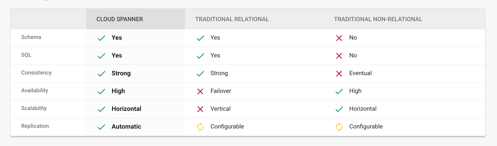

GCP Certification Series
========================

For Google Certified Associate Cloud Engineer.

Basic Knowledge
---------------

- The project number and project ID are unique across the Google Cloud Platform
- Name such as **Google** or **SSL** cannot be used for the project name
- gcloud projects create [PROJECT_ID] [--organization=ORGANIZATION_ID | --folder=FOLDER_ID]. Project ID must **start with a lowercase letter**, and can contain only ASCII letters, digits, and hyphens, and must be between 6 and 30 characters.
- Project owners can restore a deleted project within the 30-day recovery period that starts when the project is shut down. Restoring a project returns it to the state it was in before it was shut down. Cloud Storage resources are deleted before the 30-day period ends, and may not be fully recoverable.

- Standard user access types or Primitive Roles:
** Browser (Beta)
** Editor
** Owner
** Viewer

- Cloud Shell gives 5GB of persistent disk storage in your home directory

- To place a **lien** on a project protecting GCP project accidentally delete by any owners and administrator, untile **lien** is revoked
- gcloud alpha resource-manager liens list
- gcloud beta **interactive**

- IAM policy can be set at the organization level, folder level, project level, or (in some cases) resource level
- Permissions that were inherited from the original parent will be lost when the project is moved to a new folder. Permissions set at the destination folder will be inherited by the project as it is moved

image::https://miro.medium.com/max/1202/0*oNHpRfBVe4xrGmXm[G Suite account, Cloud Identity, and the GCP resource hierarchy]

- To use any API need to have valid credentials. To find the keys for authenticating uses of API you can add and remove credentials from the list

Cloud SDK and CLI
-----------------

Managing SDK Components - **General Availability**, **Preview** release, **Alpha**, **Beta** components, _https://cloud.google.com/sdk/docs/components_

image::https://miro.medium.com/max/1540/1*OA7SspVtgjxSZX6z73jB_A.png[Cloud SDK Additional components]

Pricing
-------

- These savings are achieved by:
** **Sustained use discount**: _**More your instances are running bigger discount you will get.**_
** **List price differences**: Google is reducing the price of services and instances according to **Moore’s law** and immediately after the price of any instance or services are reduced they are applied in your monthly billing.
** **Rightsizing recommendations**: Google cloud provides recommendations for compute engine based on the 8 days stack driver monitoring to resize the VM.

image::https://cloud.google.com/images/pricing/pricing-hero.png[GCP compared to other Cloud vendors]

Do More For Less, _https://cloud.google.com/pricing/_

image::GCP Certification Series - Google Cloud Storage Classes.png[Google Cloud Storage Classes]

Google Cloud Platform Pricing Calculator, _https://cloud.google.com/products/calculator/_

Compute Resources
-----------------

- Up to 5 VPC can be added to the project
- Instances in the same VPC communicate in local area network
- Public IP is only used when it has to communicate outside the project
- Compute Engine can automatically generate SSH keys for you and apply them to your Google account, or G Suite account, or **project metadata**
- Shared-core machine types provide one vCPU that is allowed to run for a portion of the time on a single hardware hyper-thread on the host CPU running your instance. Shared-core instances can be more cost-effective for running small, non-resource intensive applications than standard, high-memory or high-CPU machine types
- Bursting happens automatically when your instance requires more physical CPU than originally allocated. During these spikes, your instance will opportunistically take advantage of available physical CPU in bursts. Note that bursts are not permanent and are only possible periodically
- Attach GPUs only to instances with a predefined machine type or custom machine type are able to create in a zone. GPUs are not supported on shared-core machine types or memory-optimized machine types
- Preemption process:
** Compute Engine sends a preemption notice to the instance in the form of **an ACPI G2 Soft Off signal**. You can use a shutdown script to handle the preemption notice and complete cleanup actions before the instance stops
** If the instance does not stop after 30 seconds, Compute Engine sends **an ACPI G3 Mechanical Off signal** to the operating system
** Compute Engine transitions the instance to a **TERMINATED** state

image::GCP Certification Series - Computing options comparing.png[Computing options comparing]

App Hosting on Google Cloud, _https://cloud.google.com/hosting-options/_

image::GCP Certification Series - Hosting options.png[Hosting options]

Storage
-------

image::https://miro.medium.com/max/2470/0*-J9gAHSRqWQsDeoo.png[File Storage vs. Block Storage vs. Object Storage]

- Storage Systems:
** **File storage** — files and folders. Performance suffers of certain capacity, like processing power and growth
** **Block storage** — Databases, OS. Using traditional file systems on block storage places explicit or practical operational limits on scaling beyond the petabyte range
** **Object storage** - buckets, multimedia, designed for unstructured data such as media, documents, logs, backups, application binaries, and VM images:
*** Data are stored along with its metadata (**objects in object**) and unique identifier
*** Conceptually they are like a persistent key/value store
*** Perfect solution for backup or archive
*** Real file system layer is obsolete
*** Can be scaled up much easier

image::https://miro.medium.com/max/2132/1*Xjo8kkkZ7LwM93jY-tw3AQ.png[Storage System]

- Network Storage Options:

image::https://www.caringo.com/wp-content/uploads/2017/01/File-Object-Storage.svg[Network Storage Options]

- Different Storage products from Google

[cols="1,3,4a,4a"]
|===
|Product {set:cellbgcolor:#4885ed} |Description |Good For |Common Workloads

|
image:../icons/Storage & Databases/Persistent Disk.svg[] https://cloud.google.com/persistent-disk/[Persistent Disk]
{set:cellbgcolor!}
|Fully-managed, price-performant block storage that is suitable for virtual machines and containers
|
* Block storage for Google Compute Engine and Google Kubernetes Engine
* Snapshots for data backup
|
* Disks for virtual machines
* Sharing read-only data across multiple virtual machines
* Rapid, durable backups of running virtual machines

|
image:../icons/Storage & Databases/Cloud Storage.svg[] https://cloud.google.com/storage/[Google Cloud Storage]
|A scalable, fully-managed, highly reliable, and cost-efficient object / blob store
|
* Images, pictures, and videos
* Objects and blobs
* Unstructured data
|
* Storing and streaming multimedia
* Storage for custom data analytics pipelines
* Archive, backup, and disaster recovery

|
image:../icons/Storage & Databases/Cloud Bigtable.svg[] https://cloud.google.com/bitable/[Google Cloud Bigtable]
|A scalable, fully-managed NoSQL wide-column database that is suitable for both real-time access and analytics workloads
|
* Low-latency read/write access
* High-throughput analytics
* Native time series support
|
* IoT, finance, adtech
* Personalization, recommendations
* Monitoring
* Geospatial datasets
* Graphs

|
 https://cloud.google.com/datastore/[Google Cloud Datastore]
|A scalable, fully-managed NoSQL document database for your web and mobile applications
|
* Semi-structured application data
* Hierarchical data
* Durable key-value data
|
* User profiles
* Product catalogs
* Game state

|
 https://cloud.google.com/sql/[Google Cloud SQL]
|A fully-managed MySQL and PostgreSQL database service that is built on the strength and reliability of Google’s infrastructure
|
* Web frameworks
* Structured data
* OLTP workloads
|
* Websites, blogs, and content management systems (CMS)
* Business Intelligence (BI) applications
* ERP, CRM, and eCommerce applications
* Geospatial applications

|
image:../icons/Storage & Databases/Cloud Spanner.svg[] https://cloud.google.com/spanner/[Google Cloud Spanner]
|Mission-critical, relational database service with transactional consistency, global scale and high availability
|
* Mission-critical applications
* High transactions
* Scale + Consistency requirements
|
* Adtech
* Financial services
* Global supply chain
* Retail

|
image:../icons/Big Data/BigQuery.svg[] https://cloud.google.com/bigquery/[Google BigQuery]
|A scalable, fully-managed Enterprise Data Warehouse (EDW) with SQL and fast response times
|
* OLAP workloads up to petabyte-scale
* Big Data exploration and processing
* Reporting via Business Intelligence (BI) tools
|
* Analytical reporting on large data
* Data Science and advanced analyses
* Big Data processing using SQL

|
image:../icons/Storage & Databases/Cloud Filestore.svg[] https://cloud.google.com/filestore/[Google Cloud Filestore]
|A managed file storage service for applications that require a filesystem interface and a shared filesystem for data. Filestore gives users a simple, native experience for standing up managed Network Attached Storage (NAS) with their Google Compute Engine and Kubernetes Engine instances. The ability to fine-tune Filestore’s performance and capacity independently leads to predictably fast performance for your file-based workloads
|
* Fast
* Consistent
* Simple
|
* Rendering
* Application migrations
* Web content management
* Media processing
* Home directories

|
 https://cloud.google.com/memorystore/[Google Cloud Memorystore]
|A fully managed in-memory data store service built on scalable, secure, and highly available infrastructure managed by Google. Use Cloud Memorystore to build application caches that provides sub-millisecond data access. Cloud Memorystore is compatible with the Redis protocol, allowing easy migration with zero code changes
|
* Focus on Building Great Apps
* Scale as Needed
* Highly Available
* Google Grade Security
* Easy Lift and Shift
|

|
image:https://cloud.google.com/images/products/logos/svg/firebase-firestore.svg[] https://cloud.google.com/filestore/[Google Cloud Firestore]
|A fast, fully managed, serverless, cloud-native NoSQL document database that simplifies storing, syncing, and querying data for your mobile, web, and IoT apps at global scale. Its client libraries provide live synchronization and offline support, while its security features and integrations with Firebase and Google Cloud Platform (GCP) accelerate building truly serverless apps
|
* Accelerate development velocity with serverless
* Sync data across devices, on or offline
* Simple and effortless
* Enterprise-grade, scalable NoSQL
|
* Mobile applications
|===

image::GCP Certification Series - Storage Options Flowchart.jpg[Google Cloud Storage Options Flowchart]

- Google Cloud Storage, Standard (Multi-Regional, Regional)

image::https://cloud.google.com/images/storage/storage-classes-desktop.svg[Google Cloud Storage]

- Google Cloud Spanner

The best of the relational and non-relational worlds:

Network
-------

- 3 tiers Internet Providers:
** Tier 1 carriers are the movers and shakers of the industry, called as backbone Internet providers
** Tier 2 carriers peer with other networks, but also purchase IP transit for full access to the internet
** Tier 3 carriers strictly purchase IP transit, usually are last mile providers

- **BGP Peering** is an agreement between different Service Providers. It is an EBGP neighborship between different Service Providers to send BGP traffic between them without paying upstream Service Provider

- How internet works

image::https://cdn3.vox-cdn.com/assets/4463779/nRzfTEu.gif[The internet conquers the world]

40 maps that explain the internet, _https://www.vox.com/a/internet-maps_

- Internet Exchange Directory

image::GCP Certification Series - Internet Exchange Directory.svg[Internet Exchange Directory]

PCH (Packet Clearing House) Internet Exchange Directory, _https://www.pch.net/ixp/dir_

- Explore Google's Data Analytics, Data Encryption, Container Operations on Google Cloud Infrastructure and Global Network via virsualisation, _https://cloud.withgoogle.com/infrastructure_

- Few of the resources in GCP are global, others may be restricted by region or zone
** Global Resources:
*** Images
*** Snapshots
*** VPC Network
*** Firewalls
*** Routes
** Regional Resources:
*** Static external IP addresses
*** Subnets
** Zonal Resources:
*** Instances (VMs)
*** Persistent Disks

image::https://www.networkmanagementsoftware.com/wp-content/uploads/disks-images-1024x407.png[]

_Can attach a disk from one instance to another within the same zone, but cannot do this across zones. Since images and snapshots are Global Resources, can use these across zones in the same region._

- Addressing Methods
** Unicast
** Multicast
** Broadcast
** Geocast
** Anycast

- Load Balancer
** Distribute load-balanced resources in single or multiple regions
** Meet your high availability requirements
** Put your resources behind a single anycast IP address
** Scale your resources up or down with intelligent Autoscaling
** Use Cloud CDN for optimal content delivery

image::https://cloud.google.com/load-balancing/images/choose-lb.svg[Load Balancer Decision Tree]

- Connection
** Interconnect

** Peering

** Options

image::GCP Certification Series - Connection.png[Google Cloud Connection]

References
----------

- GCP Certification Series, 1.1, _https://medium.com/@prashantapaudel/gcp-certification-series-1-1-15cf8117f610_
- GCP Certification Series: 1.2, Managing billing configuration, _https://medium.com/@prashantapaudel/gcp-certification-series-1-2-managing-billing-configuration-5d33de697ca3_
- Google Cloud Platform(GCP) Certification Series: 1.3 Installing and configuring the command line interface (CLI), specifically the Cloud SDK, _https://medium.com/@prashantapaudel/google-cloud-platform-gcp-certification-series-1-3-6cdc9358672d_
- GCP Certification Series: Section 2: Planning and configuring a Cloud solution, 2.1 Planning and estimating GCP product use using the Pricing Calculator, _https://medium.com/@prashantapaudel/gcp-certification-series-section-2-planning-and-configuring-a-cloud-solution-2-1-580eb601f62f_
- Google Cloud Platform(GCP): 2.2 Planning and configuring compute resources, _https://medium.com/@prashantapaudel/google-cloud-platform-gcp-2-2-planning-and-configuring-compute-resources-47332d8309a5_
- GCP Certification Series: 2.3 Planning and configuring data storage options, _https://medium.com/@prashantapaudel/gcp-certification-series-2-3-planning-and-configuring-data-storage-options-5a6bfbca8601_
- GCP Certification Series: 2.4 Planning and configuring network resources, _https://medium.com/@prashantapaudel/gcp-certification-series-2-4-planning-and-configuring-network-resources-8045ac2cc2ac_