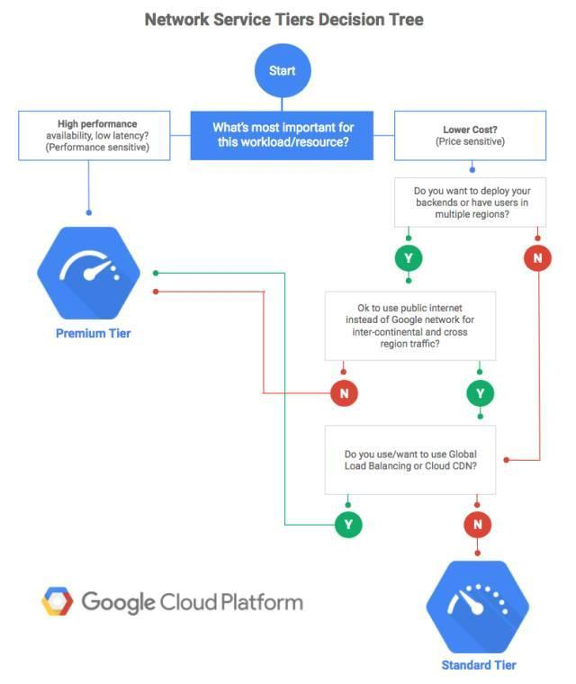
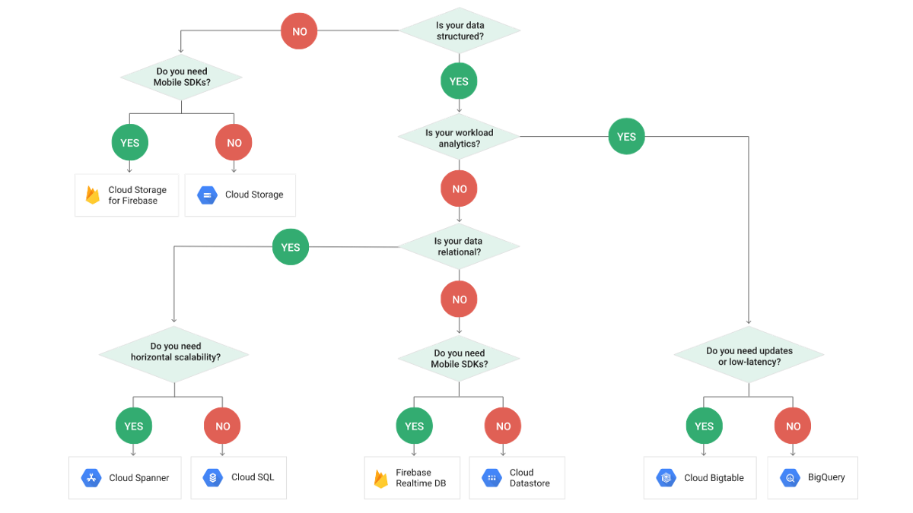
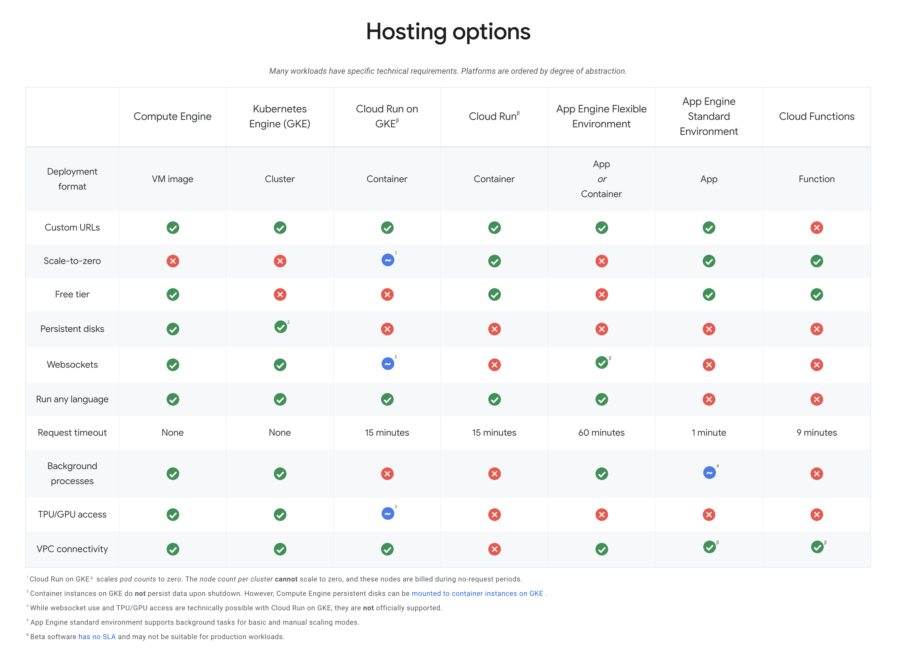

GCP Products Decision Tree
==========================

GCP Network Tier decision tree
------------------------------

image::https://miro.medium.com/max/1200/1*JnDFATWt5-7DgQusex4BeQ.png[GCP Network Tier decision tree]

GCP Network Service Tiers decision tree
---------------------------------------

GCP Authentiation options decision tree
---------------------------------------

image::https://miro.medium.com/max/1200/1*Uw6w0_X8X29jhpfMgW58Sw.png[GCP Authentiation options decision tree]

GCP Compute options decision tree
---------------------------------

image::https://miro.medium.com/max/628/1*OV12s1M9O3OcEn2cwdtmEA.png[GCP Compute options decision tree]

Google Data products decision tree
----------------------------------

Google Cloud Dataflow vs. Cloud Dataproc
----------------------------------------

image::https://cloud.google.com/dataflow/images/flow-vs-proc-flowchart.svg[Google Dataflow vs. Dataproc]

Data encryption decision tree
-----------------------------

image::https://miro.medium.com/max/640/1*LTWOlTPPGXIWSPmJEoBVRQ.png[Data encryption decision tree]

Serverless Compute Platform decition tree
-----------------------------------------

image::https://cloud.google.com/images/serverless-options/serverless-guide.svg[Serverless Compute Platform]

GCP Hosting Options
-------------------

References
----------

- GCP flowchart of decision tree, _https://medium.com/google-cloud/a-gcp-flowchart-a-day-2d57cc109401_
- GCP Hosting Options, _https://cloud.google.com/hosting-options/_
- GCP Serverless Options, _https://cloud.google.com/serverless-options/_