Cloud Architecture
==================

**Migrate a MySQL Database to Google Cloud SQL**

Tasks to complete:

- Create a Google Cloud SQL Instance and create a Database
- Import a MySQL database into Google Cloud SQL
- Reconfigure an application to use Google Cloud SQL instead of a local MySQL database

Some important information:

- Compute Instance called blog that is already running in the lab

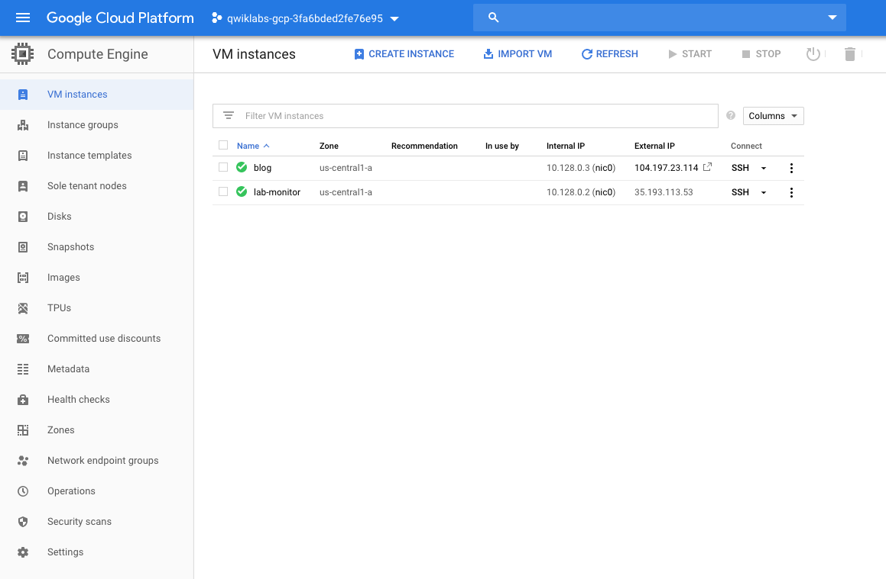

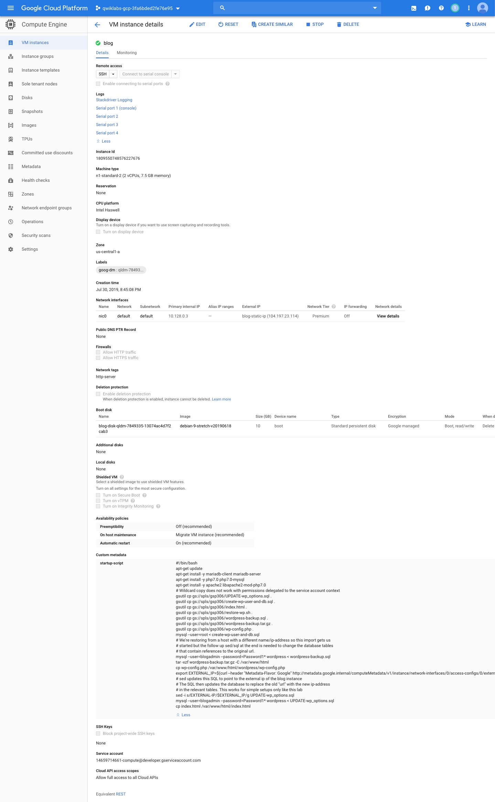

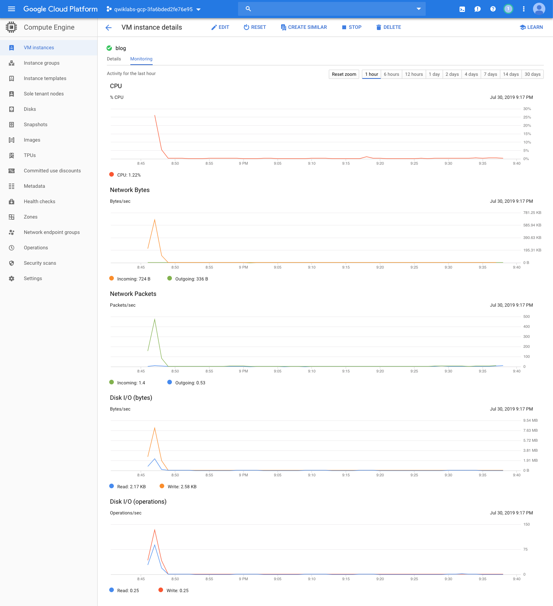

- The existing MySQL database is called **wordpress** and the username / password is **blogadmin / Password1***
- WordPress site configuration file is located here: **/var/www/html/wordpress/wp-config.php**
- The Project ID is **qwiklabs-gcp-3fa6bded2fe76e95**

Create a new Google Cloud SQL instance to host the migrated database.

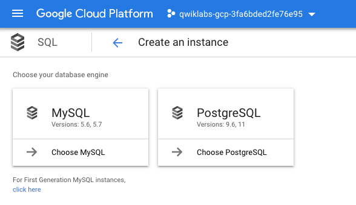

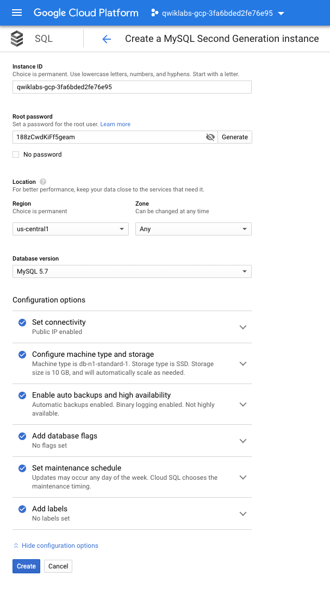

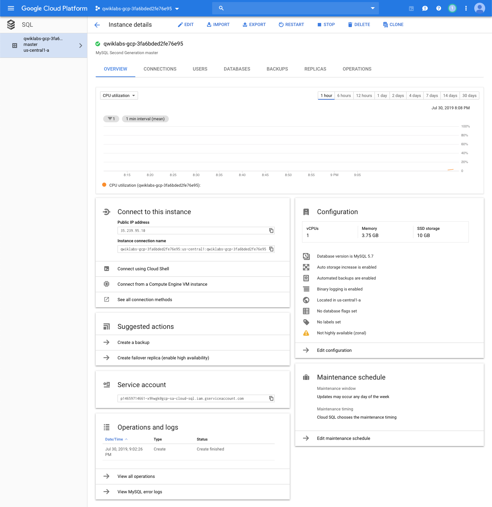

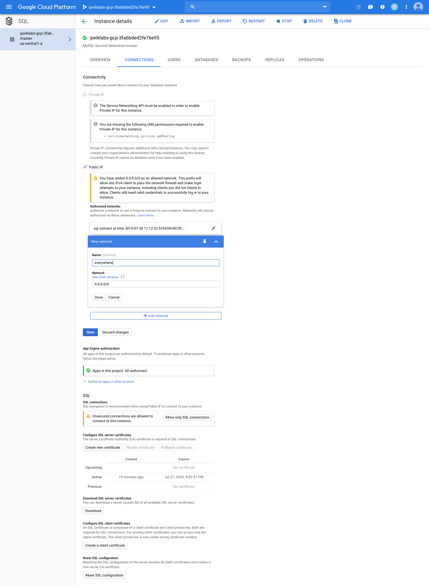

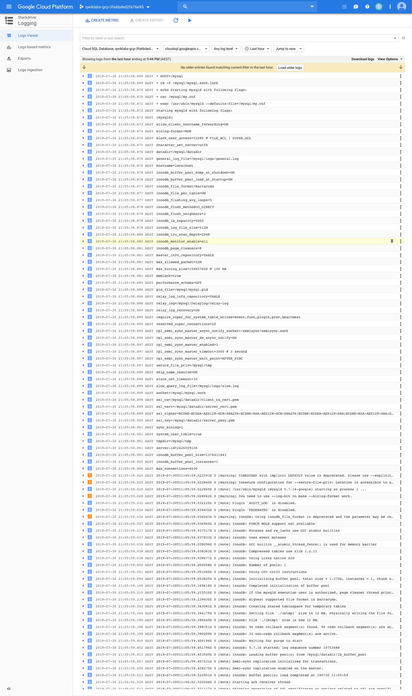

Connect Google SQL using Cloud Shell:

[source.console]
----
$ gcloud sql connect qwiklabs-gcp-3fa6bded2fe76e95 --user=root --quiet
Whitelisting your IP for incoming connection for 5 minutes...done.
Connecting to database with SQL user [root].Enter password:
Welcome to the MariaDB monitor.  Commands end with ; or \g.
Your MySQL connection id is 59
Server version: 5.7.14-google-log (Google)

Copyright (c) 2000, 2018, Oracle, MariaDB Corporation Ab and others.

Type 'help;' or '\h' for help. Type '\c' to clear the current input statement.
----

Create database, user and grant user's access to the database:

[source.console]
----
MySQL [(none)]> create database wordpress;
Query OK, 1 row affected (0.20 sec)

MySQL [(none)]> CREATE USER 'blogadmin'@'%' IDENTIFIED BY 'Password1*';
Query OK, 0 rows affected (0.19 sec)

GRANT ALL PRIVILEGES ON wordpress.* TO 'blogadmin'@'%';
Query OK, 0 rows affected (0.01 sec)
----

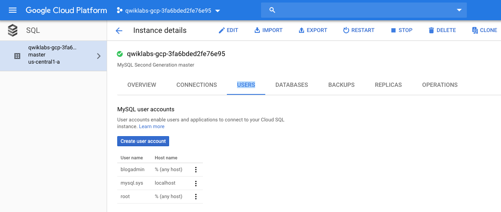

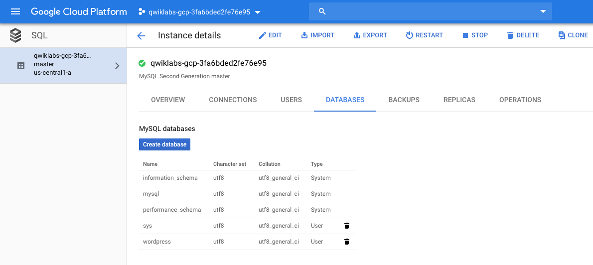

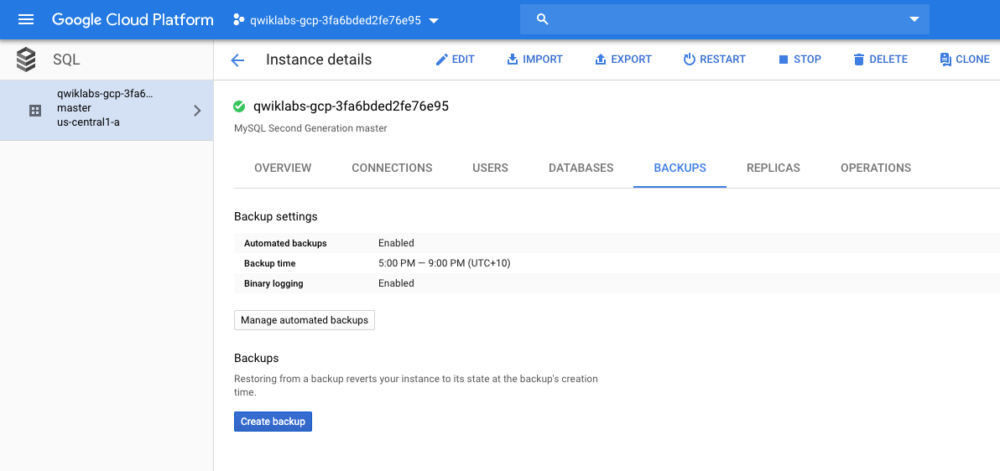

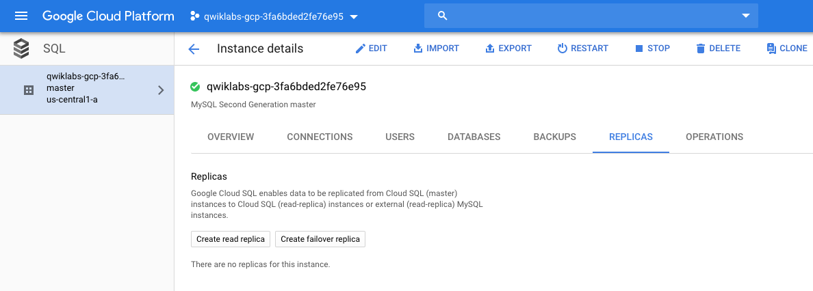

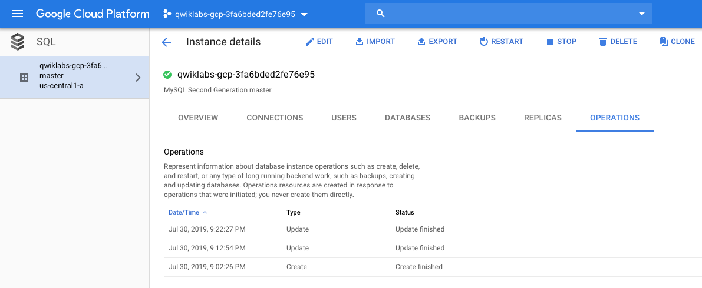

Connect new Google SQL database from blog's VM.

[source.console]
----
$ mysql -h 35.239.95.10 -u blogadmin -pPassword1* wordpress
Reading table information for completion of table and column names
You can turn off this feature to get a quicker startup with -A
Welcome to the MariaDB monitor.  Commands end with ; or \g.
Your MySQL connection id is 141
Server version: 5.7.14-google-log (Google)
Copyright (c) 2000, 2018, Oracle, MariaDB Corporation Ab and others.
Type 'help;' or '\h' for help. Type '\c' to clear the current input statement.

MySQL [wordpress]> show tables;
+-----------------------+
| Tables_in_wordpress   |
+-----------------------+
| wp_commentmeta        |
| wp_comments           |
| wp_links              |
| wp_options            |
| wp_postmeta           |
| wp_posts              |
| wp_term_relationships |
| wp_term_taxonomy      |
| wp_termmeta           |
| wp_terms              |
| wp_usermeta           |
| wp_users              |
+-----------------------+
12 rows in set (0.01 sec)
----

Consider migrating SQL data on GCP console:

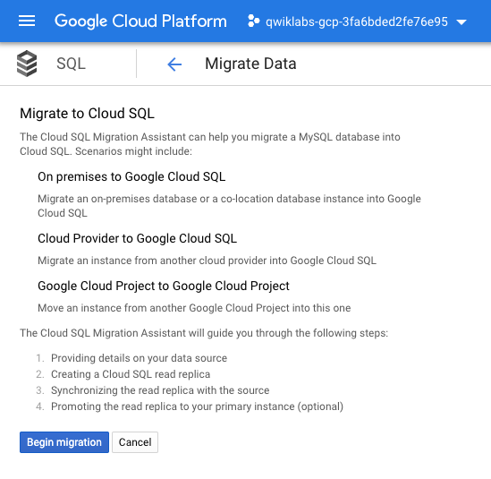

Or, using commnad line, on blog VM:

[source.console]
----
$ mysqldump -h localhost -u blogadmin -pPassword1* wordpress > workdpress-data-dump.sql

$ more workdpress-data-dump.sql
-- MySQL dump 10.16  Distrib 10.1.38-MariaDB, for debian-linux-gnu (x86_64)
--
-- Host: localhost    Database: wordpress
-- ------------------------------------------------------
-- Server version       10.1.38-MariaDB-0+deb9u1
/*!40101 SET @OLD_CHARACTER_SET_CLIENT=@@CHARACTER_SET_CLIENT */;
/*!40101 SET @OLD_CHARACTER_SET_RESULTS=@@CHARACTER_SET_RESULTS */;
/*!40101 SET @OLD_COLLATION_CONNECTION=@@COLLATION_CONNECTION */;
/*!40101 SET NAMES utf8mb4 */;
/*!40103 SET @OLD_TIME_ZONE=@@TIME_ZONE */;
/*!40103 SET TIME_ZONE='+00:00' */;
/*!40014 SET @OLD_UNIQUE_CHECKS=@@UNIQUE_CHECKS, UNIQUE_CHECKS=0 */;
/*!40014 SET @OLD_FOREIGN_KEY_CHECKS=@@FOREIGN_KEY_CHECKS, FOREIGN_KEY_CHECKS=0 */;
/*!40101 SET @OLD_SQL_MODE=@@SQL_MODE, SQL_MODE='NO_AUTO_VALUE_ON_ZERO' */;
/*!40111 SET @OLD_SQL_NOTES=@@SQL_NOTES, SQL_NOTES=0 */;
--
-- Table structure for table `wp_commentmeta`
--
...

$ mysql -h 35.239.95.10 -u blogadmin -pPassword1* wordpress < workdpress-data-dump.sql
----

Step by step how to connect SQL instance from GCP VM:

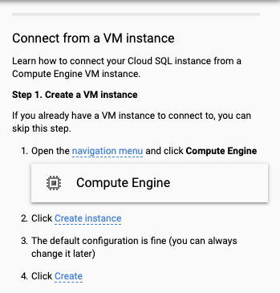

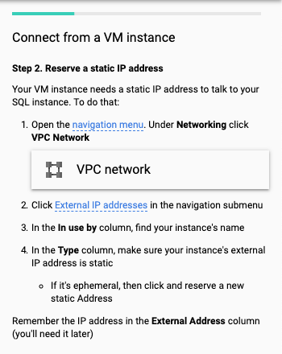

image::Migrate MySQL to Google Cloud SQL - connect SQL from VM 3.png[connect SQL from VM]

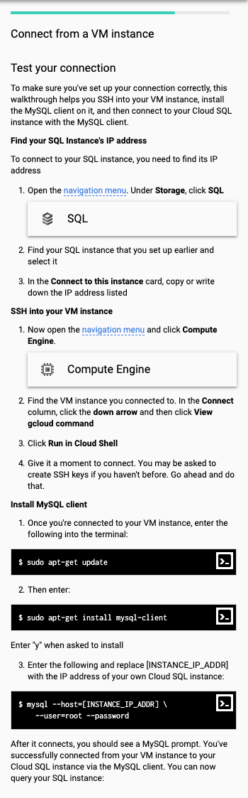

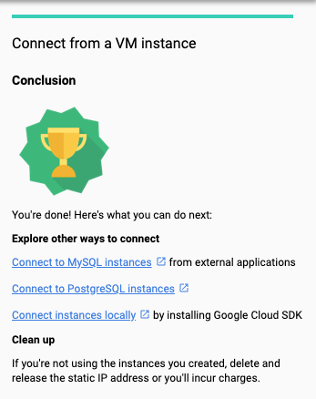

Update Wordpress configuration file with new GCP SQL connection:

[source.console]
----
$ cat /var/www/html/wordpress/wp-config.php
...
// ** MySQL settings - You can get this info from your web host ** //
/** The name of the database for WordPress */
define('DB_NAME', 'wordpress');

/** MySQL database username */
define('DB_USER', 'blogadmin');

/** MySQL database password */
define('DB_PASSWORD', 'Password1*');

/** MySQL hostname */
define('DB_HOST', '35.239.95.10');

/** Database Charset to use in creating database tables. */
define('DB_CHARSET', 'utf8mb4');

/** The Database Collate type. Don't change this if in doubt. */
define('DB_COLLATE', '');
...
----

Stop MySQL runs on localhost with blog VM:

[source.console]
----
$ sudo /etc/init.d/mysql stop
[ ok ] Stopping mysql (via systemctl): mysql.service.
----

Restart Apache2:

[source.console]
----
$ sudo /etc/init.d/apache2 stop
[ ok ] Stopping apache2 (via systemctl): apache2.service.

$ sudo /etc/init.d/apache2 start
[ ok ] Starting apache2 (via systemctl): apache2.service.
----

References
----------

- Google Cloud Training - Cloud Architecture, _https://google.qwiklabs.com/quests/24_
- Migrate a MySQL Database to Google Cloud SQL, _https://google.qwiklabs.com/focuses/1740?parent=catalog_