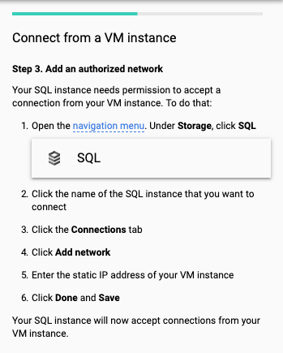

Cloud Architecture
==================

**Migrate a MySQL Database to Google Cloud SQL**

Tasks to complete:

- Create a Google Cloud SQL Instance and create a Database
- Import a MySQL database into Google Cloud SQL
- Reconfigure an application to use Google Cloud SQL instead of a local MySQL database

Some important information:

- Compute Instance called blog that is already running in the lab

- The existing MySQL database is called **wordpress** and the username / password is **blogadmin / Password1***
- WordPress site configuration file is located here: **/var/www/html/wordpress/wp-config.php**
- The Project ID is **qwiklabs-gcp-3fa6bded2fe76e95**

Create a new Google Cloud SQL instance to host the migrated database.

image::Migrate MySQL to Google Cloud SQL - SQL.png[SQL]

image::Migrate MySQL to Google Cloud SQL - create SQL instance.png[Create a new SQL instance]

image::Migrate MySQL to Google Cloud SQL - SQL instance overview.png[new SQL instance overview]

image::Migrate MySQL to Google Cloud SQL - SQL instance log.png[new SQL instance log]

Connect Google SQL using Cloud Shell:

[source.console]
----
$ gcloud sql connect qwiklabs-gcp-3fa6bded2fe76e95 --user=root --quiet
Whitelisting your IP for incoming connection for 5 minutes...done.
Connecting to database with SQL user [root].Enter password:
Welcome to the MariaDB monitor.  Commands end with ; or \g.
Your MySQL connection id is 59
Server version: 5.7.14-google-log (Google)

Copyright (c) 2000, 2018, Oracle, MariaDB Corporation Ab and others.

Type 'help;' or '\h' for help. Type '\c' to clear the current input statement.
----

Create database, user and grant user's access to the database:

[source.console]
----
MySQL [(none)]> create database wordpress;
Query OK, 1 row affected (0.20 sec)

MySQL [(none)]> CREATE USER 'blogadmin'@'%' IDENTIFIED BY 'Password1*';
Query OK, 0 rows affected (0.19 sec)

GRANT ALL PRIVILEGES ON wordpress.* TO 'blogadmin'@'%';
Query OK, 0 rows affected (0.01 sec)
----

image::Migrate MySQL to Google Cloud SQL - SQL instance operations.png[new SQL instance operations]

Connect new Google SQL database from blog's VM.

[source.console]
----
$ mysql -h 35.239.95.10 -u blogadmin -pPassword1* wordpress
Reading table information for completion of table and column names
You can turn off this feature to get a quicker startup with -A
Welcome to the MariaDB monitor.  Commands end with ; or \g.
Your MySQL connection id is 141
Server version: 5.7.14-google-log (Google)
Copyright (c) 2000, 2018, Oracle, MariaDB Corporation Ab and others.
Type 'help;' or '\h' for help. Type '\c' to clear the current input statement.

MySQL [wordpress]> show tables;
+-----------------------+
| Tables_in_wordpress   |
+-----------------------+
| wp_commentmeta        |
| wp_comments           |
| wp_links              |
| wp_options            |
| wp_postmeta           |
| wp_posts              |
| wp_term_relationships |
| wp_term_taxonomy      |
| wp_termmeta           |
| wp_terms              |
| wp_usermeta           |
| wp_users              |
+-----------------------+
12 rows in set (0.01 sec)
----

Consider migrating SQL data on GCP console:

image::Migrate MySQL to Google Cloud SQL - migrate data.png[migrate data]

Or, using commnad line, on blog VM:

[source.console]
----
$ mysqldump -h localhost -u blogadmin -pPassword1* wordpress > workdpress-data-dump.sql

$ mysql -h 35.239.95.10 -u blogadmin -pPassword1* wordpress < workdpress-data-dump.sql
----

Step by step how to connect SQL instance from GCP VM:

image::Migrate MySQL to Google Cloud SQL - connect SQL from VM 1.png[connect SQL from VM]

image::Migrate MySQL to Google Cloud SQL - connect SQL from VM 2.png[connect SQL from VM]

References
----------

- Google Cloud Training - Cloud Architecture, _https://google.qwiklabs.com/quests/24_
- Migrate a MySQL Database to Google Cloud SQL, _https://google.qwiklabs.com/focuses/1740?parent=catalog_