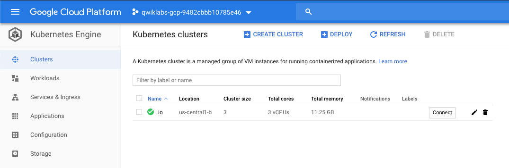
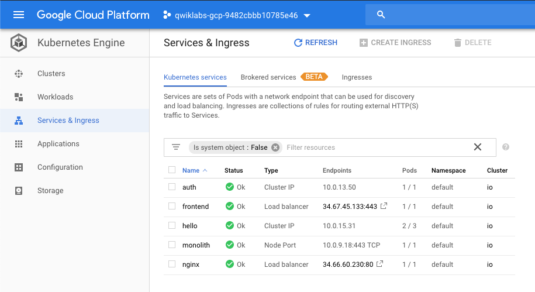
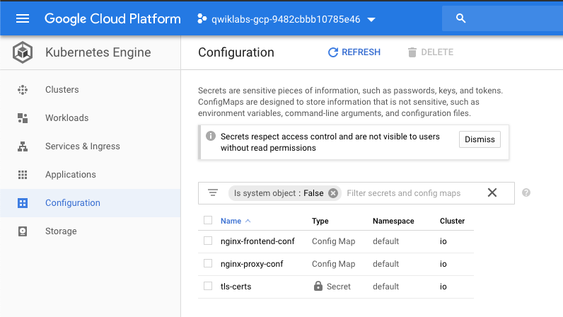
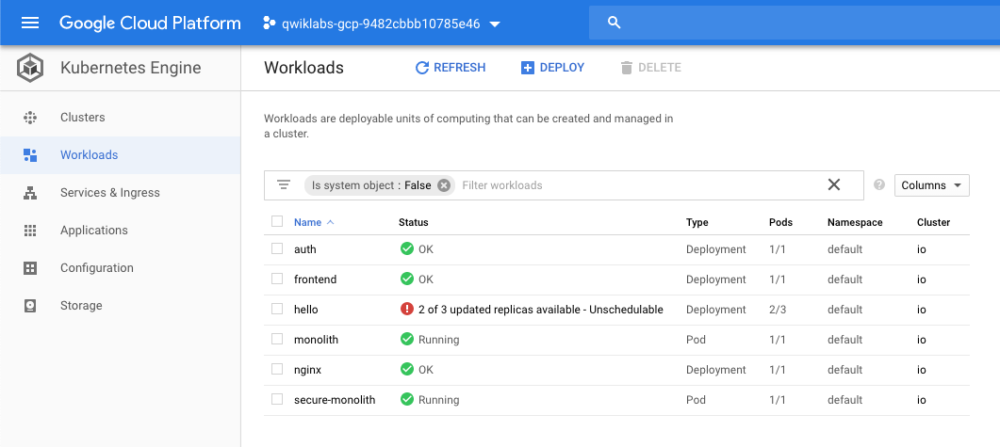

Cloud Architecture
==================

Orchestrating the Cloud with Kubernetes

Google Kubernetes Engine
------------------------

[source.console]
----
$ gcloud config set compute/zone us-central1-b
Updated property [compute/zone].
----

Start up a Kubernetes Engine cluster:

[source.console]
----
$ gcloud container clusters create io
Creating cluster io in us-central1-b... Cluster is being health-checked (master is healthy)...done.
Created [https://container.googleapis.com/v1/projects/qwiklabs-gcp-9482cbbb10785e46/zones/us-central1-b/clusters/io].
To inspect the contents of your cluster, go to: https://console.cloud.google.com/kubernetes/workload_/gcloud/us-central1-b/io?project=qwiklabs-gcp-9482cbbb10785e46
kubeconfig entry generated for io.
NAME  LOCATION       MASTER_VERSION  MASTER_IP      MACHINE_TYPE   NODE_VERSION   NUM_NODES  STATUS
io    us-central1-b  1.12.8-gke.10   35.225.154.57  n1-standard-1  1.12.8-gke.10  3          RUNNING
----

Get the sample code
-------------------

[source.console]
----
$ git clone https://github.com/googlecodelabs/orchestrate-with-kubernetes.git
Cloning into 'orchestrate-with-kubernetes'...
remote: Enumerating objects: 90, done.
remote: Total 90 (delta 0), reused 0 (delta 0), pack-reused 90
Unpacking objects: 100% (90/90), done.

$ cd orchestrate-with-kubernetes/kubernetes

$ ls
total 32
drwxr-xr-x 7 google3965106_student google3965106_student 4096 Jun 29 23:34 .
drwxr-xr-x 5 google3965106_student google3965106_student 4096 Jun 29 23:34 ..
-rw-r--r-- 1 google3965106_student google3965106_student  283 Jun 29 23:34 cleanup.sh
drwxr-xr-x 2 google3965106_student google3965106_student 4096 Jun 29 23:34 deployments
drwxr-xr-x 2 google3965106_student google3965106_student 4096 Jun 29 23:34 nginx
drwxr-xr-x 2 google3965106_student google3965106_student 4096 Jun 29 23:34 pods
drwxr-xr-x 2 google3965106_student google3965106_student 4096 Jun 29 23:34 services
drwxr-xr-x 2 google3965106_student google3965106_student 4096 Jun 29 23:34 tls
----

Quick Kubernetes Demo
---------------------

[source.console]
----
$ kubectl create deployment nginx --image=nginx:1.10.0
deployment.apps/nginx created

$ kubectl get pods
NAME                     READY   STATUS    RESTARTS   AGE
nginx-7486dbfddd-bzsfk   1/1     Running   0          22s

$ kubectl expose deployment nginx --port 80 --type LoadBalancer
service/nginx exposed
----

Behind the scenes Kubernetes created an external Load Balancer with a public IP address attached to it. Any client who hits that public IP address will be routed to the pods behind the service.

[source.console]
----
$ kubectl get services
NAME         TYPE           CLUSTER-IP   EXTERNAL-IP    PORT(S)        AGE
kubernetes   ClusterIP      10.0.0.1     <none>         443/TCP        5m20s
nginx        LoadBalancer   10.0.2.218   34.66.60.230   80:30346/TCP   2m4s
----

[NOTE]
====
It may take a few seconds before the ExternalIP field is populated for your service.
====

[source.console]
----
curl http://34.66.60.230:80
<!DOCTYPE html>
<html>
<head>
<title>Welcome to nginx!</title>
...
</body>
</html>
----

Creating Pods
-------------

image::https://cdn.qwiklabs.com/tzvM5wFnfARnONAXX96nz8OgqOa1ihx6kCk%2BelMakfw%3D[Pods]

Pods represent and hold a collection of one or more containers. Generally, if you have multiple containers with a hard dependency on each other, you package the containers inside a single pod.

[source.console]
----
$ cat pods/monolith.yaml
apiVersion: v1
kind: Pod
metadata:
  name: monolith
  labels:
    app: monolith
spec:
  containers:
    - name: monolith
      image: kelseyhightower/monolith:1.0.0
      args:
        - "-http=0.0.0.0:80"
        - "-health=0.0.0.0:81"
        - "-secret=secret"
      ports:
        - name: http
          containerPort: 80
        - name: health
          containerPort: 81
      resources:
        limits:
          cpu: 0.2
          memory: "10Mi"

$ kubectl create -f pods/monolith.yaml
pod/monolith created

$ kubectl get pods
NAME                     READY   STATUS    RESTARTS   AGE
monolith                 1/1     Running   0          21s
nginx-7486dbfddd-bzsfk   1/1     Running   0          7m38s
----

[NOTE]
====
It may take a few seconds before the monolith pod is up and running. The monolith container image needs to be pulled from the Docker Hub before we can run it.
====

[source.console]
----
$ kubectl describe pods monolith
Name:               monolith
Namespace:          default
Priority:           0
PriorityClassName:  <none>
Node:               gke-io-default-pool-6ca7767d-b6nn/10.128.0.4
Start Time:         Sat, 29 Jun 2019 23:44:32 +1000
Labels:             app=monolith
Annotations:        <none>
Status:             Running
IP:                 10.4.2.6
Containers:
  monolith:
    Container ID:  docker://4438afcc1e98c84ba98026c141fa273ef3d1037e3bcd947d1a6491c34f107f5e
    Image:         kelseyhightower/monolith:1.0.0
    Image ID:      docker-pullable://kelseyhightower/monolith@sha256:72c3f41b6b01c21d9fdd2f45a89c6e5d59b8299b52d7dd0c9491745e73db3a35
    Ports:         80/TCP, 81/TCP
    Host Ports:    0/TCP, 0/TCP
    Args:
      -http=0.0.0.0:80
      -health=0.0.0.0:81
      -secret=secret
    State:          Running
      Started:      Sat, 29 Jun 2019 23:44:34 +1000
    Ready:          True
    Restart Count:  0
    Limits:
      cpu:     200m
      memory:  10Mi
    Requests:
      cpu:        200m
      memory:     10Mi
    Environment:  <none>
    Mounts:
      /var/run/secrets/kubernetes.io/serviceaccount from default-token-gxwqv (ro)
Conditions:
  Type              Status
  Initialized       True
  Ready             True
  ContainersReady   True
  PodScheduled      True
Volumes:
  default-token-gxwqv:
    Type:        Secret (a volume populated by a Secret)
    SecretName:  default-token-gxwqv
    Optional:    false
QoS Class:       Guaranteed
Node-Selectors:  <none>
Tolerations:     node.kubernetes.io/not-ready:NoExecute for 300s
                 node.kubernetes.io/unreachable:NoExecute for 300s
Events:
  Type    Reason     Age   From                                        Message
  ----    ------     ----  ----                                        -------
  Normal  Scheduled  117s  default-scheduler                           Successfully assigned default/monolith to gke-io-default-pool-6ca7767d-b6nn
  Normal  Pulling    116s  kubelet, gke-io-default-pool-6ca7767d-b6nn  pulling image "kelseyhightower/monolith:1.0.0"
  Normal  Pulled     115s  kubelet, gke-io-default-pool-6ca7767d-b6nn  Successfully pulled image "kelseyhightower/monolith:1.0.0"
  Normal  Created    115s  kubelet, gke-io-default-pool-6ca7767d-b6nn  Created container
  Normal  Started    115s  kubelet, gke-io-default-pool-6ca7767d-b6nn  Started container
----

Interacting with Pods
---------------------

By default, pods are allocated a private IP address and cannot be reached outside of the cluster. Use the kubectl port-forward command to map a local port to a port inside the monolith pod.

[source.console]
----
$ kubectl port-forward monolith 10080:80
Forwarding from 127.0.0.1:10080 -> 80
Handling connection for 10080

$ curl http://127.0.0.1:10080
{"message":"Hello"}

$ curl http://127.0.0.1:10080/secure
authorization failed
----

At the login prompt, use the super-secret password "password" to login.

[source.console]
----
$ curl -u user http://127.0.0.1:10080/login
Enter host password for user 'user':
{"token":"eyJhbGciOiJIUzI1NiIsInR5cCI6IkpXVCJ9.eyJlbWFpbCI6InVzZXJAZXhhbXBsZS5jb20iLCJleHAiOjE1NjIwNzU5OTgsImlhdCI6MTU2MTgxNjc5OCwiaXNzIjoiYXV0aC5zZXJ2aWNlIiwic3ViIjoidXNlciJ9.J6Ukgu
uDeedko9lBc56iSnOKvTXNud5X1IOBisXTWgM"}

$ TOKEN=$(curl http://127.0.0.1:10080/login -u user|jq -r '.token')
Enter host password for user 'user':
  % Total    % Received % Xferd  Average Speed   Time    Time     Time  Current
                                 Dload  Upload   Total   Spent    Left  Speed
100   222  100   222    0     0    210      0  0:00:01  0:00:01 --:--:--   210

$ curl -H "Authorization: Bearer $TOKEN" http://127.0.0.1:10080/secure
{"message":"Hello"}

$ kubectl logs monolith
2019/06/29 13:44:34 Starting server...
2019/06/29 13:44:34 Health service listening on 0.0.0.0:81
2019/06/29 13:44:34 HTTP service listening on 0.0.0.0:80
127.0.0.1:57582 - - [Sat, 29 Jun 2019 13:58:37 UTC] "GET / HTTP/1.1" curl/7.52.1
127.0.0.1:57606 - - [Sat, 29 Jun 2019 13:59:17 UTC] "GET /secure HTTP/1.1" curl/7.52.1
127.0.0.1:57646 - - [Sat, 29 Jun 2019 13:59:58 UTC] "GET /login HTTP/1.1" curl/7.52.1
127.0.0.1:57710 - - [Sat, 29 Jun 2019 14:01:25 UTC] "GET /login HTTP/1.1" curl/7.52.1
127.0.0.1:57742 - - [Sat, 29 Jun 2019 14:01:57 UTC] "GET /secure HTTP/1.1" curl/7.52.1
----

Use the kubectl exec command to run an interactive shell inside the Monolith Pod. This can come in handy when you want to troubleshoot from within a container:

[source.console]
----
$ kubectl exec monolith --stdin --tty -c monolith /bin/sh
/ # ping -c 3 google.com
PING google.com (64.233.191.100): 56 data bytes
64 bytes from 64.233.191.100: seq=0 ttl=51 time=0.870 ms
64 bytes from 64.233.191.100: seq=1 ttl=51 time=0.401 ms
64 bytes from 64.233.191.100: seq=2 ttl=51 time=0.362 ms
--- google.com ping statistics ---
3 packets transmitted, 3 packets received, 0% packet loss
round-trip min/avg/max = 0.362/0.544/0.870 ms
/ # exit
----

Creating a Service
------------------

image::https://cdn.qwiklabs.com/Jg0T%2F326ASwqeD1vAUPBWH5w1D%2F0oZn6z5mQ5MubwL8%3D[Services]

Services provide stable endpoints for Pods.

Services use labels to determine what Pods they operate on. If Pods have the correct labels, they are automatically picked up and exposed by our services.

The level of access a service provides to a set of pods depends on the Service's type. Currently there are three types:

- ClusterIP (internal) - the default type means that this Service is only visible inside of the cluster,
- NodePort gives each node in the cluster an externally accessible IP and
- LoadBalancer adds a load balancer from the cloud provider which forwards traffic from the service to Nodes within it.

[source.console]
----
$ cd ~/orchestrate-with-kubernetes/kubernetes

$ cat pods/secure-monolith.yaml
apiVersion: v1
kind: Pod
metadata:
  name: "secure-monolith"
  labels:
    app: monolith
spec:
  containers:
    - name: nginx
      image: "nginx:1.9.14"
      lifecycle:
        preStop:
          exec:
            command: ["/usr/sbin/nginx","-s","quit"]
      volumeMounts:
        - name: "nginx-proxy-conf"
          mountPath: "/etc/nginx/conf.d"
        - name: "tls-certs"
          mountPath: "/etc/tls"
    - name: monolith
      image: "kelseyhightower/monolith:1.0.0"
      ports:
        - name: http
          containerPort: 80
        - name: health
          containerPort: 81
      resources:
        limits:
          cpu: 0.2
          memory: "10Mi"
      livenessProbe:
        httpGet:
          path: /healthz
          port: 81
          scheme: HTTP
        initialDelaySeconds: 5
        periodSeconds: 15
        timeoutSeconds: 5
      readinessProbe:
        httpGet:
          path: /readiness
          port: 81
          scheme: HTTP
        initialDelaySeconds: 5
        timeoutSeconds: 1
  volumes:
    - name: "tls-certs"
      secret:
        secretName: "tls-certs"
    - name: "nginx-proxy-conf"
      configMap:
        name: "nginx-proxy-conf"
        items:
          - key: "proxy.conf"
            path: "proxy.conf"
----

Create the secure-monolith pods and their configuration data:

[source.console]
----
$ kubectl create secret generic tls-certs --from-file tls/
secret/tls-certs created

$ kubectl create configmap nginx-proxy-conf --from-file nginx/proxy.conf
configmap/nginx-proxy-conf created

$ kubectl create -f pods/secure-monolith.yaml
pod/secure-monolith created

$ cat services/monolith.yaml
kind: Service
apiVersion: v1
metadata:
  name: "monolith"
spec:
  selector:
    app: "monolith"
    secure: "enabled"
  ports:
    - protocol: "TCP"
      port: 443
      targetPort: 443
      nodePort: 31000
  type: NodePort

$ kubectl create -f services/monolith.yaml
service/monolith created
----

Use the gcloud compute firewall-rules command to allow traffic to the monolith service on the exposed nodeport:

[source.console]
----
$ gcloud compute firewall-rules create allow-monolith-nodeport \
        --allow=tcp:31000
Creating firewall...⠏Created [https://www.googleapis.com/compute/v1/projects/qwiklabs-gcp-9482cbbb10785e46/global/firewalls/allow-monolith-nodeport].
Creating firewall...done.
NAME                     NETWORK  DIRECTION  PRIORITY  ALLOW      DENY  DISABLED
allow-monolith-nodeport  default  INGRESS    1000      tcp:31000        False
----

Now try hitting the secure-monolith service using curl:

[source.console]
----
$ gcloud compute instances list
NAME                               ZONE           MACHINE_TYPE   PREEMPTIBLE  INTERNAL_IP  EXTERNAL_IP     STATUS
gke-io-default-pool-6ca7767d-17jd  us-central1-b  n1-standard-1               10.128.0.3   35.239.202.70   RUNNING
gke-io-default-pool-6ca7767d-b6nn  us-central1-b  n1-standard-1               10.128.0.4   34.67.45.117    RUNNING
gke-io-default-pool-6ca7767d-wx5j  us-central1-b  n1-standard-1               10.128.0.2   35.184.165.149  RUNNING

$ curl -k https://35.239.202.70:31000
curl: (7) Failed to connect to 35.239.202.70 port 31000: Connection refused

# Uh oh! That timed out.
$ curl -k https://34.67.45.117:31000
^C

$ curl -k https://35.184.165.149:31000
curl: (7) Failed to connect to 35.184.165.149 port 31000: Connection refused
----

Uh oh! That timed out. What's going wrong?

[source.console]
----
$ kubectl get services monolith
NAME       TYPE       CLUSTER-IP   EXTERNAL-IP   PORT(S)         AGE
monolith   NodePort   10.0.9.18    <none>        443:31000/TCP   7m23s

$ kubectl describe services monolith
Name:                     monolith
Namespace:                default
Labels:                   <none>
Annotations:              <none>
Selector:                 app=monolith,secure=enabled
Type:                     NodePort
IP:                       10.0.9.18
Port:                     <unset>  443/TCP
TargetPort:               443/TCP
NodePort:                 <unset>  31000/TCP
Endpoints:                <none>
Session Affinity:         None
External Traffic Policy:  Cluster
Events:                   <none>
----

Adding Labels to Pods
---------------------

Currently the monolith service does not have endpoints. One way to troubleshoot an issue like this is to use the kubectl get pods command with a label query.

Quite a few pods running with the monolith label:

[source.console]
----
$ kubectl get pods -l "app=monolith"
NAME              READY   STATUS    RESTARTS   AGE
monolith          1/1     Running   0          36m
secure-monolith   2/2     Running   0          10m
----

But what about "app=monolith" and "secure=enabled"?

[source.console]
----
$ kubectl get pods -l "app=monolith,secure=enabled"
No resources found.
----

Use the kubectl label command to add the missing secure=enabled label to the secure-monolith Pod.

[source.console]
----
$ kubectl label pods secure-monolith 'secure=enabled'
pod/secure-monolith labeled

$ kubectl get pods secure-monolith --show-labels
NAME              READY   STATUS    RESTARTS   AGE   LABELS
secure-monolith   2/2     Running   0          11m   app=monolith,secure=enabled
----

Now that our pods are correctly labeled, let's view the list of endpoints on the monolith service:

[source.console]
----
$ kubectl describe services monolith | grep Endpoints
Endpoints:                10.4.1.7:443
----

Let's test this out by hitting one of our nodes again.

[source.console]
----
$ gcloud compute instances list
NAME                               ZONE           MACHINE_TYPE   PREEMPTIBLE  INTERNAL_IP  EXTERNAL_IP     STATUS
gke-io-default-pool-6ca7767d-17jd  us-central1-b  n1-standard-1               10.128.0.3   35.239.202.70   RUNNING
gke-io-default-pool-6ca7767d-b6nn  us-central1-b  n1-standard-1               10.128.0.4   34.67.45.117    RUNNING
gke-io-default-pool-6ca7767d-wx5j  us-central1-b  n1-standard-1               10.128.0.2   35.184.165.149  RUNNING

$ curl -k https://35.239.202.70:31000
{"message":"Hello"}

$ curl -k https://35.67.45.117:31000
^C

$ curl -k https://35.184.165.149:31000
{"message":"Hello"}
----

Creating Deployments
--------------------

Deployments are a declarative way to ensure that the number of Pods running is equal to the desired number of Pods, specified by the user.

image::https://cdn.qwiklabs.com/1UD7MTP0ZxwecE%2F64MJSNOP8QB7sU9rTI0PSv08OVz0%3D[Deployments]

The main benefit of Deployments is in abstracting away the low level details of managing Pods. Behind the scenes Deployments use Replica Sets to manage starting and stopping the Pods. If Pods need to be updated or scaled, the Deployment will handle that. Deployment also handles restarting Pods if they happen to go down for some reason.

Break the monolith app into three separate pieces:

- auth - Generates JWT tokens for authenticated users.
- hello - Greet authenticated users.
- frontend - Routes traffic to the auth and hello services.

[source.console]
----
$ cat deployments/auth.yaml
apiVersion: extensions/v1beta1
kind: Deployment
metadata:
  name: auth
spec:
  replicas: 1
  template:
    metadata:
      labels:
        app: auth
        track: stable
    spec:
      containers:
        - name: auth
          image: "kelseyhightower/auth:2.0.0"
          ports:
            - name: http
              containerPort: 80
            - name: health
              containerPort: 81
          resources:
            limits:
              cpu: 0.2
              memory: "10Mi"
          livenessProbe:
            httpGet:
              path: /healthz
              port: 81
              scheme: HTTP
            initialDelaySeconds: 5
            periodSeconds: 15
            timeoutSeconds: 5
          readinessProbe:
            httpGet:
              path: /readiness
              port: 81
              scheme: HTTP
            initialDelaySeconds: 5
            timeoutSeconds: 1
----

When you run the kubectl create command to create the auth deployment it will make one pod that conforms to the data in the Deployment manifest. This means you can scale the number of Pods by changing the number specified in the Replicas field.

[source.console]
----
$ kubectl create -f deployments/auth.yaml
deployment.extensions/auth created

$ kubectl create -f services/auth.yaml
service/auth created

$ kubectl create -f deployments/hello.yaml
deployment.extensions/hello created

$ kubectl create -f services/hello.yaml
service/hello created

$ kubectl create configmap nginx-frontend-conf --from-file=nginx/frontend.conf
configmap/nginx-frontend-conf created

$ kubectl create -f deployments/frontend.yaml
deployment.extensions/frontend created

$ kubectl create -f services/frontend.yaml
service/frontend created
----

There is one more step to creating the frontend because you need to store some configuration data with the container.

[source.console]
----
$ kubectl get services frontend
NAME       TYPE           CLUSTER-IP    EXTERNAL-IP    PORT(S)         AGE
frontend   LoadBalancer   10.0.13.126   34.67.45.133   443:31452/TCP   47s

curl -k https://34.67.45.133
{"message":"Hello"}
----

References
----------

- Google Cloud Training - Cloud Architecture, _https://google.qwiklabs.com/quests/24_
- Orchestrating the Cloud with Kubernetes, _https://google.qwiklabs.com/focuses/6251?parent=catalog_
- Orchestrating the Cloud with Kuberenetes source code, _https://github.com/googlecodelabs/orchestrate-with-kubernetes_
- An example 12-Facter Application, _https://github.com/kelseyhightower/app_