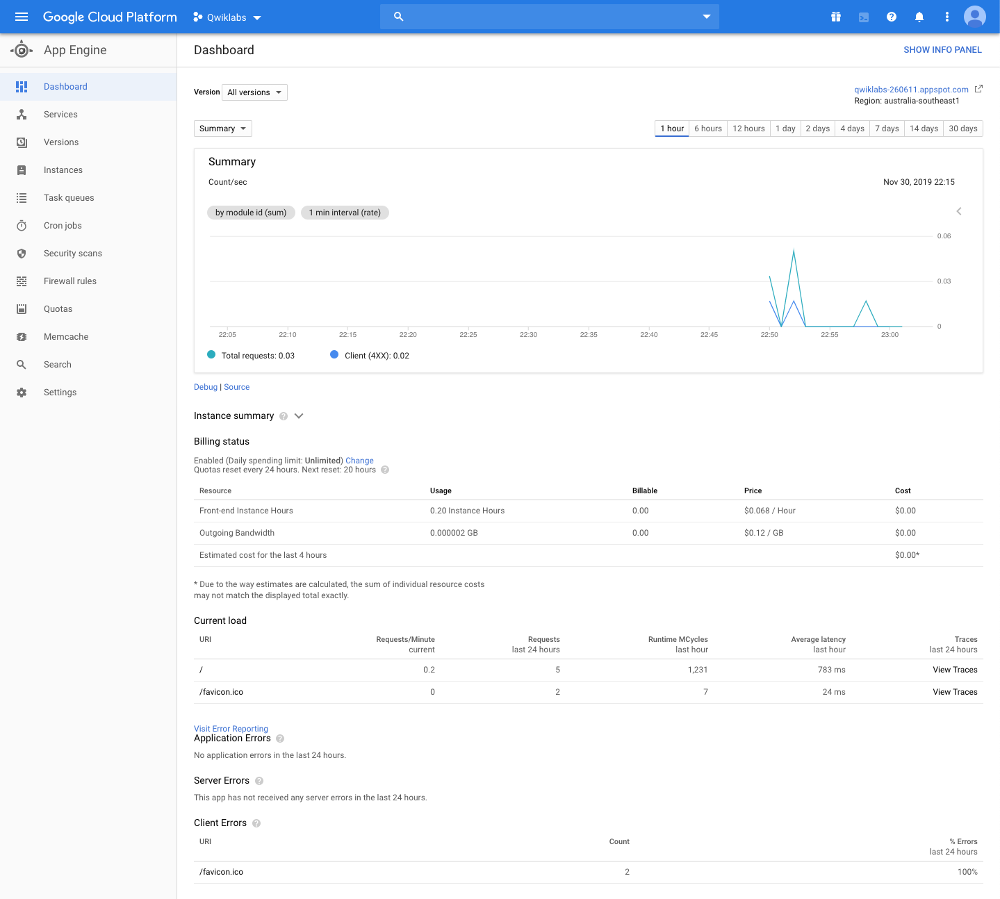
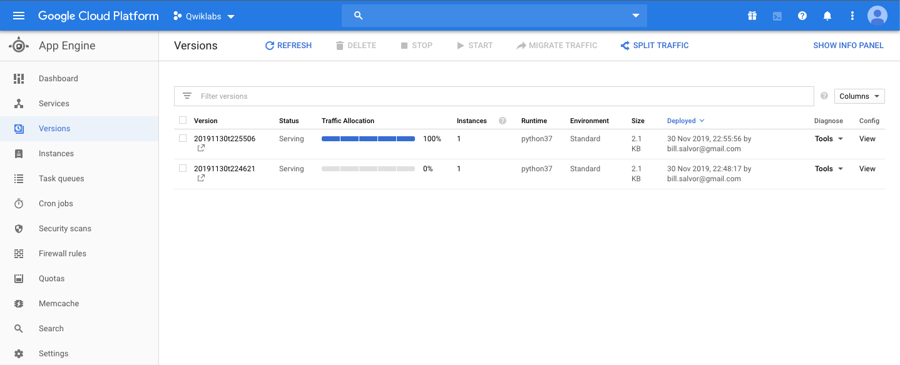
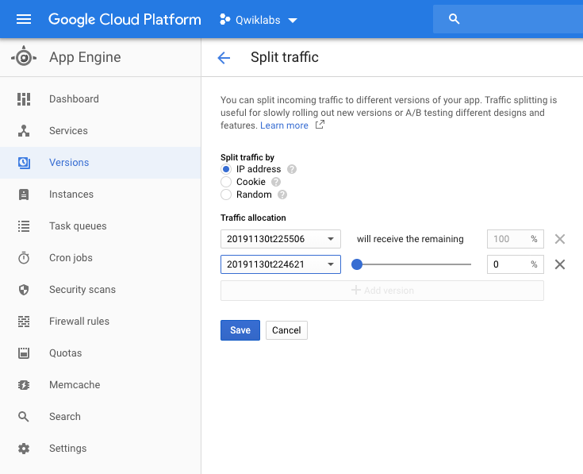
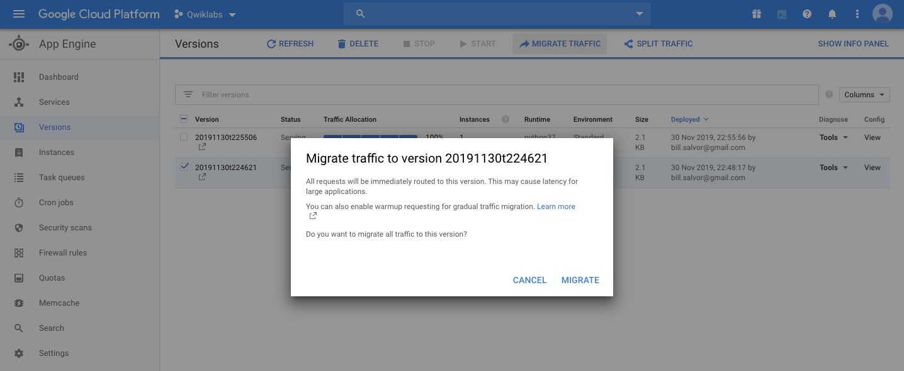

App Engine: Qwik Start - Python
===============================

Google Cloud Shell environment:

[source.console]
----
bill_salvor@cloudshell:~/python-docs-samples/appengine/standard_python37/hello_world (qwiklabs-260611)$ env | grep PATH
BASHRC_PATH=/home/bill_salvor/.bashrc
BASHRC_GOOGLE_PATH=/google/devshell/bashrc.google
GOPATH=/home/bill_salvor/gopath:/google/gopath
GEM_PATH=/home/bill_salvor/.gems:/usr/local/lib/ruby/gems/2.6.0/
PATH=/home/bill_salvor/gopath/bin:/google/gopath/bin:/google/google-cloud-sdk/bin:/usr/local/go/bin:/opt/gradle/bin:/opt/maven/bin:/usr/local/sbin:/usr/local/bin:/usr/sbin:/usr/bin:/sbin:/bin:/usr/local/nvm/versions/node/v10.14.2/bin:/google/go_appengine:/google/google_appengine
----

Test the application:

[source.console]
----
bill_salvor@cloudshell:~/python-docs-samples/appengine/standard_python37/hello_world (qwiklabs-260611)$ dev_appserver.py app.yaml
INFO     2019-11-30 11:21:32,850 devappserver2.py:231] Using Cloud Datastore Emulator.
We are gradually rolling out the emulator as the default datastore implementation of dev_appserver.
If broken, you can temporarily disable it by --support_datastore_emulator=False
Read the documentation: https://cloud.google.com/appengine/docs/standard/python/tools/migrate-cloud-datastore-emulator
Help us validate that the feature is ready by taking this survey: https://goo.gl/forms/UArIcs8K9CUSCm733
Report issues at: https://issuetracker.google.com/issues/new?component=187272
INFO     2019-11-30 11:21:32,865 devappserver2.py:285] Skipping SDK update check.
INFO     2019-11-30 11:21:33,044 datastore_emulator.py:155] Starting Cloud Datastore emulator at: http://localhost:24117
WARNING  2019-11-30 11:21:33,090 simple_search_stub.py:1196] Could not read search indexes from /tmp/appengine.None.bill_salvor/search_indexes
INFO     2019-11-30 11:21:36,499 datastore_emulator.py:161] Cloud Datastore emulator responded after 3.454906 seconds
INFO     2019-11-30 11:21:36,500 api_server.py:282] Starting API server at: http://0.0.0.0:41571
E1130 11:21:36.521525550     480 server_chttp2.cc:40]        {"created":"@1575112896.521494783","description":"Only 1 addresses added out of total 2 resolved","file":"src/core/ext/tr
ansport/chttp2/server/chttp2_server.cc","file_line":403,"referenced_errors":[{"created":"@1575112896.521489792","description":"Address family not supported by protocol","errno":97,"f
ile":"src/core/lib/iomgr/socket_utils_common_posix.cc","file_line":395,"os_error":"Address family not supported by protocol","syscall":"socket","target_address":"[::1]:33663"}]}
INFO     2019-11-30 11:21:36,522 api_server.py:272] Starting gRPC API server at: http://localhost:33663
INFO     2019-11-30 11:21:36,567 instance_factory.py:71] Detected Python 3.7.3
INFO     2019-11-30 11:21:39,950 instance_factory.py:205] Using pip to install dependency libraries; pip stdout is redirected to /tmp/tmpWzp0RZ
INFO     2019-11-30 11:21:39,952 instance_factory.py:211] Running /tmp/tmpTFImaI/bin/pip install --upgrade pip

INFO     2019-11-30 11:21:43,603 instance_factory.py:211] Running /tmp/tmpTFImaI/bin/pip install -r /tmp/tmpsF39_o

INFO     2019-11-30 11:21:46,509 dispatcher.py:263] Starting module "default" running at: http://0.0.0.0:8080
INFO     2019-11-30 11:21:46,512 admin_server.py:150] Starting admin server at: http://0.0.0.0:8000
INFO     2019-11-30 11:21:47,515 instance.py:557] Detected GOOGLE_CLOUD_PROJECT=qwiklabs-260611 in environment variables
[2019-11-30 11:21:47 +0000] [543] [INFO] Starting gunicorn 20.0.4
[2019-11-30 11:21:47 +0000] [543] [INFO] Listening at: http://0.0.0.0:18208 (543)
[2019-11-30 11:21:47 +0000] [543] [INFO] Using worker: sync
[2019-11-30 11:21:47 +0000] [547] [INFO] Booting worker with pid: 547
INFO     2019-11-30 11:21:48,529 instance.py:294] Instance PID: 543
INFO     2019-11-30 11:40:45,577 module.py:861] default: "GET /?environment_id=default HTTP/1.1" 200 12
INFO     2019-11-30 11:40:46,098 instance.py:557] Detected GOOGLE_CLOUD_PROJECT=qwiklabs-260611 in environment variables
[2019-11-30 11:40:46 +0000] [715] [INFO] Starting gunicorn 20.0.4
[2019-11-30 11:40:46 +0000] [715] [INFO] Listening at: http://0.0.0.0:24422 (715)
[2019-11-30 11:40:46 +0000] [715] [INFO] Using worker: sync
[2019-11-30 11:40:46 +0000] [719] [INFO] Booting worker with pid: 719
INFO     2019-11-30 11:40:46,932 module.py:861] default: "GET /favicon.ico HTTP/1.1" 404 232
INFO     2019-11-30 11:40:47,118 instance.py:294] Instance PID: 715
----

References
----------
