Data Engineering
================

**Classify Images with Pre-built ML Models using Cloud Vision API and AutoML**

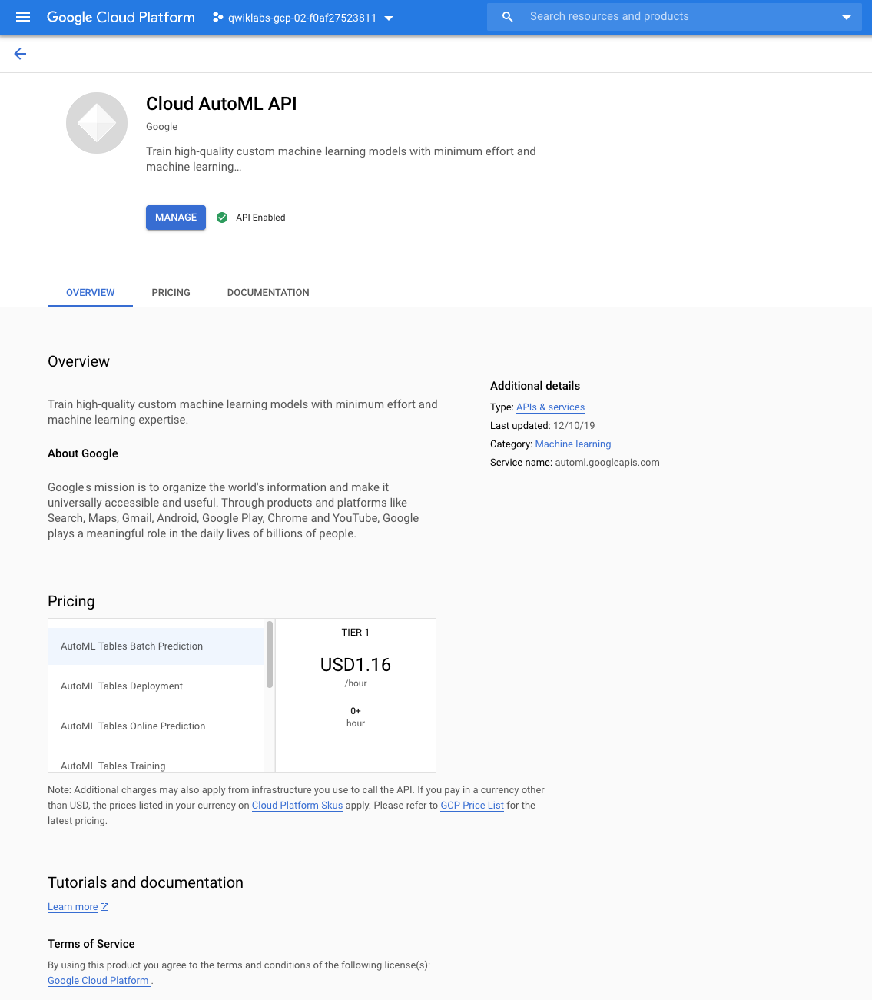

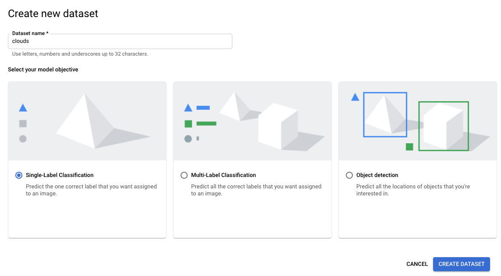

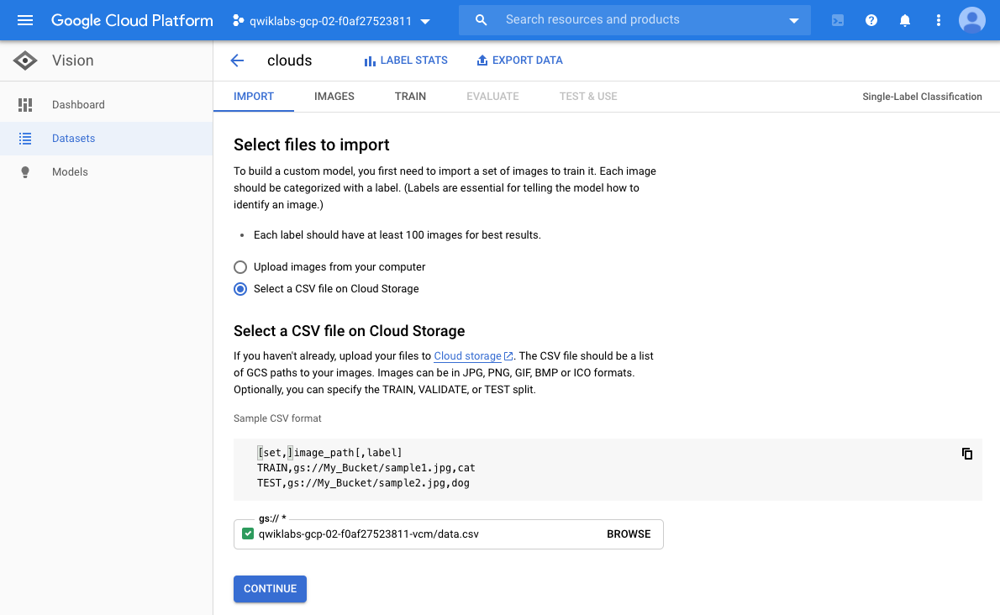

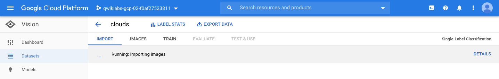

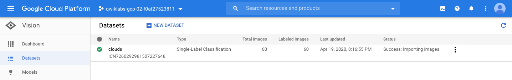

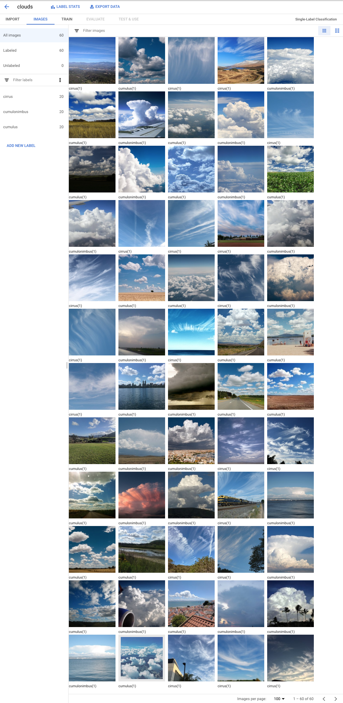

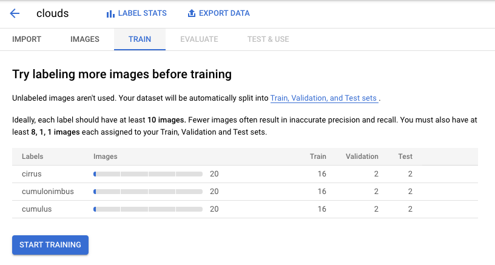

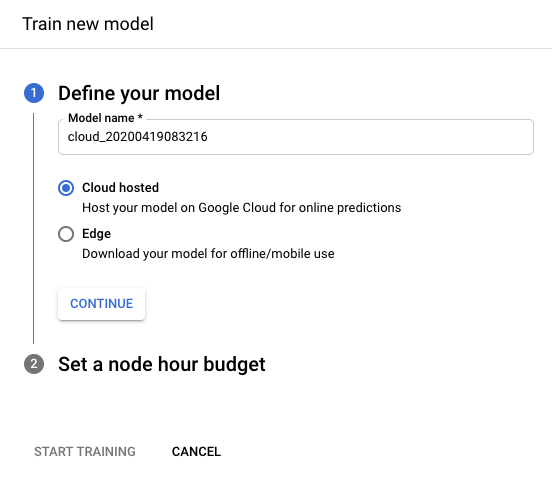

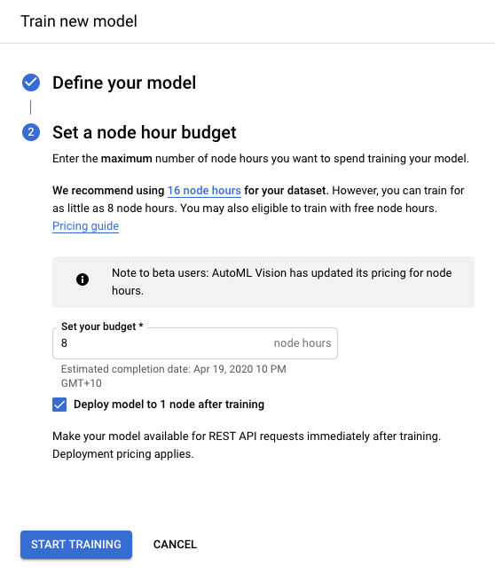

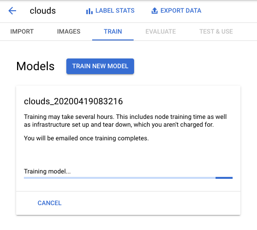

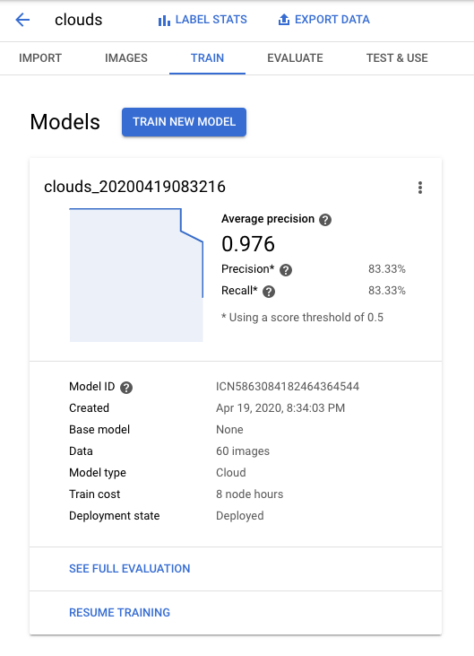

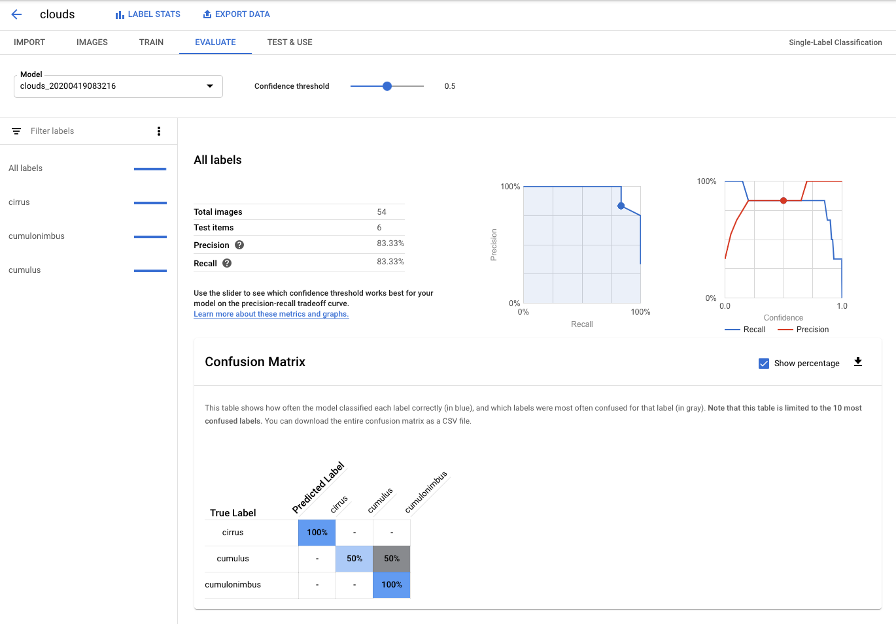

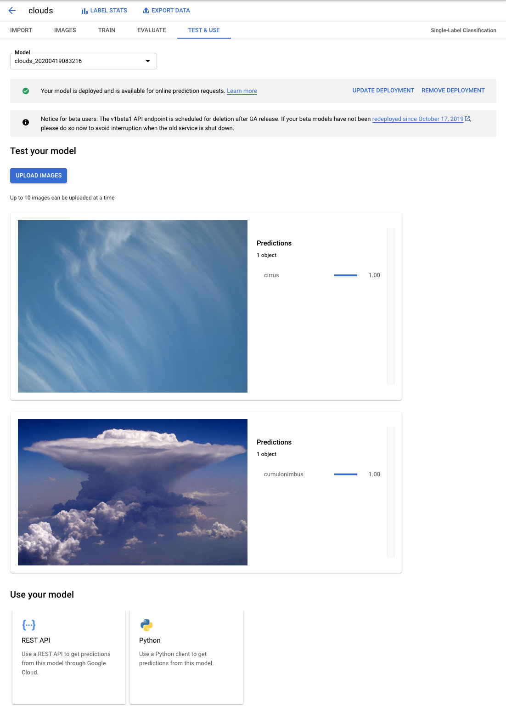

References
----------

- Data Engineering, _https://google.qwiklabs.com/quests/25_
- Classify Images with Pre-built ML Models using Cloud Vision API and AutoML, _https://googlecoursera.qwiklabs.com/focuses/31821_