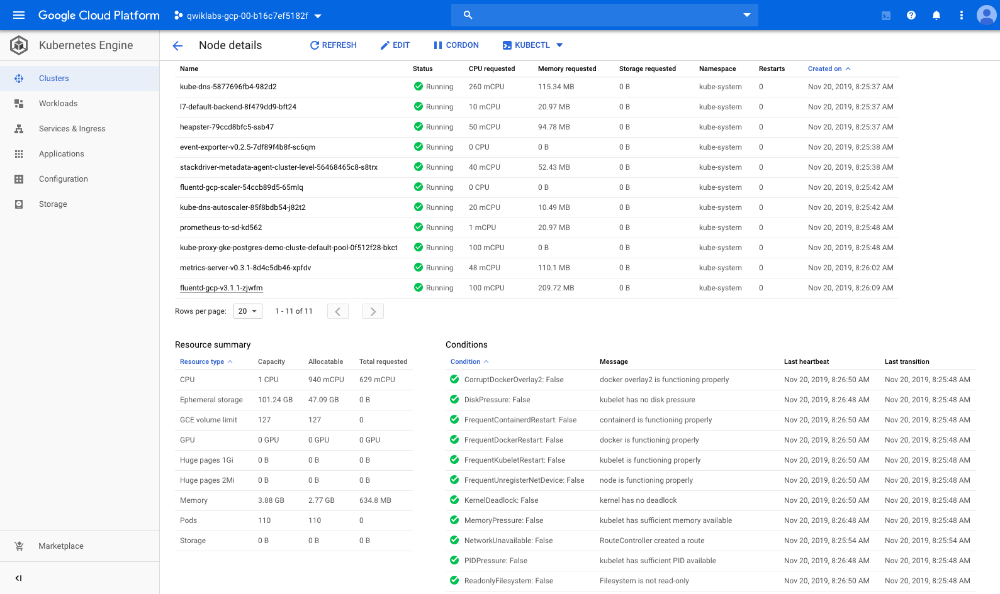
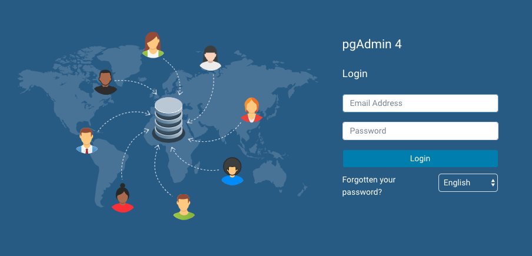
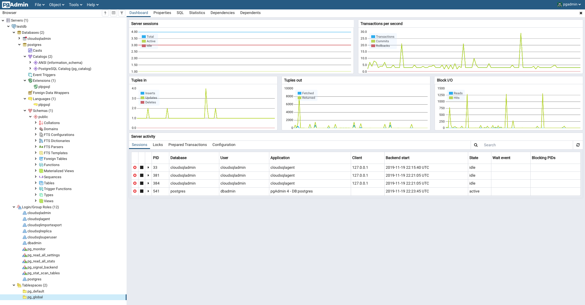

Google Kubernetes Engine Best Practices
=======================================

**Connect to Cloud SQL from an Application in Kubernetes Engine**

References
----------

- Google Kubernetes Engine Best Practices, _https://google.qwiklabs.com/quests/63_
- Connect to Cloud SQL from an Application in Kubernetes Engine, _https://google.qwiklabs.com/focuses/5625?parent=catalog_