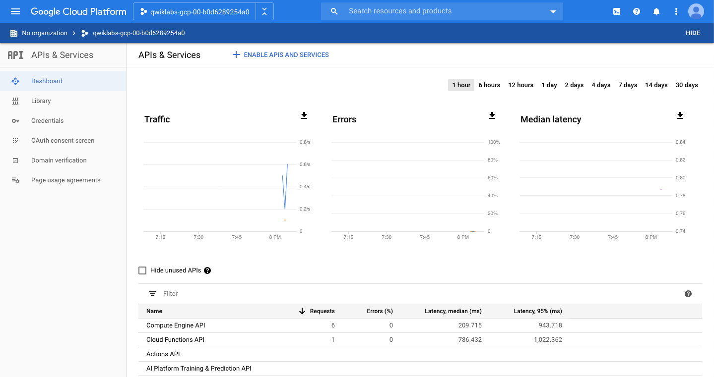
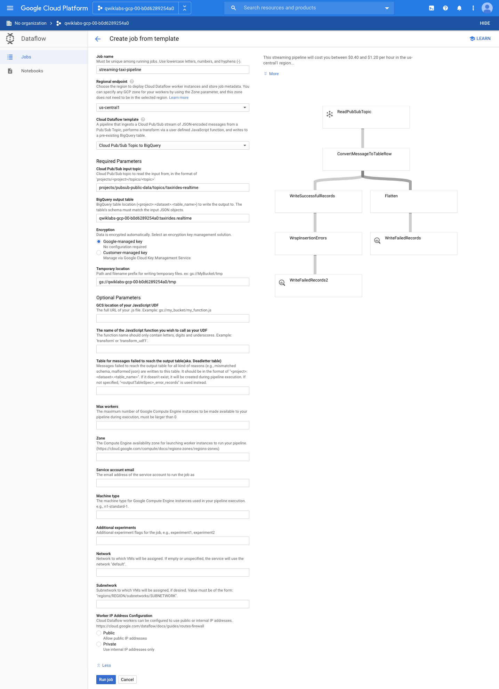
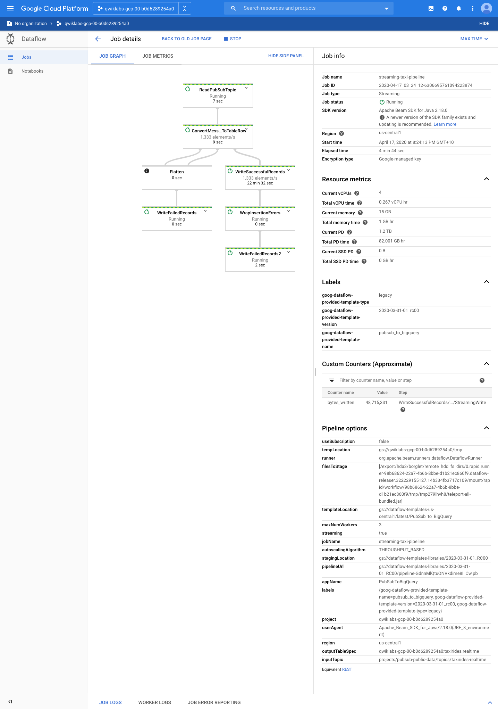
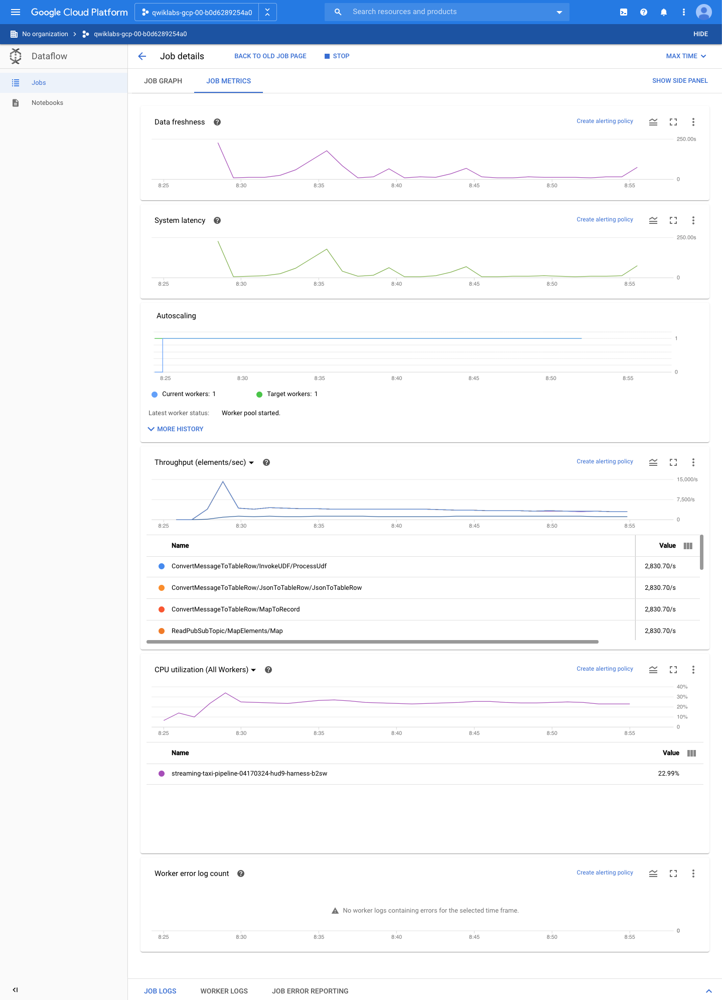
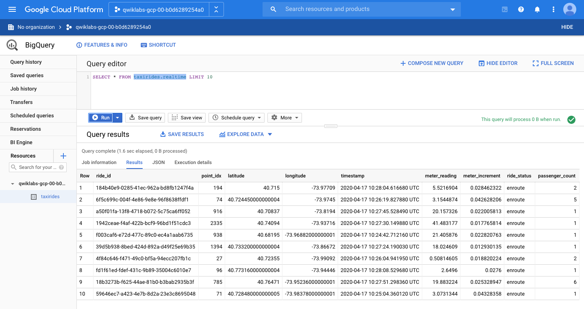
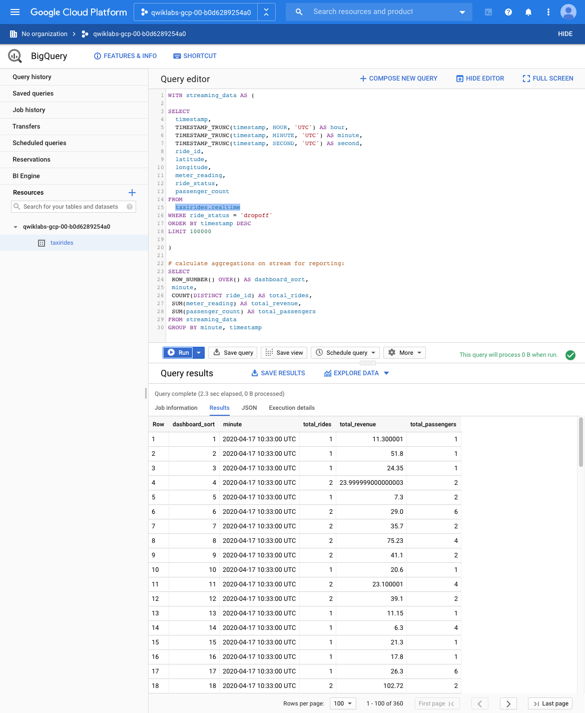
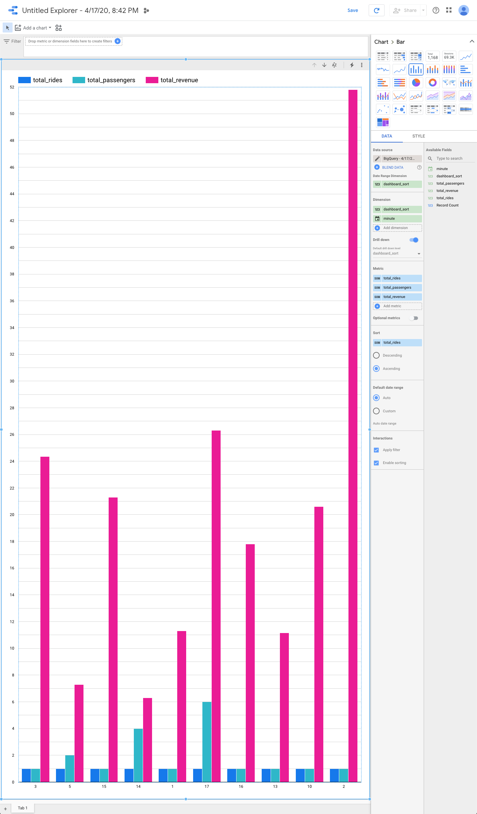
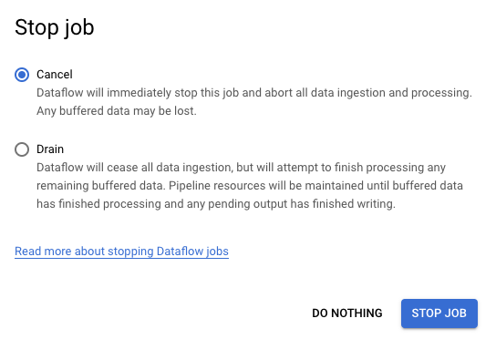

Data Engineering
================

**Create a Streaming Data Pipeline for a Real-Time Dashboard with Cloud Dataflow**

References
----------

- Data Engineering, _https://google.qwiklabs.com/quests/25_
- Create a Streaming Data Pipeline for a Real-Time Dashboard with Cloud Dataflow, _https://googlecoursera.qwiklabs.com/focuses/31820_