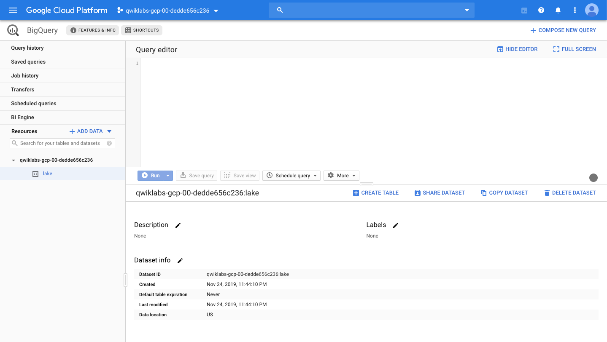
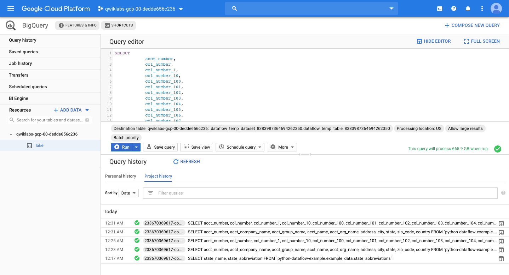
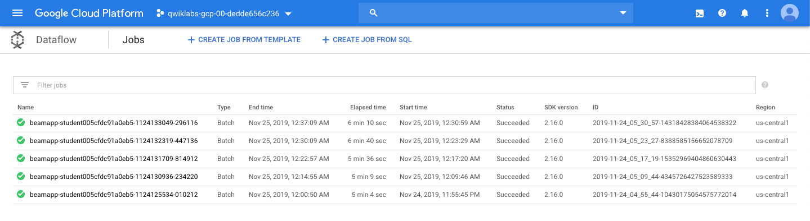
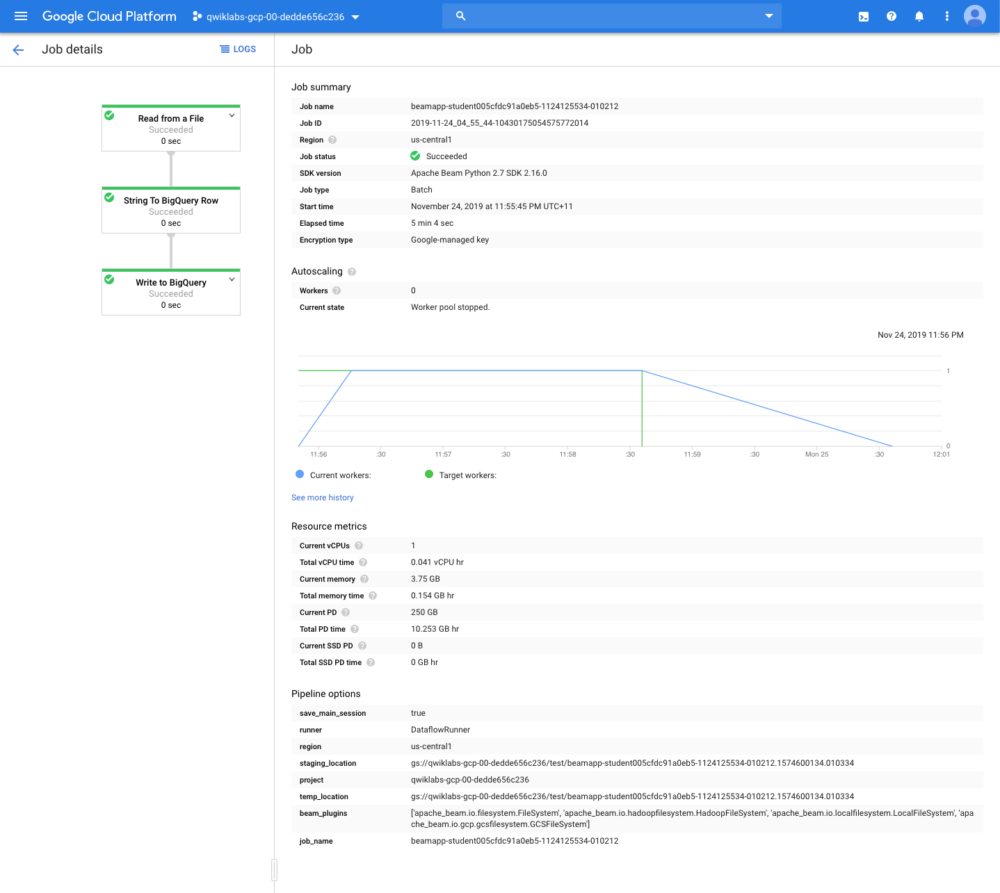
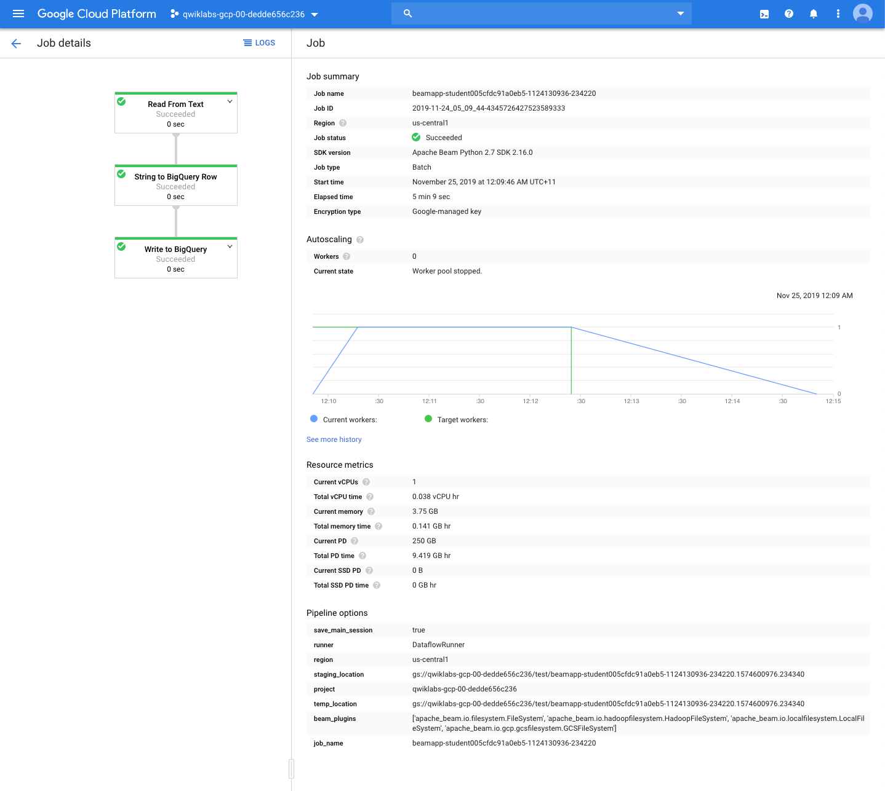
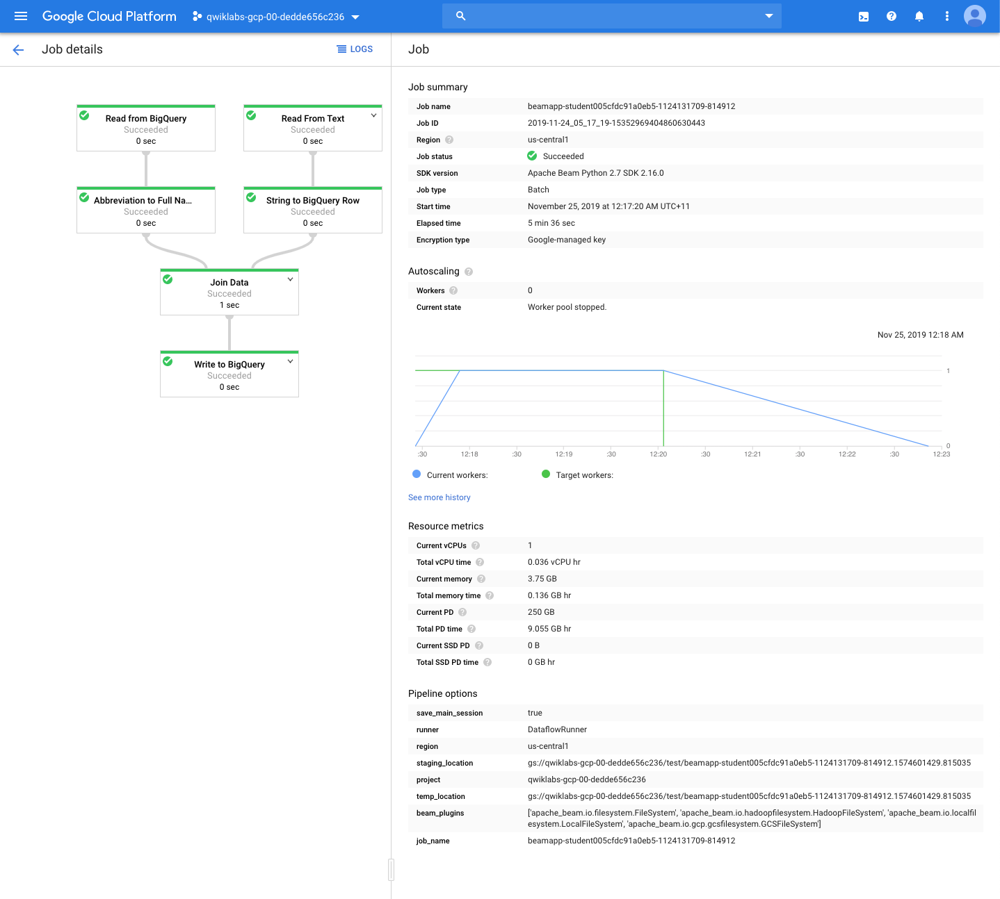
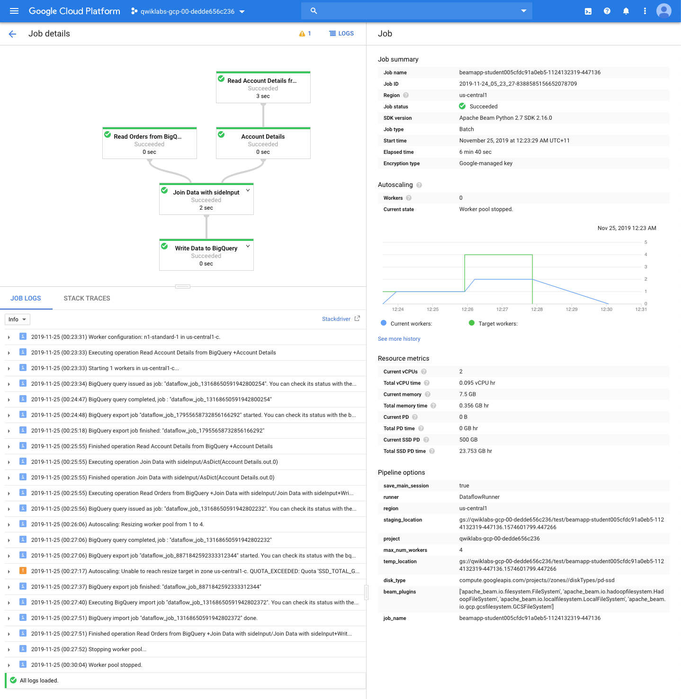
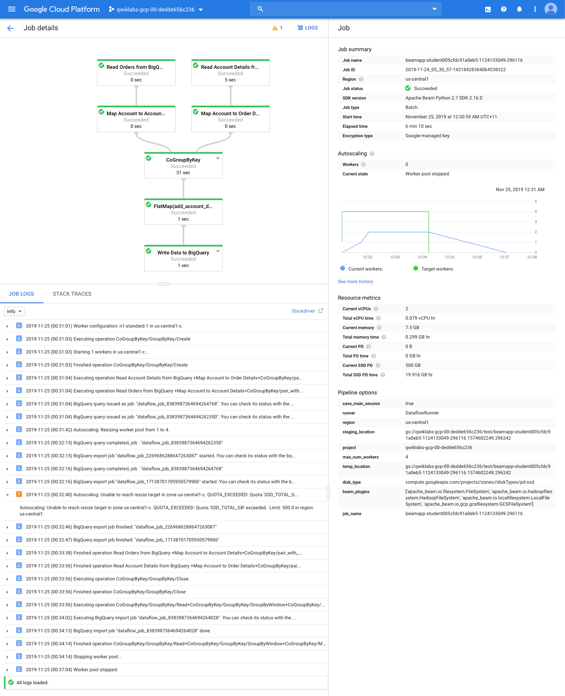
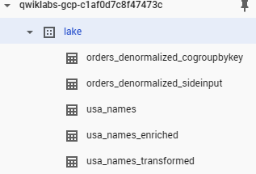

Data Engineering
================

**ETL Processing on GCP Using Dataflow and BigQuery**

References
----------

- Data Engineering, _https://google.qwiklabs.com/quests/25_
- ETL Processing on GCP Using Dataflow and BigQuery, _https://google.qwiklabs.com/focuses/3460?parent=catalog_