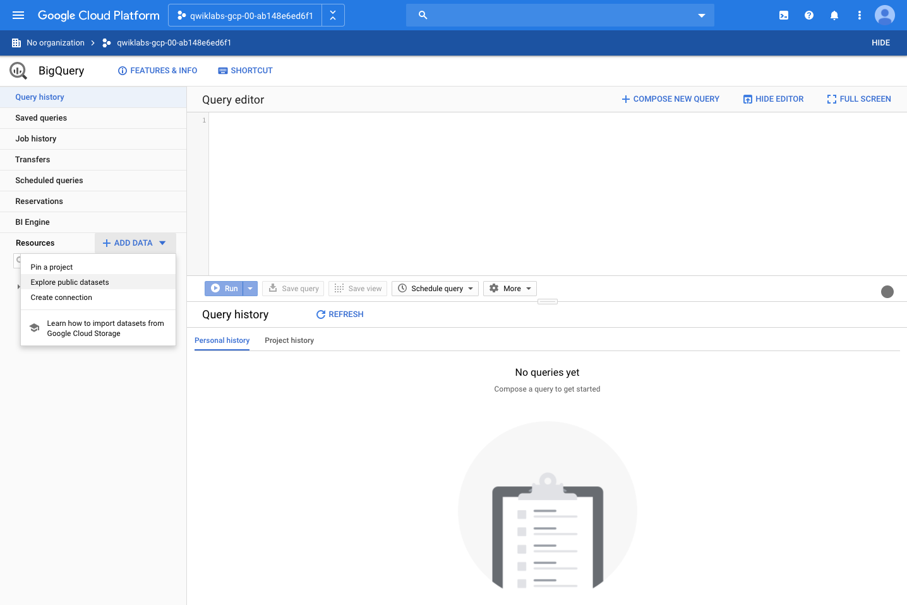
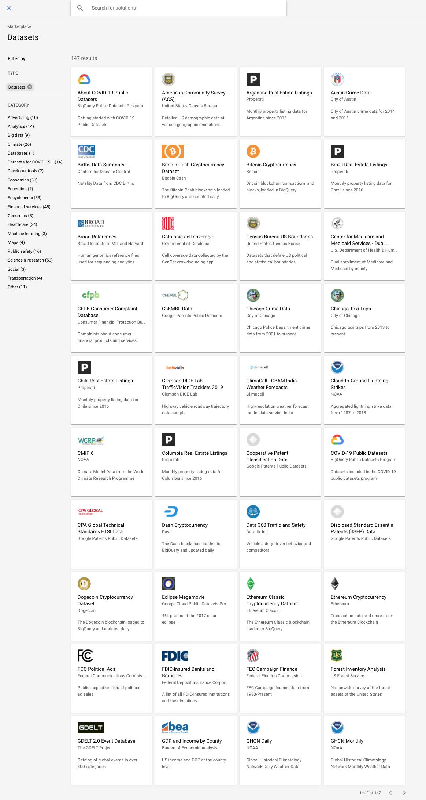
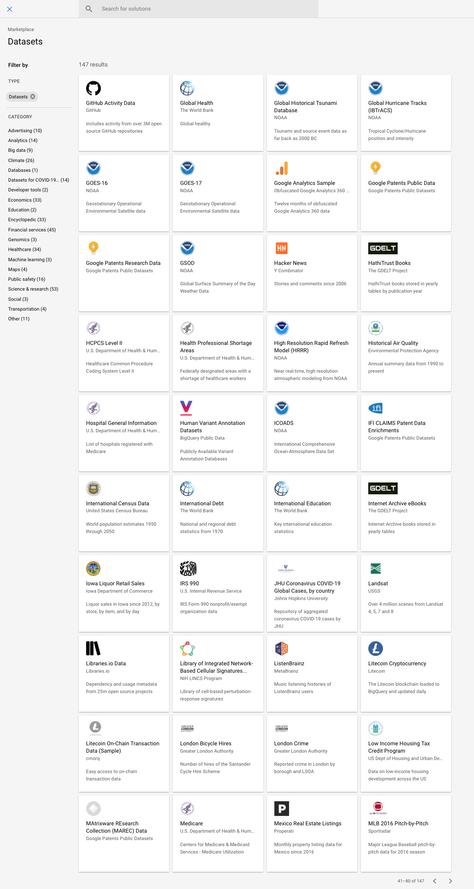
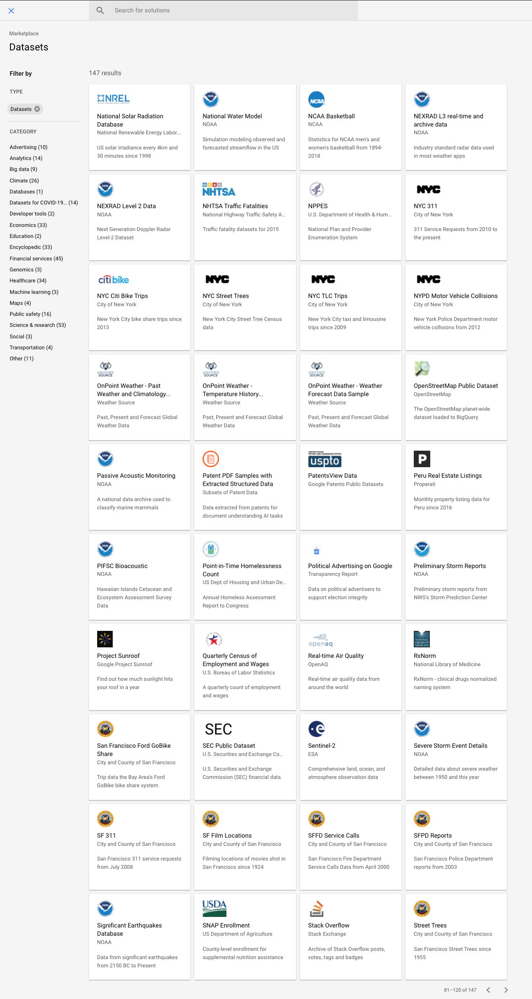
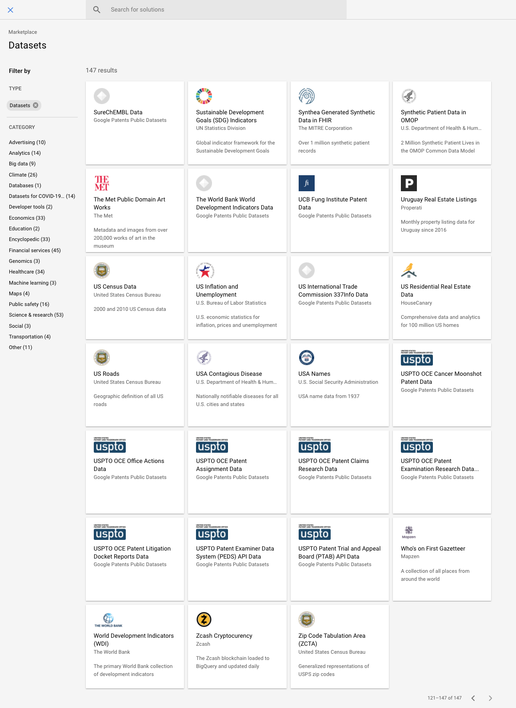
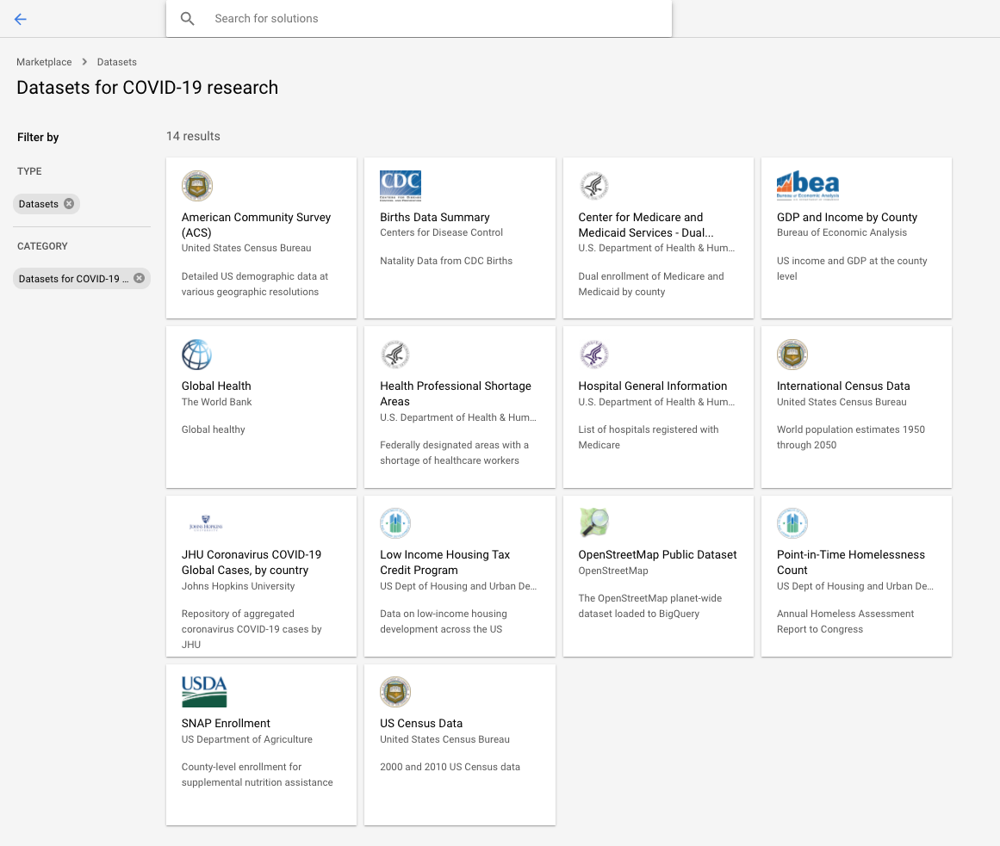
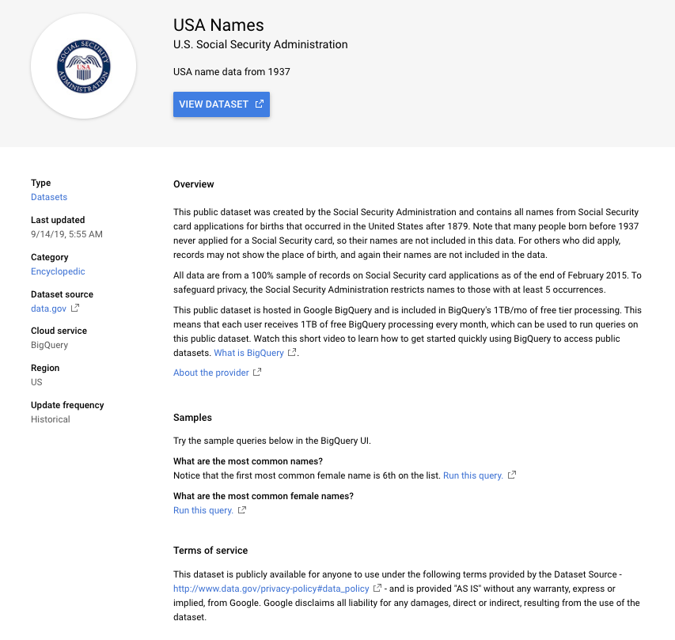

Explore a BigQuery Public Dataset
=================================

- BigQuery window

- Public Datasets

References
----------

- Explore a BigQuery Public Dataset, _https://googlecoursera.qwiklabs.com/focuses/31817_