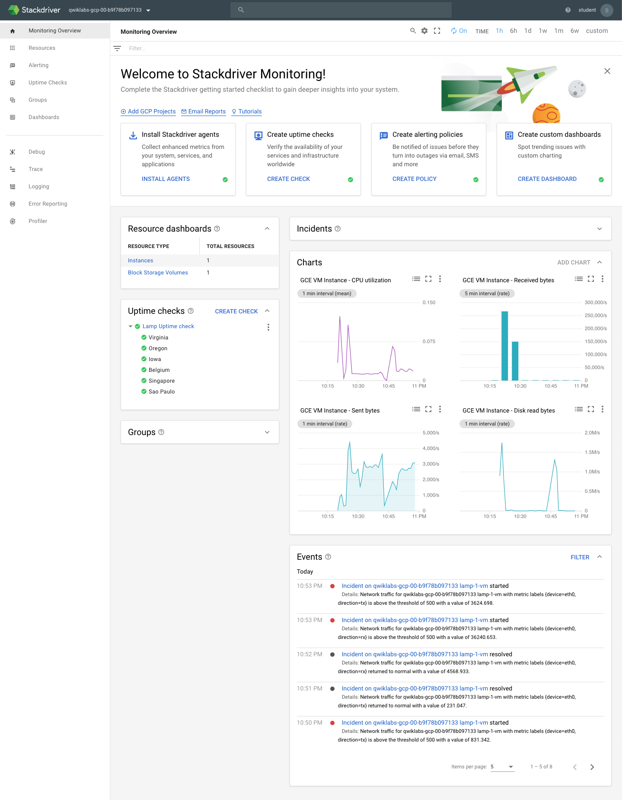

Baseline: Infrastructure
========================

**Stackdriver: Qwik Start**

References
----------

- Baseline: Infrastructure, _https://google.qwiklabs.com/quests/33_
- Stackdriver: Qwik Start, _https://google.qwiklabs.com/focuses/858?parent=catalog_