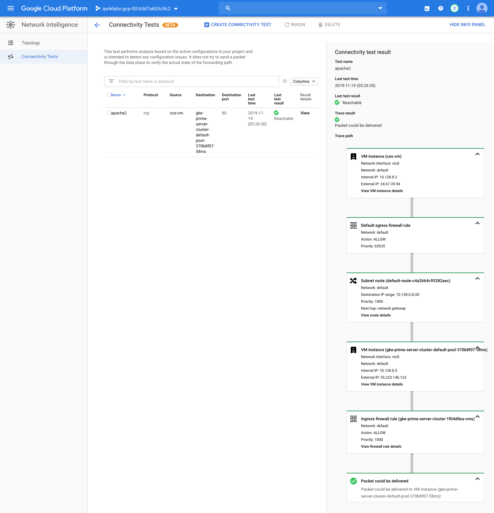

Google Kubernetes Engine Best Practices
=======================================

**GKE Migrating to Containers**

References
----------

- Google Kubernetes Engine Best Practices, _https://google.qwiklabs.com/quests/63_
- GKE Migrating to Containers, _https://google.qwiklabs.com/focuses/5155?parent=catalog_