GCP Architecture
================

**Google Cloud Essential Skills: Challenge Lab**

Create a Compute Engine VM instance
-----------------------------------

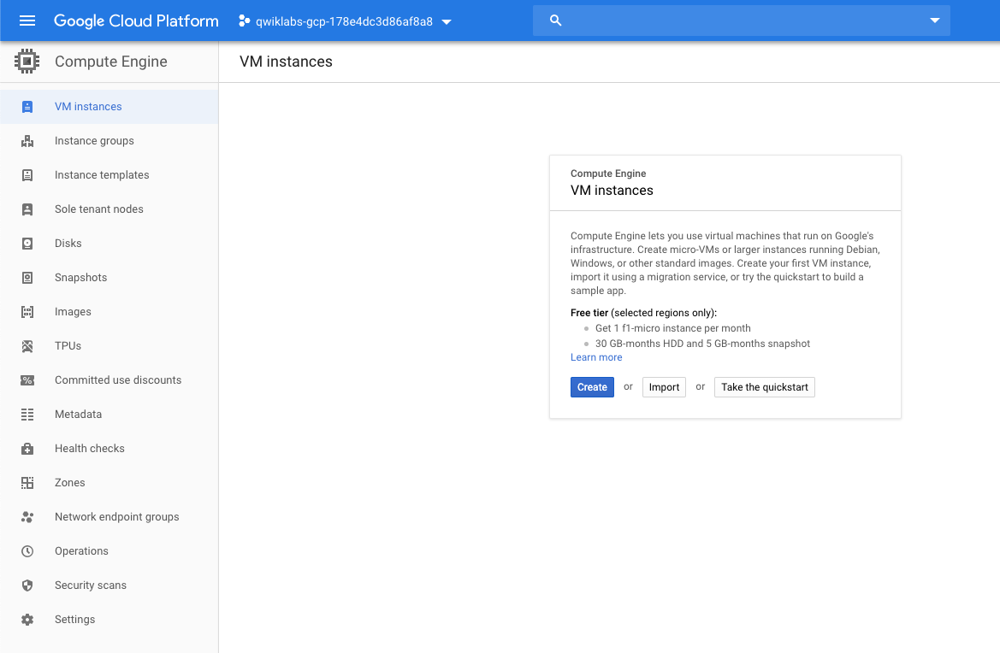

with instance options

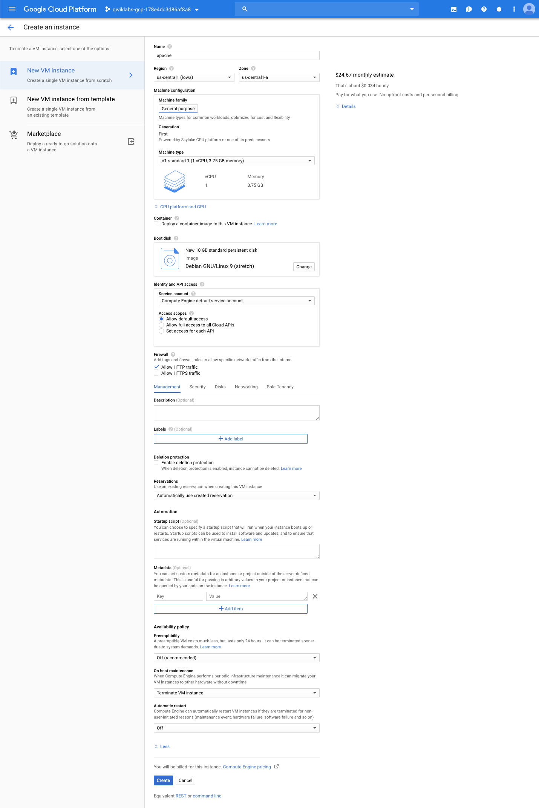

with security options

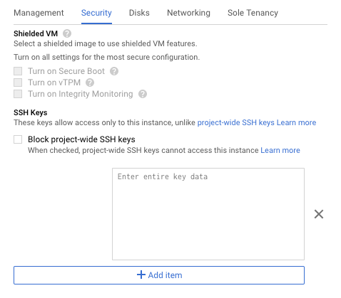

with disks options

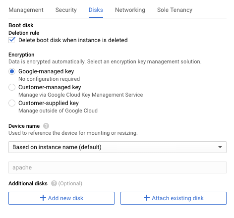

with networking options

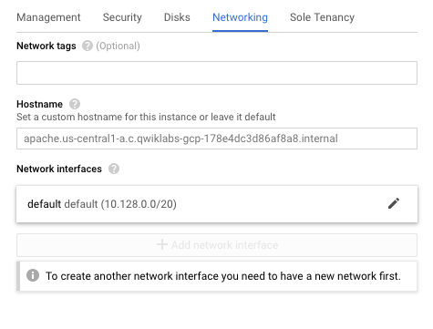

with sole tenancy

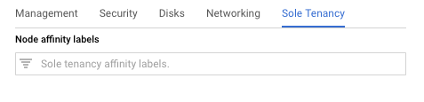

Compute Engine VM instance
--------------------------

Compute Engine -> VM instances

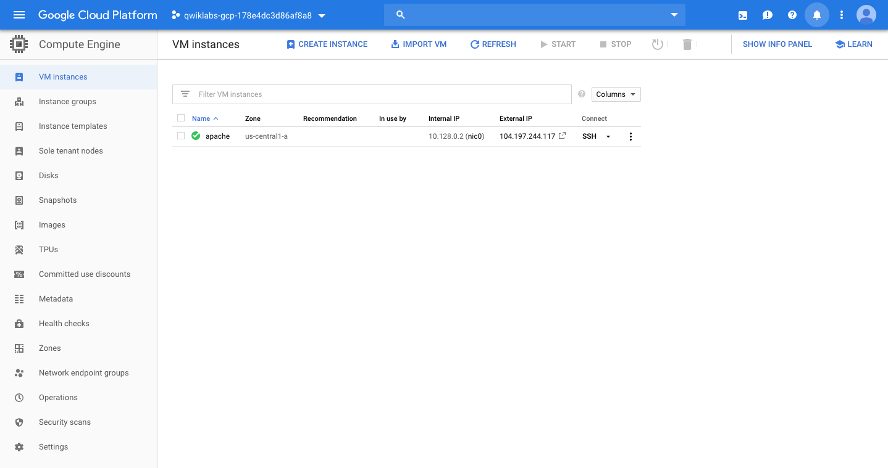

Compute Engine -> Disks

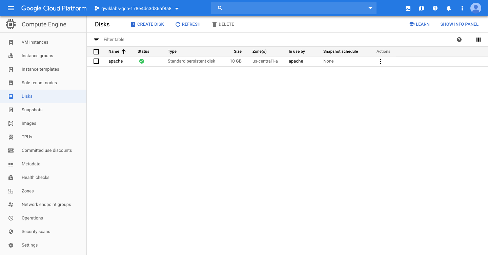

Compute Engine -> Metadata

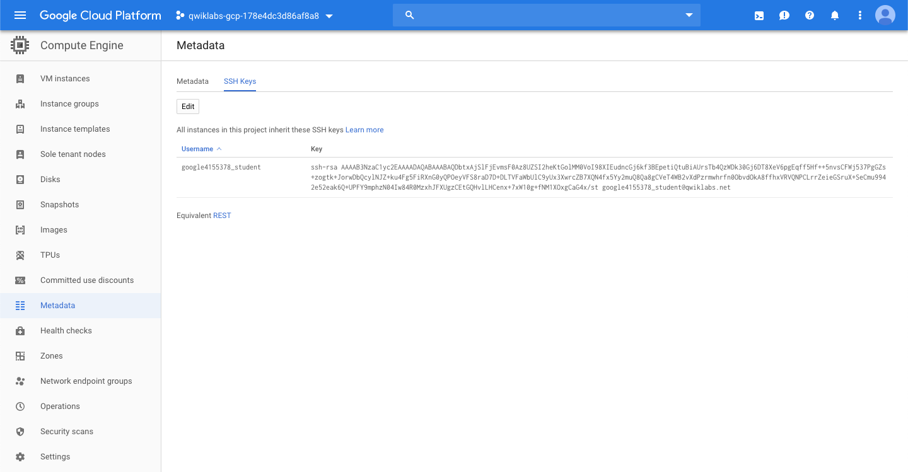

Compute Engine -> Operations

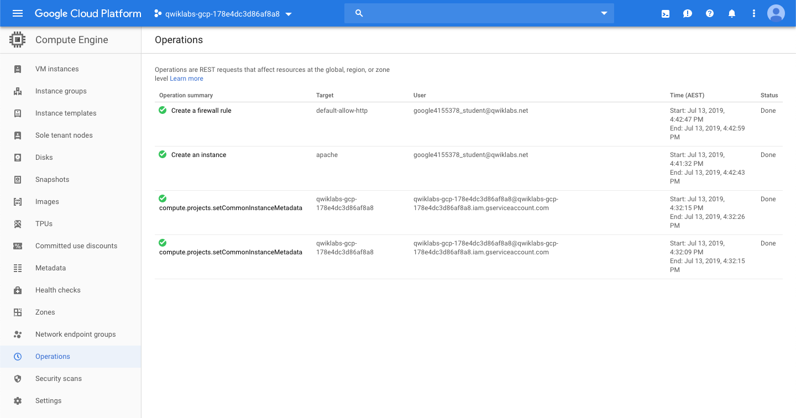

Update Linux
------------

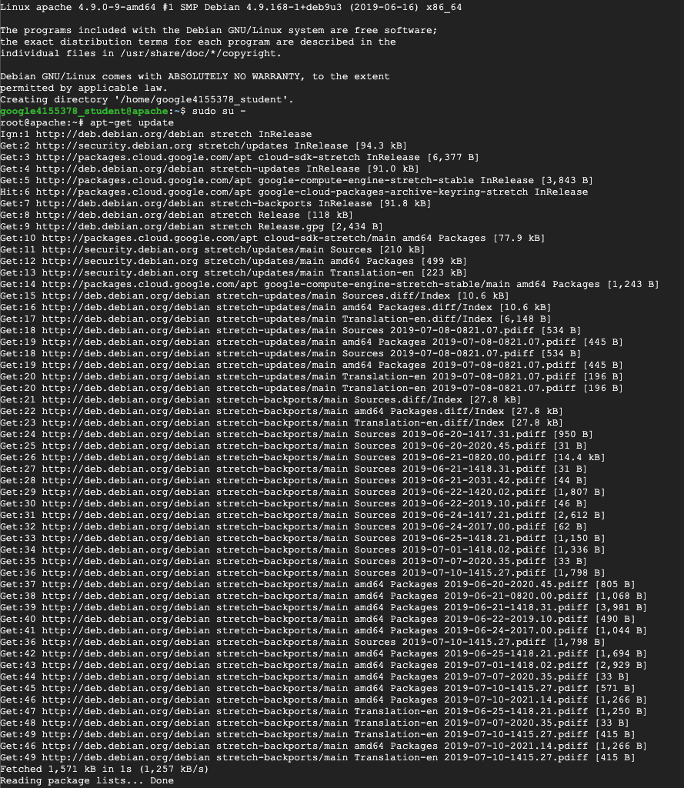

Install Apache2
---------------

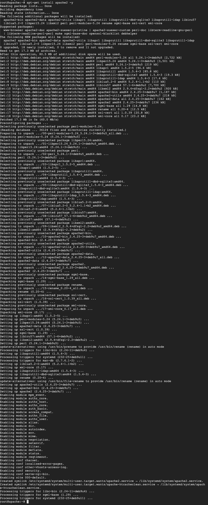

Monitoring
----------

VM instances monitoring

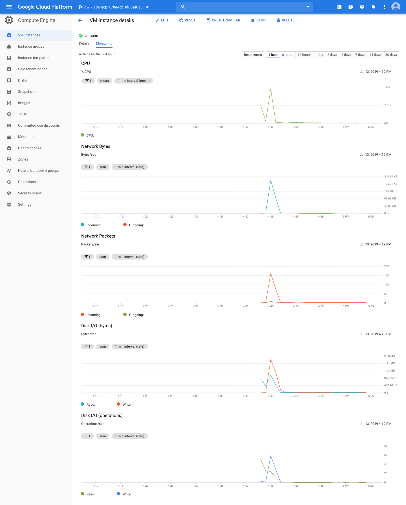

Linux System boot log

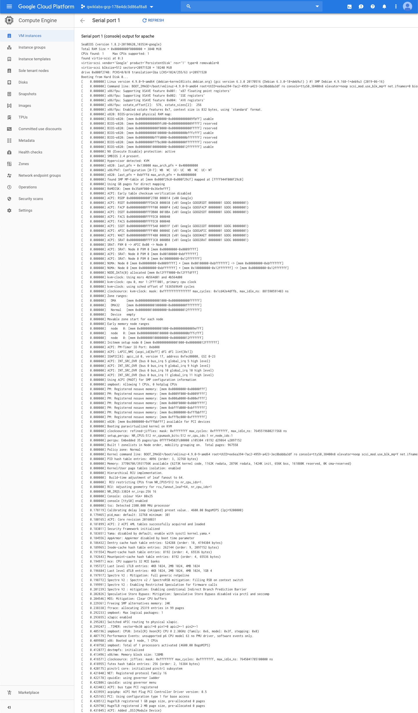

Networking
----------

VPC networks

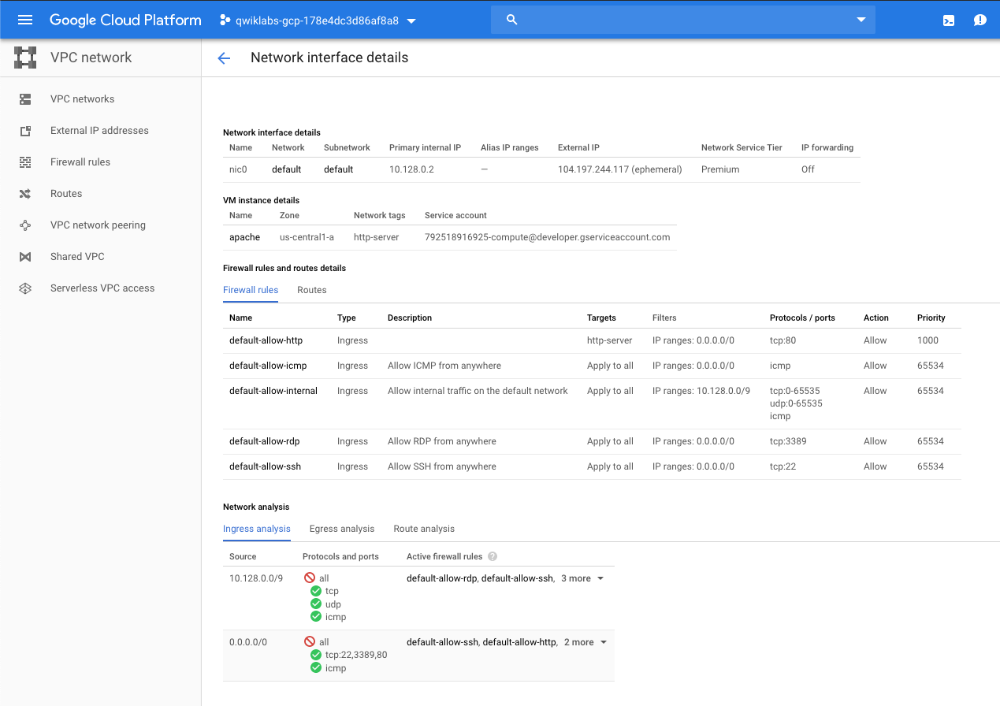

Routes

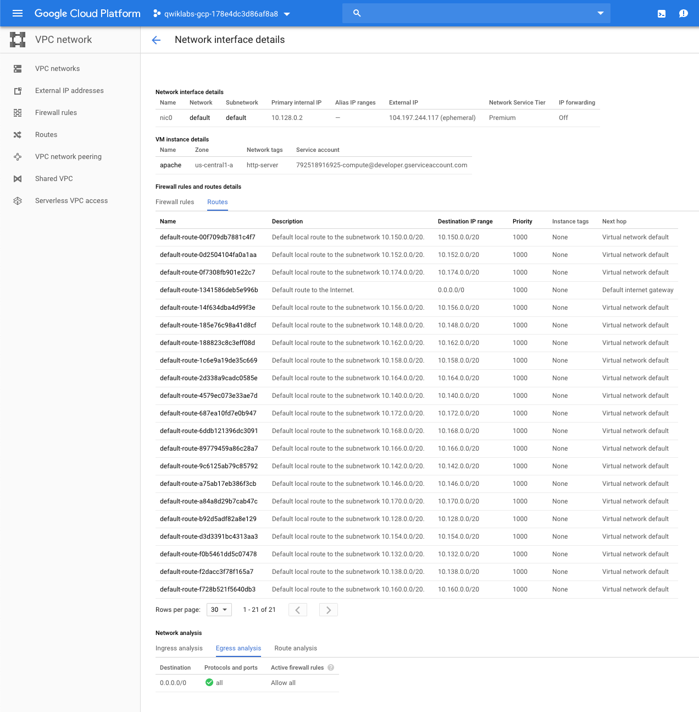

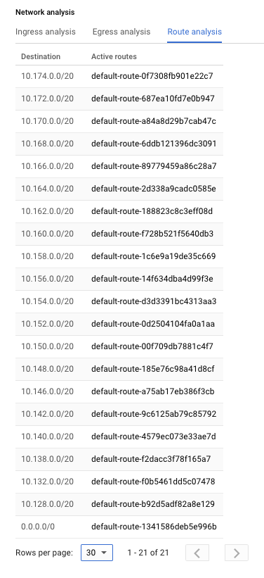

References
----------

- Google Cloud Training - Challenge: GCP Architecture, _https://google.qwiklabs.com/quests/47_
- Google Cloud Essential Skills: Challenge Lab, _https://google.qwiklabs.com/focuses/6159?parent=catalog_