Cloud Architecture
==================

Continuous Delivery with Jenkins in Kubernetes Engine

image::https://cdn.qwiklabs.com/1b%2B9D20QnfRjAF8c6xlXmexot7TDcOsYzsRwp%2FH4ErE%3D[Continuous Delivery with Jenkins]

Clone Repository
----------------

[source.console]
----
$ gcloud config set compute/zone us-central1-f
Updated property [compute/zone].

$ git clone https://github.com/GoogleCloudPlatform/continuous-deployment-on-kubernetes.git
Cloning into 'continuous-deployment-on-kubernetes'...
remote: Enumerating objects: 8, done.
remote: Counting objects: 100% (8/8), done.
remote: Compressing objects: 100% (4/4), done.
remote: Total 830 (delta 2), reused 6 (delta 2), pack-reused 822
Receiving objects: 100% (830/830), 1.15 MiB | 455.00 KiB/s, done.
Resolving deltas: 100% (404/404), done.

$ cd continuous-deployment-on-kubernetes
----

Install Google Service Account Credentials version 7.0 and Google Source version 0.3 Jenkins plugins:

[source.console]
----
$ cd jenkins

$ cat values.yaml
Master:
  InstallPlugins:
    - kubernetes:latest
    - workflow-job:latest
    - workflow-aggregator:latest
    - credentials-binding:latest
    - git:latest
    - google-oauth-plugin:0.7
    - google-source-plugin:0.3
  Cpu: "1"
  Memory: "3500Mi"
  JavaOpts: "-Xms3500m -Xmx3500m"
  ServiceType: ClusterIP
Agent:
  Enabled: true
  resources:
    requests:
      cpu: "500m"
      memory: "256Mi"
    limits:
      cpu: "1"
      memory: "512Mi"
Persistence:
  Size: 100Gi
NetworkPolicy:
  ApiVersion: networking.k8s.io/v1
rbac:
  install: true
  serviceAccountName: cd-jenkins

$ cd ..
----

Provisioning Jenkins
--------------------

Creating a Kubernetes cluster. The extra scopes enable Jenkins to access Cloud Source Repositories and Google Container Registry.

[source.console]
----
$ gcloud container clusters create jenkins-cd \
        --num-nodes 2 \
        --machine-type n1-standard-2 \
        --scopes "https://www.googleapis.com/auth/projecthosting,cloud-platform"
This will enable the autorepair feature for nodes. Please see https://cloud.google.com/kubernetes-engine/docs/node-auto-repair for more information on node autorepairs.
Creating cluster jenkins-cd in us-central1-f... Cluster is being health-checked (master is healthy)...done.
Created [https://container.googleapis.com/v1/projects/qwiklabs-gcp-025799fb082fa267/zones/us-central1-f/clusters/jenkins-cd].
To inspect the contents of your cluster, go to: https://console.cloud.google.com/kubernetes/workload_/gcloud/us-central1-f/jenkins-cd?project=qwiklabs-gcp-025799fb082fa267
kubeconfig entry generated for jenkins-cd.
NAME        LOCATION       MASTER_VERSION  MASTER_IP       MACHINE_TYPE   NODE_VERSION   NUM_NODES  STATUS
jenkins-cd  us-central1-f  1.12.8-gke.10   104.197.42.240  n1-standard-2  1.12.8-gke.10  2          RUNNING

$ gcloud container clusters list
NAME        LOCATION       MASTER_VERSION  MASTER_IP       MACHINE_TYPE   NODE_VERSION   NUM_NODES  STATUS
jenkins-cd  us-central1-f  1.12.8-gke.10   104.197.42.240  n1-standard-2  1.12.8-gke.10  2          RUNNING
----

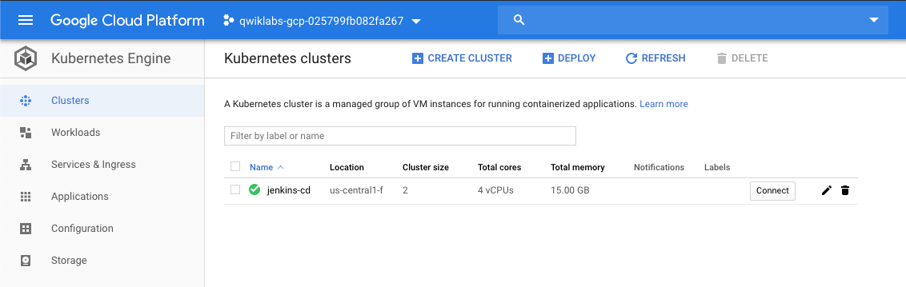

Get the credentials for your cluster. Kubernetes Engine uses these credentials to access your newly provisioned cluster.

[source.console]
----
$ gcloud container clusters get-credentials jenkins-cd
Fetching cluster endpoint and auth data.
kubeconfig entry generated for jenkins-cd.

$ kubectl cluster-info
Kubernetes master is running at https://104.197.42.240
GLBCDefaultBackend is running at https://104.197.42.240/api/v1/namespaces/kube-system/services/default-http-backend:http/proxy
Heapster is running at https://104.197.42.240/api/v1/namespaces/kube-system/services/heapster/proxy
KubeDNS is running at https://104.197.42.240/api/v1/namespaces/kube-system/services/kube-dns:dns/proxy
Metrics-server is running at https://104.197.42.240/api/v1/namespaces/kube-system/services/https:metrics-server:/proxy
----

To further debug and diagnose cluster problems, use 'kubectl cluster-info dump'.

Install Helm
------------

Helm is a package manager that makes it easy to configure and deploy Kubernetes applications.

[source.console]
----
$ wget https://storage.googleapis.com/kubernetes-helm/helm-v2.9.1-linux-amd64.tar.gz
--2019-06-30 20:54:20--  https://storage.googleapis.com/kubernetes-helm/helm-v2.9.1-linux-amd64.tar.gz
Resolving storage.googleapis.com (storage.googleapis.com)... 172.217.194.128, 2404:6800:4003:c03::80
Connecting to storage.googleapis.com (storage.googleapis.com)|172.217.194.128|:443... connected.
HTTP request sent, awaiting response... 200 OK
Length: 9160761 (8.7M) [application/x-tar]
Saving to: ‘helm-v2.9.1-linux-amd64.tar.gz’

helm-v2.9.1-linux-amd64.tar.gz                100%[===============================================================================================>]   8.74M  26.3MB/s    in 0.3s

2019-06-30 20:54:21 (26.3 MB/s) - ‘helm-v2.9.1-linux-amd64.tar.gz’ saved [9160761/9160761]

$ tar zxfv helm-v2.9.1-linux-amd64.tar.gz

$ cp linux-amd64/helm .
----

Add yourself as a cluster administrator in the cluster's RBAC (Role-Based Access Control) so that you can give Jenkins permissions in the cluster:

[source.console]
----
$ kubectl create clusterrolebinding cluster-admin-binding --clusterrole=cluster-admin --user=$(gcloud config get-value account)
Your active configuration is: [cloudshell-20944]
clusterrolebinding.rbac.authorization.k8s.io/cluster-admin-binding created
----

Grant Tiller, the server side of Helm (the client side of Helm is Helm), the cluster-admin role in your cluster:

[source.console]
----
$ kubectl create serviceaccount tiller --namespace kube-system
serviceaccount/tiller created

$ kubectl create clusterrolebinding tiller-admin-binding --clusterrole=cluster-admin --serviceaccount=kube-system:tiller
clusterrolebinding.rbac.authorization.k8s.io/tiller-admin-binding created
----

Initialize Helm. This ensures that the server side of Helm (Tiller) is properly installed in your cluster.

[source.console]
----
$ ./helm init --service-account=tiller
Creating /home/google3977749_student/.helm
Creating /home/google3977749_student/.helm/repository
Creating /home/google3977749_student/.helm/repository/cache
Creating /home/google3977749_student/.helm/repository/local
Creating /home/google3977749_student/.helm/plugins
Creating /home/google3977749_student/.helm/starters
Creating /home/google3977749_student/.helm/cache/archive
Creating /home/google3977749_student/.helm/repository/repositories.yaml
Adding stable repo with URL: https://kubernetes-charts.storage.googleapis.com
Adding local repo with URL: http://127.0.0.1:8879/charts
$HELM_HOME has been configured at /home/google3977749_student/.helm.

Tiller (the Helm server-side component) has been installed into your Kubernetes Cluster.

Please note: by default, Tiller is deployed with an insecure 'allow unauthenticated users' policy.
For more information on securing your installation see: https://docs.helm.sh/using_helm/#securing-your-helm-installation
Happy Helming!

$ ./helm update
Command "update" is deprecated, use 'helm repo update'

Hang tight while we grab the latest from your chart repositories...
...Skip local chart repository
...Successfully got an update from the "stable" chart repository
Update Complete. ⎈ Happy Helming!⎈

$ ./helm version
Client: &version.Version{SemVer:"v2.9.1", GitCommit:"20adb27c7c5868466912eebdf6664e7390ebe710", GitTreeState:"clean"}
Server: &version.Version{SemVer:"v2.9.1", GitCommit:"20adb27c7c5868466912eebdf6664e7390ebe710", GitTreeState:"clean"}
----

Configure and Install Jenkins
-----------------------------

[source.console]
----
$ ./helm install -n cd stable/jenkins -f jenkins/values.yaml --version 0.16.6 --wait
NAME:   cd
LAST DEPLOYED: Sun Jun 30 20:59:25 2019
NAMESPACE: default
STATUS: DEPLOYED
RESOURCES:
==> v1/Service
NAME              TYPE       CLUSTER-IP  EXTERNAL-IP  PORT(S)    AGE
cd-jenkins-agent  ClusterIP  10.0.14.49  <none>       50000/TCP  6s
cd-jenkins        ClusterIP  10.0.9.101  <none>       8080/TCP   6s
==> v1beta1/Deployment
NAME        DESIRED  CURRENT  UP-TO-DATE  AVAILABLE  AGE
cd-jenkins  1        1        1           0          6s
==> v1/Pod(related)
NAME                        READY  STATUS    RESTARTS  AGE
cd-jenkins-97fc777c7-b4dwd  0/1    Init:0/1  0         6s
==> v1/Secret
NAME        TYPE    DATA  AGE
cd-jenkins  Opaque  2     6s
==> v1/ConfigMap
NAME              DATA  AGE
cd-jenkins        4     6s
cd-jenkins-tests  1     6s
==> v1/PersistentVolumeClaim
NAME        STATUS  VOLUME                                    CAPACITY  ACCESS MODES  STORAGECLASS  AGE
cd-jenkins  Bound   pvc-1fe17276-9b26-11e9-be6c-42010a800086  100Gi     RWO           standard      6s
==> v1/ServiceAccount
NAME        SECRETS  AGE
cd-jenkins  1        6s
==> v1beta1/ClusterRoleBinding
NAME                     AGE
cd-jenkins-role-binding  6s
NOTES:
1. Get your 'admin' user password by running:
  printf $(kubectl get secret --namespace default cd-jenkins -o jsonpath="{.data.jenkins-admin-password}" | base64 --decode);echo
2. Get the Jenkins URL to visit by running these commands in the same shell:
  export POD_NAME=$(kubectl get pods --namespace default -l "component=cd-jenkins-master" -o jsonpath="{.items[0].metadata.name}")
  echo http://127.0.0.1:8080
  kubectl port-forward $POD_NAME 8080:8080
3. Login with the password from step 1 and the username: admin
For more information on running Jenkins on Kubernetes, visit:
https://cloud.google.com/solutions/jenkins-on-container-engine
Configure the Kubernetes plugin in Jenkins to use the following Service Account name cd-jenkins using the following steps:
  Create a Jenkins credential of type Kubernetes service account with service account name cd-jenkins
  Under configure Jenkins -- Update the credentials config in the cloud section to use the service account credential you created in the step above.

$ kubectl get pods
NAME                         READY   STATUS    RESTARTS   AGE
cd-jenkins-97fc777c7-b4dwd   0/1     Running   0          68s

$ export POD_NAME=$(kubectl get pods -l "component=cd-jenkins-master" -o jsonpath="{.items[0].metadata.name}")

$ kubectl port-forward $POD_NAME 8080:8080 >> /dev/null &
[1] 554

$ kubectl get svc
NAME               TYPE        CLUSTER-IP   EXTERNAL-IP   PORT(S)     AGE
cd-jenkins         ClusterIP   10.0.9.101   <none>        8080/TCP    2m40s
cd-jenkins-agent   ClusterIP   10.0.14.49   <none>        50000/TCP   2m40s
kubernetes         ClusterIP   10.0.0.1     <none>        443/TCP     11m
----

Connect to Jenkins
------------------

[source.console]
----
$ printf $(kubectl get secret cd-jenkins -o jsonpath="{.data.jenkins-admin-password}" | base64 --decode);echo
kOMnMRED1L
----

To get to the Jenkins user interface, in Google Cloud Shell, click on the Web Preview button in cloud shell, then click “Preview on port 8080”:

image::https://cdn.qwiklabs.com/wy13PEPdV6ZbYMJR2tmk3iKe%2FEyVDXVWtrWFVJeZUXk%3D[]

With **Username / Password** i.e. **admin / kOMnMRED1L** to logon Jenkins.

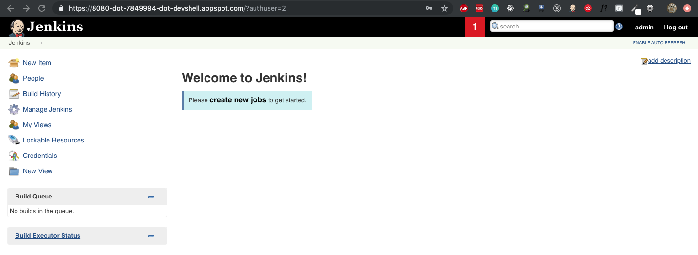

Deploying the Application
-------------------------

Deploy the sample application, **gceme**, in your continuous deployment pipeline. The application is written in the Go language and is located in the repo's sample-app directory.

- In backend: gceme listens on port 8080 and returns Compute Engine instance metadata in JSON format.
- In frontend: gceme queries the backend gceme service and renders the resulting JSON in the user interface.

image::https://cdn.qwiklabs.com/P1T5JBWWprA4iLf%2FB5%2BO6as7otLE25YBde57gzZwSz4%3D[Sample App]

Create the Kubernetes namespace **production**, logically isolate the deployment:

[source.console]
----
$ cd sample-app

$ kubectl create ns production
namespace/production created
----

Create the production and canary deployments:

[source.console]
----
$ kubectl apply -f k8s/production -n production
deployment.extensions/gceme-backend-production created
deployment.extensions/gceme-frontend-production created

kubectl apply -f k8s/canary -n production
deployment.extensions/gceme-backend-canary created
deployment.extensions/gceme-frontend-canary created

kubectl apply -f k8s/services -n production
service/gceme-backend created
service/gceme-frontend created
----

Scale up the production environment frontends by running the following command:

[source.console]
----
$ kubectl scale deployment gceme-frontend-production -n production --replicas 4
deployment.extensions/gceme-frontend-production scaled
----

By default, only one replica of the frontend is deployed. Use the kubectl scale command to ensure that there are at least 4 replicas running at all times.

[source.console]
----
$ kubectl get pods -n production -l app=gceme -l role=frontend
NAME                                         READY   STATUS    RESTARTS   AGE
gceme-frontend-canary-84cc88cccf-xp6qx       1/1     Running   0          4m58s
gceme-frontend-production-5df96c664d-989k6   1/1     Running   0          5m20s
gceme-frontend-production-5df96c664d-j5n5w   1/1     Running   0          60s
gceme-frontend-production-5df96c664d-j8xn9   1/1     Running   0          60s
gceme-frontend-production-5df96c664d-m2qsh   1/1     Running   0          60s
----

Now have 5 pods running for the frontend, 4 for production traffic and 1 for canary releases (changes to the canary release will only affect 1 out of 5 (20%) of users).

[source.console]
----
$ kubectl get pods -n production -l app=gceme -l role=backend
NAME                                       READY   STATUS    RESTARTS   AGE
gceme-backend-canary-688b9c69d9-j7rcj      1/1     Running   0          5m38s
gceme-backend-production-d6559978d-kt7hj   1/1     Running   0          6m1s
----

Now have 2 pods for the backend, 1 for production and 1 for canary.

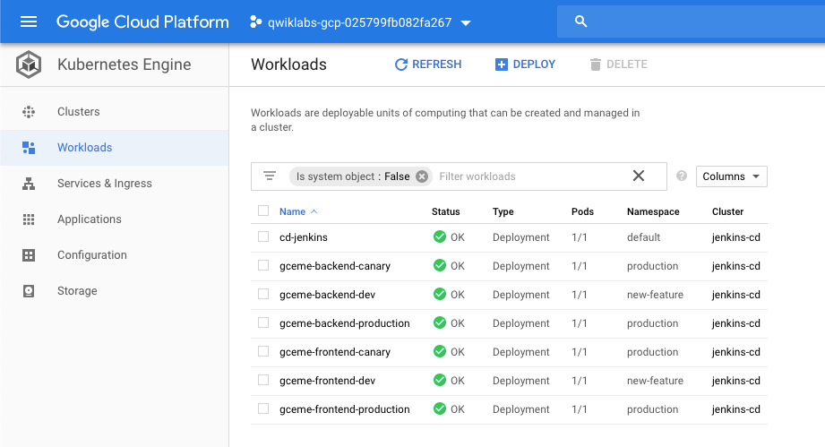

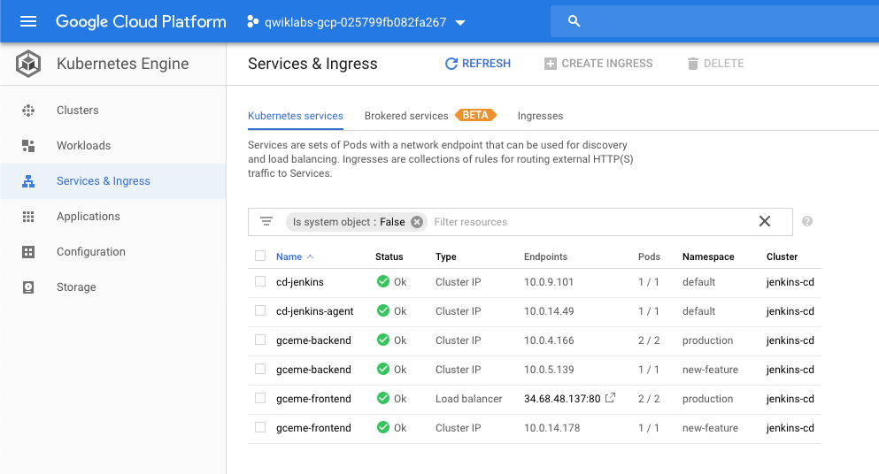

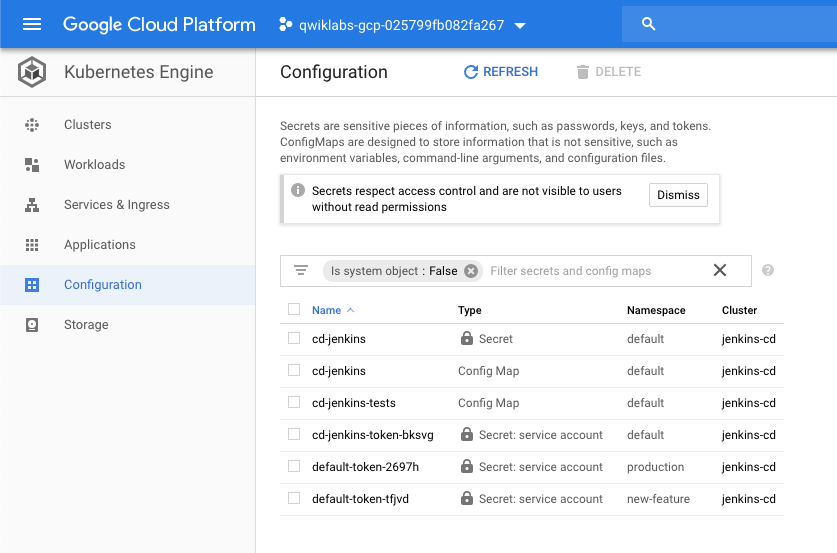

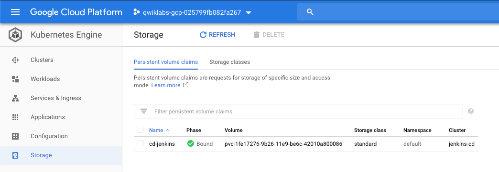

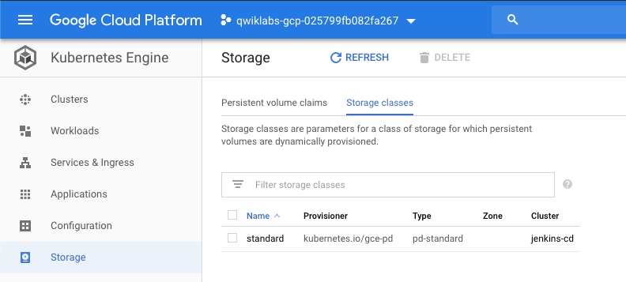

Retrieve the external IP for the production services (may take several minutes):

[source.console]
----
$ kubectl get service gceme-frontend -n production
NAME             TYPE           CLUSTER-IP   EXTERNAL-IP    PORT(S)        AGE
gceme-frontend   LoadBalancer   10.0.10.80   34.68.48.137   80:32700/TCP   6m23s
----

Paste External IP into a browser http://34.68.48.137 to see the instance metadata info card displayed:

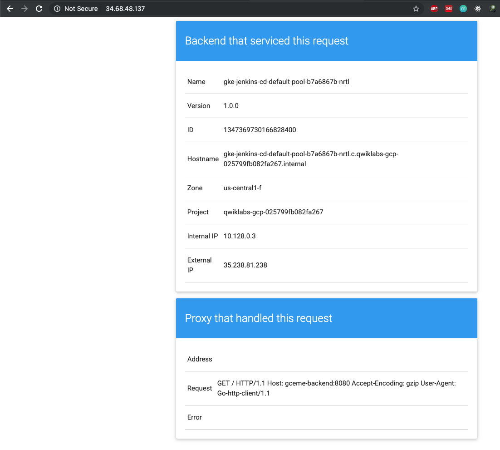

Assign the frontend service load balancer IP in an environment variable:

[source.console]
----
$ export FRONTEND_SERVICE_IP=$(kubectl get -o jsonpath="{.status.loadBalancer.ingress[0].ip}" --namespace=production services gceme-frontend)

$ curl http://$FRONTEND_SERVICE_IP/version
1.0.0
----

Creating the Jenkins Pipeline
-----------------------------

Creating a repository to host the sample app source code:

[source.console]
----
$ gcloud alpha source repos create default
WARNING: You may be billed for this repository. See https://cloud.google.com/source-repositories/docs/pricing for details.

$ git init
Initialized empty Git repository in /home/google3977749_student/continuous-deployment-on-kubernetes/sample-app/.git/

$ git config credential.helper gcloud.sh

$ env | grep DEVSHELL_PROJECT_ID
DEVSHELL_PROJECT_ID=qwiklabs-gcp-025799fb082fa267

$ git remote add origin https://source.developers.google.com/p/$DEVSHELL_PROJECT_ID/r/default

$ git config --global user.email "terrence.miao@somewhere-over-the-rainbow.net"

$ git config --global user.name "Terrence Miao"

$ git add .

$ git commit -m "Initial commit"
[master (root-commit) e20c5a6] Initial commit
 31 files changed, 2434 insertions(+)
 create mode 100644 Dockerfile
 create mode 100644 Gopkg.lock
 create mode 100644 Gopkg.toml
 create mode 100644 Jenkinsfile
 create mode 100644 html.go
 create mode 100644 k8s/canary/backend-canary.yaml
 create mode 100644 k8s/canary/frontend-canary.yaml
 create mode 100644 k8s/dev/backend-dev.yaml
 create mode 100644 k8s/dev/default.yml
 create mode 100644 k8s/dev/frontend-dev.yaml
 create mode 100644 k8s/production/backend-production.yaml
 create mode 100644 k8s/production/frontend-production.yaml
 create mode 100644 k8s/services/backend.yaml
 create mode 100644 k8s/services/frontend.yaml
 create mode 100644 main.go
 create mode 100644 main_test.go
 create mode 100644 vendor/cloud.google.com/go/AUTHORS
 create mode 100644 vendor/cloud.google.com/go/CONTRIBUTORS
 create mode 100644 vendor/cloud.google.com/go/LICENSE
 create mode 100644 vendor/cloud.google.com/go/compute/metadata/metadata.go
 create mode 100644 vendor/golang.org/x/net/AUTHORS
 create mode 100644 vendor/golang.org/x/net/CONTRIBUTORS
 create mode 100644 vendor/golang.org/x/net/LICENSE
 create mode 100644 vendor/golang.org/x/net/PATENTS
 create mode 100644 vendor/golang.org/x/net/context/context.go
 create mode 100644 vendor/golang.org/x/net/context/ctxhttp/ctxhttp.go
 create mode 100644 vendor/golang.org/x/net/context/ctxhttp/ctxhttp_pre17.go
 create mode 100644 vendor/golang.org/x/net/context/go17.go
 create mode 100644 vendor/golang.org/x/net/context/go19.go
 create mode 100644 vendor/golang.org/x/net/context/pre_go17.go
 create mode 100644 vendor/golang.org/x/net/context/pre_go19.go

$ git push origin master
Counting objects: 48, done.
Compressing objects: 100% (43/43), done.
Writing objects: 100% (48/48), 27.03 KiB | 0 bytes/s, done.
Total 48 (delta 11), reused 0 (delta 0)
remote: Resolving deltas: 100% (11/11)
To https://source.developers.google.com/p/qwiklabs-gcp-025799fb082fa267/r/default
 * [new branch]      master -> master
----

Project repo now set at: _https://source.developers.google.com/p/qwiklabs-gcp-025799fb082fa267/r/default_

Add Sample App into Jenkins build task:

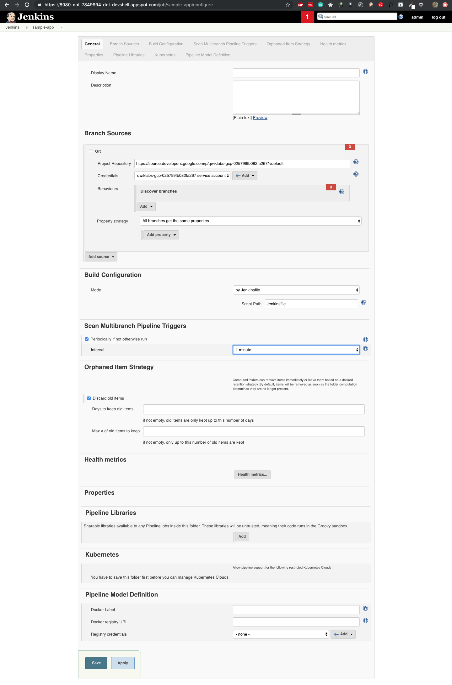

Creating the Development Environment
------------------------------------

Create a development branch and push it to the Git server:

[source.console]
----
$ git checkout -b new-feature
Switched to a new branch 'new-feature'

$ gcloud config get-value project
Your active configuration is: [cloudshell-20944]
qwiklabs-gcp-025799fb082fa267

$ cat Jenkinsfile
...
def project = 'qwiklabs-gcp-025799fb082fa267'
def appName = 'gceme'
def feSvcName = "${appName}-frontend"
def imageTag = "gcr.io/${project}/${appName}:${env.BRANCH_NAME}.${env.BUILD_NUMBER}"
...
----

Modify html.go file, change 
 to 

Modify main.go file, change to const version string = "2.0.0"

Commit and push your changes:

[source.console]
----
$ git add Jenkinsfile html.go main.go

$ git commit -m "Version 2.0.0"
[new-feature 09ccaa1] Version 2.0.0
 3 files changed, 4 insertions(+), 4 deletions(-)

$ git push origin new-feature
Counting objects: 5, done.
Compressing objects: 100% (5/5), done.
Writing objects: 100% (5/5), 496 bytes | 0 bytes/s, done.
Total 5 (delta 4), reused 0 (delta 0)
remote: Resolving deltas: 100% (4/4)
To https://source.developers.google.com/p/qwiklabs-gcp-025799fb082fa267/r/default
 * [new branch]      new-feature -> new-feature
----

[NOTE]
====
In a development scenario, you wouldn't use a public-facing load balancer. To help secure your application, you can use kubectl proxy. The proxy authenticates itself with the Kubernetes API and proxies requests from your local machine to the service in the cluster without exposing your service to the Internet.
====

[source.console]
----
$ kubectl proxy &
[2] 930
Starting to serve on 127.0.0.1:8001

$ curl http://localhost:8001/api/v1/namespaces/new-feature/services/gceme-frontend:80/proxy/version
2.0.0
----

Deploying a Canary Release
--------------------------

[source.console]
----
$ git checkout -b canary
Switched to a new branch 'canary'

$ git push origin canary
Total 0 (delta 0), reused 0 (delta 0)
To https://source.developers.google.com/p/qwiklabs-gcp-025799fb082fa267/r/default
 * [new branch]      canary -> canary

$ export FRONTEND_SERVICE_IP=$(kubectl get -o \
jsonpath="{.status.loadBalancer.ingress[0].ip}" --namespace=production services gceme-frontend)

$ while true; do curl http://$FRONTEND_SERVICE_IP/version; sleep 1; done
1.0.0
1.0.0
1.0.0
1.0.0
^C
----

Deploying to production
-----------------------

[source.console]
----
$ git checkout master
Switched to branch 'master'

$ git merge canary
Updating e20c5a6..09ccaa1
Fast-forward
 Jenkinsfile | 2 +-
 html.go     | 4 ++--
 main.go     | 2 +-
 3 files changed, 4 insertions(+), 4 deletions(-)

$ git push origin master
Total 0 (delta 0), reused 0 (delta 0)
To https://source.developers.google.com/p/qwiklabs-gcp-025799fb082fa267/r/default
   e20c5a6..09ccaa1  master -> master

$ export FRONTEND_SERVICE_IP=$(kubectl get -o \
jsonpath="{.status.loadBalancer.ingress[0].ip}" --namespace=production services gceme-frontend)

$ while true; do curl http://$FRONTEND_SERVICE_IP/version; sleep 1; done
2.0.0
1.0.0
1.0.0
1.0.0
1.0.0
2.0.0
1.0.0
1.0.0
2.0.0
1.0.0
1.0.0
^C
----

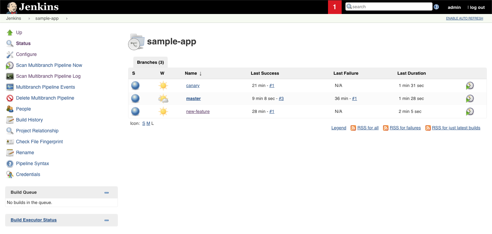

Now get the external IP address:

[source.console]
----
$ kubectl get service gceme-frontend -n production
NAME             TYPE           CLUSTER-IP   EXTERNAL-IP    PORT(S)        AGE
gceme-frontend   LoadBalancer   10.0.10.80   34.68.48.137   80:32700/TCP   38m
----

Paste External IP into a browser http://34.68.48.137 to see the instance metadata info card displayed:

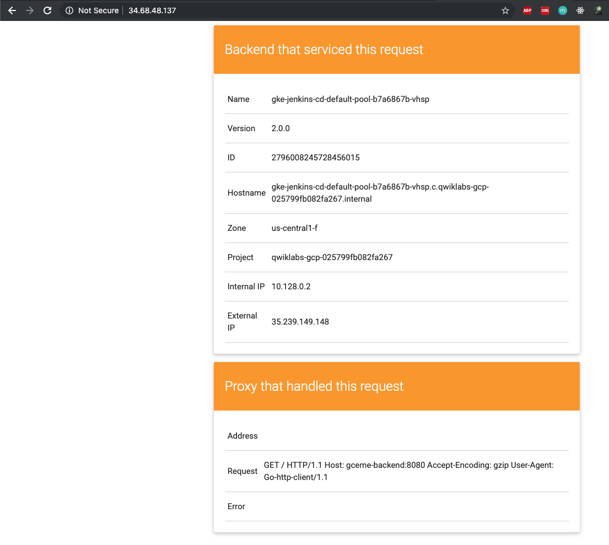

References
----------

- Google Cloud Training - Cloud Architecture, _https://google.qwiklabs.com/quests/24_
- Continuous Delivery with Jenkins in Kubernetes Engine, _https://google.qwiklabs.com/focuses/1104?parent=catalog_
- Continuous Delivery with Jenkins in Kubernetes Engine example, _https://github.com/GoogleCloudPlatform/continuous-deployment-on-kubernetes.git_
- Google Cloud Source Repositories, _https://cloud.google.com/source-repositories/_