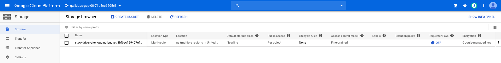
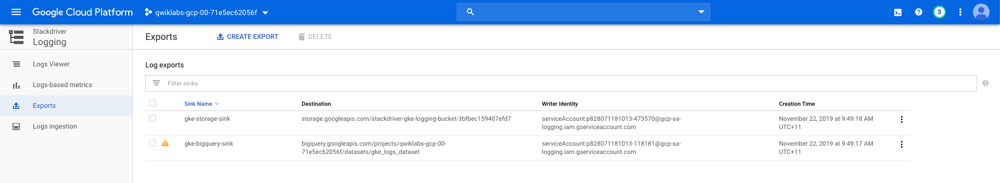
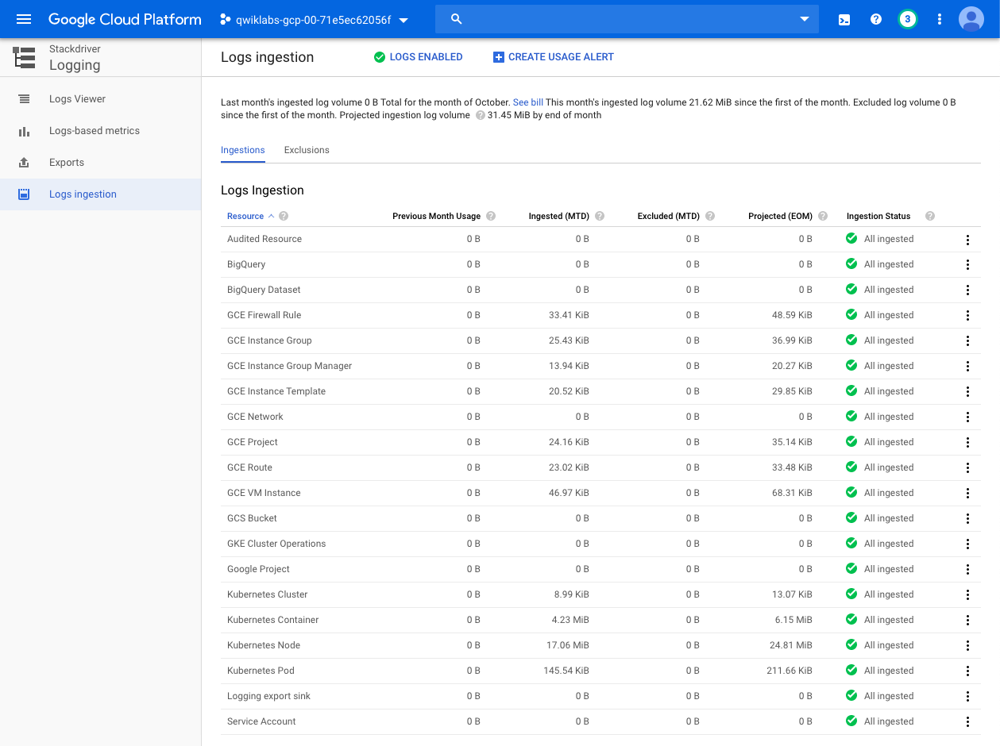

Google Kubernetes Engine Best Practices
=======================================

**Logging with Stackdriver on Kubernetes Engine**

References
----------

- Google Kubernetes Engine Best Practices, _https://google.qwiklabs.com/quests/63_
- Logging with Stackdriver on Kubernetes Engine, _https://google.qwiklabs.com/focuses/5539?parent=catalog_