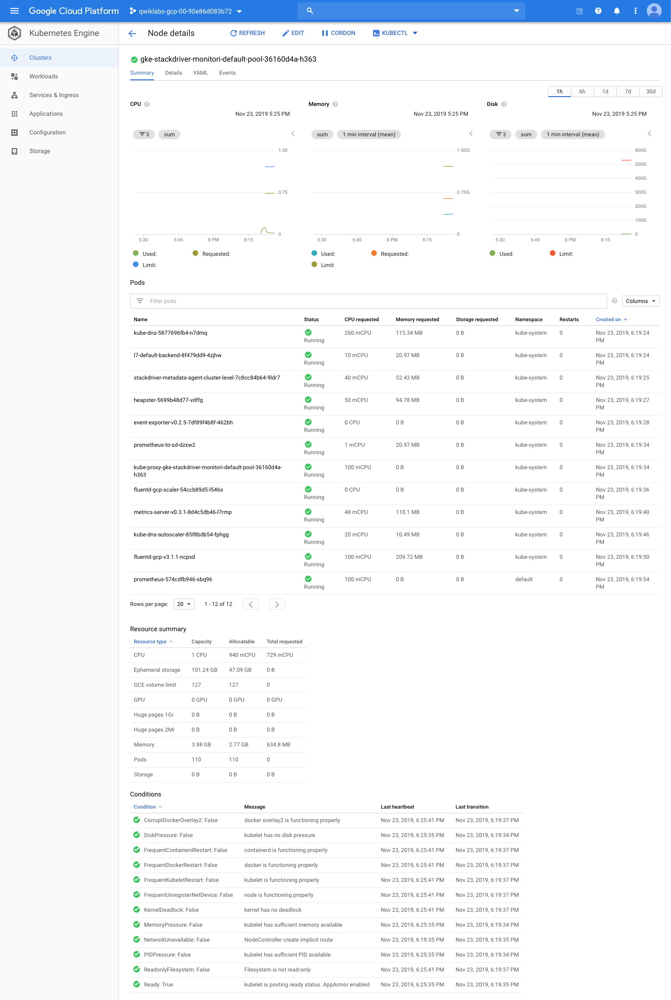
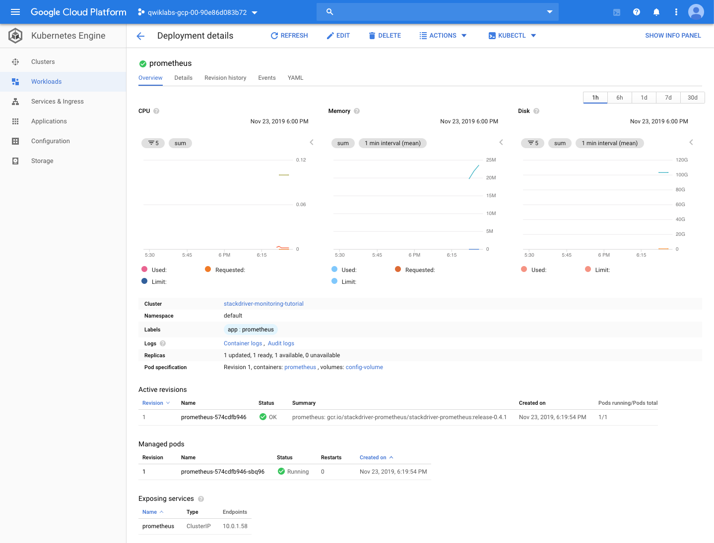
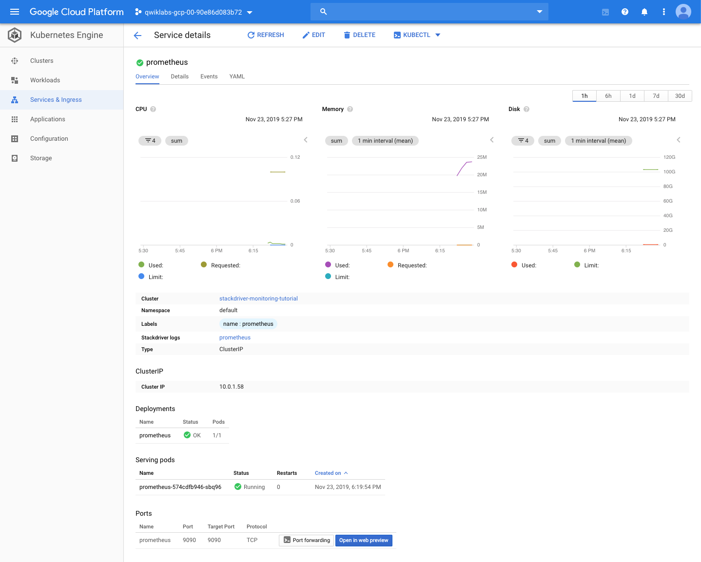
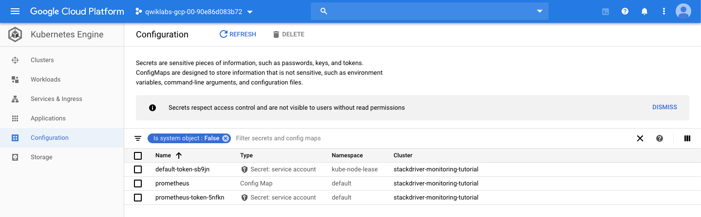
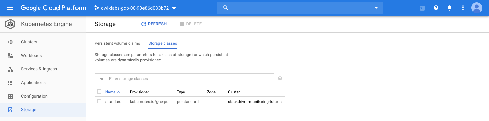
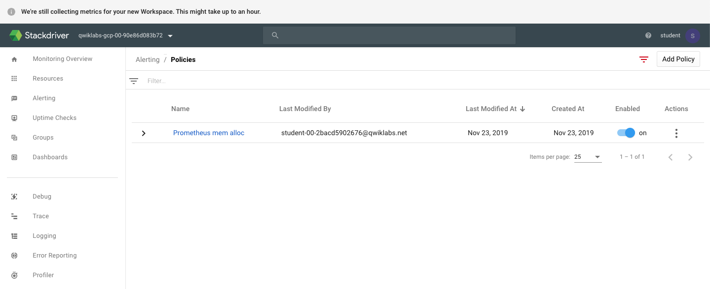
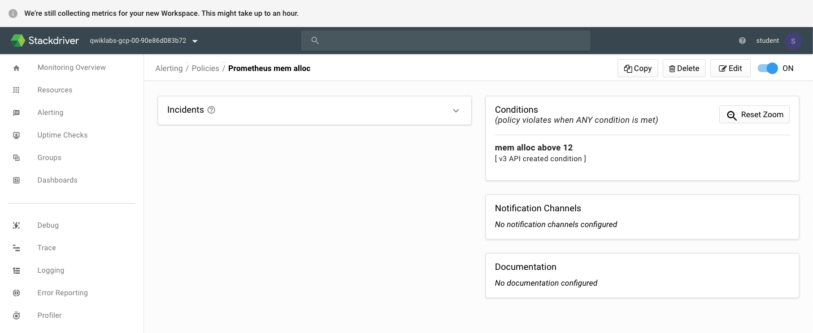

Google Kubernetes Engine Best Practices
=======================================

**Monitoring with Stackdriver on Kubernetes Engine**

[source.console]
----
student_00_2bacd5902676@cloudshell:~/gke-monitoring-tutorial (qwiklabs-gcp-00-90e86d083b72)$ gcloud auth application-default login
You are running on a Google Compute Engine virtual machine.
The service credentials associated with this virtual machine
will automatically be used by Application Default
Credentials, so it is not necessary to use this command.
If you decide to proceed anyway, your user credentials may be visible
to others with access to this virtual machine. Are you sure you want
to authenticate with your personal account?
Do you want to continue (Y/n)?  Y

Go to the following link in your browser:
    https://accounts.google.com/o/oauth2/auth?code_challenge=HEhhLYxTqsfeuCKf_06gdXwIgjkm-cmgVBBUWe2COyQ&prompt=select_account&code_challenge_method=S256&access_type=offline&redirect
_uri=urn%3Aietf%3Awg%3Aoauth%3A2.0%3Aoob&response_type=code&client_id=764086051850-6qr4p6gpi6hn506pt8ejuq83di341hur.apps.googleusercontent.com&scope=https%3A%2F%2Fwww.googleapis.com%
2Fauth%2Fuserinfo.email+https%3A%2F%2Fwww.googleapis.com%2Fauth%2Fcloud-platform+https%3A%2F%2Fwww.googleapis.com%2Fauth%2Faccounts.reauth

Enter verification code: 4/tgHVrQ7rCJ-jQ06RsjLYCQlZLB6SahBhHyN1Cq7Qc07ody-RyTBIzeM

Credentials saved to file: [/tmp/tmp.tQIbUj0Ctp/application_default_credentials.json]
These credentials will be used by any library that requests
Application Default Credentials.
To generate an access token for other uses, run:
  gcloud auth application-default print-access-token
----

References
----------

- Google Kubernetes Engine Best Practices, _https://google.qwiklabs.com/quests/63_
- Monitoring with Stackdriver on Kubernetes Engine, _https://google.qwiklabs.com/focuses/5157?parent=catalog_