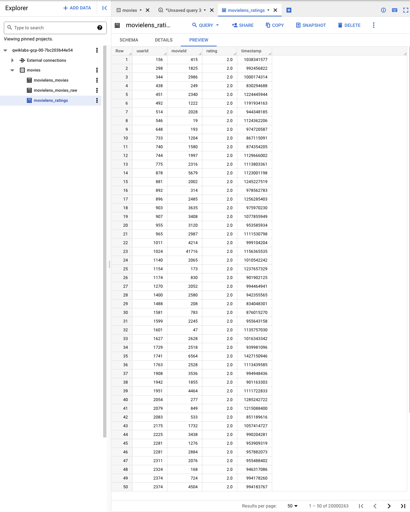

Movie Recommendations in BigQuery ML
====================================

Matrix factorization is a collaborative filtering technique that relies on two vectors called the user factors and the item factors. The user factors is a low-dimensional representation of a user_id and the item factors similarly represents an item_id.

To perform a matrix factorization of our data, you use the typical BigQuery ML syntax except that the model_type is **matrix_factorization** and you have to identify which columns play what roles in the collaborative filtering setup.

In order to apply matrix factorization to the movie ratings data, the BigQuery ML query needs to be executed to create the model.

[source.console]
----
CREATE OR REPLACE MODEL movies.movie_recommender
OPTIONS (model_type='matrix_factorization', user_col='userId', item_col='movieId', rating_col='rating', l2_reg=0.2, num_factors=16) AS
SELECT userId, movieId, rating
FROM movies.movielens_ratings
----

References
----------

- Colab: Build a Movie Recommendation System, _https://developers.google.com/machine-learning/recommendation/labs/movie-rec-programming-exercise_