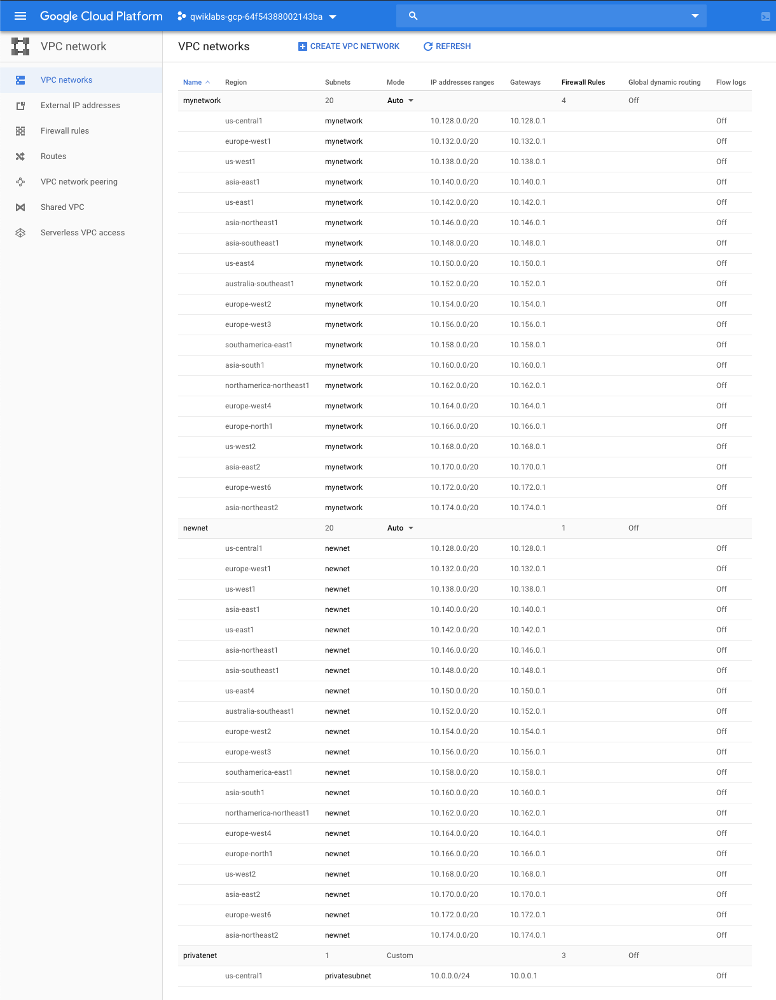

Cloud Architecture
==================

Networking 102

image::https://cdn.qwiklabs.com/rRCXB1teOm99S4NPAOU8M89i6%2FDh98eEkXYIizQOykY%3D[Overview]

Allow and deny access to a network using firewall rules, and deploy environment of Projects, Networks, and Subnetworks to the Google Cloud Platform.

image::https://cdn.qwiklabs.com/ZoSAjpgR0M9X9iKOwAk%2Fujt4zYPw3SfeQFalG3uaFag%3D[Network Environment]

Google Cloud Network Concepts
-----------------------------

Google Cloud Platform supports Projects, Networks, and Subnetworks to provide flexible, logical isolation of unrelated resources.

image::https://cdn.qwiklabs.com/nRBAyybz%2F%2Btq3cHR0O1QtANUPbu7NBEigKG1xo3vjXY%3D[Projects - Networks - Subnetworks]

**Projects** group resources that share the same trust boundary; mapped to teams since each Proejct has its own access poicy (IAM) and member list; serve as a collector of billing and quota details reflecting resource consumption. **Projects** contain Networks which contain Subnetworks, Firewall rules, and Routes.

image::https://cdn.qwiklabs.com/F%2FuKMHO0L60f0vCAeZHtnZsvGYBklTvbCP%2BpZ898R1Y%3D[Projects]

**Networks**, using Firewalls, also house the access policies for incoming and outgoing connections. **Networks** can be Global (offering horizontal scalability across multiple Regions) or Regional (offering low-latency within a single Region).

**Subnetworks** group related resources (Compute Engine instances) into private address spaces. **Subnetworks** can only be Regional. A subnetwork can be in auto mode or custom mode.

- An auto mode network has one subnet per region, each with a predetermined IP range and gateway. These subnets are created automatically when you create the auto mode network, and each subnet has the same name as the overall network.
- A custom mode network has no subnets at creation. In order to create an instance in a custom mode network, you must first create a subnetwork in that region and specify its IP range. A custom mode network can have zero, one, or many subnets per region.

Create Virtual Private Cloud (VPC) Networks and Instances
---------------------------------------------------------

Create the network **mynetwork** with auto subnets:

[source.console]
----
$ gcloud compute networks create mynetwork --subnet-mode=auto
Created [https://www.googleapis.com/compute/v1/projects/qwiklabs-gcp-64f54388002143ba/global/networks/mynetwork].
NAME       SUBNET_MODE  BGP_ROUTING_MODE  IPV4_RANGE  GATEWAY_IPV4
mynetwork  AUTO         REGIONAL

Instances on this network will not be reachable until firewall rules
are created. As an example, you can allow all internal traffic between
instances as well as SSH, RDP, and ICMP by running:

$ gcloud compute firewall-rules create <FIREWALL_NAME> --network mynetwork --allow tcp,udp,icmp --source-ranges <IP_RANGE>
$ gcloud compute firewall-rules create <FIREWALL_NAME> --network mynetwork --allow tcp:22,tcp:3389,icmp
----

Create the network **privatenet** with custom subnets:

[source.console]
----
$ gcloud compute networks create privatenet --subnet-mode=custom
Created [https://www.googleapis.com/compute/v1/projects/qwiklabs-gcp-64f54388002143ba/global/networks/privatenet].
NAME        SUBNET_MODE  BGP_ROUTING_MODE  IPV4_RANGE  GATEWAY_IPV4
privatenet  CUSTOM       REGIONAL

Instances on this network will not be reachable until firewall rules
are created. As an example, you can allow all internal traffic between
instances as well as SSH, RDP, and ICMP by running:

$ gcloud compute firewall-rules create <FIREWALL_NAME> --network privatenet --allow tcp,udp,icmp --source-ranges <IP_RANGE>
$ gcloud compute firewall-rules create <FIREWALL_NAME> --network privatenet --allow tcp:22,tcp:3389,icmp
----

Create the custom subnet in the **privatenet** network:

[source.console]
----
$ gcloud compute networks subnets create privatesubnet --network=privatenet \
        --region=us-central1 --range=10.0.0.0/24 --enable-private-ip-google-access
Created [https://www.googleapis.com/compute/v1/projects/qwiklabs-gcp-64f54388002143ba/regions/us-central1/subnetworks/privatesubnet].
NAME           REGION       NETWORK     RANGE
privatesubnet  us-central1  privatenet  10.0.0.0/24
----

Create some instances:

[source.console]
----
$ gcloud compute instances create default-us-vm --zone=us-central1-a --network=default
Created [https://www.googleapis.com/compute/v1/projects/qwiklabs-gcp-64f54388002143ba/zones/us-central1-a/instances/default-us-vm].
NAME           ZONE           MACHINE_TYPE   PREEMPTIBLE  INTERNAL_IP  EXTERNAL_IP     STATUS
default-us-vm  us-central1-a  n1-standard-1               10.128.0.2   35.232.236.135  RUNNING

$ gcloud compute instances create mynet-us-vm --zone=us-central1-a --network=mynetwork
Created [https://www.googleapis.com/compute/v1/projects/qwiklabs-gcp-64f54388002143ba/zones/us-central1-a/instances/mynet-us-vm].
NAME         ZONE           MACHINE_TYPE   PREEMPTIBLE  INTERNAL_IP  EXTERNAL_IP    STATUS
mynet-us-vm  us-central1-a  n1-standard-1               10.128.0.2   35.238.168.52  RUNNING

$ gcloud compute instances create mynet-eu-vm --zone=europe-west1-b --network=mynetwork
Created [https://www.googleapis.com/compute/v1/projects/qwiklabs-gcp-64f54388002143ba/zones/europe-west1-b/instances/mynet-eu-vm].
NAME         ZONE            MACHINE_TYPE   PREEMPTIBLE  INTERNAL_IP  EXTERNAL_IP    STATUS
mynet-eu-vm  europe-west1-b  n1-standard-1               10.132.0.2   35.205.138.11  RUNNING

$ gcloud compute instances create privatenet-bastion --zone=us-central1-c \
        --subnet=privatesubnet --can-ip-forward
Created [https://www.googleapis.com/compute/v1/projects/qwiklabs-gcp-64f54388002143ba/zones/us-central1-c/instances/privatenet-bastion].
NAME                ZONE           MACHINE_TYPE   PREEMPTIBLE  INTERNAL_IP  EXTERNAL_IP      STATUS
privatenet-bastion  us-central1-c  n1-standard-1               10.0.0.2     104.154.194.159  RUNNING

$ gcloud compute instances create privatenet-us-vm --zone=us-central1-f \
        --subnet=privatesubnet
Created [https://www.googleapis.com/compute/v1/projects/qwiklabs-gcp-64f54388002143ba/zones/us-central1-f/instances/privatenet-us-vm].
NAME              ZONE           MACHINE_TYPE   PREEMPTIBLE  INTERNAL_IP  EXTERNAL_IP    STATUS
privatenet-us-vm  us-central1-f  n1-standard-1               10.0.0.3     34.67.211.245  RUNNING
----

Each firewall rule has a Priority value from 0-65535 inclusive. Relative priority values are used to determine precedence of conflicting rules:

- Lower priority value implies higher precedence.
- When unspecified, a priority value of 1000 is used.
- If a packet matches conflicting rules with the same priority, the deny policy takes precedence.

image::https://cdn.qwiklabs.com/d%2Ba1W4qULIwDM2wnAlr9w8BkEhVA%2FmwGxGYDKYIqFiY%3D[Firewall rules]

Delete the Default network
--------------------------

image::https://cdn.qwiklabs.com/22zTvoQJIz7c%2BqFZfka0Yi0sZo7Q0tSGGiaJz1PatcQ%3D[User-created Networks]

Advanced firewall rules
-----------------------

GCP Firewalls are stateful: for each initiated connection tracked by allow rules in one direction, the return traffic is automatically allowed, regardless of any rules.

Allow/Ingress Rules:

[source.console]
----
$ gcloud beta compute firewall-rules create mynetwork-allow-icmp --network mynetwork \
        --action ALLOW --direction INGRESS --rules icmp
Creating firewall...⠧Created [https://www.googleapis.com/compute/beta/projects/qwiklabs-gcp-64f54388002143ba/global/firewalls/mynetwork-allow-icmp].
Creating firewall...done.
NAME                  NETWORK    DIRECTION  PRIORITY  ALLOW  DENY  DISABLED
mynetwork-allow-icmp  mynetwork  INGRESS    1000      icmp         False

$ gcloud beta compute firewall-rules create mynetwork-allow-ssh --network mynetwork \
        --action ALLOW --direction INGRESS --rules tcp:22
Creating firewall...⠧Created [https://www.googleapis.com/compute/beta/projects/qwiklabs-gcp-64f54388002143ba/global/firewalls/mynetwork-allow-ssh].
Creating firewall...done.
NAME                 NETWORK    DIRECTION  PRIORITY  ALLOW   DENY  DISABLED
mynetwork-allow-ssh  mynetwork  INGRESS    1000      tcp:22        False

$ gcloud beta compute firewall-rules create mynetwork-allow-internal --network mynetwork \
        --action ALLOW --direction INGRESS --rules all \
        --source-ranges 10.128.0.0/9
Creating firewall...⠏Created [https://www.googleapis.com/compute/beta/projects/qwiklabs-gcp-64f54388002143ba/global/firewalls/mynetwork-allow-internal].
Creating firewall...done.
NAME                      NETWORK    DIRECTION  PRIORITY  ALLOW  DENY  DISABLED
mynetwork-allow-internal  mynetwork  INGRESS    1000      all          False

$ gcloud beta compute firewall-rules list \
        --filter="network:mynetwork"
NAME                      NETWORK    DIRECTION  PRIORITY  ALLOW   DENY  DISABLED
mynetwork-allow-icmp      mynetwork  INGRESS    1000      icmp          False
mynetwork-allow-internal  mynetwork  INGRESS    1000      all           False
mynetwork-allow-ssh       mynetwork  INGRESS    1000      tcp:22        False

To show all fields of the firewall, please show in JSON format: --format=json
To show all fields in table format, please see the examples in --help.
----

image::https://cdn.qwiklabs.com/Y9GPqglqiz4exe0T6MzS6s8Zei3gUSm7UPECNhHP9t0%3D[Filewall rules]

Deny/Egress rules:

[source.console]
----
$ gcloud beta compute firewall-rules create privatenet-allow-icmp \
        --network privatenet --action ALLOW --direction INGRESS --rules icmp
Creating firewall...⠧Created [https://www.googleapis.com/compute/beta/projects/qwiklabs-gcp-64f54388002143ba/global/firewalls/privatenet-allow-icmp].
Creating firewall...done.
NAME                   NETWORK     DIRECTION  PRIORITY  ALLOW  DENY  DISABLED
privatenet-allow-icmp  privatenet  INGRESS    1000      icmp         False

$ gcloud beta compute firewall-rules create privatenet-allow-ssh \
        --network privatenet --action ALLOW --direction INGRESS --rules tcp:22
Creating firewall...⠧Created [https://www.googleapis.com/compute/beta/projects/qwiklabs-gcp-64f54388002143ba/global/firewalls/privatenet-allow-ssh].
Creating firewall...done.
NAME                  NETWORK     DIRECTION  PRIORITY  ALLOW   DENY  DISABLED
privatenet-allow-ssh  privatenet  INGRESS    1000      tcp:22        False

$ gcloud beta compute firewall-rules create privatenet-allow-internal \
        --network privatenet --action ALLOW --direction INGRESS --rules all \
        --source-ranges 10.0.0.0/24
Creating firewall...⠏Created [https://www.googleapis.com/compute/beta/projects/qwiklabs-gcp-64f54388002143ba/global/firewalls/privatenet-allow-internal].
Creating firewall...done.
NAME                       NETWORK     DIRECTION  PRIORITY  ALLOW  DENY  DISABLED
privatenet-allow-internal  privatenet  INGRESS    1000      all          False
----

Egress firewall rules require a --destination-ranges flag.

[source.console]
----
$ gcloud beta compute firewall-rules create mynetwork-deny-icmp \
        --network mynetwork --action DENY --direction EGRESS --rules icmp \
        --destination-ranges 10.132.0.2 --priority 500
Creating firewall...⠧Created [https://www.googleapis.com/compute/beta/projects/qwiklabs-gcp-64f54388002143ba/global/firewalls/mynetwork-deny-icmp].
Creating firewall...done.
NAME                 NETWORK    DIRECTION  PRIORITY  ALLOW  DENY  DISABLED
mynetwork-deny-icmp  mynetwork  EGRESS     500              icmp  False

$ gcloud beta compute firewall-rules list \
        --filter="network:mynetwork AND name=mynetwork-deny-icmp"
NAME                 NETWORK    DIRECTION  PRIORITY  ALLOW  DENY  DISABLED
mynetwork-deny-icmp  mynetwork  EGRESS     500              icmp  False

To show all fields of the firewall, please show in JSON format: --format=json
To show all fields in table format, please see the examples in --help.
----

Convert to a NAT gateway (the IP forwarding was set to On via the --can-ip-forward flag. This flag cannot be changed after the VM has been created):

[source.console]
----
$ gcloud compute instances add-tags privatenet-us-vm --zone us-central1-f --tags nat-me
Updated [https://www.googleapis.com/compute/v1/projects/qwiklabs-gcp-64f54388002143ba/zones/us-central1-f/instances/privatenet-us-vm].

$ gcloud compute routes create nat-route --network privatenet \
        --destination-range 0.0.0.0/0 --next-hop-instance privatenet-bastion \
        --next-hop-instance-zone us-central1-c --tags nat-me --priority 800
Created [https://www.googleapis.com/compute/v1/projects/qwiklabs-gcp-64f54388002143ba/global/routes/nat-route].
NAME       NETWORK     DEST_RANGE  NEXT_HOP                                    PRIORITY
nat-route  privatenet  0.0.0.0/0   us-central1-c/instances/privatenet-bastion  800
----

Open a new SSH into privatenet-bastion and activate IP forwarding and NAT on the Linux side by running:

[source.console]
----
$ sudo sysctl -w net.ipv4.ip_forward=1
net.ipv4.ip_forward = 1

$ sudo iptables -t nat -A POSTROUTING -o eth0 -j MASQUERADE

$ ssh privatenet-us-vm
Linux privatenet-us-vm 4.9.0-9-amd64 #1 SMP Debian 4.9.168-1+deb9u3 (2019-06-16) x86_64
The programs included with the Debian GNU/Linux system are free software;
the exact distribution terms for each program are described in the
individual files in /usr/share/doc/*/copyright.
Debian GNU/Linux comes with ABSOLUTELY NO WARRANTY, to the extent
permitted by applicable law.
Last login: Thu Jul  4 12:47:51 2019 from 10.0.0.2

$ curl ifconfig.co
104.154.194.159
----

104.154.194.159 is the IP of privatenet-bastion.

Give IAM role to a buddy
------------------------

In the Cloud Console, go to **IAM & Admin** > **IAM**, then click **ADD**:

Enter your buddy's email address e.g. <**terrence.miao@somewhere-over-the-rainbow**>, who is already have Google Cloud Console access, then add:

**Compute Engine > Compute Network Admin**

**Compute Engine > Compute Security Admin**

roles.

Have your colleague log into their Cloud Console at, adding yourprojectname to the URL: https://console.cloud.google.com/compute/instances?project=qwiklabs-gcp-64f54388002143ba

[source.console]
----
$ gcloud compute networks create newnet --subnet-mode=auto
Created [https://www.googleapis.com/compute/v1/projects/qwiklabs-gcp-64f54388002143ba/global/networks/newnet].
NAME    SUBNET_MODE  BGP_ROUTING_MODE  IPV4_RANGE  GATEWAY_IPV4
newnet  AUTO         REGIONAL

Instances on this network will not be reachable until firewall rules
are created. As an example, you can allow all internal traffic between
instances as well as SSH, RDP, and ICMP by running:

$ gcloud compute firewall-rules create <FIREWALL_NAME> --network newnet --allow tcp,udp,icmp --source-ranges <IP_RANGE>
$ gcloud compute firewall-rules create <FIREWALL_NAME> --network newnet --allow tcp:22,tcp:3389,icmp
----

[source.console]
----
$ gcloud compute firewall-rules create newrule --network newnet --allow icmp
Creating firewall...⠏Created [https://www.googleapis.com/compute/v1/projects/qwiklabs-gcp-64f54388002143ba/global/firewalls/newrule].
Creating firewall...done.
NAME     NETWORK  DIRECTION  PRIORITY  ALLOW  DENY  DISABLED
newrule  newnet   INGRESS    1000      icmp         False

$ gcloud compute firewall-rules delete newrule
The following firewalls will be deleted:
 - [newrule]

Do you want to continue (Y/n)?

Deleted [https://www.googleapis.com/compute/v1/projects/qwiklabs-gcp-64f54388002143ba/global/firewalls/newrule].

$ gcloud compute networks delete newnet
The following networks will be deleted:
 - [newnet]

Do you want to continue (Y/n)?

Deleted [https://www.googleapis.com/compute/v1/projects/qwiklabs-gcp-64f54388002143ba/global/networks/newnet].
----

References
----------

- Google Cloud Training - Cloud Architecture, _https://google.qwiklabs.com/quests/24_
- Networking 102, _https://google.qwiklabs.com/focuses/556?parent=catalog_