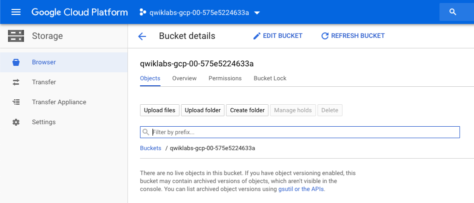
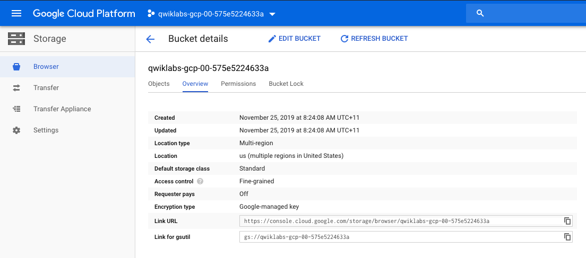
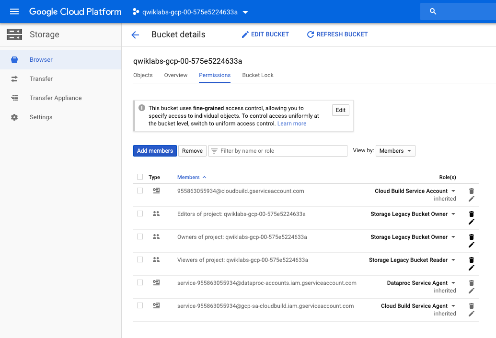
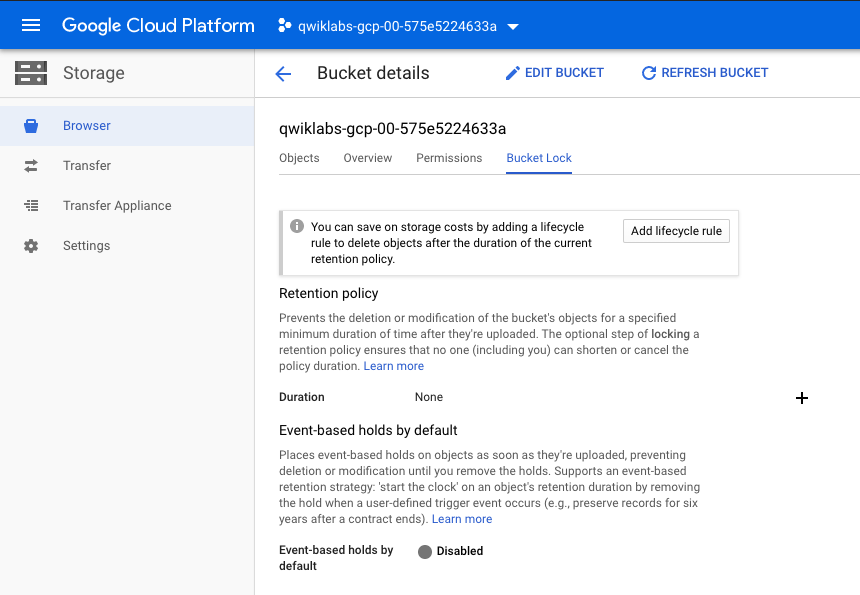
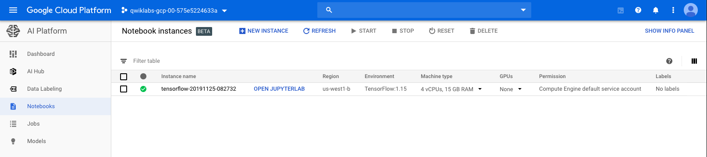
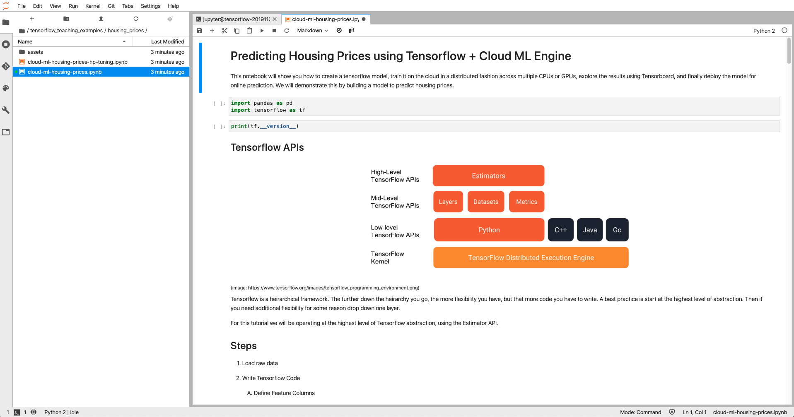
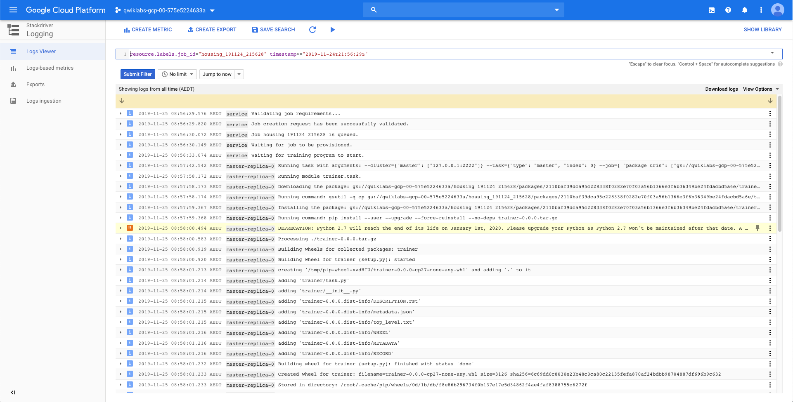
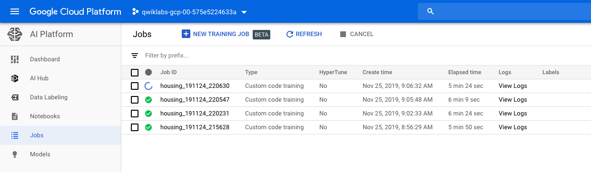
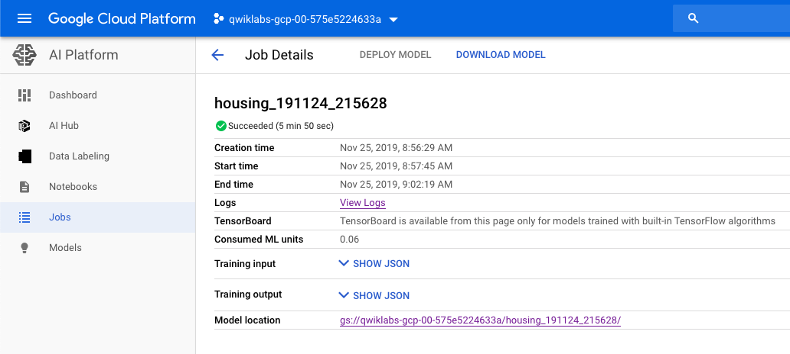

Data Engineering
================

**Predict Housing Prices with Tensorflow and AI Platform**

References
----------

- Data Engineering, _https://google.qwiklabs.com/quests/25_
- Predict Housing Prices with Tensorflow and AI Platform, _https://google.qwiklabs.com/focuses/3644?parent=catalog_