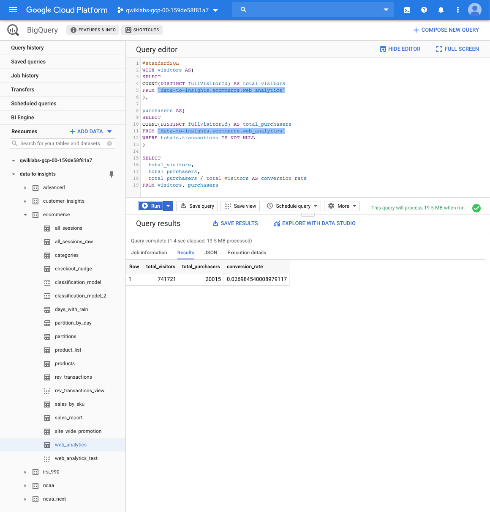

Data Engineering
================

**Predict Visitor Purchases with a Classification Model in BQML**

- Sample Dataset

- Out of the total visitors who visited our website, what % made a purchase?

- What are the top 5 selling products?

- How many visitors bought on subsequent visits to the website?

- What are the risks of only using totals.bounces and totals.timeOnSite two fields?

image::Predict Visitor Purchases with a Classification Model in BQML - Question total bounces and timeOnSite.png[Predict Visitor Purchases with a Classification Model in BQML - Question total bounces and timeOnSite]

- Dataset to store models

- Classification model

- Classification model 2

image::Predict Visitor Purchases with a Classification Model in BQML - Classification model 2 evaluation.png[Predict Visitor Purchases with a Classification Model in BQML - Classification model 2 evaluation]

image::Predict Visitor Purchases with a Classification Model in BQML - Query job information.png[Predict Visitor Purchases with a Classification Model in BQML - Query job information]

image::Predict Visitor Purchases with a Classification Model in BQML - Query results.png[Predict Visitor Purchases with a Classification Model in BQML - Query results]

- Visualizing BigQuery data using Data Studio

References
----------

- Data Engineering, _https://google.qwiklabs.com/quests/25_
- Predict Visitor Purchases with a Classification Model in BQML, _https://google.qwiklabs.com/focuses/1794?parent=catalog_