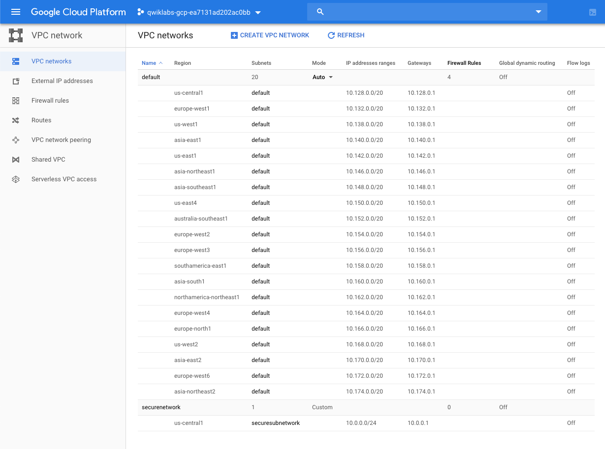
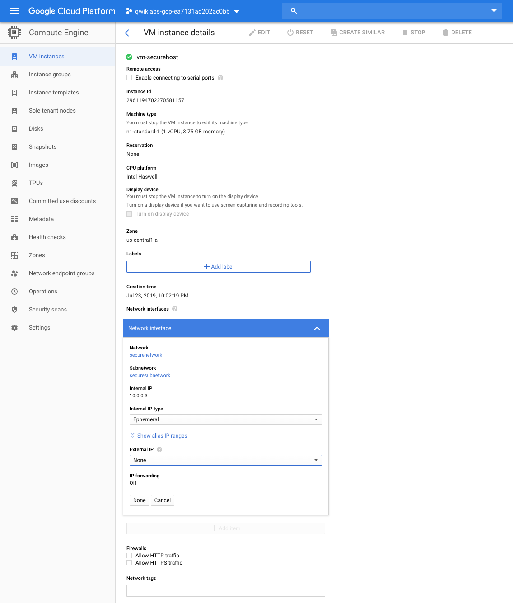
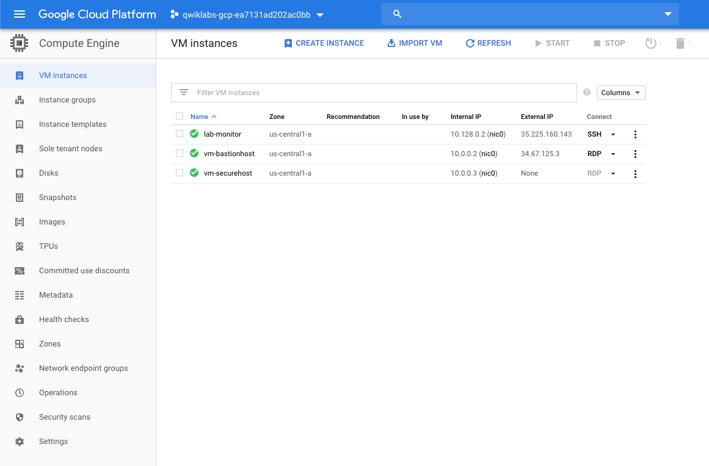
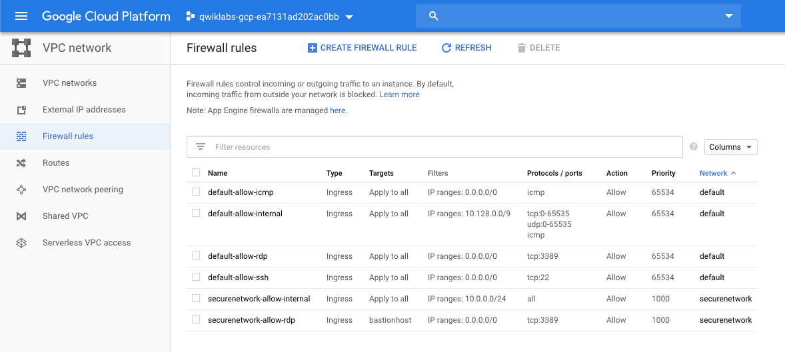
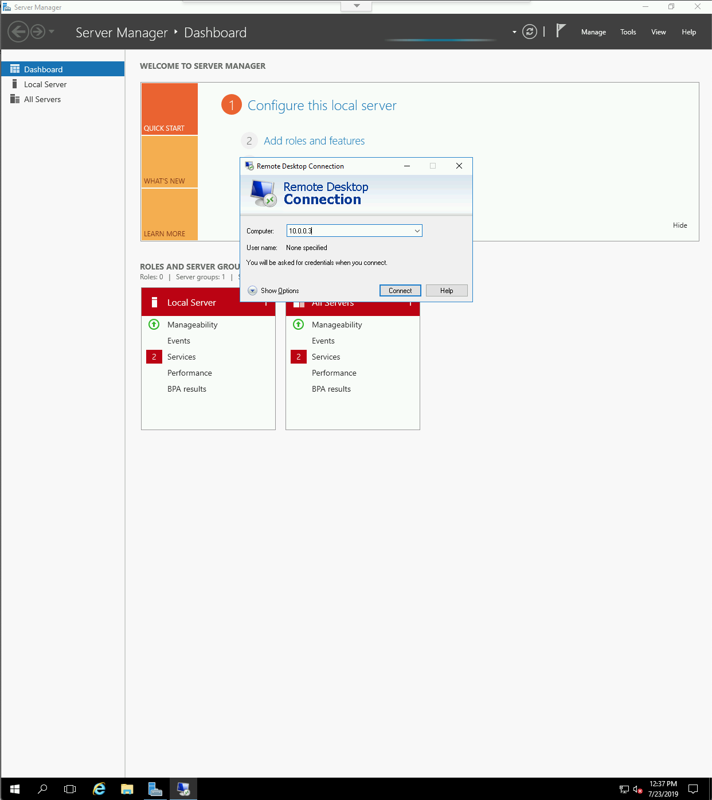
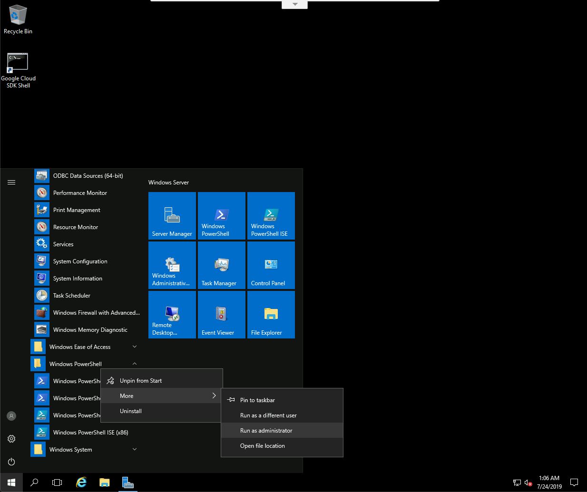
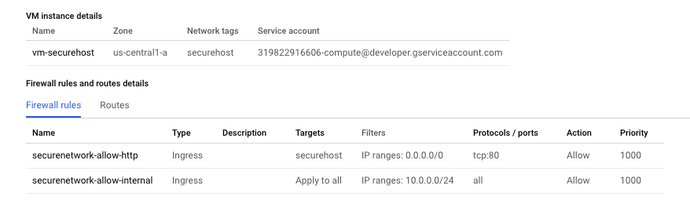

Cloud Architecture
==================

**Configure Secure RDP using a Windows Bastion Host**

Tasks to complete:

- Create a new VPC to host secure production Windows services, and with a single subnet.
- Create a Windows secure host connected to a subnet in the new VPC with an internal only network interface.
- Create a Windows bastion host (jump box) connected to a subnet in the new VPC, and with an externally accessible network interface.
- Deploy the Microsoft Internet Information Server on that secure host.
- Configure firewall rule that allows external RDP traffic to the bastion host system.
- Configure firewall rule to enable management of the Windows secure host from the Internet using the bastion host as a jump box.
- Configure firewall rule to allow HTTP access to the virtual machine.
- Create a virtual machine that points to the startup script.

[source.console]
----
$ gcloud compute networks create securenetwork --subnet-mode=custom
Created [https://www.googleapis.com/compute/v1/projects/qwiklabs-gcp-ea7131ad202ac0bb/global/networks/securenetwork].
NAME           SUBNET_MODE  BGP_ROUTING_MODE  IPV4_RANGE  GATEWAY_IPV4
securenetwork  CUSTOM       REGIONAL

Instances on this network will not be reachable until firewall rules
are created. As an example, you can allow all internal traffic between
instances as well as SSH, RDP, and ICMP by running:

$ gcloud compute firewall-rules create <FIREWALL_NAME> --network securenetwork --allow tcp,udp,icmp --source-ranges <IP_RANGE>
$ gcloud compute firewall-rules create <FIREWALL_NAME> --network securenetwork --allow tcp:22,tcp:3389,icmp

$ gcloud compute networks subnets create securesubnetwork --network=securenetwork --region=us-central1 --range=10.0.0.0/24 --enable-private-ip-google-access
Created [https://www.googleapis.com/compute/v1/projects/qwiklabs-gcp-ea7131ad202ac0bb/regions/us-central1/subnetworks/securesubnetwork].
NAME              REGION       NETWORK        RANGE
securesubnetwork  us-central1  securenetwork  10.0.0.0/24
----

[source.console]
----
$ gcloud compute instances create vm-bastionhost --zone=us-central1-a --subnet=securesubnetwork --network=securenetwork --image-project windows-cloud --image-family=windows-2016
Created [https://www.googleapis.com/compute/v1/projects/qwiklabs-gcp-ea7131ad202ac0bb/zones/us-central1-a/instances/vm-bastionhost].
NAME            ZONE           MACHINE_TYPE   PREEMPTIBLE  INTERNAL_IP  EXTERNAL_IP    STATUS
vm-bastionhost  us-central1-a  n1-standard-1               10.0.0.2     34.67.125.3    RUNNING

$ gcloud compute instances get-serial-port-output vm-bastionhost --zone us-central1-a
SeaBIOS (version 1.8.2-20190620_103534-google)
Total RAM Size = 0x00000000f0000000 = 3840 MiB
CPUs found: 1     Max CPUs supported: 1
found virtio-scsi at 0:3
virtio-scsi vendor='Google' product='PersistentDisk' rev='1' type=0 removable=0
virtio-scsi blksize=512 sectors=104857600 = 51200 MiB
drive 0x000f2740: PCHS=0/0/0 translation=lba LCHS=1024/255/63 s=104857600
Booting from Hard Disk 0...
2019/07/23 12:29:18 GCEWindowsAgent: GCE Agent Started (version 4.6.0@1)
2019/07/23 12:29:51 GCEInstanceSetup: Starting sysprep specialize phase.
2019/07/23 12:29:52 GCEInstanceSetup: All networks set to DHCP.
2019/07/23 12:29:52 GCEInstanceSetup: Running 'netsh' with arguments 'interface ipv4 set interface Ethernet mtu=1460'
2019/07/23 12:29:53 GCEInstanceSetup: --> Ok.
2019/07/23 12:29:53 GCEInstanceSetup: MTU set to 1460.
2019/07/23 12:29:53 GCEInstanceSetup: Running 'route' with arguments '/p add 169.254.169.254 mask 255.255.255.255 0.0.0.0 if 4 metric 1'
2019/07/23 12:29:53 GCEInstanceSetup: --> OK!
2019/07/23 12:29:53 GCEInstanceSetup: Added persistent route to metadata netblock via first netkvm adapter.
2019/07/23 12:29:54 GCEInstanceSetup: Getting hostname from metadata server.
2019/07/23 12:29:54 GCEInstanceSetup: Changing hostname from WIN-JUAPJ0LK79F to vm-bastionhost.
2019/07/23 12:29:54 GCEInstanceSetup: Renamed from WIN-JUAPJ0LK79F to vm-bastionhost.
2019/07/23 12:29:55 GCEMetadataScripts: Starting specialize scripts (version 4.2.2@1).
2019/07/23 12:29:55 GCEMetadataScripts: No specialize scripts to run.
2019/07/23 12:29:55 GCEMetadataScripts: Finished running specialize scripts.
2019/07/23 12:29:55 GCEInstanceSetup: Finished with sysprep specialize phase, restarting...
2019/07/23 12:30:42 GCEWindowsAgent: GCE Agent Stopped
SeaBIOS (version 1.8.2-20190620_103534-google)
Total RAM Size = 0x00000000f0000000 = 3840 MiB
CPUs found: 1     Max CPUs supported: 1
found virtio-scsi at 0:3
virtio-scsi vendor='Google' product='PersistentDisk' rev='1' type=0 removable=0
virtio-scsi blksize=512 sectors=104857600 = 51200 MiB
drive 0x000f2740: PCHS=0/0/0 translation=lba LCHS=1024/255/63 s=104857600
Booting from Hard Disk 0...
2019/07/23 12:31:19 GCEWindowsAgent: GCE Agent Started (version 4.6.0@1)

Specify --start=2239 in the next get-serial-port-output invocation to get only the new output starting from here.

$ gcloud compute instances create vm-securehost --zone=us-central1-a --subnet=securesubnetwork --network=securenetwork --image-project windows-cloud --image-family=windows-2016
Created [https://www.googleapis.com/compute/v1/projects/qwiklabs-gcp-ea7131ad202ac0bb/zones/us-central1-a/instances/vm-securehost].
NAME           ZONE           MACHINE_TYPE   PREEMPTIBLE  INTERNAL_IP  EXTERNAL_IP    STATUS
vm-securehost  us-central1-a  n1-standard-1               10.0.0.3     35.238.142.42  RUNNING
----

Create user accounts and reset the Windows passwords in order to connect to each instance in **vm-bastionhost** and **vm-securehost**.

[source.console]
----
$ gcloud compute reset-windows-password vm-bastionhost --user app_admin --zone us-central1-a
This command creates an account and sets an initial password for the
user [app_admin] if the account does not already exist.
If the account already exists, resetting the password can cause the
LOSS OF ENCRYPTED DATA secured with the current password, including
files and stored passwords.

For more information, see:
https://cloud.google.com/compute/docs/operating-systems/windows#reset

Would you like to set or reset the password for [app_admin] (Y/n)?
Resetting and retrieving password for [app_admin] on [vm-bastionhost]
Updated [https://www.googleapis.com/compute/v1/projects/qwiklabs-gcp-ea7131ad202ac0bb/zones/us-central1-a/instances/vm-bastionhost].
ip_address: 34.67.125.3
password:   hae;id)Ei\Ru#td
username:   app_admin

$ gcloud compute reset-windows-password vm-securehost --user app_admin --zone us-central1-a
This command creates an account and sets an initial password for the
user [app_admin] if the account does not already exist.
If the account already exists, resetting the password can cause the
LOSS OF ENCRYPTED DATA secured with the current password, including
files and stored passwords.

For more information, see:
https://cloud.google.com/compute/docs/operating-systems/windows#reset

Would you like to set or reset the password for [app_admin] (Y/n)?

Resetting and retrieving password for [app_admin] on [vm-securehost]
Updated [https://www.googleapis.com/compute/v1/projects/qwiklabs-gcp-ea7131ad202ac0bb/zones/us-central1-a/instances/vm-securehost].
ip_address: 35.238.142.42
password:   ~.S(kQP}>c8*LK,
username:   app_admin
----

And remove vm-securehost public IP address:

[source.console]
----
$ gcloud beta compute firewall-rules create securenetwork-allow-internal --network securenetwork --action ALLOW --direction INGRESS --rules all --source-ranges 10.0.0.0/24
Creating firewall...⠏Created [https://www.googleapis.com/compute/beta/projects/qwiklabs-gcp-ea7131ad202ac0bb/global/firewalls/securenetwork-allow-internal].
Creating firewall...done.
NAME                          NETWORK        DIRECTION  PRIORITY  ALLOW  DENY  DISABLED
securenetwork-allow-internal  securenetwork  INGRESS    1000      all          False

$ gcloud beta compute firewall-rules create securenetwork-allow-rdp --network securenetwork --action ALLOW --direction INGRESS --rules tcp:3389 --target-tags=bastionhost
Creating firewall...⠏Created [https://www.googleapis.com/compute/beta/projects/qwiklabs-gcp-ea7131ad202ac0bb/global/firewalls/securenetwork-allow-rdp].
Creating firewall...done.
NAME                     NETWORK        DIRECTION  PRIORITY  ALLOW     DENY  DISABLED
securenetwork-allow-rdp  securenetwork  INGRESS    1000      tcp:3389        False
----

Install Microsoft Internet Information Server (IIS) on **vm-bastionhost** machine, in Windows PowerShell, run as user **administrator**:

[source.console]
----
PS C:\> import-module servermanager

PS C:\> add-windowsfeature web-server -includeallsubfeature
Success Restart Needed Exit Code      Feature Result
------- -------------- ---------      --------------
True    No             Success        {ASP.NET 4.6, .NET Framework 3.5 (includes...

PS C:\> echo '<!doctype html><html><body><h1>Hello World!</h1></body></html>' > C:\inetpub\wwwroot\index.html
----

Configure a firewall rule to allow HTTP access to the virtual machine.

[source.console]
----
$ gcloud beta compute firewall-rules create securenetwork-allow-http --network securenetwork --action ALLOW --direction INGRESS --rules tcp:80 --target-tags=securehost
Creating firewall...⠛Created [https://www.googleapis.com/compute/beta/projects/qwiklabs-gcp-e7b44a3064a81abb/global/firewalls/securenetwork-allow-http].
Creating firewall...done.
NAME                      NETWORK        DIRECTION  PRIORITY  ALLOW   DENY  DISABLED
securenetwork-allow-http  securenetwork  INGRESS    1000      tcp:80        False

$ gcloud compute instances add-tags vm-securehost --zone=us-central1-a --tags securehost
Updated [https://www.googleapis.com/compute/v1/projects/qwiklabs-gcp-e7b44a3064a81abb/zones/us-central1-a/instances/vm-securehost].

$ gcloud beta compute firewall-rules list
NAME                          NETWORK        DIRECTION  PRIORITY  ALLOW                         DENY  DISABLED
default-allow-icmp            default        INGRESS    65534     icmp                                False
default-allow-internal        default        INGRESS    65534     tcp:0-65535,udp:0-65535,icmp        False
default-allow-rdp             default        INGRESS    65534     tcp:3389                            False
default-allow-ssh             default        INGRESS    65534     tcp:22                              False
securenetwork-allow-http      securenetwork  INGRESS    1000      tcp:80                              False
securenetwork-allow-internal  securenetwork  INGRESS    1000      all                                 False
securenetwork-allow-rdp       securenetwork  INGRESS    1000      tcp:3389                            False

To show all fields of the firewall, please show in JSON format: --format=json
To show all fields in table format, please see the examples in --help.
----

References
----------

- Google Cloud Training - Cloud Architecture, _https://google.qwiklabs.com/quests/24_
- Configure Secure RDP using a Windows Bastion Host, _https://google.qwiklabs.com/focuses/1737?parent=catalog_
- Running a basic IIS web server, _https://cloud.google.com/compute/docs/tutorials/basic-webserver-iis_