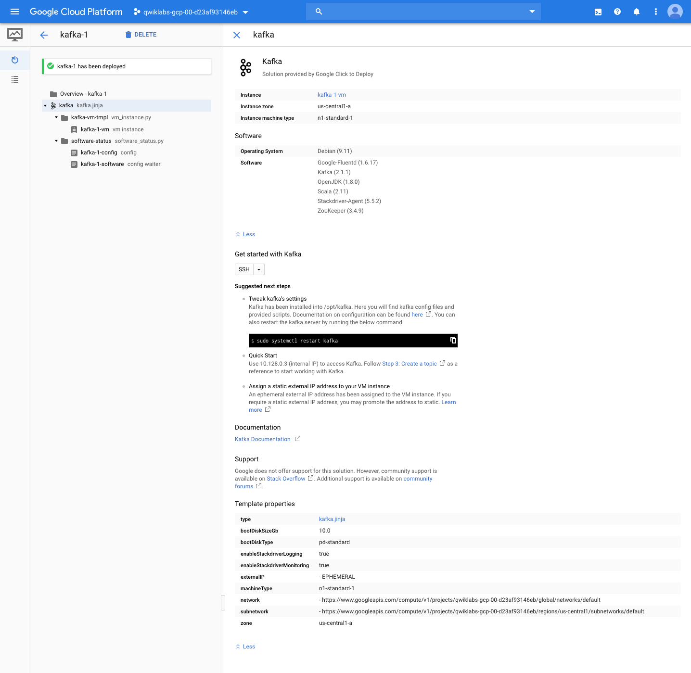
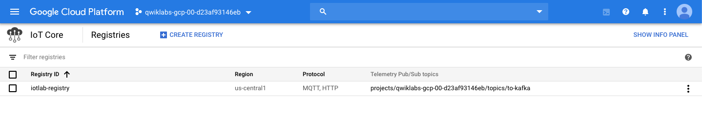

Data Engineering
================

**Streaming IoT Kafka to Google Cloud Pub/Sub**

[source.console]
----
student-00-d9571ba9e09f@iot-device-simulator:~/training-data-analyst/quests/iotlab$ ls -al
total 124
drwxr-xr-x  4 student-00-d9571ba9e09f google-sudoers  4096 Nov 24 05:08 .
drwxr-xr-x 15 student-00-d9571ba9e09f google-sudoers  4096 Nov 24 05:05 ..
-rw-r--r--  1 student-00-d9571ba9e09f google-sudoers  7902 Nov 24 05:05 cloudiot_mqtt_example_json.py
-rw-r--r--  1 student-00-d9571ba9e09f google-sudoers  7835 Nov 24 05:05 cloudiot_mqtt_example.py
drwxr-xr-x  2 student-00-d9571ba9e09f google-sudoers  4096 Nov 24 05:05 labinfra
-rw-r--r--  1 student-00-d9571ba9e09f google-sudoers  2925 Nov 24 05:05 pom.xml
-rw-r--r--  1 student-00-d9571ba9e09f google-sudoers 76276 Oct 22 18:15 roots.pem
-rw-r--r--  1 student-00-d9571ba9e09f google-sudoers  1090 Nov 24 05:07 rsa_cert.pem
-rw-------  1 student-00-d9571ba9e09f google-sudoers  1704 Nov 24 05:07 rsa_private.pem
-rwxr-xr-x  1 student-00-d9571ba9e09f google-sudoers   589 Nov 24 05:05 run_oncloud.sh
drwxr-xr-x  3 student-00-d9571ba9e09f google-sudoers  4096 Nov 24 05:05 src
----

References
----------

- Data Engineering, _https://google.qwiklabs.com/quests/25_
- Streaming IoT Kafka to Google Cloud Pub/Sub, _https://google.qwiklabs.com/focuses/2766?parent=catalog_