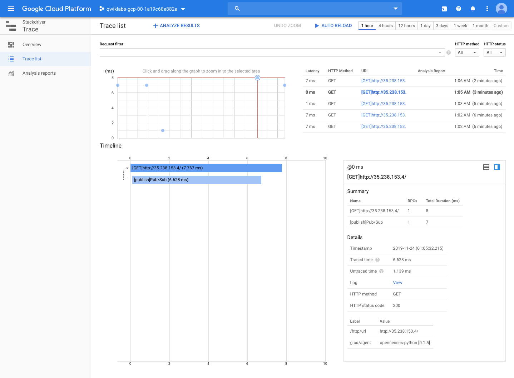

Google Kubernetes Engine Best Practices
=======================================

**Tracing with Stackdriver on Kubernetes Engine**

[source.console]
----
student_00_2bacd5902676@cloudshell:~/gke-tracing-demo/terraform (qwiklabs-gcp-00-90e86d083b72)$ \
>  gcloud container clusters get-credentials tracing-demo-space --zone us-central1-a --project qwiklabs-gcp-00-90e86d083b72 \
>  && echo "# When the next line says 'Forwarding from...', go to: https://ssh.cloud.google.com/devshell/proxy?port=8080" && kubectl port-forward $(kubectl get pod --selector="app=tracing-demo" --output jsonpath='{.items[0].metadata.name}') 8080:8080

Fetching cluster endpoint and auth data.
kubeconfig entry generated for tracing-demo-space.

# When the next line says 'Forwarding from...', go to: https://ssh.cloud.google.com/devshell/proxy?port=8080
Forwarding from 127.0.0.1:8080 -> 8080
----

image::Tracing with Stackdriver on Kubernetes Engine - Monitoring Kubernetes Services.png[Tracing with Stackdriver on Kubernetes Engine - Monitoring Kubernetes Services]

References
----------

- Google Kubernetes Engine Best Practices, _https://google.qwiklabs.com/quests/63_
- Tracing with Stackdriver on Kubernetes Engine, _https://google.qwiklabs.com/focuses/5159?parent=catalog_