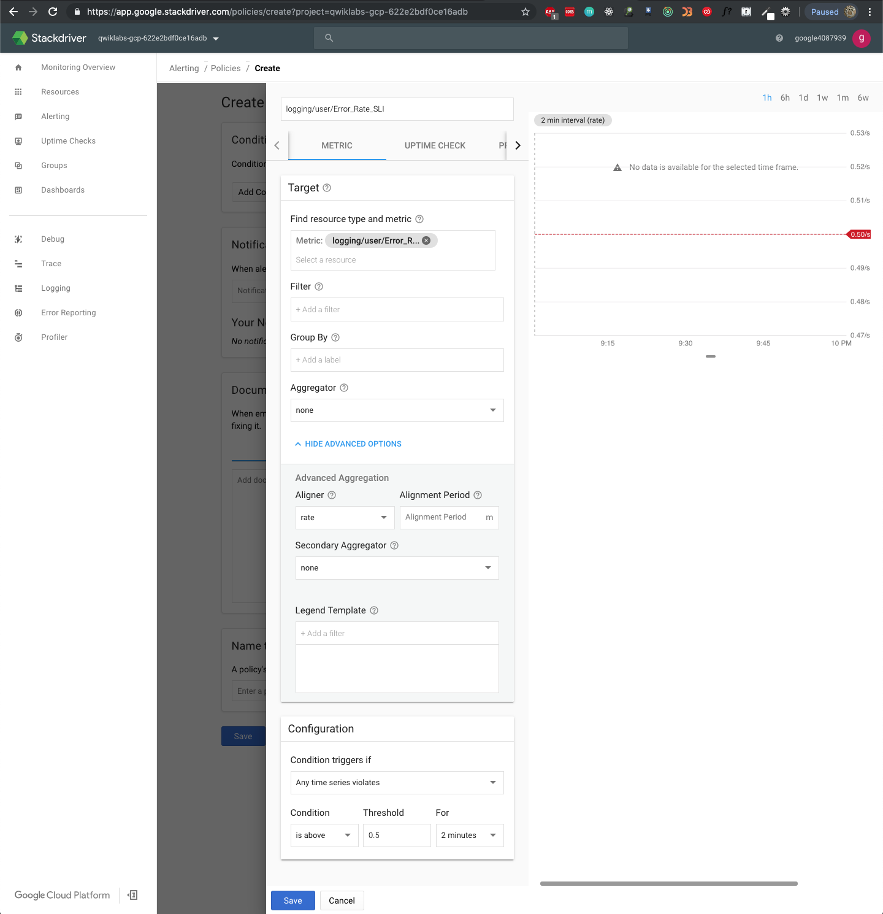

Cloud Architecture
==================

Site Reliability Troubleshooting with Stackdriver APM

Infrastructure setup
--------------------

[source.console]
----
$ gcloud config set compute/zone us-west1-b
Updated property [compute/zone].

$ export PROJECT_ID=$(gcloud info --format='value(config.project)')

$ env | grep PROJECT_ID
PROJECT_ID=qwiklabs-gcp-622e2bdf0ce16adb

$ gcloud container clusters list
NAME          LOCATION    MASTER_VERSION                     MASTER_IP       MACHINE_TYPE   NODE_VERSION  NUM_NODES  STATUS
shop-cluster  us-west1-b  1.13.7-gke.8 ALPHA (29 days left)  35.230.104.125  n1-standard-2  1.13.7-gke.8  4          RUNNING
----

Create Stackdriver workspace
----------------------------

In the Navigation menu, click on Monitoring to open up Stackdriver dashboard.

[source.console]
----
$ gcloud container clusters get-credentials shop-cluster --zone us-west1-b
Fetching cluster endpoint and auth data.
kubeconfig entry generated for shop-cluster.

$ kubectl get nodes
NAME                                             STATUS   ROLES    AGE     VERSION
gke-shop-cluster-demo-node-pool1-aa9e2dcd-45r7   Ready    <none>   4m40s   v1.13.7-gke.8
gke-shop-cluster-demo-node-pool1-aa9e2dcd-84w5   Ready    <none>   5m14s   v1.13.7-gke.8
gke-shop-cluster-demo-node-pool1-aa9e2dcd-tw70   Ready    <none>   5m1s    v1.13.7-gke.8
gke-shop-cluster-demo-node-pool1-aa9e2dcd-w09s   Ready    <none>   5m14s   v1.13.7-gke.8
----

Deploy application
------------------

Deploy a microservices application called Hipster Shop to shop-cluster:

[source.console]
----
$ git clone -b APM-Troubleshooting-Demo-2 https://github.com/blipzimmerman/microservices-demo-1
Cloning into 'microservices-demo-1'...
remote: Enumerating objects: 2648, done.
remote: Total 2648 (delta 0), reused 0 (delta 0), pack-reused 2648
Receiving objects: 100% (2648/2648), 4.89 MiB | 2.43 MiB/s, done.
Resolving deltas: 100% (1820/1820), done.

$ curl -Lo skaffold https://storage.googleapis.com/skaffold/releases/latest/skaffold-linux-amd64
  % Total    % Received % Xferd  Average Speed   Time    Time     Time  Current
                                 Dload  Upload   Total   Spent    Left  Speed
100 45.4M  100 45.4M    0     0  51.1M      0 --:--:-- --:--:-- --:--:-- 51.1M

$ chmod +x skaffold

$ sudo mv skaffold /usr/local/bin

$ cd microservices-demo-1

$ skaffold run
Generating tags...
Tags generated in 260.956µs
Starting build...
Build complete in 168.35µs
Starting test...
Test complete in 112.777µs
Starting deploy...
kubectl client version: 1.12+
deployment.extensions/adservice created
service/adservice created
deployment.extensions/cartservice created
service/cartservice created
deployment.extensions/checkoutservice created
service/checkoutservice created
deployment.extensions/currencyservice created
service/currencyservice created
deployment.extensions/emailservice created
service/emailservice created
deployment.extensions/frontend created
service/frontend created
service/frontend-external created
deployment.extensions/loadgenerator created
deployment.extensions/paymentservice created
service/paymentservice created
deployment.extensions/productcatalogservice created
service/productcatalogservice created
deployment.extensions/recommendationservice created
service/recommendationservice created
deployment.extensions/redis-cart created
service/redis-cart created
deployment.extensions/shippingservice created
service/shippingservice created
Deploy complete in 12.342664422s
Waiting for deployments to stabilize
You can also run [skaffold run --tail] to get the logs

$ kubectl get pods
NAME                                     READY   STATUS            RESTARTS   AGE
adservice-75dcf9df6b-nxjf5               1/1     Running           0          58s
cartservice-6bb67d9bff-srfds             1/1     Running           2          58s
checkoutservice-5fb4747448-p6pcv         1/1     Running           0          57s
currencyservice-6cc9b75b9d-lpklg         1/1     Running           0          56s
emailservice-78d7df6fcc-lhf27            1/1     Running           0          55s
frontend-cbf9bcc9f-pfrrm                 1/1     Running           0          55s
loadgenerator-7d59b7c89c-kfbjs           0/1     PodInitializing   0          54s
paymentservice-6d77886db6-jq4qj          1/1     Running           0          53s
productcatalogservice-bd4d9b7f8-759j9    1/1     Running           0          52s
recommendationservice-5888bd9d94-lcpss   1/1     Running           0          52s
redis-cart-589b64c856-rz4pp              1/1     Running           0          51s
shippingservice-5f54fc6974-zbxgz         1/1     Running           0          50s
----

Get the external IP of the application:

[source.console]
----
$ export EXTERNAL_IP=$(kubectl get service frontend-external | awk 'BEGIN { cnt=0; } { cnt+=1; if (cnt > 1) print $4; }')

$ env | grep EXTERNAL_IP
EXTERNAL_IP=35.203.169.62

$ curl -o /dev/null -s -w "%{http_code}\n"  http://$EXTERNAL_IP
200
----

Download the source and put the code in the Cloud Source Repo:

[source.console]
----
$ ./setup_csr.sh
Sun Jul  7 21:36:30 AEST 2019
Created [apm-qwiklabs-demo].
WARNING: You may be billed for this repository. See https://cloud.google.com/source-repositories/docs/pricing for details.
/home/google4087939_student/microservices-demo-1/tmp/master
Cloning into 'microservices-demo-1'...
remote: Enumerating objects: 2648, done.
remote: Total 2648 (delta 0), reused 0 (delta 0), pack-reused 2648
Receiving objects: 100% (2648/2648), 4.89 MiB | 866.00 KiB/s, done.
Resolving deltas: 100% (1820/1820), done.
Counting objects: 2479, done.
Compressing objects: 100% (704/704), done.
Writing objects: 100% (2479/2479), 4.86 MiB | 1.60 MiB/s, done.
Total 2479 (delta 1694), reused 2476 (delta 1694)
remote: Resolving deltas: 100% (1694/1694)
To https://source.developers.google.com/p/qwiklabs-gcp-622e2bdf0ce16adb/r/apm-qwiklabs-demo
 * [new branch]      master -> master
Cloning into 'microservices-demo-1'...
remote: Enumerating objects: 2648, done.
remote: Total 2648 (delta 0), reused 0 (delta 0), pack-reused 2648
Receiving objects: 100% (2648/2648), 4.89 MiB | 2.23 MiB/s, done.
Resolving deltas: 100% (1820/1820), done.
Counting objects: 186, done.
Compressing objects: 100% (65/65), done.
Writing objects: 100% (186/186), 28.62 KiB | 0 bytes/s, done.
Total 186 (delta 140), reused 163 (delta 117)
remote: Resolving deltas: 100% (140/140)
To https://source.developers.google.com/p/qwiklabs-gcp-622e2bdf0ce16adb/r/apm-qwiklabs-demo
 * [new branch]      APM-Troubleshooting-Demo-2 -> APM-Troubleshooting-Demo-2
rm: refusing to remove '.' or '..' directory: skipping 'tmp/master/.'
rm: refusing to remove '.' or '..' directory: skipping 'tmp/master/..'
rm: refusing to remove '.' or '..' directory: skipping 'tmp/error/.'
rm: refusing to remove '.' or '..' directory: skipping 'tmp/error/..'
----

Develop Sample SLOs and SLIs
----------------------------

**Service Kevel Indicators (SLIs)**, **Service Kevel Objectives (SLOs)**, and **Service Kevel Agreements (SLAs)**

Most services consider **request latency**, how long it takes to return a response to a request, the **error rate**, often expressed as a fraction of all requests received, and **system throughput**, typically measured in requests per second, **availability**, the fraction of the time that a service is usable, often defined in terms of the fraction of well-formed requests that succeed, **durability**, the likelihood that data will be retained over a long period of time, is equally important for data storage systems.

The measurements are often aggregated: i.e., raw data is collected over a measurement window and then turned into a rate, average, or percentile.

Configure Latency SLI
---------------------

Stackdriver -> Monitoring then in the new tab, select Alerting -> Create a Policy:

Configure Availability SLI
--------------------------

Deploy new release
------------------

[source.console]
----
$ skaffold run
Generating tags...
Tags generated in 298.999µs
Starting build...
Build complete in 260.315µs
Starting test...
Test complete in 113.801µs
Starting deploy...
kubectl client version: 1.12+
deployment.extensions/adservice unchanged
service/adservice unchanged
deployment.extensions/cartservice unchanged
service/cartservice unchanged
deployment.extensions/checkoutservice unchanged
service/checkoutservice unchanged
deployment.extensions/currencyservice configured
service/currencyservice unchanged
deployment.extensions/emailservice unchanged
service/emailservice unchanged
deployment.extensions/frontend configured
service/frontend unchanged
service/frontend-external unchanged
deployment.extensions/loadgenerator unchanged
deployment.extensions/paymentservice unchanged
service/paymentservice unchanged
deployment.extensions/productcatalogservice unchanged
service/productcatalogservice unchanged
deployment.extensions/recommendationservice configured
service/recommendationservice unchanged
deployment.extensions/redis-cart unchanged
service/redis-cart unchanged
deployment.extensions/shippingservice unchanged
service/shippingservice unchanged
Deploy complete in 15.874792263s
Waiting for deployments to stabilize
You can also run [skaffold run --tail] to get the logs

$ kubectl get pods
NAME                                    READY   STATUS    RESTARTS   AGE
adservice-75dcf9df6b-nxjf5              1/1     Running   0          40m
cartservice-6bb67d9bff-srfds            1/1     Running   2          40m
checkoutservice-5fb4747448-p6pcv        1/1     Running   0          40m
currencyservice-74fc949cdd-92dn4        1/1     Running   0          35s
emailservice-78d7df6fcc-lhf27           1/1     Running   0          40m
frontend-7fcc499789-pbf6v               0/1     Running   0          34s
loadgenerator-7d59b7c89c-kfbjs          1/1     Running   0          40m
paymentservice-6d77886db6-jq4qj         1/1     Running   0          40m
productcatalogservice-bd4d9b7f8-759j9   1/1     Running   0          40m
recommendationservice-5bf69d5dd-wtf28   1/1     Running   0          32s
redis-cart-589b64c856-rz4pp             1/1     Running   0          40m
shippingservice-5f54fc6974-zbxgz        1/1     Running   0          40m
----

Latency SLO Violation - Find the Problem
----------------------------------------

image::https://cdn.qwiklabs.com/d2mEd%2BUDydg6BT%2BnqrMSNhsQd66OCEN9S3JtXjeU6W0%3D[Uptime Checks]

image::https://cdn.qwiklabs.com/B3CiJYyrVVMSWfIi%2BSKs%2FNezUn1fCZwgt%2FZcdlM2ScE%3D[Policy Violation]

image::https://cdn.qwiklabs.com/ZQJTzVEsrg0SpmO%2BtTjxjCJWAF8ahvmZYoy%2FqzcAMpU%3D[Trace list]

Deploy Change to Address Latency
--------------------------------

[source.console]
----
$ skaffold run
Generating tags...
Tags generated in 315.995µs
Starting build...
Build complete in 538.145µs
Starting test...
Test complete in 123.682µs
Starting deploy...
kubectl client version: 1.12+
deployment.extensions/adservice unchanged
service/adservice unchanged
deployment.extensions/cartservice unchanged
service/cartservice unchanged
deployment.extensions/checkoutservice unchanged
service/checkoutservice unchanged
deployment.extensions/currencyservice unchanged
service/currencyservice unchanged
deployment.extensions/emailservice unchanged
service/emailservice unchanged
deployment.extensions/frontend configured
service/frontend unchanged
service/frontend-external unchanged
deployment.extensions/loadgenerator unchanged
deployment.extensions/paymentservice unchanged
service/paymentservice unchanged
deployment.extensions/productcatalogservice unchanged
service/productcatalogservice unchanged
deployment.extensions/recommendationservice configured
service/recommendationservice unchanged
deployment.extensions/redis-cart unchanged
service/redis-cart unchanged
deployment.extensions/shippingservice unchanged
service/shippingservice unchanged
Deploy complete in 15.431338485s
Waiting for deployments to stabilize
You can also run [skaffold run --tail] to get the logs
----

Error Rate SLO Violation - Find the Problem
-------------------------------------------

Deploy Change to Address Error Rate
-----------------------------------

[source.console]
----
$ skaffold run
----

Application optimization with Stackdriver APM
---------------------------------------------

References
----------

- Google Cloud Training - Cloud Architecture, _https://google.qwiklabs.com/quests/24_
- Site Reliability Troubleshooting with Stackdriver APM, _https://google.qwiklabs.com/focuses/4186?parent=catalog_
- Easy and Repeatable Kubernetes Development, _https://github.com/GoogleContainerTools/skaffold_
- Sample cloud-native application with 10 microservices showcasing Kubernetes, Istio, gRPC and OpenCensus, _https://github.com/GoogleCloudPlatform/microservices-demo_
- Cloud Source Repositories, _https://source.cloud.google.com/onboarding/welcome_
