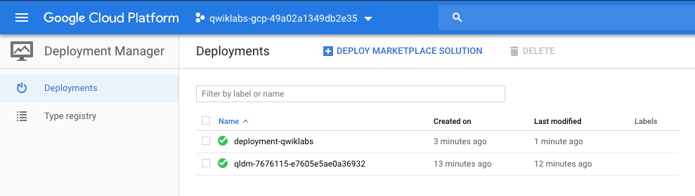
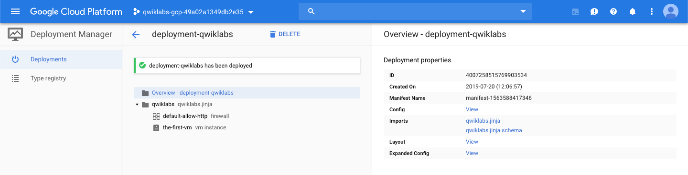
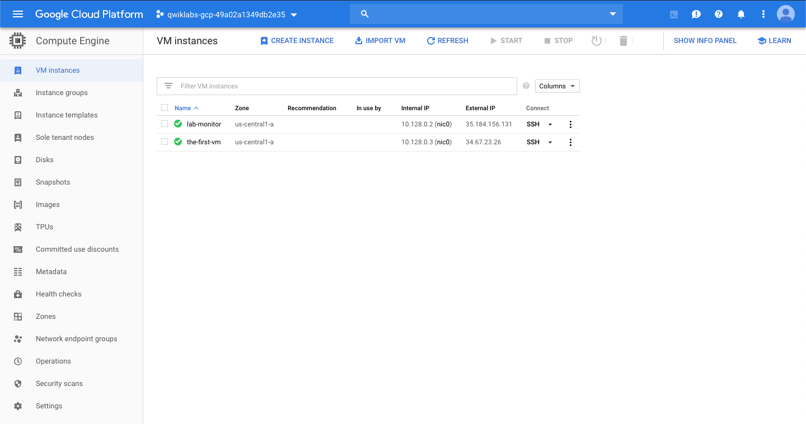
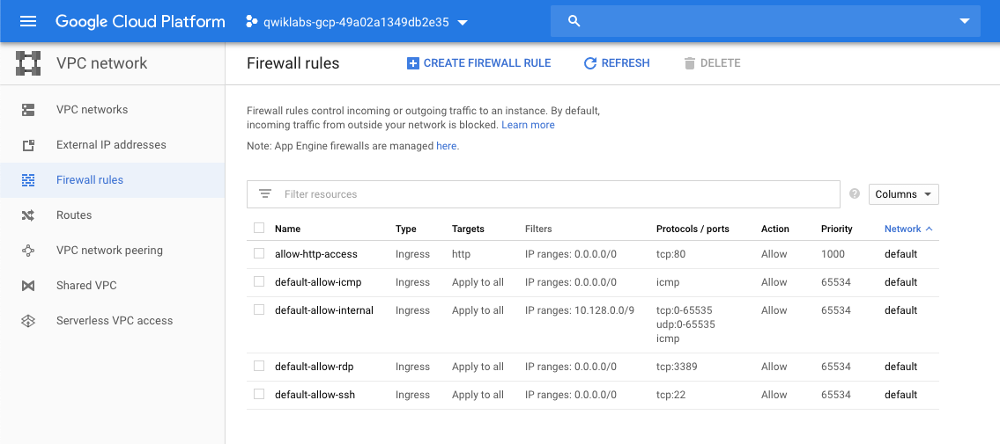

Cloud Architecture
==================

**Configure a Firewall and a Startup Script with Deployment Manager**

The key tasks are:

- Configure a deployment template to include a startup script
- Configure a deployment template to add a firewall rule allowing http traffic
- Configure a deployment template to add a networking tag to a compute instance
- Deploy a configuration using Deployment Manager

First, download the baseline Deployment Manager template:

[source.console]
----
$ gsutil cp gs://spls/gsp302/* .

$ ls -al
total 24
drwxr-xr-x 2 terrence_miao terrence_miao 4096 Jul 19 10:38 .
drwxr-xr-x 7 terrence_miao terrence_miao 4096 Jul 19 10:38 ..
-rw-r--r-- 1 terrence_miao terrence_miao   56 Jul 19 10:38 install-web.sh
-rw-r--r-- 1 terrence_miao terrence_miao  931 Jul 19 10:38 qwiklabs.jinja
-rw-r--r-- 1 terrence_miao terrence_miao  173 Jul 19 10:38 qwiklabs.jinja.schema
-rw-r--r-- 1 terrence_miao terrence_miao  719 Jul 19 10:38 qwiklabs.yaml

$ cat install-web.sh
#!/bin/bash
apt-get update
apt-get install -y apache2

$ cat qwiklabs.jinja
resources:
- type: compute.v1.instance
...
        type: ONE_TO_ONE_NAT

$ cat qwiklabs.jinja.schema
info:
  title: Deploy a Simple VM
  author: qwiklabs@google.com

required:
  - zone

properties:
  zone:
    description: Zone to create the resources in.
    type: string

$ cat qwiklabs.yaml
imports:
- path: qwiklabs.jinja

resources:
- name: qwiklabs
  type: qwiklabs.jinja
  properties:
    zone: us-central1-a
----

Updated Deployment Manager template file:

[source.console]
----
$ cat qwiklabs.jinja

resources:
- type: compute.v1.firewall
  name: default-allow-http
  properties:
    targetTags: ["http"]
    sourceRanges: ["0.0.0.0/0"]
    allowed:
      - IPProtocol: TCP
        ports: ["80"]
- type: compute.v1.instance
  name: the-first-vm
  properties:
    zone: {{ properties["zone"] }}
    machineType: https://www.googleapis.com/compute/v1/projects/{{ env["project"] }}/zones/{{ properties["zone"] }}/machineTypes/f1-micro
    tags:
        items: ["http"]
    disks:
    - deviceName: boot
      type: PERSISTENT
      boot: true
      autoDelete: true
      initializeParams:
        diskName: disk-{{ env["deployment"] }}
        sourceImage: https://www.googleapis.com/compute/v1/projects/debian-cloud/global/images/family/debian-9
    networkInterfaces:
    - network: https://www.googleapis.com/compute/v1/projects/{{ env["project"] }}/global/networks/default
      accessConfigs:
      - name: External NAT
        type: ONE_TO_ONE_NAT
    metadata:
      items:
      - key: startup-script
        value: |
          #!/bin/bash
          apt-get update
          apt-get install -y apache2
----

Run Deployment Manager to deploy the VM:

[source.console]
----
$ gcloud deployment-manager deployments create deployment-qwiklabs --config qwiklabs.yaml
The fingerprint of the deployment is XmYeCO6CTqQ8cisf8egfhQ==
Waiting for create [operation-1563588417317-58e134c306ac8-af795a3a-6a7670b1]...done.
Create operation operation-1563588417317-58e134c306ac8-af795a3a-6a7670b1 completed successfully.
NAME                TYPE                 STATE      ERRORS  INTENT
default-allow-http  compute.v1.firewall  COMPLETED  []
the-first-vm        compute.v1.instance  COMPLETED  []
----

[source.console]
----
$ gcloud compute instances describe the-first-vm | grep "natIP"
Did you mean zone [asia-southeast1-a] for instance: [the-first-vm] (Y/n)?  n

No zone specified. Using zone [us-central1-a] for instance: [the-first-vm].
    natIP: 34.67.23.26
----

Make some change, change firewall rule name to "**allow-http-access**" and vm name to "**vm-test**", and commit the update:

[source.console]
----
$ gcloud deployment-manager deployments update deployment-qwiklabs --config qwiklabs.yaml --preview
The fingerprint of the deployment is xmp2YsmKqA4KHE5YiYd5pw==
Waiting for update [operation-1563589365965-58e1384bba167-1b4da2f5-5b562d16]...done.
Update operation operation-1563589365965-58e1384bba167-1b4da2f5-5b562d16 completed successfully.
NAME                TYPE                 STATE       ERRORS  INTENT
allow-http-access   compute.v1.firewall  IN_PREVIEW  []      CREATE_OR_ACQUIRE
default-allow-http  compute.v1.firewall  IN_PREVIEW  []      DELETE
the-first-vm        compute.v1.instance  IN_PREVIEW  []      DELETE
vm-test             compute.v1.instance  IN_PREVIEW  []      CREATE_OR_ACQUIRE

$ gcloud deployment-manager deployments update deployment-qwiklabs
ERROR: (gcloud.deployment-manager.deployments.update) ResponseError: code=400, message=Invalid value for field 'resource.target': '{  "imports": [{    "name": "qwiklabs.jinja",    "c
ontent": "\nresources:\n- type: compute.v1.firewa...'.  Deployment in preview must not have a target with UPDATE
----

Have to delete the original deployment:

[source.console]
----
$ gcloud deployment-manager deployments delete deployment-qwiklabs
The following deployments will be deleted:
- deployment-qwiklabs

Do you want to continue (y/N)?  Y

Waiting for delete [operation-1563589635704-58e1394cf85d7-b1cf1c11-a86889c8]...done.
Delete operation operation-1563589635704-58e1394cf85d7-b1cf1c11-a86889c8 completed successfully.
----

Retry the updated deployment and VM:

[source.console]
----
$ gcloud deployment-manager deployments create deployment-qwiklabs --config qwiklabs.yaml
The fingerprint of the deployment is jkcxWuN_RcUP_FamgkKdhA==
Waiting for create [operation-1563589908274-58e13a50e9f20-5274ac89-1a1cdede]...done.
Create operation operation-1563589908274-58e13a50e9f20-5274ac89-1a1cdede completed successfully.
NAME               TYPE                 STATE      ERRORS  INTENT
allow-http-access  compute.v1.firewall  COMPLETED  []
vm-test            compute.v1.instance  COMPLETED  []
----

Restart instance:

[source.console]
----
$ gcloud compute instances reset vm-test
Did you mean zone [asia-southeast1-a] for instance: [vm-test] (Y/n)?  n

No zone specified. Using zone [us-central1-a] for instance: [vm-test].
Updated [https://www.googleapis.com/compute/v1/projects/qwiklabs-gcp-49a02a1349db2e35/zones/us-central1-a/instances/vm-test].

$ gcloud config list project
[core]
project = qwiklabs-gcp-49a02a1349db2e35

Your active configuration is: [cloudshell-9887]

$ gcloud compute project-info describe --project qwiklabs-gcp-49a02a1349db2e35
commonInstanceMetadata:
  fingerprint: Bmv2RhhGaAk=
  items:
  - key: google-compute-default-zone
    value: us-central1-a
  - key: google-compute-default-region
    value: us-central1
  - key: ssh-keys
    value: google4271162_student:ssh-rsa AAAAB3NzaC1yc2EAAAADAQABAAABAQDUh0zVuwOP4fcf3AJp/V5FwNzw/UaOyOhUPKd5KHlz1jMEGK/9PQ0rGnT4kauJlS5C51Zd7++Ktpjb+LIXBVRl1cc6eHFllB6WTIK2aLHHigbZtWpQ6faIDXIVizmfXtpPd6uPenYIqR8dVDkoF4CWc//+aJOfKpCkdgKNa21ANdDLYUgHUi2PFU5jPtMNkFHg/rCh/II7Y2+yH83ZDgl4KlB4vrTmh70kFMwu6YcoGar+Oq6rwrk2ZWK/zMctxxrN1M+vPfIExj7OoW8tbERaEwg8GY5aB/HVR1qhChwT17E/QobhZsRzU6YkUabrlpfaJYd9zTQQjFFCtZoYFonZ
      google4271162_student@qwiklabs.net
  - key: enable-oslogin
    value: 'true'
  kind: compute#metadata
creationTimestamp: '2019-07-19T14:29:23.403-07:00'
defaultNetworkTier: PREMIUM
defaultServiceAccount: 210252680589-compute@developer.gserviceaccount.com
id: '8812823090265295068'
kind: compute#project
name: qwiklabs-gcp-49a02a1349db2e35
quotas:
- limit: 1000.0
  metric: SNAPSHOTS
  usage: 0.0
...
selfLink: https://www.googleapis.com/compute/v1/projects/qwiklabs-gcp-49a02a1349db2e35
xpnProjectStatus: UNSPECIFIED_XPN_PROJECT_STATUS
----

References
----------

- Google Cloud Training - Challenge: GCP Architecture, _https://google.qwiklabs.com/quests/47_
- Configure a Firewall and a Startup Script with Deployment Manager, _https://google.qwiklabs.com/focuses/1736?parent=catalog_
- Setting Metadata and Using Startup Scripts, _https://cloud.google.com/deployment-manager/docs/step-by-step-guide/setting-metadata-and-startup-scripts_
- Updating a Deployment, _https://cloud.google.com/deployment-manager/docs/step-by-step-guide/updating-a-deployment_