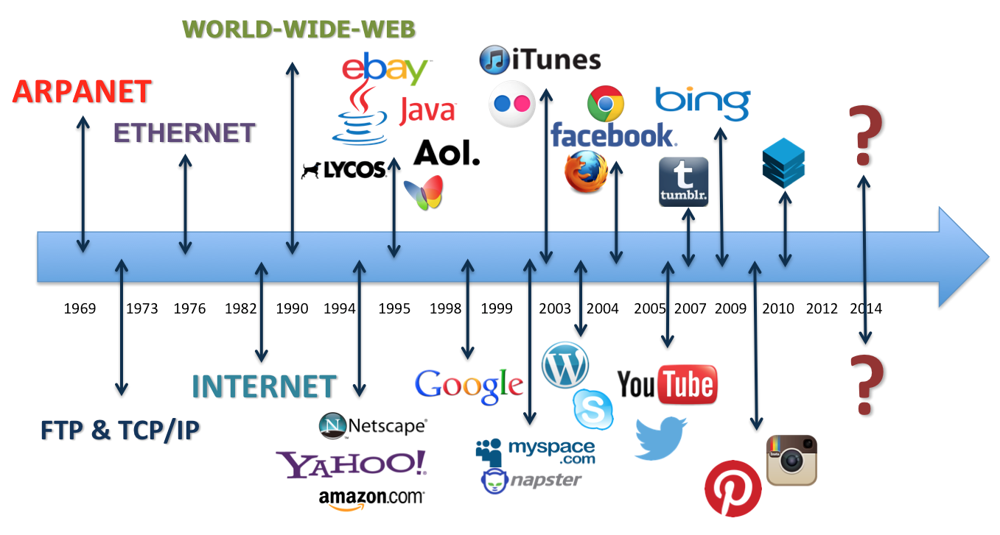

Teaching Kids Series - The History Of Internet
==============================================

Encyclopedia Britannica
-----------------------

- Encyclopedia Britannica Kids, Internet introduction, _https://kids.britannica.com/kids/article/Internet/353293_

Video Online
------------

- History of the Internet, an animated documentary explaining the inventions from time-sharing to file-sharing, from Arpanet to Internet, _https://www.youtube.com/watch?v=9hIQjrMHTv4_

Internet Hall of Fame
---------------------

- Internet History Timeline, _https://www.internethalloffame.org/internet-history/timeline_

World Wide Web (WWW)
--------------------

- World Wide Web Timeline, _https://www.pewresearch.org/internet/2014/03/11/world-wide-web-timeline/_
